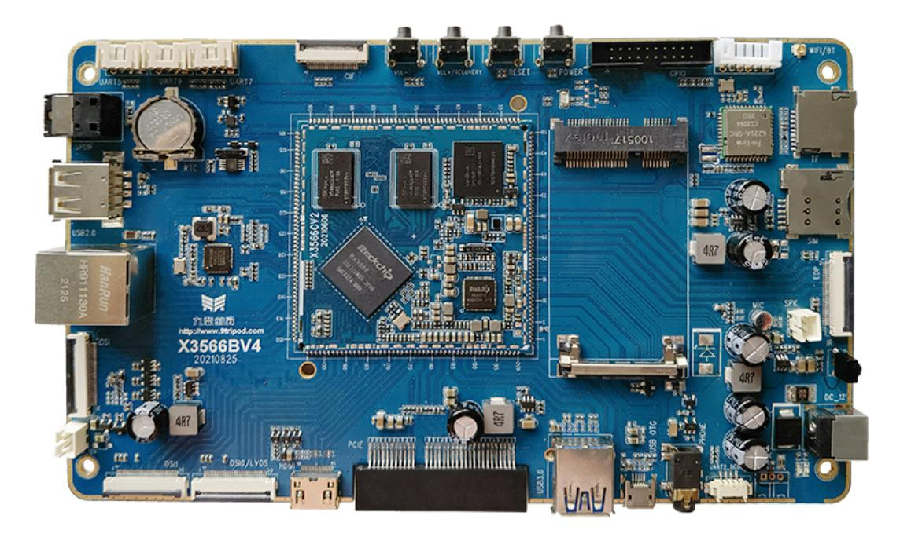

# Product Introduction

The X3566 development board is based on the Rockchip RK3566 platform. It uses the X3566CV2 core board and exposes common interfaces such as HDMI, DSI/LVDS, EDP, CSI/CIF, USB, OTG, Gigabit Ethernet, SATA, PCIe, audio, IR, GPIO, TF card, keys, RTC, and Wi-Fi/Bluetooth. It is suitable for Android/Linux evaluation, display adaptation, camera debugging, peripheral-driver verification, and embedded-product development.

## Feature Highlights

- Quad-core ARM Cortex-A55 CPU.
- 1.8GHz x 4.
- 1GB/2GB/4GB DDR4 memory, standard 2GB.
- 4GB/8GB/16GB/32GB/64GB eMMC options, standard 16GB.
- 1 USB HOST2.0, 1 USB HOST3.0, and 1 Micro USB OTG.
- 4 TTL UART interfaces, including one debug UART.
- TF card interface.
- Reset button, power button, and two independent keys.
- HDMI output and SPDIF optical audio output.
- 20-pin GPIO expansion header.
- DSI or LVDS display interface, DSI display interface, and EDP display interface.
- SATA interface.
- Integrated IR receiver.
- External speaker, MIC input, and headphone output.
- Stepless backlight control and capacitive touch support.
- On-board dual-band Wi-Fi module.
- RTC time retention.
- Gigabit Ethernet with YT8521.
- MIPI camera interface and standard PCIe bus interface.
- USB mouse and keyboard support.

## Core Board Features

- X3566CV2 core board size is 55mm x 55mm.
- Up to 200 pins are exported, covering most CPU pins.
- RK817 PMU is used for reliable operation.
- Dual-channel DDR4 design, supporting 1GB/2GB/4GB capacity.
- Android/Linux operating-system support.
- Gigabit Ethernet support.
- Reliability testing includes high/low temperature and repeated reboot tests.

## System Configuration

| Item | Parameter |
| --- | --- |
| CPU | RK3566 |
| Clock | Quad-core Cortex-A55, 1.8GHz |
| Memory | Standard 2GB DDR4, hardware compatible with 4GB |
| Storage | 4GB/8GB/16GB eMMC optional, standard 16GB |
| PMIC | RK817, supports adapter and battery power |

## Interface Parameters

| Item | Parameter |
| --- | --- |
| LCD | DSI / LVDS / EDP / HDMI output |
| Touch | Capacitive touch |
| Audio | Headphone and speaker direct output, recording and playback |
| SD | 2 SDIO output channels |
| eMMC | On-board eMMC, pins are not separately exported |
| Ethernet | 1 Gigabit Ethernet port |
| USB HOST2.0 | 2 HOST2.0 channels |
| USB HOST3.0 | 1 HOST3.0 channel |
| OTG | 1 OTG interface |
| UART | 10 UARTs, flow-control UART supported |
| PWM | 16 PWM outputs |
| I2C | 6 I2C outputs |
| SPI | 4 SPI outputs |
| ADC | 2 ADC outputs, 6 additional ADCs are not exported |
| Camera | CSI / BT601 / BT656 / BT1120 / RAW input |

## Electrical Characteristics

| Item | Parameter |
| --- | --- |
| VBUS input | 5V / 2A |
| VBAT input | 3.5V to 4.2V, typical 3.7V |
| Output voltage | VCC5V_MIDU outputs 5V for carrier-board power |
| Operating temperature | -10°C to 70°C |
| Storage temperature | -10°C to 40°C |

## Software Resources

The X3566 development board supports Android 11 / Linux operating systems. The driver support matrix from the hardware manual is kept below:

| System / Driver | Linux 4.19+ / Android 11 | Linux 4.19+ QT |
| --- | --- | --- |
| 7寸MIPI屏(1024*600) | Supported | Planned |
| 背光驱动 | Supported | Planned |
| PMIC驱动(RK817) | Supported | Planned |
| 电容触摸 | Supported | Planned |
| eMMC驱动 | Supported | Planned |
| SD卡驱动 | Supported | Planned |
| 独立按键 | Supported | Planned |
| ADC驱动 | Supported | Planned |
| 开关机 | Supported | Planned |
| 休眠唤醒 | Supported | Planned |
| 两路USB HOST2.0驱动 | Supported | Planned |
| 一路USB HOST3.0驱动 | Supported | Planned |
| 一路OTG驱动 | Supported | Planned |
| PCIE总线驱动 | Supported | Planned |
| 光纤驱动 | Supported | Planned |
| RTC驱动 | Supported | Planned |
| 音频 | Supported | Planned |
| 录音 | Supported | Planned |
| 双频WIFI/BT4.0 | Supported | Planned |
| GPS | Supported | Planned |
| CSI摄像头驱动 | Supported | Planned |
| USB口摄像头驱动 | Supported | Planned |
| 串口 | Supported | Planned |
| HDMI2.0 | Supported | Planned |
| 千兆以太网 | Supported | Planned |
| USB鼠标键盘 | Supported | Planned |
| uboot | Supported | Planned |

