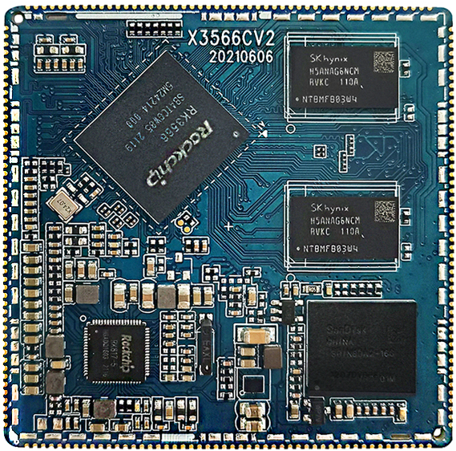
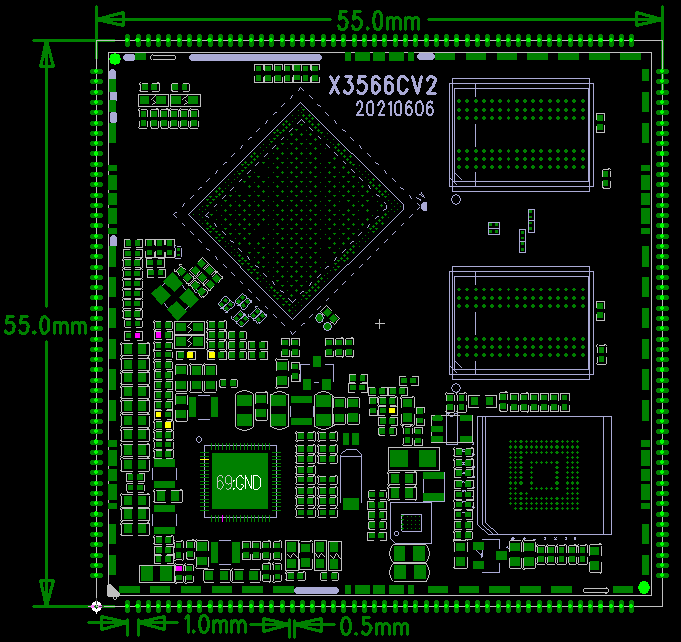

# Size and Specifications

## Core Board Appearance

## Core Board Layout

## Structure Parameters

| Item | Parameter |
| --- | --- |
| Form factor | Stamp-hole module |
| Core board size | 55mm x 55mm x 3mm |
| Pin pitch | 1.0mm |
| Pad size | 1.3mm x 0.5mm |
| Pin count | 200 pins |
| PCB layers | 8 layers |
| Warpage | Not more than 0.5% |

## Key Specifications

| Item | Parameter |
| --- | --- |
| CPU | RK3566 |
| Clock | Quad-core Cortex-A55, 1.8GHz |
| Memory | Standard 2GB DDR4, hardware compatible with 4GB |
| Storage | 4GB/8GB/16GB eMMC optional, standard 16GB |
| PMIC | RK817, supports adapter and battery power |

| Item | Parameter |
| --- | --- |
| LCD | DSI / LVDS / EDP / HDMI output |
| Touch | Capacitive touch |
| Audio | Headphone and speaker direct output, recording and playback |
| SD | 2 SDIO output channels |
| eMMC | On-board eMMC, pins are not separately exported |
| Ethernet | 1 Gigabit Ethernet port |
| USB HOST2.0 | 2 HOST2.0 channels |
| USB HOST3.0 | 1 HOST3.0 channel |
| OTG | 1 OTG interface |
| UART | 10 UARTs, flow-control UART supported |
| PWM | 16 PWM outputs |
| I2C | 6 I2C outputs |
| SPI | 4 SPI outputs |
| ADC | 2 ADC outputs, 6 additional ADCs are not exported |
| Camera | CSI / BT601 / BT656 / BT1120 / RAW input |

| Item | Parameter |
| --- | --- |
| VBUS input | 5V / 2A |
| VBAT input | 3.5V to 4.2V, typical 3.7V |
| Output voltage | VCC5V_MIDU outputs 5V for carrier-board power |
| Operating temperature | -10°C to 70°C |
| Storage temperature | -10°C to 40°C |

