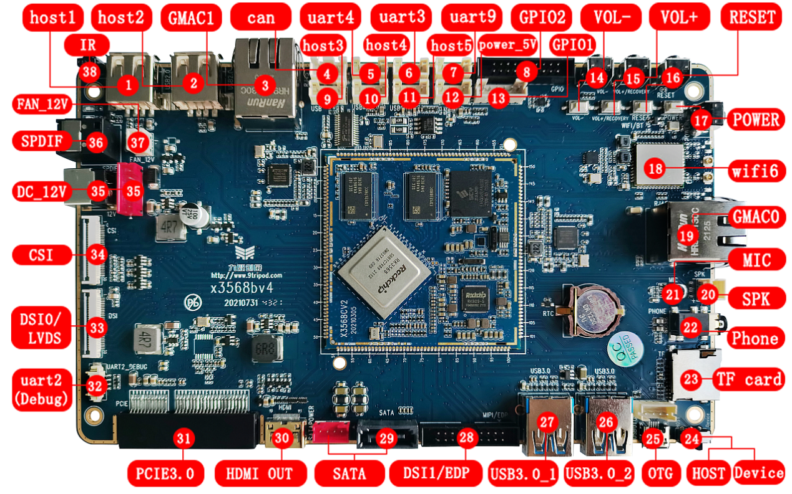

# Hardware Resources

This page only provides the hardware resource overview. It does not repeat the detailed connector usage or the full core-board pin definition. For connector usage, see [Interface Details](./x3568-interface-details). For the 200PIN core-board definition, see [Pin Definition](./x3568-pin-definition).

## Interface Location Diagram

## Hardware Interface Overview

| No. | Name | Description |
| --- | --- | --- |
| [1] | HOST2.0 | USB HOST2.0 interface |
| [2] | HOST2.0 | USB HOST2.0 interface |
| [3] | GMAC1 | Gigabit Ethernet interface 1 |
| [4] | CAN | CAN bus interface |
| [5] | UART4 | UART4, TTL-level interface |
| [6] | UART3 | UART3, TTL-level interface |
| [7] | UART9 | UART9, TTL-level interface |
| [8] | GPIO | GPIO expansion interface |
| [9] | HOST2.0 | USB HOST2.0 interface |
| [10] | HOST2.0 | USB HOST2.0 interface |
| [11] | HOST2.0 | USB HOST2.0 interface |
| [12] | 5V power output | Power output for external peripherals |
| [13] | GPIO interface | GPIO pins for common control-type expansion |
| [14] | Independent key | Mapped to Volume Down in software |
| [15] | Independent key | Mapped to Volume Up in software |
| [16] | Independent key | RESET |
| [17] | Independent key | PWRKEY |
| [18] | WIFI/BT | AP6375S WIFI6 / BT combo module |
| [19] | GMAC0 | Gigabit Ethernet interface 0 |
| [20] | Speaker interface | External stereo speaker interface |
| [21] | Microphone | Microphone recording input |
| [22] | Headset jack | Headset output |
| [23] | TF card | TF card slot |
| [24] | USB switch | Left for Host mode, right for Device mode |
| [25] | OTG | OTG download interface, multiplexed with one USB3.0 port |
| [26] | USB3.0 | USB3.0 interface; its compatible USB2.0 function is multiplexed with OTG |
| [27] | USB3.0 | USB HOST3.0 interface |
| [28] | Display interface | DSI or EDP interface |
| [29] | SATA interface | SATA signal and power interface |
| [30] | HDMI | HDMI output interface |
| [31] | PCIe interface | PCIe bus interface for PCIe devices such as WIFI6, SATA, UART, and Ethernet expansion |
| [32] | UART2 | UART2, TTL-level interface, used as the default debug UART |
| [33] | Display interface | DSI or LVDS interface |
| [34] | MIPI CSI | MIPI camera interface |
| [35] | DC jack | 12V DC power input |
| [36] | SPDIF | Optical audio output |
| [37] | Cooling-fan power connector | 12V fan power interface |
| [38] | IR receiver | HS0038 integrated infrared receiver |

## Driver Support List

X3568 supports Android11 / Linux4.19 / Debian10 / Ubuntu / QT system variants. Actual driver support depends on the delivered SDK and firmware.

| Driver | Linux4.19 + Android11 | Linux4.19 + Debian10 | Linux4.19 + Ubuntu | Linux4.19 + QT |
| --- | --- | --- | --- | --- |
| 7-inch MIPI display (1024×600) | ● | ● | ● | ● |
| 10.1-inch EDP display (1920×1080) | ● | ● | ● | ● |
| Backlight driver | ● | ● | ● | ● |
| PMIC driver (RK809) | ● | ● | ● | ● |
| Capacitive touch | ● | ● | ● | ● |
| EMMC driver | ● | ● | ● | ● |
| SD card driver | ● | ● | ● | ● |
| Independent keys | ● | ● | ● | ● |
| ADC driver | ● | ● | ● | ● |
| Power on/off | ● | ● | ● | ● |
| Suspend / wake-up | ● | ● | ● | ● |
| Dual USB HOST2.0 drivers | ● | ● | ● | ● |
| Dual USB HOST3.0 drivers | ● | ● | ● | ● |
| One OTG driver | ● | ● | ● | ● |
| SATA | ● | ● | ● | ● |
| PCIe bus driver | ● | ● | ● | ● |
| Optical audio driver | ● | Not verified | Not verified | ● |
| RTC driver | ● | ● | Not verified | ● |
| Audio | ● | ● | Not verified | To be supported |
| Recording | ● | Not supported | Not supported | To be supported |
| Dual-band WIFI/BT4.0 | ● | ● | ● | To be supported |
| GPS | ● | ● | ● | ● |
| CSI camera driver | ● | Not supported | Not supported | To be supported |
| USB camera driver | ● | ● | ● | ● |
| UART | ● | ● | ● | ● |
| HDMI2.0 | ● | ● | ● | ● |
| Dual Gigabit Ethernet | ● | ● | ● | ● |
| USB mouse and keyboard | ● | ● | ● | ● |
| U-Boot | ● | ● | ● | ● |
