# Interface Details

This page describes the purpose and connection notes of the external interfaces on the mainboard. It does not repeat the full pin definition table.

## Power Switch and DC Jack

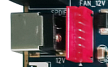

The X3568 uses a 12V DC power supply. The round jack shown in the figure is the 12V DC input connector. The red PH connector on the right can also be used as an alternative 12V power input. Select one of them according to the product design.

## Debug UART

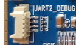

UART2 is used as the default debug UART. The debug UART can be changed by modifying the software configuration.

## HDMI Interface

The mainboard uses a mini-HDMI connector. With a mini-HDMI cable, audio and video can be output to HDMI2.0-compatible TVs, monitors, or other display devices.

## Camera Interface

This is a general-purpose 30PIN camera connector and supports OV-series cameras. Different camera modules require matching power supply and driver configuration.

## Ethernet Interface

The X3568V4 supports two Gigabit Ethernet ports. The Ethernet PHY has been updated from RTL8211F to YT8521CA.

## Headset Interface

A headset can be connected to this interface for audio output. The signal can also be routed to an amplifier input.

## Speaker Interface

The mainboard supports one 2W speaker output.

## Microphone Interface

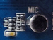

The mainboard supports recording input, and the MIC circuit is implemented on the board.

## TF Card Slot

An external TF card can be used for firmware upgrade or for storing multimedia files.

## Independent Keys

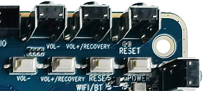

The X3568 has four keys: two independent keys, one PWRKEY, and one reset key. The independent keys are detected through ADC sampling.

## USB OTG Interface

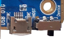

The RK3568 OTG interface is multiplexed with one USB3.0 interface. Host / Device mode is selected by the hardware DIP switch. Device mode can be used for firmware download.

## HOST2.0 Interface

The RK3568 provides two standard Type-A HOST2.0 ports. Three additional HOST2.0 ports are routed through PH connectors for USB peripheral expansion.

## HOST3.0 Interface

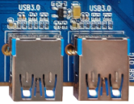

The RK3568 provides two HOST3.0 ports. The USB2.0 function of the right-side HOST3.0 port is multiplexed with OTG, so it depends on the DIP switch status.

## Power Key

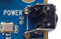

After connecting the external power adapter, long-press PWRKEY to power on. In Android, short-pressing the key enters suspend / wake-up, and long-pressing it opens the shutdown dialog.

## Reset Key

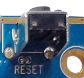

Pressing RESET while the system is running triggers a hardware reset and reboots the board.

## Recovery Key

The Volume Up key can be used as the Recovery key during flashing. Hold it during flashing to enter recovery / loader-related modes.

## LCD Interface

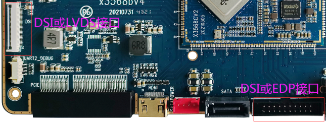

RK3568 supports dual DSI, LVDS, EDP, and other display interfaces. The left connector is a DSI/LVDS interface selected by software. The right connector is a DSI/EDP interface selected by 0Ω resistor configuration on the core board.

## Backup Battery

The backup battery keeps the RTC running after power loss, ensuring that the system time is not lost. The X3568 core board has an external RTC chip with operating current below 0.6uA.

## Integrated IR Receiver

The board uses an HS0038B integrated IR receiver, suitable for infrared remote-control and set-top-box applications.

## Optical Audio Interface

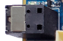

Audio can be output through the speaker, headset, HDMI, or optical interface. The optical interface can connect to speakers or amplifiers with optical input.

## WIFI / Bluetooth Module

The standard configuration includes a 2.4G / 5G dual-band WIFI6 SDIO WIFI/BT combo module, compatible with AP6398S, AP6375S, and Ofilm dual-band WIFI modules.

## UART Interfaces

RK3568 provides 10 UART ports. The mainboard reserves three TTL UARTs through PH connectors, corresponding to UART3, UART4, and UART9. UART2 is also reserved as the debug UART.

## PCIe Interface

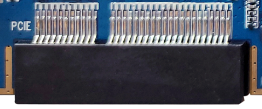

Compared with RK3288, RK3568 adds a PCIe bus. The mainboard reserves a standard PCIe connector for external PCIe devices.

## Reserved GPIO Interface

The mainboard reserves a GPIO box-header connector for GPIO expansion and common control-type peripheral connections.

## Key Mapping

| Key | Function |
| --- | --- |
| VOL+ | Volume Up |
| VOL- | Volume Down |
| PWRKEY | Power key |
| RESET | Reset key |
