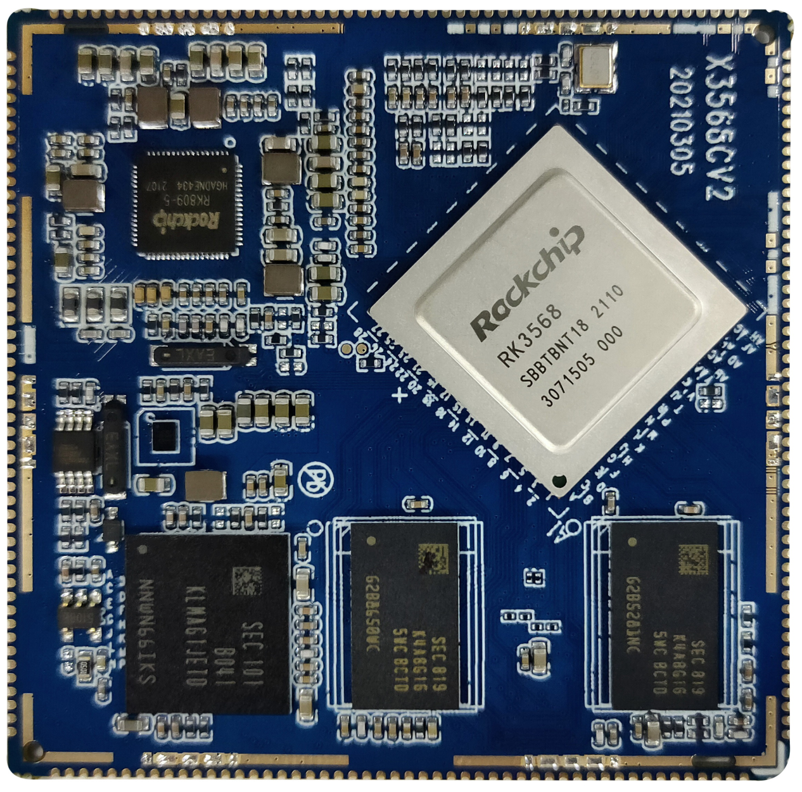
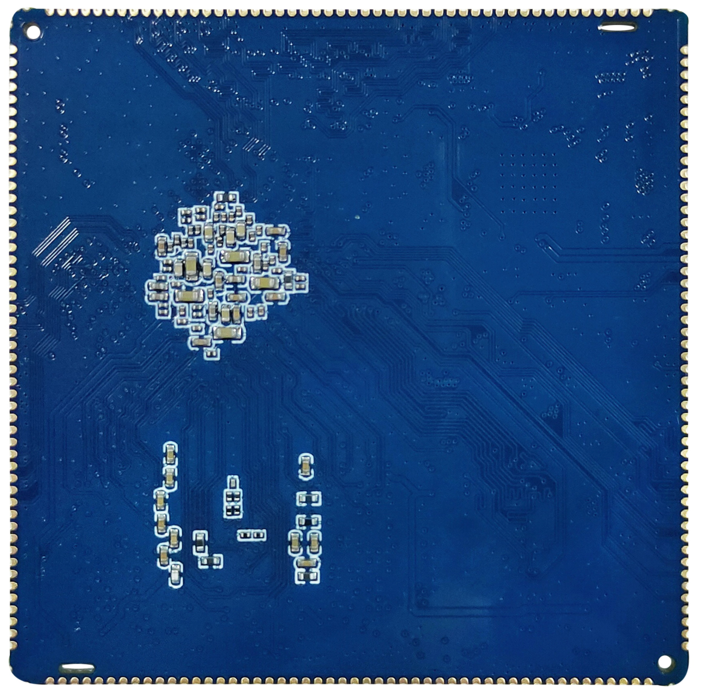

# Product Introduction

The X3568V4 mainboard is based on the Rockchip RK3568 / RK3568B2 platform and uses the X3568CV2 / X3568CV3 core board. RK3568 integrates a quad-core ARM Cortex-A55 CPU running up to 2GHz, and is suitable for intelligent terminals, industrial control, display control, multimedia devices, and embedded system development.

The X3568 core board has two versions: X3568CV2 uses DDR4 memory, while X3568CV3 uses LPDDR4 / LPDDR4X memory. The two versions are pin-compatible and software-compatible. The RK3568 chip is available in metal-lid and plastic packages; the latest 9Tripod code can support both packages.

## Features

- CPU core: quad-core ARM Cortex-A55;
- Main frequency: 2GHz × 4;
- Memory: 1GB / 2GB / 4GB / 8GB DDR4 or LPDDR4 / LPDDR4X, with 2GB as the standard configuration;
- Flash: optional 4GB / 8GB / 16GB / 32GB / 64GB / 128GB eMMC, with 16GB as the standard configuration;
- 5 USB HOST2.0 ports: 2 ports through standard Type-A USB connectors and 3 ports through PH connectors;
- 2 USB HOST3.0 ports;
- 1 Micro USB OTG port, multiplexed with one USB3.0 port;
- 4 TTL UART ports, including 1 debug UART;
- 1 TF card interface;
- 1 HDMI output interface;
- 1 SPDIF optical interface;
- 1 20-pin GPIO expansion interface;
- 1 DSI or LVDS display interface, selected by software configuration;
- 1 DSI or EDP display interface, selected by core-board resistor configuration;
- 1 SATA interface;
- Supports dual Gigabit Ethernet, MIPI camera, PCIe 3.0, USB mouse/keyboard, RTC, and WIFI/BT module.

## Core-board Features

- Compact size: 55mm × 55mm;
- 200PIN pins are routed out;
- Uses RK809 PMU for stable and reliable operation;
- X3568CV2 uses dual-channel DDR4 and supports 1GB / 2GB / 4GB / 8GB;
- X3568CV3 uses LPDDR4 / LPDDR4X and supports 1GB / 2GB / 4GB / 8GB;
- Both DDR4 and LPDDR4 / LPDDR4X designs can run stably at 1560MHz;
- Supports Android / Linux / Ubuntu / Debian operating systems;
- Supports dual Gigabit Ethernet;
- Verified by reliability tests such as high/low temperature and repeated reboot tests.

## Product Appearance

## Core-board Structure

## System Configuration

| Item | Specification |
| --- | --- |
| CPU | RK3568 / RK3568B2 |
| Main frequency | Quad-core A55, 2GHz |
| Memory | 2GB standard, hardware-compatible with 4GB and 8GB |
| Storage | Optional 4GB / 8GB / 16GB eMMC, 16GB standard |
| PMIC | RK809, supports dynamic frequency scaling |

## Interface Parameters

| Item | Specification |
| --- | --- |
| LCD interface | Supports DSI / LVDS / EDP / HDMI output |
| Touch interface | Capacitive touch |
| Audio interface | Supports headset / speaker output and recording / playback |
| SD card interface | 2 SDIO output channels |
| eMMC interface | On-board eMMC, pins are not routed out |
| Ethernet interface | 2 Gigabit Ethernet ports |
| USB HOST2.0 interface | 2 HOST2.0 ports |
| USB HOST3.0 interface | 2 HOST3.0 ports |
| OTG interface | 1 OTG port, multiplexed with one USB3.0 port |
| UART interface | 10 UART ports, including flow-control UARTs |
| PWM interface | 16 PWM outputs |
| I2C interface | 6 I2C outputs |
| SPI interface | 4 SPI outputs |
| ADC interface | 2 ADC outputs, with 6 channels not routed out |
| Camera interface | CSI / BT601 / BT656 / BT1120 / RAW input |

## Electrical Characteristics

| Item | Specification |
| --- | --- |
| 3.3V input | 3.3V / 2A |
| RTC input | 3V / 0.6uA |
| Output voltage | 3.3V / 1.5A, available for carrier-board power supply |
| Operating temperature | -10~70°C |
| Storage temperature | -10~40°C |

## Mechanical Parameters

| Item | Specification |
| --- | --- |
| Package style | Stamp-hole style |
| Core-board size | 55mm × 55mm × 3mm |
| Pin pitch | 1.0mm |
| Pad size | 1.3mm × 0.5mm |
| Pin count | 200PIN |
| PCB layers | 8 layers |
| Warpage | Not more than 0.5% |
