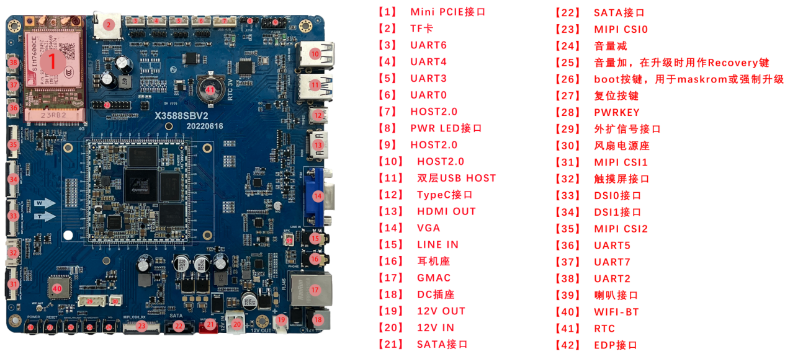

# Hardware Resources

This page summarizes connector locations, interface descriptions, and software driver support. For detailed connector usage, see [Interface Details](./x3588s-interface-details). For mechanical size and full specifications, see [Size and Specifications](./x3588s-product-size-spec).

## Top View

## Side View

## Hardware Interface List

| No. | Name | Description |
| --- | --- | --- |
| 【1】 | Mini PCIE接口 | 外扩4G Wireless无线通讯模块 |
| 【2】 | TF卡 | TF卡座 |
| 【3】 | UART6 | UART6，RS485电平接口，可配置成TTL电平 |
| 【4】 | UART4 | UART4，RS485电平接口，可配置成TTL电平 |
| 【5】 | UART3 | UART3，RS232电平接口 |
| 【6】 | UART0 | UART0，RS232电平接口 |
| 【7】 | HOST2.0 | USB HOST2.0接口 |
| 【8】 | PWR LED接口 | 用于外接机箱的POWER按键及LED指示灯 |
| 【9】 | HOST2.0 | USB HOST2.0接口，接机箱前端USB扩展口 |
| 【10】 | HOST2.0 | 双层USB HOST2.0接口 |
| 【11】 | 双层USB HOST | 双层USB HOST接口，上层为HOST2.0，下层为HOST3.0 |
| 【12】 | TypeC接口 | 标准TypeC接口，用于程序下载等 |
| 【13】 | HDMI OUT | HDMI1输出接口 |
| 【14】 | VGA | VGA信号输出 |
| 【15】 | LINE IN | 音频录音接口 |
| 【16】 | 耳机座 | 耳机输出 |
| 【17】 | GMAC | 千兆以太网接口，PCIE接口 |
| 【18】 | DC插座 | 12V直流电源输入接口 |
| 【19】 | 12V OUT | 12V电源输出，GPIO可控 |
| 【20】 | 12V IN | 12V直流电源输入，标准机箱电源输入接口 |
| 【21】 | SATA接口 | SATA电源接口 |
| 【22】 | SATA接口 | SATA信号接口 |
| 【23】 | MIPI CSI0 | MIPI摄像头接口 |
| 【24】 | 独立按键 | 音量减 |
| 【25】 | 独立按键 | 音量加，在升级时用作Recovery键 |
| 【26】 | 独立按键 | boot按键，用于maskrom或强制升级 |
| 【27】 | 独立按键 | 复位按键 |
| 【28】 | 独立按键 | PWRKEY |
| 【29】 | 外扩信号接口 | 开机、复位、程序更新、GPIO控制等扩展座 |
| 【30】 | 风扇电源座 | DC12V，GPIO可控风扇电源座 |
| 【31】 | MIPI CSI1 | MIPI摄像头接口 |
| 【32】 | 触摸屏接口 | I2C通讯，触摸屏接口 |
| 【33】 | 显示接口 | DSI0接口 |
| 【34】 | 显示接口 | DSI1接口 |
| 【35】 | MIPI CSI2 | MIPI摄像头接口 |
| 【36】 | UART5 | UART5，TTL电平接口，可扩展CAN接口 |
| 【37】 | UART7 | UART7，TTL电平接口 |
| 【38】 | UART2 | UART2，TTL电平接口，默认为调试串口 |
| 【39】 | 喇叭接口 | 外置双声道扬声器 |
| 【40】 | WIFI-BT | 双频WIFI、BT模块 |
| 【41】 | RTC | RTC钮扣电池 |
| 【42】 | 显示接口 | EDP接口，和HDMI输出接口复用 |

## Software and Driver Support

The X3588S mini ITX board supports Android 12, Linux, Ubuntu, Debian, and Buildroot/QT related systems. The driver support table is kept from the original manual:

| system / driver | linux+ / android12 | linux+ / Debian10 | linux+ / ubuntu | linux+QT |
| --- | --- | --- | --- | --- |
| 7寸MIPI屏(1024*600) | ● | ● | ● | 即将支持 |
| 背光驱动 | ● | ● | ● | 即将支持 |
| PMIC驱动(RK806) | ● | ● | ● | 即将支持 |
| 电容触摸 | ● | ● | ● | 即将支持 |
| EMMC驱动 | ● | ● | ● | 即将支持 |
| SD卡驱动 | ● | ● | ● | 即将支持 |
| 独立按键 | ● | ● | ● | 即将支持 |
| ADC驱动 | ● | 即将支持 | 即将支持 | 即将支持 |
| 开关机 | ● | 即将支持 | 即将支持 | 即将支持 |
| 休眠唤醒 | ● | 即将支持 | 即将支持 | 即将支持 |
| 六路USB HOST2.0驱动 | ● | ● | ● | 即将支持 |
| 一路USB HOST3.0驱动 | ● | ● | ● | 即将支持 |
| 一路TypeC驱动 | ● | 即将支持 | 即将支持 | 即将支持 |
| mini PCIE wireless | ● | 即将支持 | 即将支持 | 即将支持 |
| SATA驱动 | ● | ● | ● | 即将支持 |
| RTC驱动 | ● | ● | ● | 即将支持 |
| 音频 | ● | 即将支持 | 即将支持 | 即将支持 |
| 录音 | ● | 不支持 | 不支持 | 即将支持 |
| WIFI | ● | ● | ● | 即将支持 |
| BT | ● | 即将支持 | 即将支持 | 即将支持 |
| CSI摄像头驱动 | 即将支持 | 不支持 | 不支持 | 即将支持 |
| USB口摄像头驱动 | ● | ● | ● | 即将支持 |
| 串口 | ● | ● | ● | 即将支持 |
| CAN总线 | ● | 即将支持 | 即将支持 | 即将支持 |
| HDMI OUT | ● | ● | ● | 即将支持 |
| VGA | ● | ● | ● | 即将支持 |
| 千兆以太网 | ● | ● | ● | 即将支持 |

