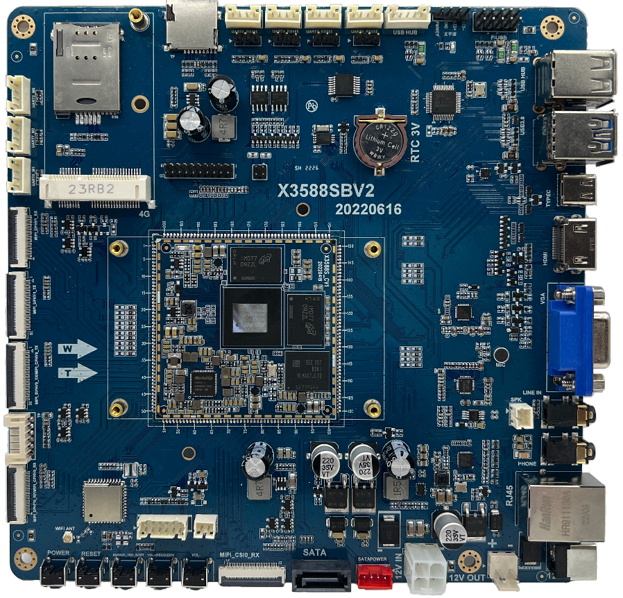

# Product Introduction

The X3588S mini ITX mainboard is based on the Rockchip RK3588S platform and uses a Mini-ITX form factor. It integrates the X3588SCV1 core board and exposes USB, UART, HDMI, VGA, MIPI DSI, MIPI CSI, SATA, Ethernet, audio, keys, RTC, Wi-Fi/Bluetooth, mini PCIe, and other common interfaces on the carrier board. It is suitable for high-performance edge computing, industrial control, multimedia display, AI inference, camera capture, and embedded-system verification.

## Feature Highlights

- ARM Cortex-A76 quad-core + Cortex-A55 quad-core CPU.
- Up to 2.4GHz.
- 1GB/2GB/4GB/8GB/16GB/32GB LPDDR4/LPDDR4X memory options.
- 4GB/8GB/16GB/32GB/64GB/128GB eMMC options.
- 6 USB HOST2.0 ports, 1 USB HOST3.0 port, and 1 Type-C port.
- 7 TTL UART interfaces, including one debug UART; can be configured as 2 RS232 and 2 RS485 interfaces.
- TF card interface.
- Reset, power, force-upgrade buttons, and 2 independent keys.
- HDMI output, two DSI display interfaces, and EDP display interface. EDP is shared with HDMI OUT.
- SATA interface.
- Speaker, LINE IN, MIC input, and headphone output.
- Capacitive touch support.
- On-board high-speed dual-band Wi-Fi/Bluetooth module.
- RTC real-time clock retention.
- Gigabit Ethernet.
- Up to four CSI camera interfaces.
- mini PCIe wireless module interface.

## Core Board Features

- X3588SCV1 size is 55mm x 55mm while exporting the GPIO resources.
- RK806 PMU is used according to the feature description.
- Dual-channel LPDDR4/LPDDR4X design, up to 32GB.
- Suspend and wake-up support.
- Android 12.0, Linux, Debian, Ubuntu, and related operating systems.
- Gigabit Ethernet, SATA, PCIe, USB3.0, and other high-speed buses.
- Stamp-hole package for stable contact.
- Reliability tests performed.

## System Configuration

| Item | Parameter |
| --- | --- |
| CPU | RK3588S |
| Clock | Quad-core Cortex-A76 + quad-core Cortex-A55, up to 2.4GHz |
| Memory / Storage | 4GB+16GB or 8GB+32GB optional |
| Power IC | RT806 in the original table; core-board feature text mentions RK806 PMU |

## Interface Parameters

| Item | Parameter |
| --- | --- |
| LCD | MIPI, EDP, and HDMI output; up to 6 same-display and 4 different-display outputs |
| Touch | Capacitive touch through USB or I2C |
| Audio | IIS / PCM / TDM |
| SPDIF | 2 optical outputs, 8-channel audio |
| SD | 2 SDIO output channels |
| eMMC | On-board eMMC, pins are not separately exported |
| Ethernet | Gigabit Ethernet |
| USB HOST2.0 | 2 HOST2.0 channels in the core-board table; board exposes multiple host ports |
| USB HOST3.0 | 2 USB OTG 3.0 / 2.0 / Type-C |
| UART | 10 UARTs, flow-control UART supported |
| PWM | 16 PWM outputs |
| I2C | 9 I2C outputs |
| SPI | 5 SPI outputs |
| ADC | 8 ADC outputs |
| CAN | 3 CAN outputs |
| Camera | 6 CSI inputs |
| HDMI | 1 HDMI2.1 TX |
| PCIe | PCIe2.0 |
| SATA | 2x SATA3.0 / PCIe2.1 |

## Electrical Characteristics

| Item | Parameter |
| --- | --- |
| Input voltage | Original table says 4V/5A and recommends 4V/8A; interface labels and accessory list indicate 12V input. Verify with schematic. |
| RTC input | 2.5V to 3V / 100uA, external coin-cell battery |
| Output voltage | 3.3V/2A and 1.8V/2A for carrier-board power |
| Operating temperature | 0 to 70°C in the feature table |
| Storage temperature | -10 to 50°C in the feature table |

