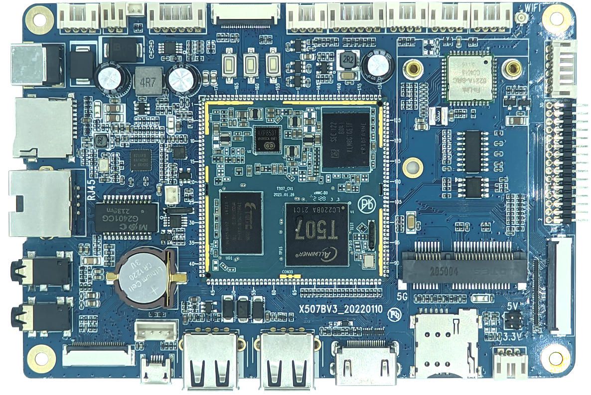

# X507 Development Board

The X507 development board is based on the Allwinner T507 quad-core Cortex-A53 SoC and carries the X507CV1 core module. The supplied manuals describe Android 10 and Linux 4.9 BSP workflows.

## Documentation

- [Product Introduction](./x507-product-introduction)
- [Hardware Resources](./x507-hardware-resources)
- [Pin Definition](./x507-pin-definition)
- [Interface Details](./x507-interface-details)
- [Hardware Design](./x507-hardware-design)
- [Package Contents](./x507-configuration-list)
- [Android Build and Flashing](./x507-android-build-flash)
- [Android User Guide](./x507-android-user-guide)
- [Android Tests and Drivers](./x507-android-test-driver)
- [Linux Build and Flashing](./x507-linux-build-flash)
- [Linux Filesystem and Qt Status](./x507-linux-qt-filesystem)
- [Linux Examples](./x507-linux-examples)
