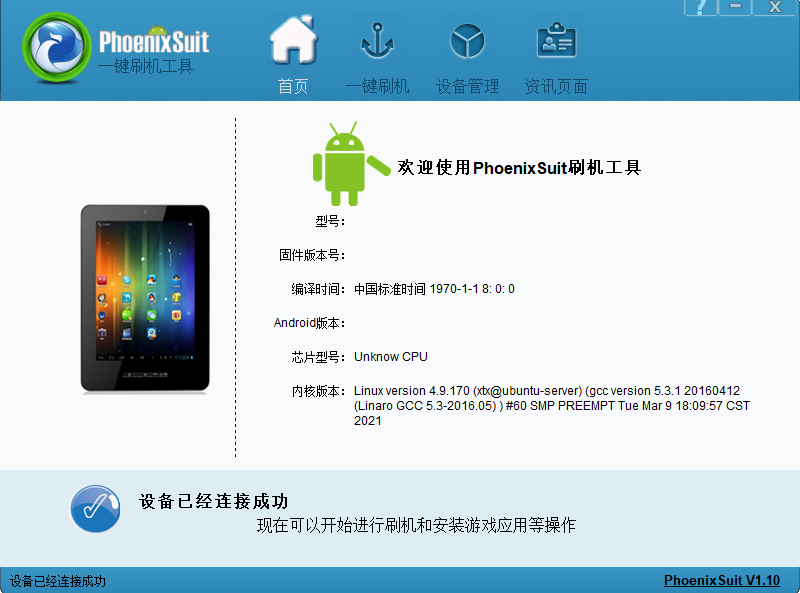
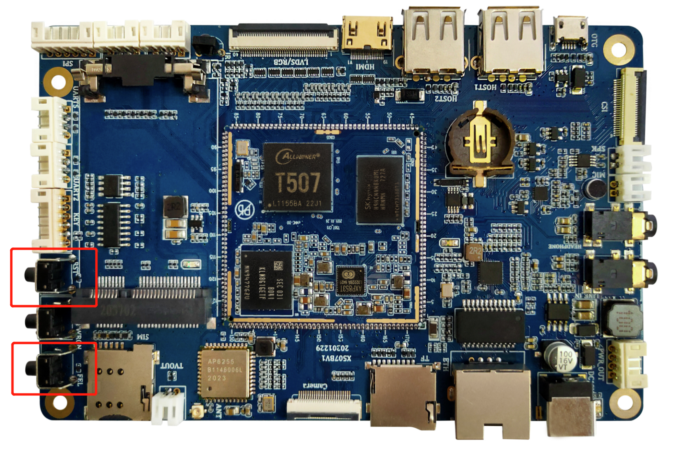

# Android Build and Flashing

## Build Environment

The supplied manual uses old Ubuntu examples. For the delivered Android 10 SDK, follow the SDK README, build script, and any container or host-version requirements. A native Linux host with sufficient RAM and disk space is recommended for a complete Android build.

## Common Packages

```bash
sudo apt-get install git gnupg flex bison gperf build-essential zip curl   zlib1g-dev gcc-multilib g++-multilib libncurses5-dev libxml2-utils   xsltproc unzip lzop liblz4-tool device-tree-compiler u-boot-tools   libssl-dev adb fastboot
```

For a serial console:

```bash
sudo apt-get install picocom
sudo picocom -b 115200 /dev/ttyUSB0
```

## Source Retrieval

### Restore a Git Working Tree from the Archive

```bash
tar xjf x507_android10.tar.bz2
cd x507_android10
git checkout .
```

### Add the Remote Repository

```bash
git remote add gitlab http://gitlab.com/9tripod/x507_android10.git
git pull gitlab
```

Archive names and repository URLs may differ between delivery releases.

## Build Commands

Build as a normal user rather than running the complete Android build as root.

### Complete Build

```bash
./mk.sh -a
```

### Kernel Build

```bash
./mk.sh -l
```

### Android Filesystem Build

```bash
./mk.sh -s
```

### Help

```bash
./mk.sh -h
```

The source manual states that `-a` performs the U-Boot, kernel, system, and update-image steps. Treat the current `mk.sh -h` output as authoritative.

## Main Images

| Image | Purpose |
|---|---|
| MiniLoaderAll.bin / uboot.img / trust.img | Boot-chain images |
| kernel.img | Linux kernel image |
| resource.img | Device tree and boot resources |
| boot.img | Android ramdisk and boot image |
| system.img | Android system partition |
| vendor.img | Android vendor partition |
| recovery.img | Recovery image |
| misc.img | Boot-mode and recovery parameters |
| oem.img | Vendor read-only data or applications |
| update-android.img | Complete upgrade package |

## PhoenixSuit USB Flashing

1. Install and start PhoenixSuit.
2. Select the complete IMG firmware generated by the build.
3. Power the board off and wait for all LEDs to turn off.
4. Hold FEL and reapply power, or hold FEL and press Reset.
5. Confirm the format prompt according to the project requirements.
6. Wait for completion without disconnecting USB or power.

### Device and Firmware Selection




### FEL Location



### Flash Progress


## PhoenixCard TF-Card Upgrade

1. Extract PhoenixCard from the SDK tools directory.
2. Insert a TF card and select the complete firmware.
3. Create the upgrade card.
4. With power removed, insert the card and power the board on.
5. Wait for the display progress and serial log to finish, then remove the card and reboot.

## Source-Manual Errata

The Android manual contains legacy Rockchip material, including `rk3288` output paths, `rk30board` command-line samples, and Rockchip logo instructions. Those items are not directly applicable to the Allwinner T507. This page keeps only the T507/Longan build and PhoenixSuit/PhoenixCard procedures.
