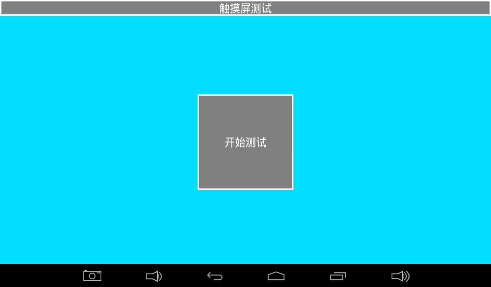
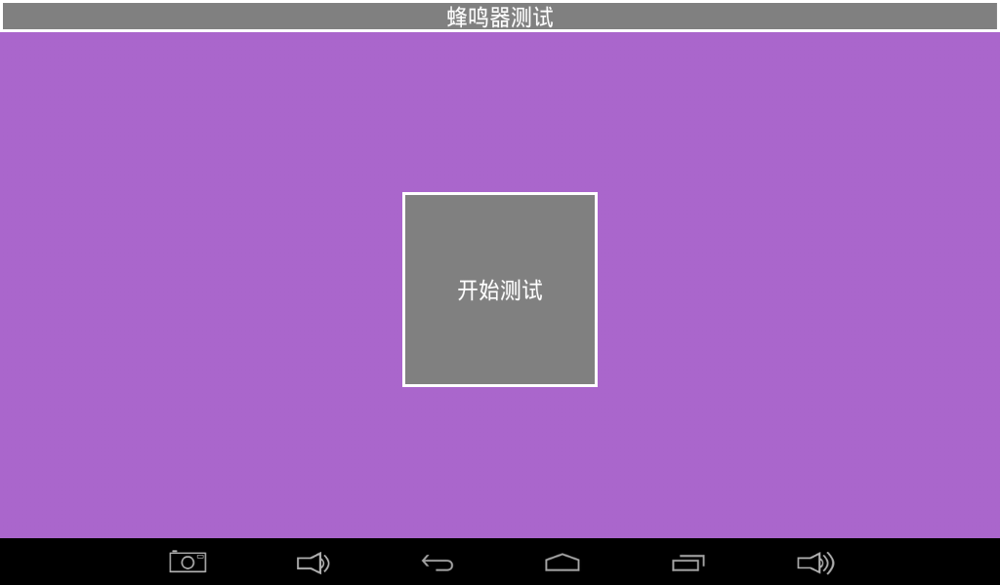
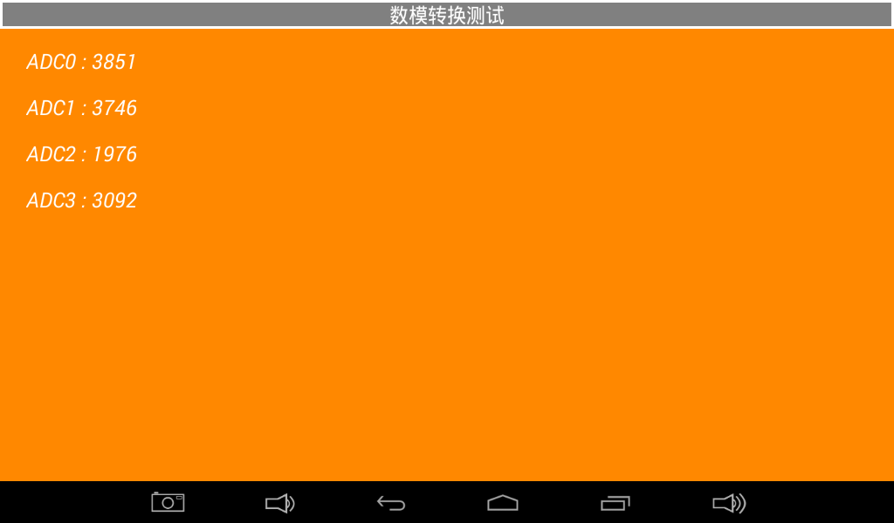
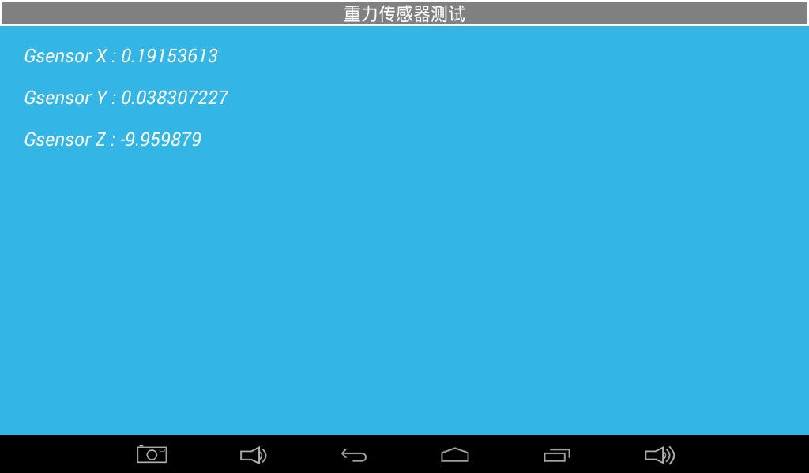
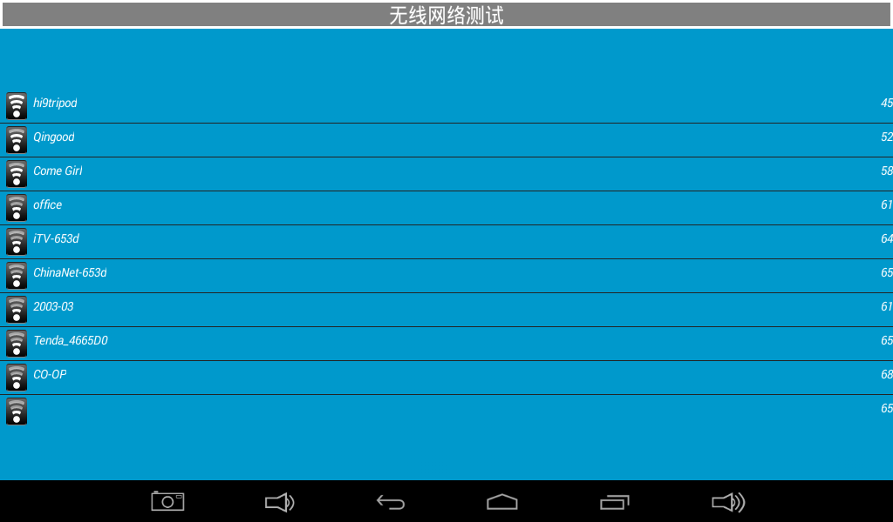
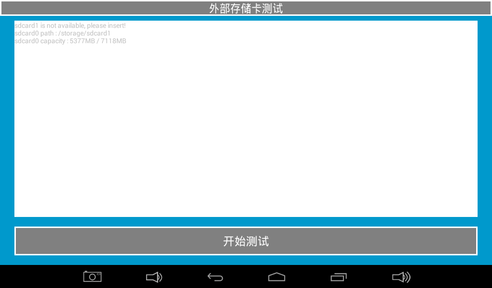

# Android Tests and Drivers

## Hardware Test Application

The supplied manual describes an Android hardware-test application for development and production checks. The available pages may vary with the firmware version.

### LCD Test


Tap the solid-color area to cycle colors and check for missing colors, bad pixels, or display faults.

### Touch Test



Draw lines across the panel; diagonal strokes are useful for checking continuity and edge response.

### LED Test


Toggle the on-screen LED state and observe the corresponding board LED.

### Buzzer Test



The buzzer sounds while the test button is held.

### Backlight Test


Move the slider and verify smooth backlight adjustment.

### Key Test


Press and release the board keys and verify both events.

### Battery Test


Displays battery level and status when a battery is connected.

### ADC Test



Observe ADC-channel voltage changes from an external input or potentiometer.

### G-Sensor Test



Rotate the board and observe X, Y, and Z values.

### Audio Test


Play a test tone and check speaker or headphone output.

### Camera Test


Open camera preview and inspect the image.

### Wi-Fi Test



Scan nearby wireless networks after enabling Wi-Fi.

### Network Test


Verify web access through wired or wireless networking.

### UART Test


Loop TXD to RXD and run the UART loopback test.

### TF Card Test



Insert a TF card and verify capacity and read/write information.

### USB Drive Test


Insert a USB drive and verify device and storage information.

## Driver Locations

| Function | Path Given by the Manual | Notes |
|---|---|---|
| G-sensor | `longan/kernel/linux-4.9/drivers/input/sensors/accel/lis3dh.c` | Also check device tree and the sensor framework |
| Capacitive touch | `longan/kernel/linux-4.9/drivers/input/touchscreen/gslx680new/` | Main file is `gslX680.c` |
| Display | `longan/kernel/linux-4.9/drivers/gpu/drm/` | The manual names `panel/panel-simple.c`; the full path also involves DRM, TCON, PHY, and device tree |
| Keys | `longan/kernel/linux-4.9/drivers/input/keyboard/adc-keys.c` | Requires matching ADC-key device-tree data |
| Wi-Fi | `longan/kernel/linux-4.9/drivers/net/wireless/` | The exact directory depends on the module and SDK release |
| Camera | The manual gives a Rockchip path | Inconsistent with T507; locate the driver again in the current Longan SDK |

## Common System Queries

```bash
cat /proc/cmdline
cat /proc/cpuinfo
cat /proc/meminfo
cat /proc/partitions
cat /proc/version
cat /proc/net/dev
dmesg
```

Treat the manual's output as an example only. CPU identification, partitions, memory, and command line must be read from the actual device.

## init.rc Changes

For a permanent change, edit the relevant `init*.rc` file in the source tree, rebuild the required image, and flash it. Temporary `boot.img` unpacking requires tools compatible with the active Android release and image format.

## Source-Manual Errata

- The temporary `ramdisk.sh` example contains `out/target/product/rk3288`, which is not a T507 path.
- The U-Boot/kernel logo description is Rockchip-specific and is not directly applicable to the Allwinner T507.
- The `/proc/cmdline` example contains `rk30board` and is only legacy sample output.
- The camera-driver path is written as `hardware/rockchip/...`, which is inconsistent with Longan/T507.

Locate the actual files through the current source tree and build scripts before applying any change.
