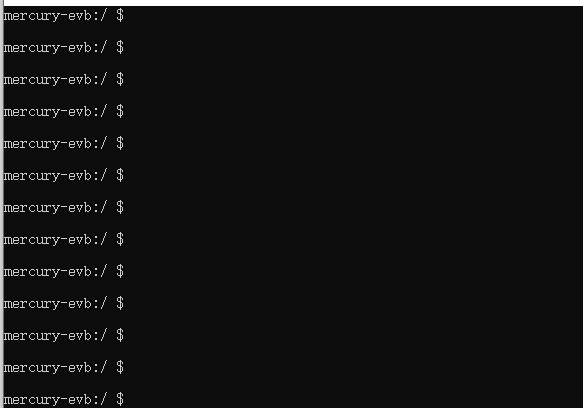
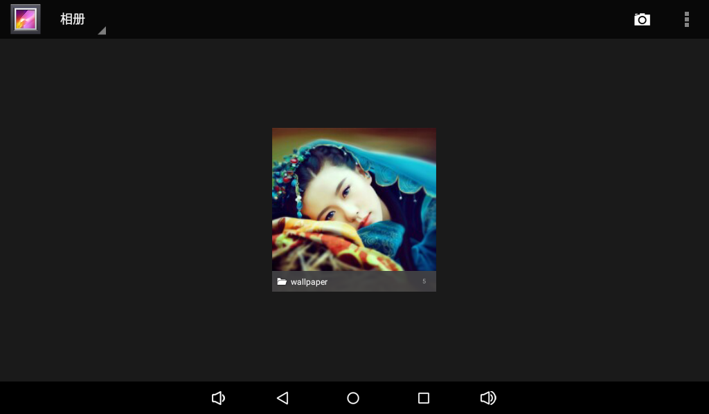
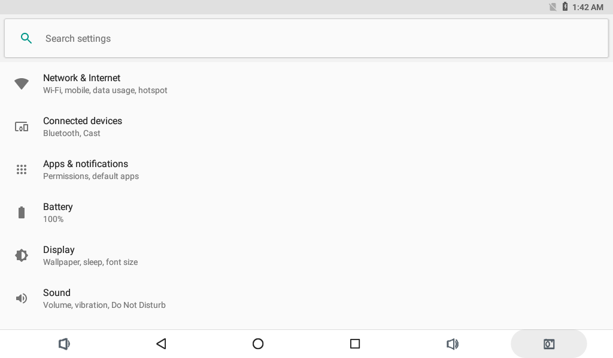
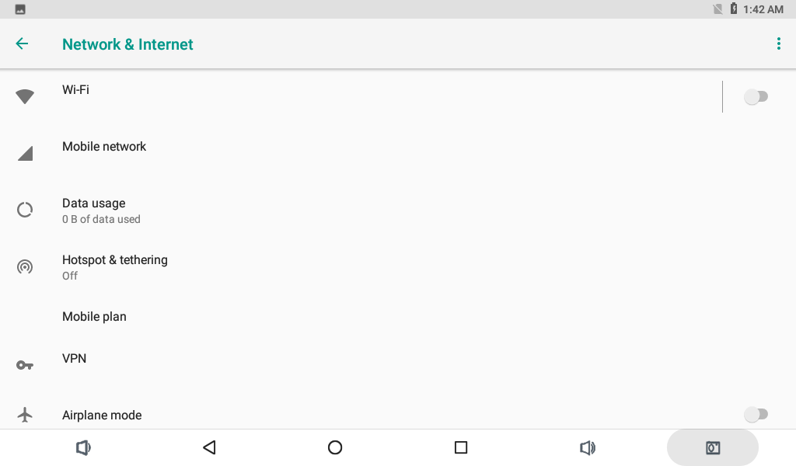
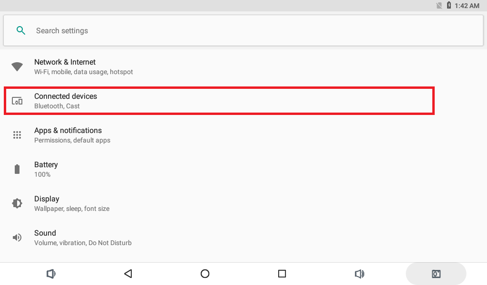
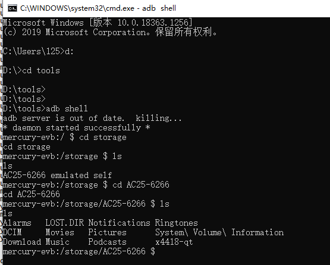
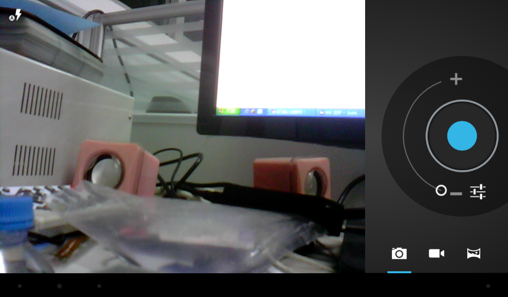
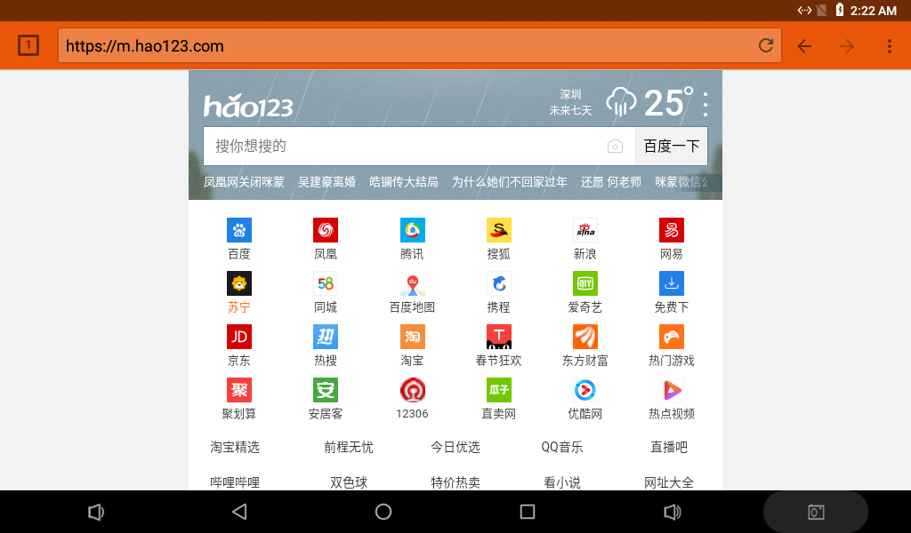
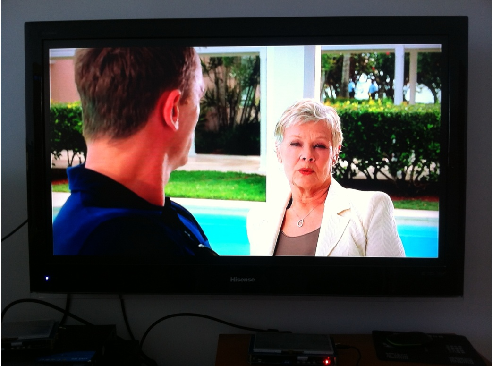
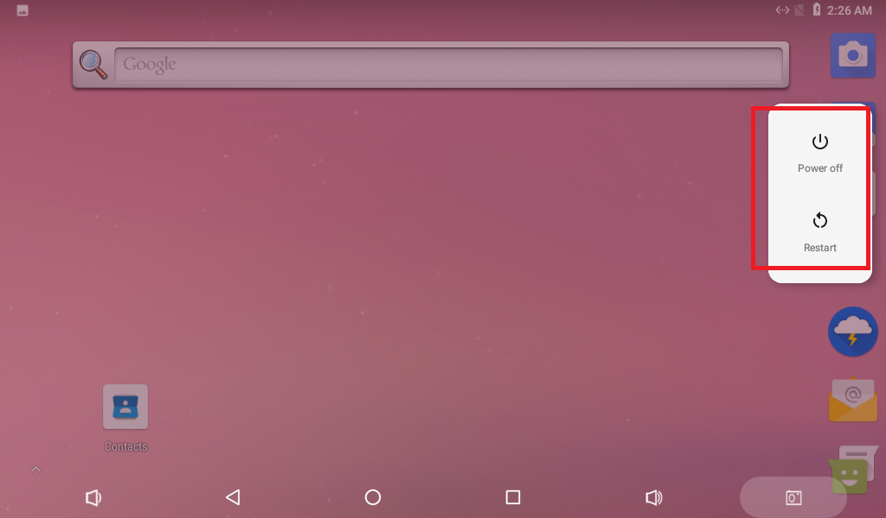

# Android User Guide

## Debug Console

Connect to the UART0 debug port at 115200 8N1 with hardware and software flow control disabled. The serial console provides boot logs and a shell after Android starts.



Common ADB commands:

```bash
adb devices
adb shell
adb push local-file /data/local/tmp/
adb pull /data/local/tmp/remote-file .
```

## Audio Playback

Place audio files on a TF card or USB drive. After media scanning completes, play them from the music application.


## Video Playback

The gallery application scans external storage for videos and images.




## Wi-Fi

Open Settings, Network and Internet, then Wi-Fi. Enable Wi-Fi, select the SSID, and enter the password.





## Bluetooth

Open Settings, Connected devices, then Bluetooth. Search for and pair a phone, speaker, or another device.




## USB Mouse and Keyboard

Connect a USB mouse, keyboard, or wireless receiver to a USB Host port. Android automatically detects standard HID devices.

## TF Card and USB Drive

Android normally mounts removable storage below `/storage/`. Check it with:

```bash
adb shell ls -l /storage
adb shell df -h
```



## Screen Rotation

The on-board gravity sensor reports orientation changes. Rotation also depends on the system setting and whether the application allows rotation.

## Camera

Open the camera application for preview, still capture, and video recording. The camera module must match the active device tree, driver, supply, and timing configuration.



## Wired Ethernet

After a live cable is connected, Android normally obtains an address through DHCP. Useful checks are:

```bash
adb shell ip addr show eth0
adb shell ip route
adb shell ping -c 4 8.8.8.8
```



## HDMI Output

HDMI carries video and audio. The actual modes depend on the firmware, monitor EDID, and display driver.



## Power and Suspend

- Depending on the PMIC configuration, the board starts automatically when 12V is applied or starts through the Power key.
- Hold the Power key to open the shutdown menu.
- Press the Power key briefly to suspend and press it again to resume.


