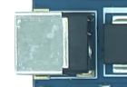
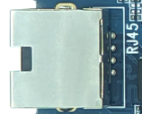
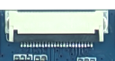
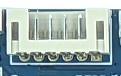
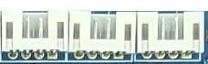
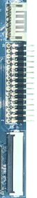
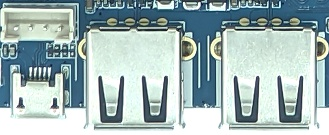
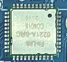

# Interface Details

## Power Input

The board uses a 12V DC input. The standard package in the hardware manual includes a 12V/2A adapter.

## Gigabit Ethernet

An RTL8211F Gigabit Ethernet PHY is fitted. Network configuration is handled by Android or Linux.

## TF Card

One TF card slot is provided for storage expansion and file transfer.

## Parallel Camera

The 24-pin connector carries the parallel camera bus. Confirm the module supply voltage and LDO setting.

## MIPI CSI Camera

The 26-pin connector carries the MIPI CSI differential interface.

## SIM and PCIe 4G Expansion

The SIM slot is used together with a PCIe 4G communication module.

## FEL Upgrade Key

Hold FEL and reset or reapply power to enter the Allwinner USB upgrade mode.

## Power Key

Used for power-on, Android suspend/resume, and software shutdown.

## Reset Key

Performs a hardware reset while the system is running.

## Key Header

A 6-pin PH header exposes power, reset, and upgrade-key signals.

## UART Headers

UART0 is the TTL debug port. UART2 and UART5 are selectable as TTL or RS-232.

## I2C and SPI Headers

I2C and SPI expansion signals. Verify pin multiplexing and voltage domains from the schematic.

## LCD and Backlight

The connectors are for backlight, LVDS, and multiplexed LVDS/RGB display signals.

## HDMI

Type-A HDMI output for a monitor or television.

## USB

Two USB Host 2.0 Type-A ports and one Micro USB OTG port.

## RTC Battery

The backup battery maintains the RTC when main power is removed.

## Wi-Fi/Bluetooth

On-board 2.4GHz/5GHz dual-band Wi-Fi and Bluetooth module.
