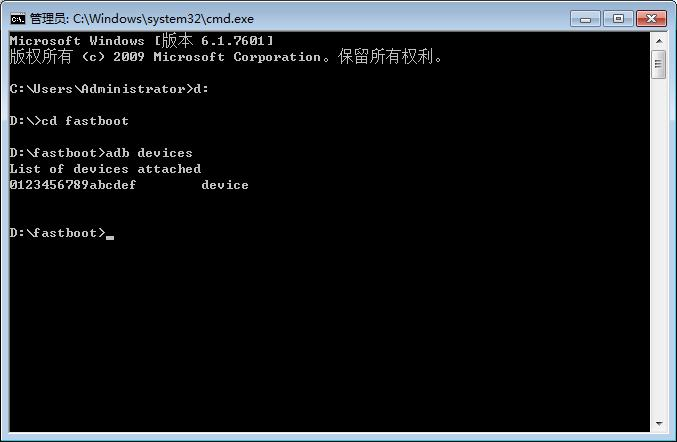
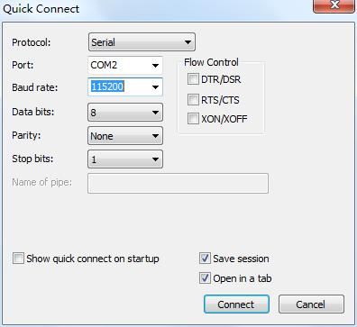
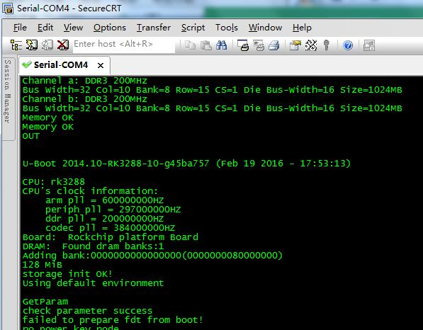

# Linux Build and Flashing

## Development Host

The supplied manual covers both VMware and native Ubuntu. A native Ubuntu host or a validated container is preferable for a complete SDK build. Do not copy the old Ubuntu 14.04/16.04 setup blindly; check the current SDK README first.

## Serial Tools

```bash
sudo apt-get install picocom
sudo picocom -b 115200 /dev/ttyUSB0
```

Exit picocom with `Ctrl+A`, then `Ctrl+Q`.

Minicom is another option:

```bash
sudo apt-get install minicom
sudo minicom -s
```

Configure 115200 8N1 with software and hardware flow control disabled.

## Build Dependencies

The dependency list from the manual can be consolidated as:

```bash
sudo apt-get install git-core gnupg flex bison gperf build-essential zip curl   zlib1g-dev gcc-multilib g++-multilib genromfs libc6-dev-i386   libncurses5-dev libx11-dev ccache libgl1-mesa-dev libxml2-utils   xsltproc unzip lzop liblz4-tool genext2fs make device-tree-compiler   u-boot-tools libssl-dev autoconf python3-pyelftools libusb-1.0-0-dev   p7zip-full adb fastboot
```

Package names vary between Ubuntu releases; replace unavailable packages according to APT output.

## Cross Compiler

The toolchains are included in the source package. The manual lists paths such as:

```text
prebuilts/gcc/linux-x86/aarch64/gcc-linaro-6.3.1-2017.05-x86_64_aarch64-linux-gnu/
prebuilts/gcc/linux-x86/aarch64/aarch64-linux-android-4.9/
```

Read the current Makefile and build scripts to determine the actual `CROSS_COMPILE` value.

## Source Retrieval

```bash
tar -xvf x507_linux.tar.bz2
cd x507_linux
git checkout .
```

The archive name and download location can change between releases.

## Example SDK Layout

```text
brandy  build  buildroot  build.sh  device  doc  kernel  out  platform  test  tools
```

## Build Help

```bash
./build.sh -h
```

## Build Commands

### U-Boot

```bash
./build.sh uboot
```

### Default Build

```bash
./build.sh
```

### Buildroot Filesystem

```bash
./build.sh buildroot
```

### Package Firmware

```bash
./build.sh pack
```

Use the paths printed by the current build script; outputs are normally placed below `out/`.

## PhoenixSuit Flashing

1. Install PhoenixSuit and the Allwinner USB driver on Windows.
2. Select the complete IMG generated by `./build.sh pack`.
3. Do not start the upgrade before the device has entered upgrade mode.
4. Hold FEL/RECOVERY, connect Micro USB OTG, and apply 12V power; press Reset if required.
5. After the tool detects the device, confirm formatting and flashing.


## ADB and Serial Checks

When ADB is enabled in the Linux image:

```bash
adb devices
adb shell
```




Configure the serial terminal for 115200 8N1 with flow control disabled.




