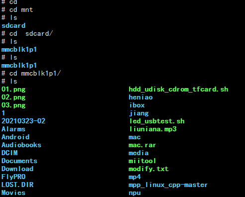
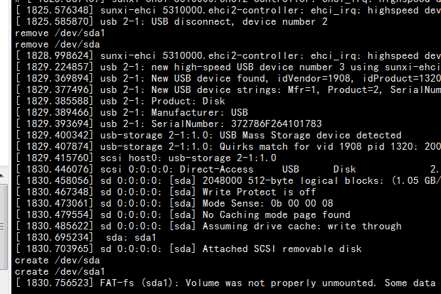
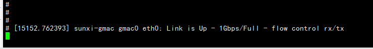

# Linux Examples

## TF Card

After inserting the card, inspect the kernel log and block devices:

```bash
dmesg | tail -n 50
lsblk
```

The manual shows `/dev/mmcblk1p1`, but the real node must be taken from `lsblk`:

```bash
mkdir -p /mnt/tf
mount /dev/mmcblk1p1 /mnt/tf
ls -la /mnt/tf
```



## Audio Playback

List cards and PCM devices first:

```bash
aplay -l
aplay -L
```

Play a WAV file:

```bash
aplay /mnt/tf/test.wav
```


## USB Drive

```bash
dmesg | tail -n 50
lsblk
mkdir -p /mnt/usb
mount /dev/sda1 /mnt/usb
ls -la /mnt/usb
```

The `/dev/sda4` node shown in the source manual is only one partition example and is not fixed.



## Wired Ethernet

After connecting a cable, check link and addressing:

```bash
ip link show eth0
ip addr show eth0
ip route
ethtool eth0
ping -c 4 192.168.1.1
```

When the image does not include `ip`, use `ifconfig` and `route -n` as temporary alternatives.



## Recommended Debug Order

1. Use `dmesg` to confirm that the driver probed successfully.
2. Check the device node and sysfs nodes.
3. Check power, clocks, reset, and pin multiplexing.
4. Then check user-space mounting, network configuration, or audio routing.
