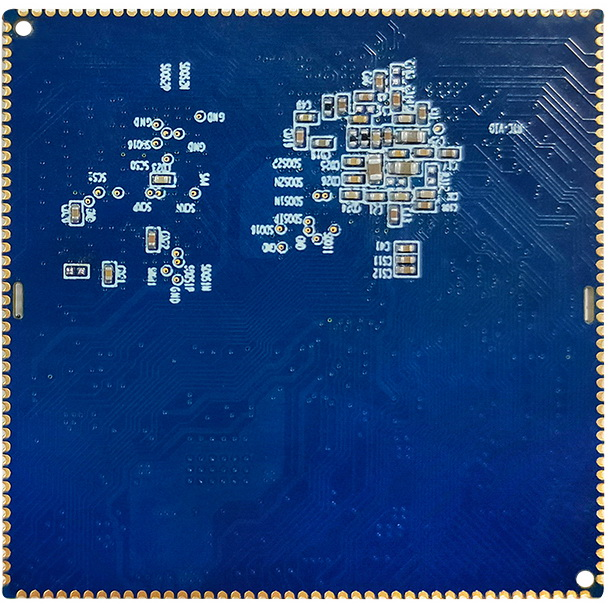

# Product Introduction

## Overview

The X507 development board is based on the Allwinner T507, a quad-core Cortex-A53 SoC running at up to 1.5GHz. It carries the X507CV1 core module and supports Android and Linux BSPs for industrial control, commercial displays, multimedia terminals, network products, and embedded HMI applications.

## Board Features

- 1GB or 2GB LPDDR4; the hardware manual lists 1GB as standard.
- 4GB, 8GB, 16GB, 32GB, or 64GB eMMC; 8GB is listed as standard.
- Two fitted USB Host 2.0 ports and one Micro USB OTG port.
- TTL UART, TF card, reset, power, and FEL upgrade keys.
- Speaker, microphone, headphone, and line-input audio connectors.
- RGB/LVDS display, backlight control, and capacitive touch.
- Dual-band Wi-Fi/Bluetooth module.
- RTC, Gigabit Ethernet, MIPI CSI, parallel camera, and PCIe expansion.

## X507CV1 Core Module

### Front

### Rear

### Mechanical Drawing

## System Configuration

| Item | Specification |
| --- | --- |
| CPU | Allwinner T507 |
| CPU architecture and clock | 4 × Cortex-A53 at 1.5GHz |
| Memory | 1GB standard; hardware supports 2GB LPDDR4 |
| Storage | 4GB / 8GB / 16GB eMMC; 8GB standard in the table |
| PMIC | AXP853T with dynamic frequency scaling |

## Interfaces

| Interface | Specification |
| --- | --- |
| LCD | RGB or LVDS output |
| Touch | Capacitive touch |
| Audio | Headphone/speaker output and recording |
| SD/SDIO | Two SDIO channels |
| eMMC | On-board; eMMC pins are not separately exposed |
| Ethernet | Gigabit Ethernet |
| USB Host 2.0 | Three SoC Host channels; two Type-A ports are fitted on the carrier board |
| USB OTG | One OTG port |
| UART | Six UART channels, including flow-control capability |
| PWM | Six outputs |
| I2C | Six channels |
| SPI | Two channels |
| ADC | Five inputs |
| Camera | One MIPI CSI input and one BT.656 parallel input |

## Electrical Characteristics

| Item | Specification |
| --- | --- |
| 5V input | 5V / 2A |
| RTC input | 3V / 0.6µA |
| Carrier-board output | 3.3V / 1.5A |
| Operating temperature | -40°C to 85°C |
| Storage temperature | -10°C to 40°C |

## Mechanical Parameters

| Item | Specification |
| --- | --- |
| Package | Castellated/stamp-hole module |
| Dimensions | 45mm × 45mm × 3mm |
| Pin pitch | 1.0mm |
| Pad size | 1.3mm × 0.7mm |
| Pin count | 172 pins |
| PCB layers | 8 |

## Software Support Status

This table reproduces the support state in the supplied hardware manual. “Planned” means that the manual did not claim completed support for that software column.

| Driver/Function | Linux 4.9 + Android 10 | Linux 4.9 + Qt |
| --- | --- | --- |
| system driver | Planned | Planned |
| 7-inch 1024×600 RGB panel | Supported | Planned |
| Backlight | Supported | Planned |
| AXP853T PMIC | Supported | Planned |
| Capacitive touch | Supported | Planned |
| eMMC | Supported | Planned |
| SD card | Supported | Planned |
| Independent key | Supported | Planned |
| ADC | Supported | Planned |
| Power control | Supported | Planned |
| Suspend/resume | Supported | Planned |
| Two USB Host 2.0 ports | Supported | Planned |
| One USB OTG port | Supported | Planned |
| Audio playback | Supported | Planned |
| Audio recording | Supported | Planned |
| Dual-band Wi-Fi/Bluetooth 4.0 | Supported | Planned |
| CSI camera | Planned | Planned |
| USB camera | Supported | Planned |
| UART | Supported | Planned |
| HDMI 2.0 | Supported | Planned |
| Gigabit Ethernet | Supported | Planned |
| USB mouse/keyboard | Supported | Planned |
| U-Boot | Supported | Planned |

## Document Version Notes

- The hardware manual is Rev.02 and refers to the X507BV3 carrier board.
- The Linux manual describes a Linux 4.9/Buildroot workflow.
- The Android manual describes an Android 10/Longan workflow.
- SDK paths, module models, and build scripts may vary between delivery releases; use the current SDK as the final reference.
