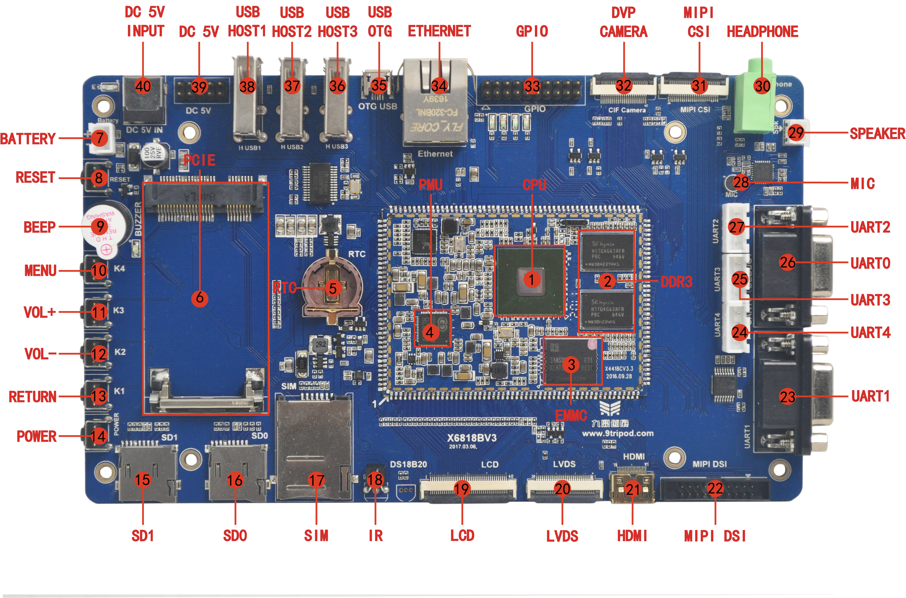

# Hardware Resources

This page summarizes the connector locations and interface functions of the X6818 board. For the complete core-board and expansion connector pin tables, see [Pin Definition](./x6818-pin-definition). For interface usage notes, see [Interface Details](./x6818-interface-details).

## Board Interface Map

## Hardware Interface List

| No. | Name | Description |
| --- | --- | --- |
| 【1】 | CPU | S5P6818，ARM Cortex A53,8*1.4GHz |
| 【2】 | Memory | K4B4G1646E-BCK0，DDR3，1GBytes |
| 【3】 | Storage | THGBMBG6D1KBAIL，8GB eMMC |
| 【4】 | PMU | Power management chip, AXP228 |
| 【5】 | Backup battery holder | 3V backup battery holder, CR1220 specification |
| 【6】 | PCIe connector | Universal 3G, 4G module PCI-E interface |
| 【7】 | Battery connector | Single cell 4.2V lithium battery interface |
| 【8】 | Hardware reset key | Hard reset |
| 【9】 | Buzzer | Support active buzzer |
| 【10】 | Menu key | Independent button, K4 |
| 【11】 | Volume up key | Independent button, K3 |
| 【12】 | Volume down key | Independent button, K2 |
| 【13】 | Return key | Independent button, K1 |
| 【14】 | Software power key | Power on and off, sleep and wake button |
| 【15】 | SD card, channel 1 | SD card, use channel 1 |
| 【16】 | SD card, channel 0 | SD card, use channel 0 |
| 【17】 | SIM card socket | 3G, 4G communication module SIM card slot |
| 【18】 | IR receiver | HS0038 Infrared integrated receiver |
| 【19】 | LCD/VGA connector | RGB output interface |
| 【20】 | LVDS connector | LCD screen connected to LVDS interface |
| 【21】 | HDMI connector | HDMI output interface |
| 【22】 | MIPI connector | LCD screen connected to MIPI interface |
| 【23】 | UART1 | Universal serial port 1, RS232 level |
| 【24】 | UART4 | Universal serial port 4, TTL level |
| 【25】 | UART3 | Universal serial port 3, TTL level |
| 【26】 | UART0 | Debug serial port 0(Default debug port，RS232level) |
| 【27】 | UART2 | Universal serial port 2, TTL level |
| 【28】 | Microphone | audio input, recording |
| 【29】 | Speaker connector | External speaker output |
| 【30】 | Headphone jack | Headphone output |
| 【31】 | Camera interface | 26PIN MIPI CSI camera interface |
| 【32】 | Camera interface | Standard 24PIN parallel camera interface |
| 【33】 | GPIO interface | SPI, UART, ADC device expansion |
| 【34】 | Gigabit Ethernet interface | RT8211E interface |
| 【35】 | USB OTG | USB OTG port |
| 【36】 | USB HOST3 | HUB chip extension, HOST |
| 【37】 | USB HOST2 | HUB chip extension, HOST |
| 【38】 | USB HOST1 | HUB chip extension, HOST |
| 【39】 | Power stand | 5V power socket |
| 【40】 | 5V input jack | DC power input port |

