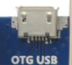
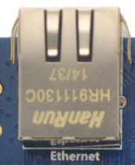

# Interface Details

## Power Input and Battery

The board provides DC 5V input, a battery connector, and an RTC backup battery holder. In the interface map, DC 5V input is at the upper-left, the battery connector is on the left edge, and the RTC holder is near the lower-left of the core-board area.

## Display Interfaces

The board provides LCD/VGA, LVDS, MIPI DSI, and mini HDMI. RGB/LVDS/MIPI can be used with different panel modules, while HDMI is used for an external monitor.

## Camera Interfaces

The board provides parallel Camera, MIPI CSI, and related camera expansion connectors, covering common DVP and MIPI camera applications.

## USB

Three USB HOST ports and one USB OTG port are available. OTG can be used for system download, debugging, or device mode; HOST ports can connect mouse, keyboard, USB disk, USB Wi-Fi/BT, USB 3G, and other devices.

## UART and Debug

UART0, UART1, UART2, UART3, UART4, and other serial resources are available, including debug UART, RS232 UART, and TTL UART resources.

## Network and Wireless Expansion

The board has Gigabit Ethernet RTL8211E and also provides PCIe and SIM-card socket for 3G/4G modules.

## Audio

Headphone, speaker, and MIC connectors are located on the right side for playback, recording, and testing.

## Keys, LEDs, Buzzer, and IR

The left edge contains Return, Volume+, Volume-, Menu, Power, Reset, and other keys. The board also has a buzzer, four LEDs, and an integrated IR receiver.

## Interface Close-up Images

