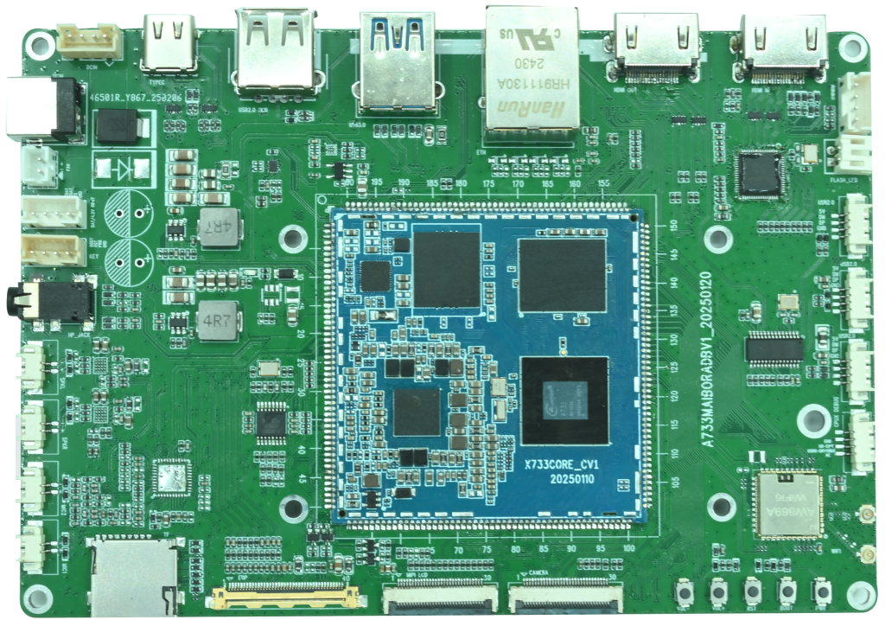

# Product Introduction

X733BV2 is built around the Allwinner A733 processor. A733 combines Cortex-A76 and Cortex-A55 CPU cores in an octa-core architecture, integrates a RISC-V E902 core and supports an optional NPU. It is intended for tablets, notebooks, smart displays, video terminals and edge-computing products.



## Key features

- A733 octa-core processor, up to approximately 2 GHz
- 2 GB / 4 GB / 8 GB memory options
- 4 GB / 8 GB / 16 GB / 32 GB / 64 GB eMMC options
- AXP318W PMIC with dynamic voltage/frequency management
- 12 V / 3 A DC input and a battery connector
- HDMI 2.0 OUT and HDMI IN; HDMI IN is converted to MIPI CSI by LT6911C
- MIPI DSI, eDP and MIPI CSI connectors
- One USB 3.0, four USB 2.0 and one Type-C OTG port
- One RTL8211F Gigabit Ethernet port
- AW869A Wi-Fi 6 / Bluetooth 5.2 module
- TF card and M.2 storage expansion
- Two microphone inputs, stereo 3 W@8 Ω speaker outputs and headphone output

## Source name

Use the following board name consistently in product configuration, device tree and documentation:

```text
x733bv2
```

A source archive may be named `a733_android13` or `x733_android13`, but the product/device-tree selection must use the `x733bv2` configuration provided by the SDK.
