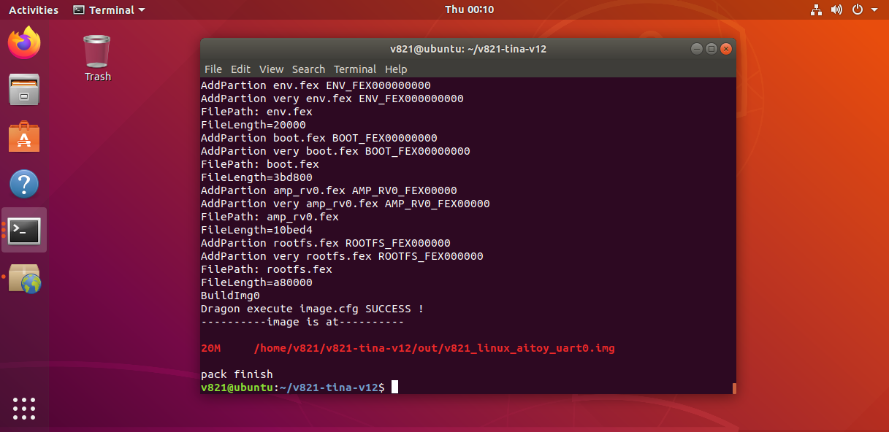

# Build and Flash

## Extract and Inspect

```bash
tar -xzvf v821.tar.gz
cd v821-tina
ls
tree -L 1
cat README.txt
```

Use the actual archive and directory names supplied with the SDK.

## Select a Board and Build

```bash
source build/envsetup.sh
lunch
# Select v821-aitoy-tina or the board requested by the vendor

m -j4
# or make -j4
```

On the first board selection, the SDK may require an eight-second notice and a `Y` confirmation. `mp` can be used for a combined build-and-package flow in SDK versions that provide it.

## Package

```bash
pack
```

A successful package produces an image under `out/`, for example:

```text
out/v821_linux_aitoy_uart0.img
```



## Flash with PhoenixSuit

1. Install the Allwinner USB flash driver and PhoenixSuit on Windows.
2. Open the one-key flash page and select the generated `.img` file.
3. Select full erase/upgrade.
4. Power off the board and hold the BOOT key.
5. Connect the board to the PC through Type-C and apply power.
6. Release BOOT after the tool detects the device, then wait for completion.


## Common Failure Points

- Unknown device remains in Device Manager: reinstall the driver from the `UsbDriver` directory.
- Packaging fails because a partition is too small: inspect the partition table or use `auto_update_partition`.
- The board does not enter flash mode: verify the BOOT key, use a data-capable Type-C cable, and check power.
- The image flashes but does not boot: verify that the selected lunch target, storage medium, and partition table match the hardware.
