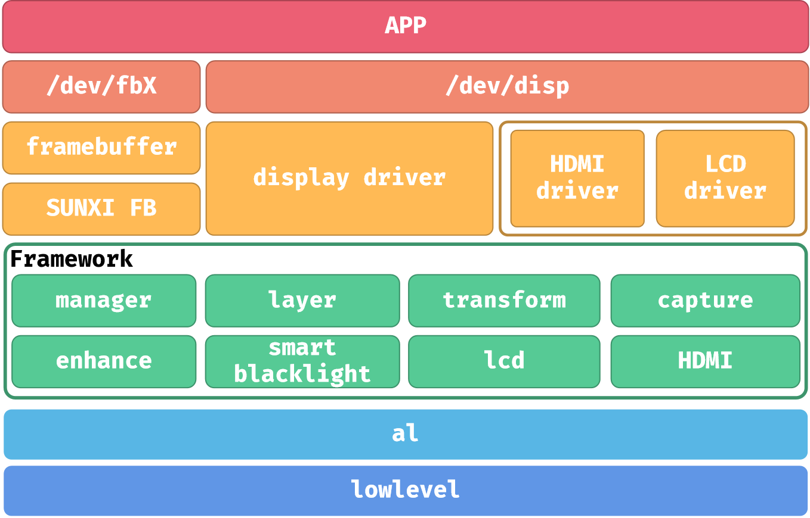

# Camera and LCD Display

## Camera Pipeline

The V821 camera pipeline consists of the sensor, MIPI CSI/DVP receiver, VIN, ISP, encoder, and application. Validate it stage by stage:

1. Read the sensor ID over I2C.
2. Verify MCLK, reset, PWDN, and power sequencing.
3. Match MIPI lane count, data rate, VC/DT, and resolution.
4. Confirm VIN/ISP link creation and frame output.
5. Match H.264/JPEG encoder buffers and application formats.

Common directories:

```text
bsp/drivers/vin/                    VIN/CSI/ISP drivers
bsp/drivers/vin/modules/sensor/     Sensor drivers
platform/allwinner/eyesee-mpp/      Multimedia applications and samples
```

After selecting a sensor through `quick_config`, still verify the I2C address, GPIOs, regulators, and MIPI route in `board.dts`.

## Display Architecture



The documentation covers three display paths:

- DISP through `/dev/disp` for layers, rotation, and display control.
- LCD framebuffer output.
- FBTFT/SPI DBI for small SPI panels.

## Device-tree Configuration

A typical configuration contains:

```dts
&disp {
    status = "okay";
};

&lcd0 {
    lcd_used = <1>;
    lcd_driver_name = "panel_name";
    lcd_if = <...>;
    lcd_x = <240>;
    lcd_y = <320>;
    lcd_dclk_freq = <...>;
    status = "okay";
};
```

Important timing parameters:

| Parameter | Meaning |
| --- | --- |
| `lcd_x` / `lcd_y` | Active resolution |
| `lcd_ht` | Horizontal total |
| `lcd_hbp` | Horizontal back-porch-related value |
| `lcd_vt` | Vertical total |
| `lcd_vbp` | Vertical back-porch-related value |
| `lcd_dclk_freq` | Pixel clock according to the driver unit convention |
| `lcd_start_delay` | TCON start delay |
| `lcd_width` / `lcd_height` | Physical dimensions for DPI calculation |

## Debug Order

- Verify backlight and panel power first.
- Check SPI/DBI waveforms and pin multiplexing.
- Use solid-color tests to isolate application issues.
- For corrupted output, check resolution, pixel format, RGB/BGR order, and address-window settings.
- If the backlight is on but the panel is blank, confirm reset timing and panel initialization commands.
