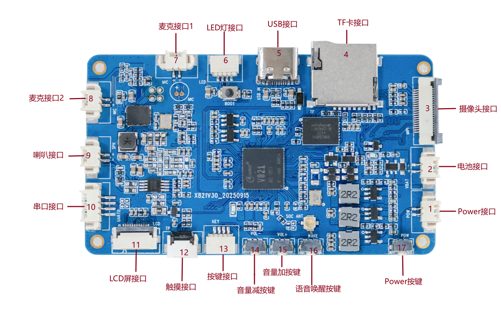

# Hardware Resources

## Connector Layout

| No. | Interface | Description |
| --- | --- | --- |
| 1 | Power-on connector | 2-pin, 1.25mm horizontal connector |
| 2 | Battery connector | 2-pin, 1.25mm, single-cell 3.7V lithium battery |
| 3 | Camera connector | 20-pin MIPI CSI connector |
| 4 | TF socket | External TF card |
| 5 | USB Type-C | Power, charging, firmware download, and ADB |
| 6 | LED connector | 4-pin, 1.0mm connector for an LED assembly |
| 7 | Microphone 1 | Audio input connected to the main controller |
| 8 | Microphone 2 | Connected to the voice-processing device |
| 9 | Speaker | 2-pin, 1.25mm; 8Ω/3W by default |
| 10 | Debug UART | 4-pin, 1.25mm UART0 connector |
| 11 | LCD | 12-pin, 0.5mm FPC for an SPI LCD |
| 12 | Touch | 6-pin, 0.5mm FPC for I2C touch |
| 13 | KEY | Volume up, volume down, and wake |
| 14 | Volume down | On-board VOL- key |
| 15 | Volume up | On-board VOL+ key |
| 16 | Wake | On-board WAKE key |
| 17 | Power | On-board power key |

## Power and Debugging

- The Type-C port is used for power, charging, firmware download, and ADB debugging.
- The battery connector is intended for a single 3.7V lithium cell.
- UART0 is the debug port. The baud rate depends on the boot stage: the BOOT0 example uses 1.5Mbps, while the Linux console can be changed in the SDK.
- To enter the flash mode, power off the board, hold the BOOT key, and then connect Type-C power.

## Peripheral Capabilities

- One MIPI CSI camera input.
- One SPI LCD and one I2C touch interface.
- Dual microphone inputs and one speaker output.
- On-board 2.4GHz Wi-Fi/BLE antenna connector.
- TF card support for booting or multimedia storage.
