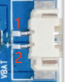
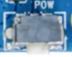
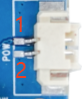
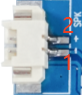
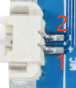
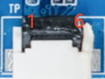
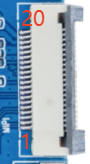
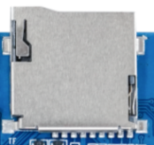

# Interface Definitions

## Power and Keys

### Power-on Connector

| Pin | Signal |
| --- | --- |
| 1 | POWER-ON |
| 2 | GND |

### On-board Power Key

| Pin | Signal |
| --- | --- |
| 1 | POWER-ON |
| 2 | GND |
| 3 | GND |

### Battery Connector

| Pin | Signal |
| --- | --- |
| 1 | GND |
| 2 | VBAT_3V7 |

## USB Type-C

The Type-C port provides charging, board power, firmware download, and ADB debugging. The USB differential pairs follow the standard Type-C receptacle wiring and normally do not need to be exposed through a separate harness.

## UART0 Debug Header

| Pin | Signal |
| --- | --- |
| 1 | NC |
| 2 | UART0-TX |
| 3 | UART0-RX |
| 4 | GND |

This is a 3.3V TTL UART. Do not connect it directly to an RS-232-level port.

## Audio

### Speaker

| Pin | Signal |
| --- | --- |
| 1 | SPK- |
| 2 | SPK+ |

### Microphone

| Pin | Signal |
| --- | --- |
| 1 | MICP |
| 2 | MICN |

## LED Connector

| Pin | Signal |
| --- | --- |
| 1 | GND |
| 2 | L-LEDB |
| 3 | L-LEDA |
| 4 | VBAT_3V7 |

## Touch Connector

| Pin | Signal |
| --- | --- |
| 1 | VCC-3V3 |
| 2 | TP-INT |
| 3 | TP-RST |
| 4 | TWI1-SCK |
| 5 | TWI1-SDA |
| 6 | GND |

## KEY Connector

| Pin | Signal |
| --- | --- |
| 1 | GND |
| 2 | VOL+ |
| 3 | VOL- |
| 4 | WAKE |

## LCD Connector

| Pin | Signal | Pin | Signal |
| --- | --- | --- | --- |
| 1 | GND | 7 | LCD-RST |
| 2 | LCD-K | 8 | SDA |
| 3 | VCC-3V3 | 9 | SCL |
| 4 | VCC-3V3 | 10 | RS |
| 5 | VCC-3V3 | 11 | CS |
| 6 | NC | 12 | GND |

This connector is intended for an SPI LCD. The `SDA/SCL` labels are display-control signal names in this context; verify the actual SPI/DBI or auxiliary-bus function against the panel driver and schematic.

## Camera Connector

| Pin | Signal | Pin | Signal |
| --- | --- | --- | --- |
| 1 | MIPI-CSI-D0P | 11 | GND |
| 2 | MIPI-CSI-D0N | 12 | TWI0-SCK |
| 3 | GND | 13 | TWI0-SDA |
| 4 | MIPI-CSI-D1P | 14 | MIPI-CSI-RSTN0 |
| 5 | MIPI-CSI-D1N | 15 | GND |
| 6 | GND | 16 | LDOB-2V8 |
| 7 | MIPI-CSI-CKP | 17 | LDOB-2V8 |
| 8 | MIPI-CSI-CKN | 18 | VCC-1V8 |
| 9 | GND | 19 | VCC-1V2 |
| 10 | MIPI-CSI-MCLK0 | 20 | NC |

## Wi-Fi and TF Card

The board has single-band 2.4GHz Wi-Fi and uses the on-board RF connector for the external antenna.

The TF card can be used as a boot medium or general storage. Changing the boot medium also requires matching storage, partition, and boot configuration changes in the SDK.
