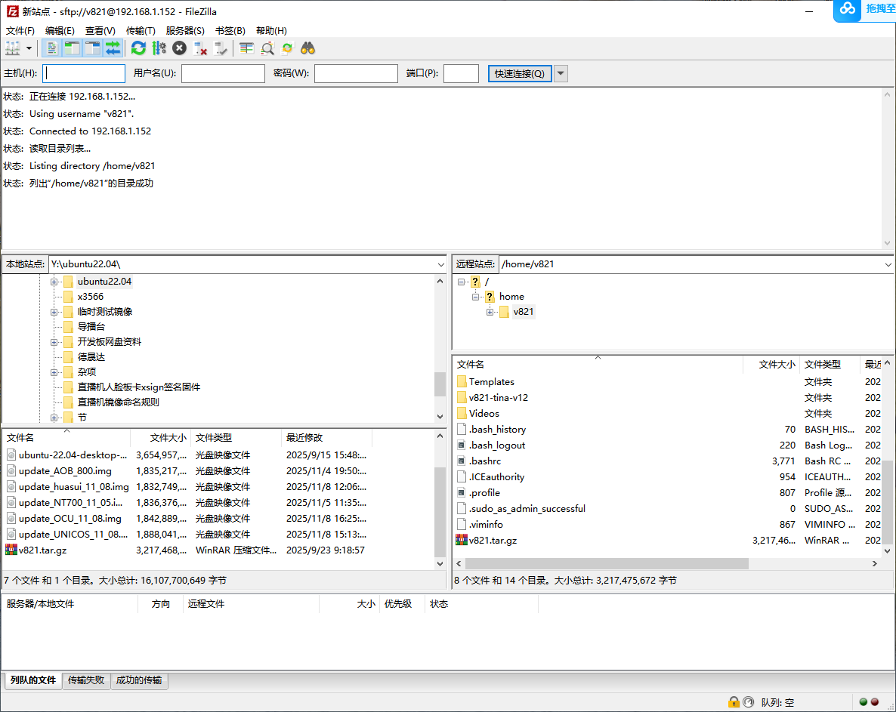

# Development Environment

## Recommended Host

The V821 SDK can be used on Ubuntu 18.04, 20.04, or 22.04. The supplied manual demonstrates VMware Workstation 17.5.2, but a native Linux host, a dedicated build server, or a well-provisioned VM is preferable for full builds.

Recommended VM resources:

- At least four CPU cores.
- 8GB RAM; 16GB or more for aggressive parallel builds.
- At least 80GB free disk space because source, download caches, and `out/` continue to grow.
- Bridged networking so the board, VM, and Windows host can communicate directly.


## Ubuntu 20.04/22.04 Dependencies

```bash
sudo apt-get update
sudo apt-get upgrade -y
sudo apt-get install -y \
  build-essential python3 python3-dev python-is-python3 \
  subversion git libncurses5-dev zlib1g-dev gawk flex bison quilt \
  libssl-dev xsltproc libxml-parser-perl mercurial bzr ecj cvs \
  unzip lsof tree kconfig-frontends android-tools-mkbootimg \
  python2 libpython3-dev gcc-multilib

sudo dpkg --add-architecture i386
sudo apt-get update
sudo apt-get install -y libc6:i386 libstdc++6:i386 lib32z1
```

On Ubuntu 18.04, `python-is-python3` is normally unnecessary. Adjust package names according to APT output.

## Basic Tools

```bash
sudo apt-get install -y vim net-tools openssh-server filezilla
```

After enabling SSH, transfer SDK archives and firmware with FileZilla or SCP:

```bash
sudo systemctl enable --now ssh
ip addr
```



## Serial Console

UART0 is a 3.3V TTL interface. The BOOT0 example uses 1500000 baud, while the Linux console rate may be controlled by U-Boot environment variables and the device tree. Confirm the actual rate from the SDK or boot log before opening the terminal.
