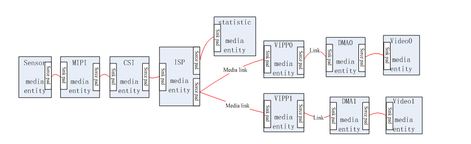

# Multimedia MPP

## Architecture

MPP sits between applications and the VIN/ISP, codec, display, and audio drivers. It provides Camera, VENC, VDEC, VO, AI, AO, MUX, DEMUX, G2D, and related components.



Common source paths:

```text
platform/allwinner/eyesee-mpp/
platform/allwinner/multimedia/
platform/allwinner/tina_multimedia/libcedarc_mpp/
```

## Configure and Build

```bash
source build/envsetup.sh
lunch
make menuconfig
# enable required MPP libraries and samples
m -j4
```

`quick_config` can switch MPP between static and shared libraries. Run `make distclean` before switching to avoid mixing old objects.

## Generic Sample Flow

1. Enable the target sample in menuconfig.
2. Build the package or full SDK.
3. Put the executable, configuration, and test media in the firmware or on a TF card.
4. Mount the TF card and run the sample on the board.
5. Validate serial logs, output streams, display output, and PC-side analysis tools.

## Smart IPC Sample

`sample_smartIPC_demo` generally follows:

```text
Camera/VIN -> ISP -> VENC -> file/network
                    -> VO/display
Audio input -> AENC -> file/network
```

Verify sensor selection, resolution, frame rate, bitrate, rate-control mode, output path, and memory-pool sizes.

## Useful Test Tools

```bash
ffprobe output.h264
ffplay -f h264 output.h264
ffmpeg -i input.mp4 -f null -
```

Use `aplay`, `arecord`, or FFmpeg to verify audio sample rate, channel count, and sample width.

## Debug Principles

- No frames: start with sensor, VIN, and ISP.
- Raw frames but no bitstream: inspect VENC input format, buffers, and memory pools.
- Encoding works but display is blank: inspect VO, layers, pixel format, and resolution.
- Long-run crashes: look for memory leaks, unreleased buffers, and full filesystems.
