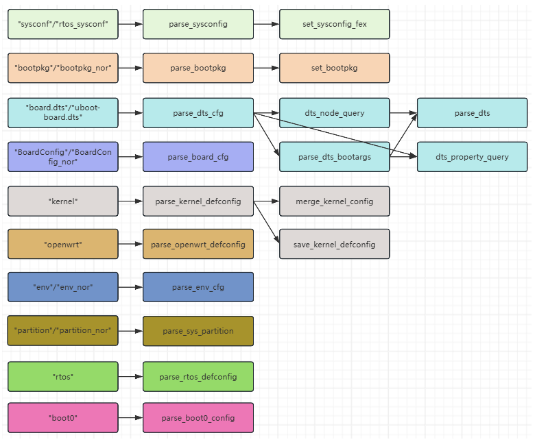

# Quick Config and Optimization

## Running quick_config

```bash
source build/envsetup.sh
lunch
quick_config
```


`quick_config` directly edits kernel defconfigs, Tina defconfigs, `board.dts`, `uboot-board.dts`, partition files, and environment files. Commit the SDK or create a temporary branch before running it. Some entries are one-way changes and have no automatic rollback.



## Override Order

A typical low-to-high priority order is:

```text
default/quick_config.json
default/quick_config/sensor.json
default/quick_config/storage_change.json
aitoy/quick_config.json
```

Later board-level files override duplicate keys. JSON objects and arrays must not have a trailing comma after the final item.

## Storage Switching

| Entry | Function |
| --- | --- |
| `change_to_emmc` | Use eMMC as the boot medium |
| `change_to_sdcard` | Use SD Card or SD NAND |
| `change_to_nand` | Use SPI NAND |

Rebuild and package after the change:

```bash
m -j4
pack
```

## Rootfs Toolchain

The root filesystem uses musl by default and can be switched to glibc. Clean first:

```bash
make distclean
quick_config
# select musl_toolchain or glibc_toolchain
```

The Linux kernel toolchain is independent and is not changed by this rootfs option.

## Automatic Partition Optimization

```bash
auto_update_partition
```

This command adjusts partitions according to packaged image sizes and is useful for `amp_rv0.fex size too large`, enlarged rootfs images, and oversized defaults. Select 64KB alignment by default. Use 4KB only when the SPI NOR configuration explicitly enables 4KB erase sectors.

## Camera Switching

Common entries include:

- `one_gc2083_sensor`
- `one_gc1084_sensor`
- `one_sc2336_sensor`
- `dual_gc2083_sensor`
- `three_gc2083_sensor(soft_tdm_mode)`
- Multiple `2in1` online/offline modes

Dual- and triple-camera configurations also require correct I2C addresses, MIPI/DVP routing, power rails, MCLK, and ISP pipelines. Selecting a driver name alone is not enough.

## Debug Options

- `debug_linux`: enables BOOT0 logs, kernel symbols, DEBUG_FS, SLUB debugging, and early serial output.
- `debug_rtos`: enables MCU multi-console logging and may disable Linux SDC0 when the pins conflict with the RTOS UART.

Disable unnecessary debug features in production images to reduce memory use and boot time.

## Memory Optimization

The memory-optimization entry reduces the log buffer and disables cgroups, ftrace, selected filesystems, IPv6, and unused drivers. The V821 has only 64MB DDR2, but every disabled feature must be checked against actual product requirements.

Analyze memory with:

```bash
ramparser -a
ramparser -p <pid>
ramparser -r
```

## CPU Frequency

- VF0: approximately 0.92V/960MHz by default; a known 24MHz or 40MHz crystal may allow a 1000/1008MHz point.
- VF2: approximately 1.0V/1200MHz by default.

Before raising frequency, verify power integrity, temperature, long-duration stability, and crystal selection. Run stress tests and repeated cold boots after any OPP change.

## Serial Baud Rate

The debug console spans BOOT0, U-Boot, kernel command line, and device-tree stages. Keep all stages consistent; otherwise early output may be correct while later output becomes unreadable.
