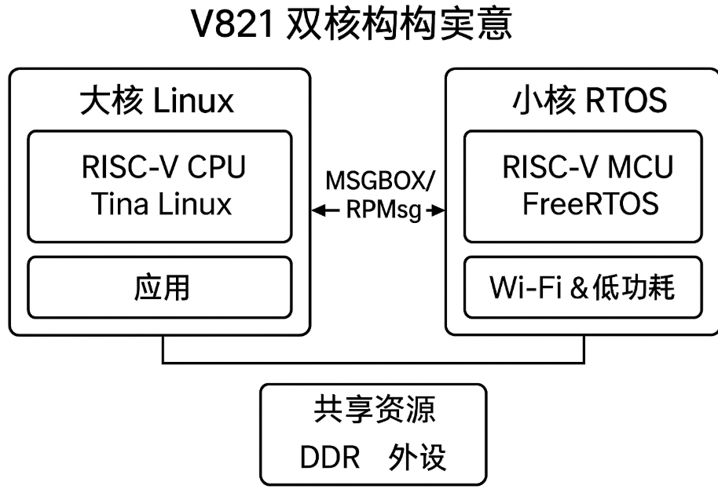

# RTOS and AMP

## Architecture

The V821 combines a Linux RISC-V CPU with a RISC-V MCU. Normal and fast-boot boards may load the RTOS from BOOT0/U-Boot, while other designs can manage the MCU through Linux remoteproc.



## RTOS Directories

```text
rtos/board/v821_e907/          Board configuration
rtos/lichee/rtos/              RTOS kernel and projects
rtos/lichee/rtos-components/   Components
rtos/lichee/rtos-hal/          HAL drivers
```

## Build

```bash
source build/envsetup.sh
lunch
mrtos
```

Typical output:

```text
rtos/lichee/rtos/build/img/
├── rt_system.bin
├── rt_system.elf
├── rt_system.map
└── rt_system.syms
```

The SDK copies the runtime image to:

```text
device/config/chips/v821/configs/<board>/bin/amp_rv0.bin
```

Clean and configure with:

```bash
mrtos clean
mrtos menuconfig
```

## Memory Layout

- The Linux kernel start address must satisfy 4MB alignment.
- OpenSBI should remain at a fixed, 128KB-aligned address with PMP protection.
- RTOS, vring, rpbuf, and no-map reserved areas must not overlap.
- U-Boot relocates near the end of DRAM, so large reserved regions must not consume that area.

## remoteproc

Board-side checks:

```bash
ls /sys/class/remoteproc/
cat /sys/class/remoteproc/remoteproc0/state
echo start > /sys/class/remoteproc/remoteproc0/state
echo stop  > /sys/class/remoteproc/remoteproc0/state
```

The actual node and start method depend on whether the MCU has already been started by the boot chain. Do not start the same core twice.

## Communication

- vring: available and used descriptor queues.
- rpmsg: message channels for control and small payloads.
- rpbuf: shared large buffers for audio/video data.
- Interrupt/mailbox: notification of queue or state changes.

## Logs and Debugging

- `amp_shell` provides an AMP control console.
- Trace log retrieves MCU-side messages.
- Keep `rt_system.elf` and `.map` for address symbolization.
- Investigate stack overflow, double free, shared-buffer overruns, cache coherency, and boot ordering.
