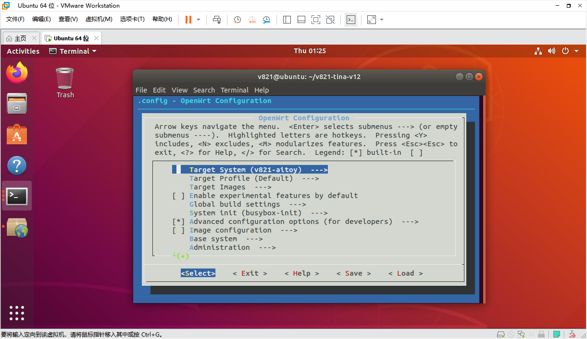
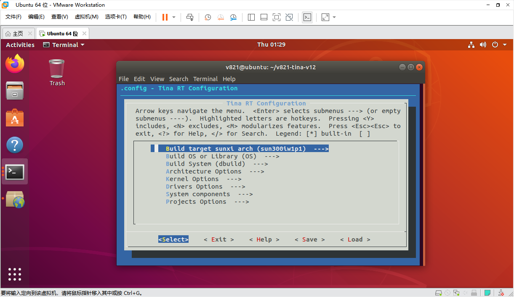

# Core Configuration Files

## Kconfig Entry Points

```bash
make kernel_menuconfig   # Linux kernel
make menuconfig          # Tina/OpenWrt packages
mrtos menuconfig         # RISC-V MCU RTOS
```






Common configuration files:

```text
device/config/chips/v821/configs/aitoy/linux-5.4-ansc/bsp_defconfig
openwrt/target/v821/v821-aitoy/defconfig
rtos/lichee/rtos/projects/v821_e907/aitoy/defconfig
```

## Device Trees

```text
bsp/configs/linux-5.4-ansc/sun300iw1p1.dtsi
    Common SoC resources

device/config/chips/v821/configs/aitoy/linux-5.4-ansc/board.dts
    Board resources; normally the preferred file for product changes

device/config/chips/v821/configs/aitoy/uboot-board.dts
    U-Boot board display, storage, and related settings
```

The board `board.dts` overrides matching properties from the common dtsi. Avoid product-specific edits in the common dtsi because they affect other boards.

## Partition Tables

- SPI NOR: `sys_partition_nor.fex`
- SPI NAND/eMMC/SD: `sys_partition.fex`

```ini
[partition]
name         = rootfs
size         = 20480
downloadfile = "rootfs.fex"
user_type    = 0x8000
```

Partition sizes must obey the erase-block alignment of the selected medium. SPI NOR commonly uses 64KB alignment. SPI NAND alignment must account for physical erase blocks and UBI logical erase blocks.

## env.cfg and sys_config.fex

```text
device/config/chips/v821/configs/default/env.cfg
device/config/chips/v821/configs/aitoy/env.cfg
device/config/chips/v821/configs/aitoy/sys_config.fex
```

`env.cfg` controls boot delay, console parameters, log levels, and related values; fast-boot boards may bypass it. `sys_config.fex` is mainly consumed by BOOT0 and takes precedence over conflicting U-Boot device-tree settings.

BOOT0 UART example:

```ini
[uart_para]
uart_debug_port = 0
uart_debug_tx = port:PD22<3><1><default><default>
uart_debug_rx = port:PD23<3><1><default><default>

[platform]
debug_mode = 8
```

`debug_mode=0` disables BOOT0 logging; `8` enables full logging.

## Root Filesystem

SquashFS is the default read-only root filesystem. EROFS can be selected instead:

```bash
make menuconfig
# CONFIG_TARGET_ROOTFS_EROFS=y
# disable TARGET_ROOTFS_SQUASHFS

make kernel_menuconfig
# CONFIG_EROFS_FS=y
```

Writable data is normally provided by a `rootfs_data` overlay: JFFS2 for SPI NOR and commonly ext4 for eMMC. Do not continuously write large files to `/mnt/extsd` when no SD card is mounted, because the path may fall back to the small overlay partition.
