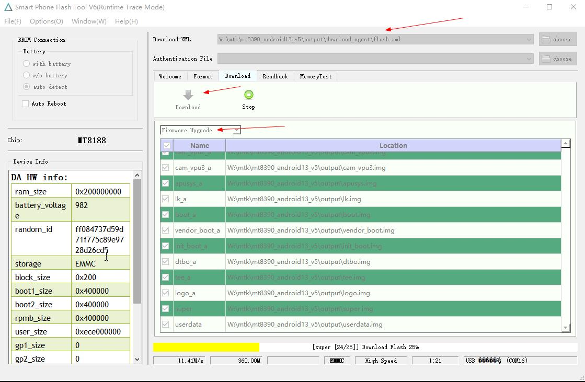
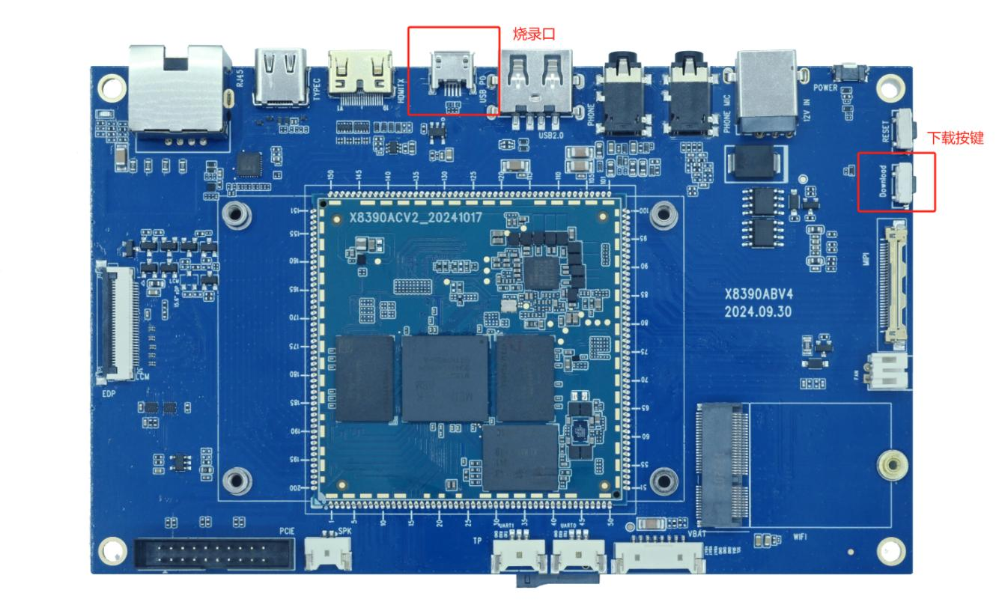

# Android Build and Flashing

## Source Directory

The original package stores the Android 13 source archive under `DVD_x8390/source/`. Archive names can change between releases.

```bash
tar -xzvf x8390_android13_v5.tar.gz
cd x8390_android13
```

Build the Android source as a normal user rather than root.

## Build Commands

### Build Android and the Upgrade Package

```bash
./build.sh -A -u
```

### Show Help

```bash
./build.sh -h
```

| Option | Function |
| --- | --- |
| `-A`, `--android` | Build Android |
| `-U`, `--update` | Build the update package |
| `-S`, `--system` | Build MSSI system only for debugging |
| `-V`, `--vendor` | Build AP vendor only for debugging |
| `-K`, `--kernel` | Build the kernel only for debugging |
| `-M`, `--merge` | Merge images |
| `-a`, `--all` | Build all components |
| `-h`, `--help` | Display help |

Build results are placed in `output/`.

## Windows Flashing Tools

- Driver: `tools/Driver_Auto_Installer_SP_Drivers_20160804.zip`
- Tool: `tools/SP_Flash_Tool_v6.2316_Win.7z`
- Configuration: `flash.xml` from the build output directory

## SP Flash Tool Procedure

1. Install the MediaTek USB driver and extract SP Flash Tool.
2. Select `output/flash.xml`.
3. Select `Firmware Upgrade` mode.
4. Click `Download`.
5. Connect the Micro USB flashing port and the 12V power supply.
6. Press the download key to enter the MediaTek download mode.
7. Wait for completion without disconnecting USB or power.



### Flashing Port and Download Key



For failures, check the USB driver, cable, power capacity, download-key timing, and whether `flash.xml` belongs to the same output set.
