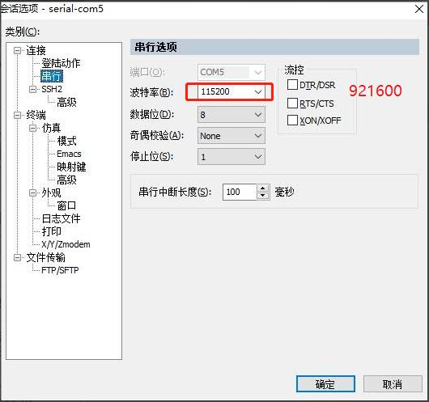
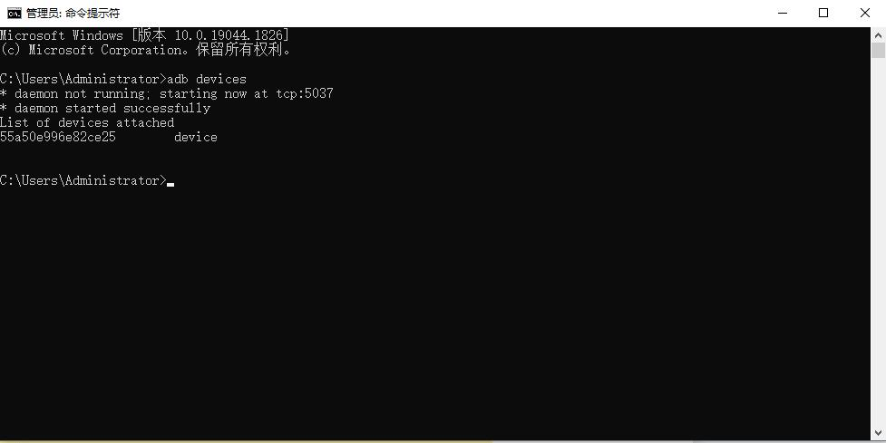

# Android Platform Setup

## Host Environment

A complete Android build requires substantial CPU, memory, and disk resources. The original manual recommends Ubuntu 16.04 64-bit. For a delivered project, prefer the VM, container, or environment guide supplied with the current SDK.

```bash
cat /etc/os-release
uname -m
java -version
python3 --version
gcc --version
```

## Common Tools

```bash
sudo apt-get update
sudo apt-get install -y meld minicom picocom ckermit
```

Picocom example:

```bash
sudo picocom -b 921600 /dev/ttyUSB0
```

The X8390 manual specifies 921600 baud for board logs. Verify the actual project setting if no output is visible.

### SecureCRT





## SDK Dependencies

The manual lists the following major packages. Package names may need adjustment on newer Ubuntu releases.

```bash
sudo apt-get install -y \
    git-core gnupg flex bison gperf build-essential zip curl \
    zlib1g-dev gcc-multilib g++-multilib genromfs libc6-dev-i386 \
    libncurses5-dev x11proto-core-dev libx11-dev ccache \
    libgl1-mesa-dev libxml2-utils xsltproc unzip lsb-core \
    lib32z1-dev lib32ncurses5-dev texinfo mercurial subversion \
    whois g++ git lzop liblz4-tool genext2fs make \
    device-tree-compiler u-boot-tools libssl-dev autoconf \
    python3-pyelftools libusb-1.0-0-dev tig p7zip p7zip-full \
    android-tools-fastboot android-tools-adb
```

## JDK

The X8390 Android 13 build script example uses OpenJDK 8:

```bash
sudo apt-get install -y openjdk-8-jdk
export PATH=/usr/lib/jvm/java-8-openjdk-amd64/bin:$PATH
java -version
```

Prefer setting the JDK for the current shell or build script instead of replacing the system-wide default Java.

## Cross Toolchains

The cross toolchains are included in the Android source tree:

```text
prebuilts/gcc/linux-x86/aarch64/gcc-linaro-6.3.1-2017.05-x86_64_aarch64-linux-gnu/bin/
prebuilts/gcc/linux-x86/aarch64/aarch64-linux-android-4.9/bin/
```

## ADB

```bash
adb devices
adb shell
```



## Source-Tree Reference

The manual records this device-tree example:

```text
ap-sdk/kernel-4.19/arch/arm64/boot/dts/mediatek/tb8788p1_64_wifi_k419.dts
```

Project names, kernel versions, and DTS files can vary between SDK releases. Use the current source tree as the final reference.
