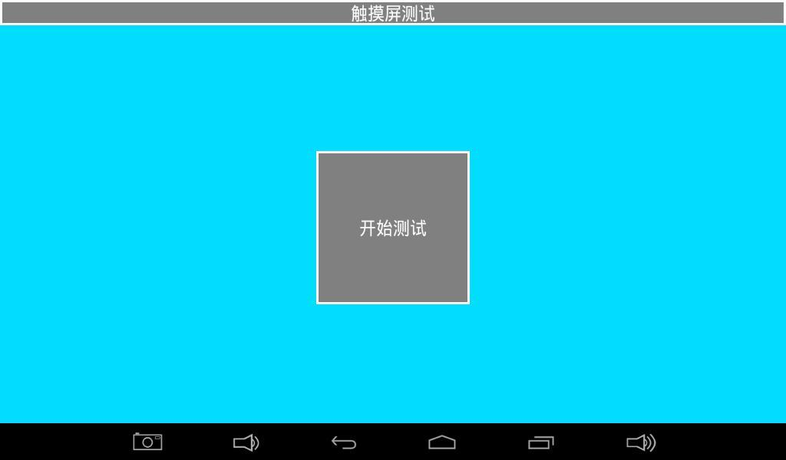
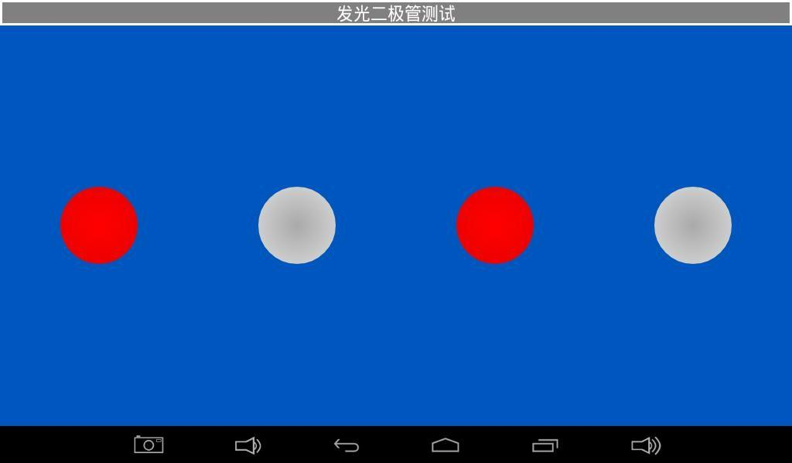
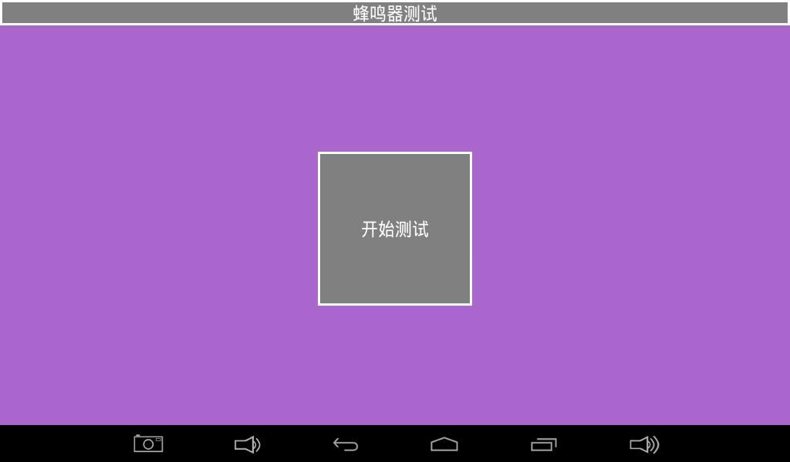
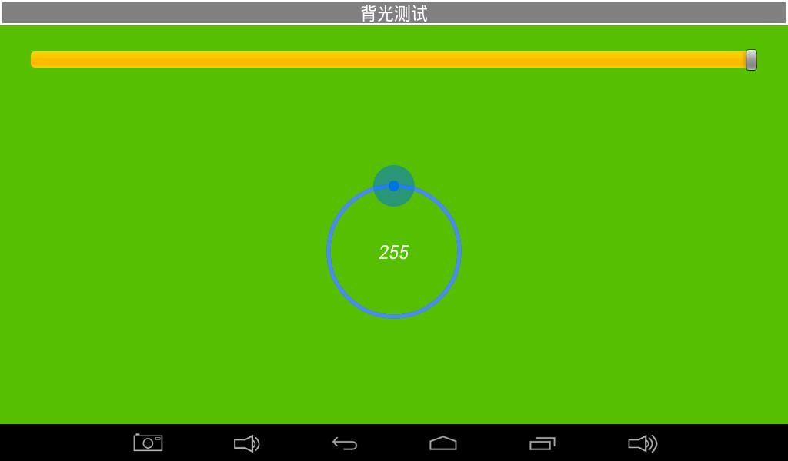
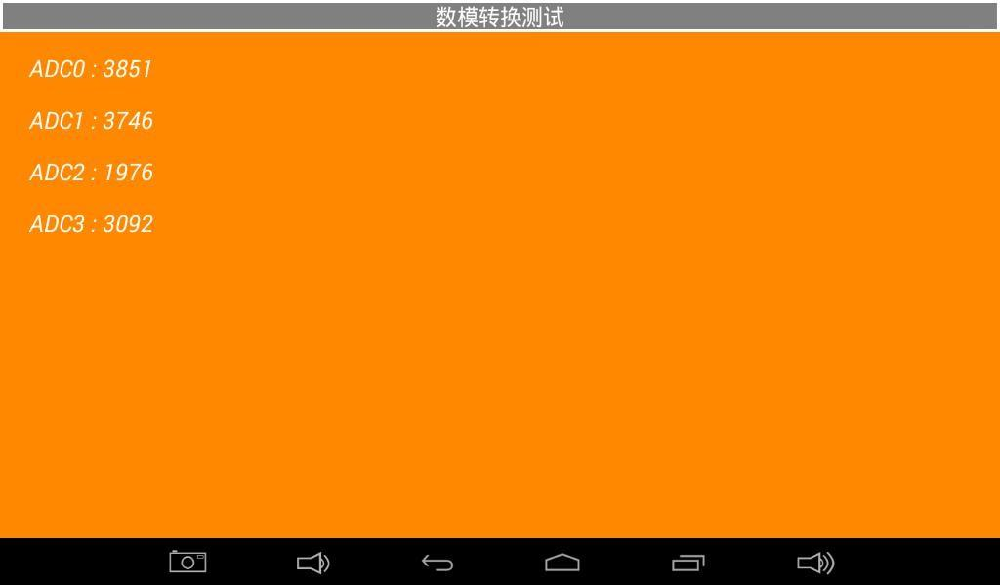
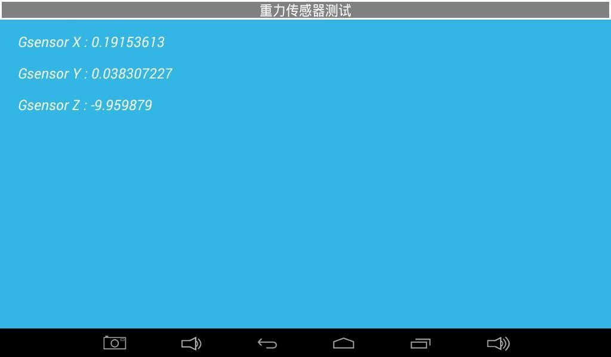
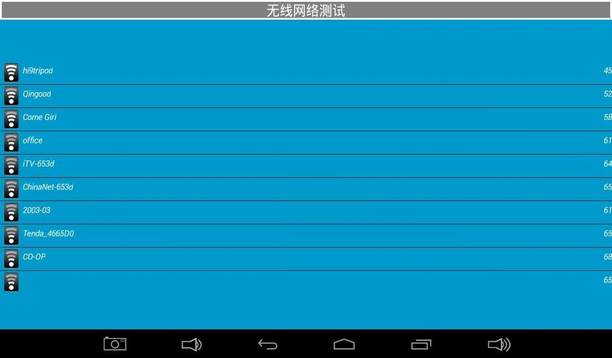
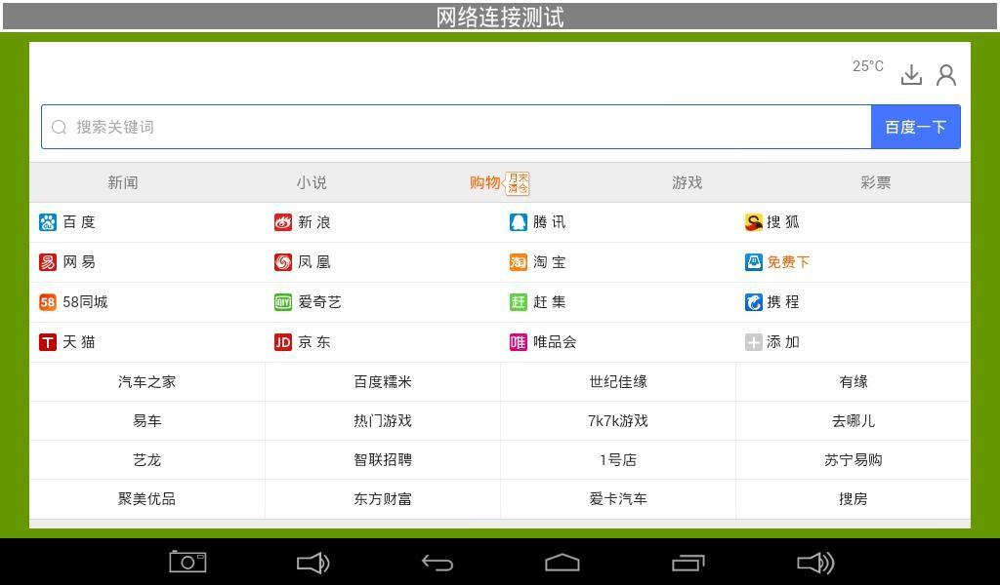

# Android Tests and System Information

## Hardware Test Application

The test application is intended for engineering validation and production testing.

### LCD and Touch




- LCD: switch solid colors to check dead pixels, bright pixels, color shift, and missing channels.
- Touch: draw lines and diagonals to check continuity and edge coverage.

### LED, Buzzer, and Backlight







### Keys and Battery


### ADC and Gravity Sensor





### Audio and Camera


### Network and Storage






Short TXD and RXD together for UART loopback. Insert the target TF card or USB drive before starting storage tests.

## Common System Queries

```bash
cat /proc/cmdline
cat /proc/cpuinfo
cat /proc/meminfo
cat /proc/partitions
cat /proc/version
cat /proc/net/dev
dmesg
```

For a continuous kernel message stream:

```bash
cat /proc/kmsg
```

## Driver Source Note

MT8390/MT8370 is a MediaTek platform. Driver paths, kernel versions, and module names vary with the SDK release. Trace the current device tree, `kernel/drivers/`, and build configuration instead of using examples from a different SoC platform.
