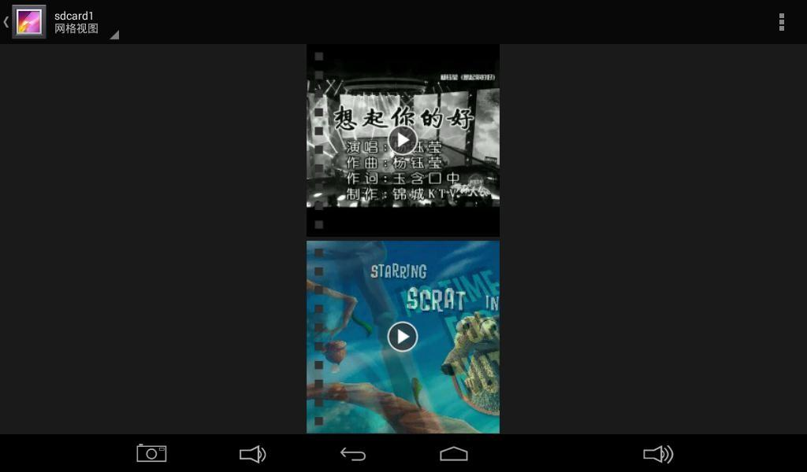
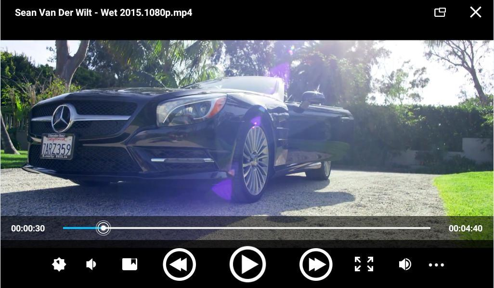
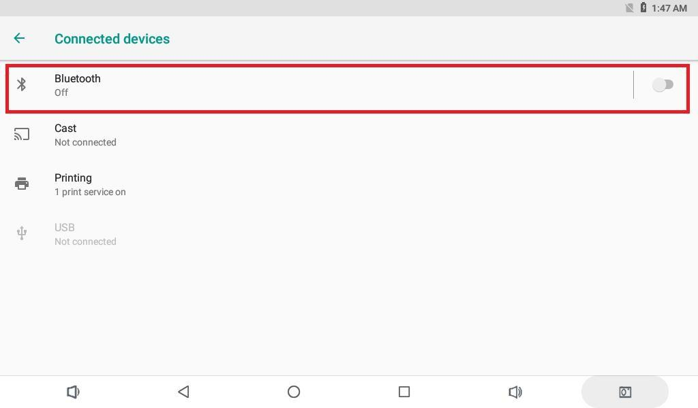
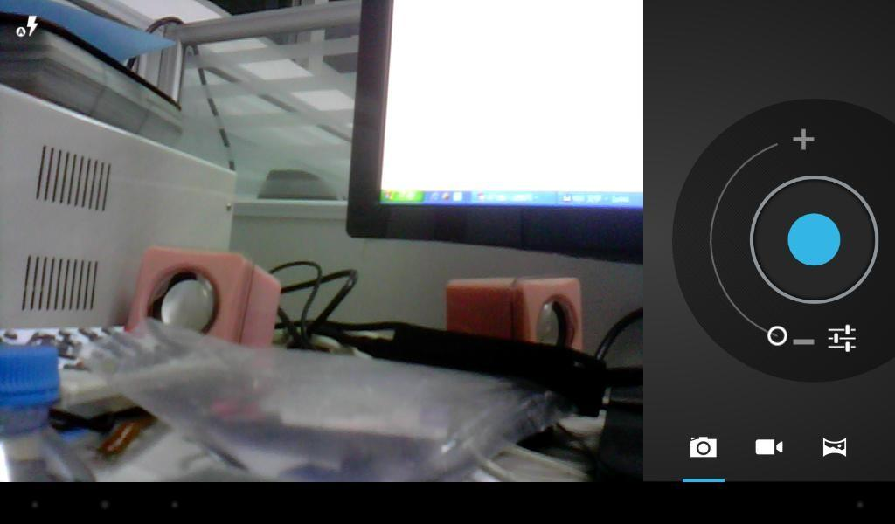

# Android User Guide

## Serial Terminal

Connect the UART0 debug port to inspect Android and kernel logs.


## Audio and Video

Media files stored on a TF card or USB drive can be played through the system applications.






## Wi-Fi

Open Settings, Network and Internet, and Wi-Fi; then select an access point.


## Bluetooth

Open Settings, Connected devices, and Bluetooth. Scan for the target device and complete pairing.





Bluetooth can be used for file sharing and wireless audio output.


## USB Mouse and Keyboard

Connect a USB mouse, keyboard, or wireless receiver to the USB Host port.

## TF Card and USB Drive

External storage is normally mounted below `/storage/`:

```bash
adb shell
ls -l /storage
```

The volume directory name depends on the filesystem UUID.

## Screen Rotation

When the firmware enables the gravity sensor and auto-rotation, supported applications rotate with board orientation.

## Camera

Connect a compatible MIPI camera and open the camera application for preview, still capture, and video recording.



## Wired Ethernet

Connect an active Ethernet cable. The connector LEDs should blink when the link is established.


## Power and Suspend

After connecting 12V power, hold the Power key for about three seconds to boot. Hold the key in Android to open the power menu; press it briefly for suspend and resume.


