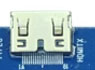
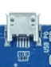
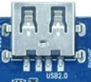
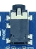
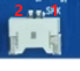
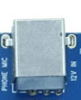
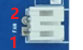
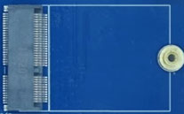
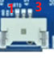
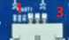

# Interface Definition

## Ethernet

The board provides one Gigabit Ethernet port using the processor GMAC and an RTL8211F PHY.

## Type-C

The full-featured Type-C connector can be used for data transfer. DisplayPort, power direction, and USB role depend on the actual hardware population and software configuration.

## HDMI

The carrier board uses a Mini HDMI Type-C connector driven by the native processor HDMI OUT interface.

## Micro USB and USB2.0

Micro USB is used for firmware flashing and can also operate as a USB Device interface.

The USB2.0 Type-A Host port supports flash drives, mice, keyboards, and other peripherals.

## Audio

### Headphone

The headphone output can also feed an external amplifier.

### Line Input

The line-input connector accepts external analog audio for recording.

### Speaker

| Pin | Signal |
| ---: | --- |
| 1 | LO2 |
| 2 | LO1 |

The board supports a single speaker output of approximately 0.5W.

### Digital Microphone

Three digital-microphone resources are routed on the board; MIC2702 is fitted by default.

## DC Power and Keys

The hardware specification recommends a 12V / 3A power adapter.

The keys are power, reset, and download from top to bottom.

## MIPI CSI Camera Connector

| Pin | Signal | Pin | Signal |
| ---: | --- | ---: | --- |
| 1 | GND | 2 | CSI1A_L0P_T0A |
| 3 | CSI1A_L0N_T0B | 4 | GND |
| 5 | CSI1A_L1P_T0C | 6 | CSI1A_L1N_T1A |
| 7 | GND | 8 | CSI1A_L2P_T1B |
| 9 | CSI1A_L2N_T1C | 10 | GND |
| 11 | CSI1B_L0P_T0A | 12 | CSI1B_L0N_T0B |
| 13 | GND | 14 | CSI1B_L1P_T0C |
| 15 | CSI1B_L1N_T1A | 16 | GND |
| 17 | CMMCLK1 | 18 | CMMRST1 |
| 19 | GND | 20 | CMMPDN1 |
| 21 | CAM_3V3 | 22 | CAM_3V3 |
| 23 | CAM_SDA | 24 | CAM_SCL |
| 25 | CAM_5V | 26 | CAM_5V |
| 27 | CAM_5V | 28 | CMMPDN1 |
| 29 | GND | 30 | GND |

## Fan

| Pin | Signal |
| ---: | --- |
| 1 | 12V |
| 2 | GND |

## Wi-Fi / Bluetooth

The M.2 socket accepts the AW-CB451NF Wi-Fi 6 / Bluetooth 5.0 module.

## Battery

| Pin | Signal | Pin | Signal |
| ---: | --- | ---: | --- |
| 1 | I2C_SCL | 5 | GND |
| 2 | I2C_SDA | 6 | VBAT |
| 3 | GND | 7 | VBAT |
| 4 | GND | 8 | VBAT |

The connector is intended for an 8.7V lithium battery, which can be charged through the DC input.

## UART

### UART0 Debug Port

| Pin | Signal |
| ---: | --- |
| 1 | UART0_TXD |
| 2 | UART0_RXD |
| 3 | GND |

### Expansion UART

| Pin | Signal |
| ---: | --- |
| 1 | UART1_TXD |
| 2 | UART1_RXD |
| 3 | GND |

## PCIe Expansion Connector

| Pin | Signal | Pin | Signal |
| ---: | --- | ---: | --- |
| 1 | PCIE_TXN_SPIM2_MISO | 2 | 3V3 |
| 3 | PCIE_TXP_SPIM2_MOSI | 4 | 3V3 |
| 5 | GND | 6 | GND |
| 7 | PCIE_CKN_SPIM2_CSB | 8 | VIO18_PMU |
| 9 | PCIE_CKP_SPIM2_CLK | 10 | VIO18_PMU |
| 11 | GND | 12 | GND |
| 13 | PCIE_RXN_GPIO14 | 14 | PCIE_WAKE_GPIO0 |
| 15 | PCIE_RXP_GPIO13 | 16 | PCIE_PERRESET_GPIO1 |
| 17 | GND | 18 | PCIE_CLKREQ_GPIO3 |
| 19 | GND | 20 | GND |

Some PCIe pins are multiplexed with SPI or GPIO functions. Verify the schematic and device tree before changing the carrier board.

## LCD Connector

| Pin | Signal | Pin | Signal |
| ---: | --- | ---: | --- |
| 1 | VDD_5V | 2 | VDD_5V |
| 3 | VDD_5V | 4 | VSYS_LCM1 |
| 5 | VSYS_LCM1 | 6 | TP_I2C_SCL |
| 7 | TP_I2C_SDA | 8 | TP_INT |
| 9 | TP_RST | 10 | VCC_3V3 |
| 11 | VCC_3V3 | 12 | LCM_BL_EN |
| 13 | LCM_RST | 14 | NC |
| 15 | LCM_EN | 16 | GND |
| 17 | LCM1_D3N | 18 | LCM1_D3P |
| 19 | GND | 20 | LCM1_D2N |
| 21 | LCM1_D2P | 22 | GND |
| 23 | LCM1_CKN | 24 | LCM1_CKP |
| 25 | GND | 26 | LCM1_D1N |
| 27 | LCM1_D1P | 28 | GND |
| 29 | LCM1_D0N | 30 | LCM1_D0P |

The 30-pin connector carries four-lane MIPI DSI together with touch, power, reset, and backlight signals.

## TF Card

The TF card can be used for boot media or data storage.
