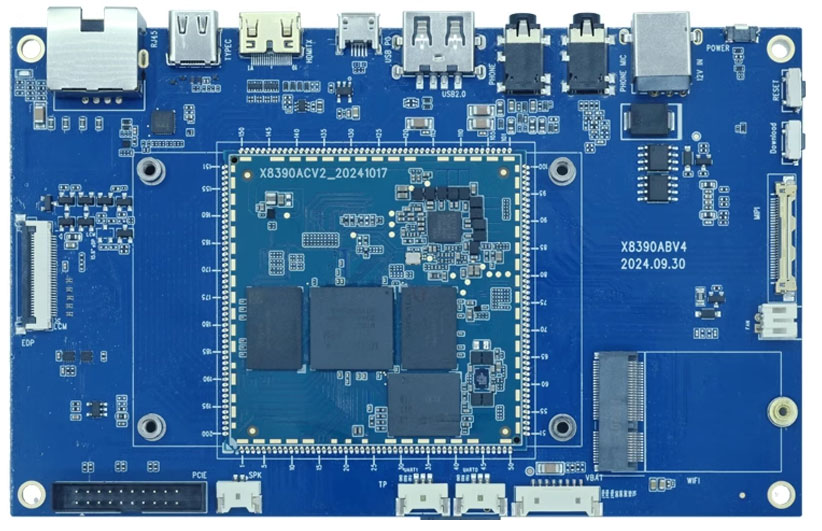
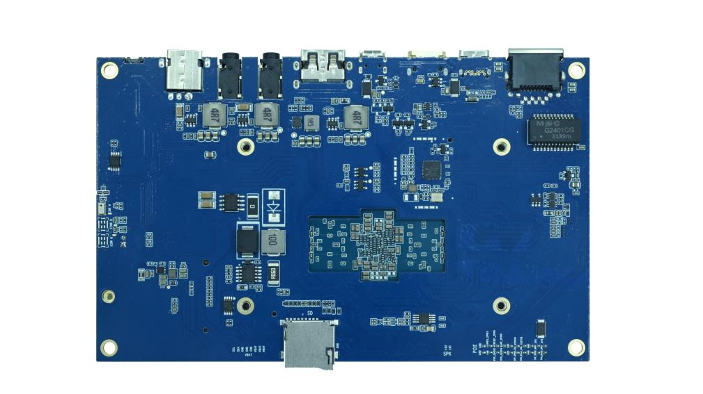
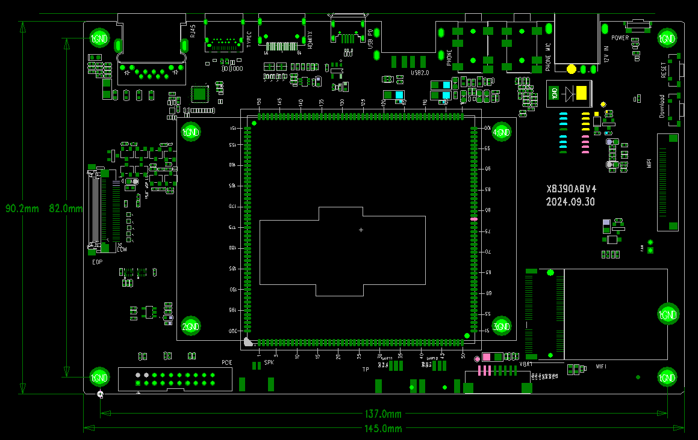

# Product Introduction

## Overview

The X8390 development board is designed around the MediaTek MT8390 platform. The MT8390 and MT8370 use pin-compatible packages, allowing the same carrier-board and core-module form factor to serve different performance targets.

- **MT8390 (Genio 700):** 6nm process, two Cortex-A78 performance cores and six Cortex-A55 efficiency cores, Mali-G57 GPU, and a multi-core AI processor for edge-AI and industrial applications.
- **MT8370 (Genio 510):** 6nm process, two Cortex-A78 and four Cortex-A55 cores, Mali-G57 MC2, APU, DSP, and HEVC encoding acceleration.

### Rear View

## System Configuration

| Item | Specification |
| --- | --- |
| CPU | MT8390; the carrier board also supports the MT8370 core module |
| MT8390 CPU | 2 × Cortex-A78 + 6 × Cortex-A55 |
| Clock | Cortex-A78 at 2.2GHz; Cortex-A55 at 2.0GHz |
| RAM | 2GB / 4GB / 8GB |
| Storage | 4GB / 8GB / 16GB / 32GB / 64GB eMMC |
| PMIC | MT6365 |

## Interfaces

| Interface | Specification |
| --- | --- |
| Power | 12V / 3A |
| Display | One MIPI DSI, one eDP, and one HDMI OUT |
| Touch | Capacitive touch over I2C |
| Audio | I2S / PCM / PDM, headphone, line input, speaker, and digital microphone |
| SD card | One SDIO channel and an on-board TF-card socket |
| eMMC | On the core module; pins are not separately exposed on the carrier board |
| Ethernet | One Gigabit Ethernet port |
| USB | One USB2.0 Type-A, one full-featured Type-C, and one Micro USB OTG |
| UART | Two TTL UARTs |
| Camera | One MIPI CSI connector |
| PCIe | One expansion connector |
| Wi-Fi/BT | M.2 AW-CB451NF with Wi-Fi 6 and Bluetooth 5.0 |

## Mechanical Parameters

| Item | Specification |
| --- | --- |
| Board dimensions | 145mm × 90mm × 1.6mm |
| Operating temperature | 0°C to 70°C |
| Storage temperature | -10°C to 50°C |

