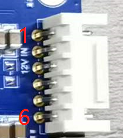
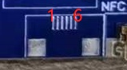
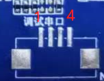
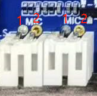
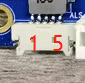
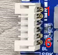

# Connector Definition

This page lists the detailed pin definitions of connectors 7 to 24 on the MT8788 girlfriend-machine mainboard. Connector numbers match the hardware interface map.

## Connector 7: CN2 6P-2.54MM

| Pin | Definition | Description |
| --- | --- | --- |
| 1 | GND | Ground |
| 2 | GND | Ground |
| 3 | GND | Ground |
| 4 | +12V | 12V input |
| 5 | +12V | 12V input |
| 6 | +12V | 12V input |

## Connector 8: J9 4P-1.25MM

| Pin | Definition | Description |
| --- | --- | --- |
| 1 | GND | Ground |
| 2 | SCL | I2C bus clock |
| 3 | SDA | I2C bus data |
| 4 | +5V | 5V power supply |

## Connector 9: J8222 15x2x2MM

| Pin | Definition | Description | Pin | Definition | Description |
| --- | --- | --- | --- | --- | --- |
| 1 | VCC | Panel power | 16 | DCAN | Group A clock - |
| 2 | VCC | Panel power | 17 | D3AP | Group A data 3+ |
| 3 | GND | Ground | 18 | D3AN | Group A data 3- |
| 4 | VCC | Panel power | 19 | D0BP | Group B data 0+ |
| 5 | GND | Ground | 20 | D0BN | Group B data 0- |
| 6 | GND | Ground | 21 | D1BP | Group B data 1+ |
| 7 | D0AP | Group A data 0+ | 22 | D1BN | Group B data 1- |
| 8 | D0AN | Group A data 0- | 23 | D2BP | Group B data 2+ |
| 9 | D1AP | Group A data 1+ | 24 | D2BN | Group B data 2- |
| 10 | D1AN | Group A data 1- | 25 | GND | Ground |
| 11 | D2AP | Group A data 2+ | 26 | GND | Ground |
| 12 | D2AN | Group A data 2- | 27 | DCBP | Group B clock + |
| 13 | GND | Ground | 28 | DCBN | Group B clock - |
| 14 | GND | Ground | 29 | D3BP | Group B data 3+ |
| 15 | DCAP | Group A clock + | 30 | D3BN | Group B data 3- |

## Connector 10: U10 2x2x2MM

| Pin | Definition | Description |
| --- | --- | --- |
| 1 | 5V | Panel +5V power |
| 2 | VCC | Panel power interface |
| 3 | VCC | Panel power interface |
| 4 | 12V | Panel +12V power |

## Connector 11: J12 30P-0.5MM

| Pin | Definition | Description | Pin | Definition | Description |
| --- | --- | --- | --- | --- | --- |
| 1 | GND | Ground | 16 | GND | Ground |
| 2 | D0+ | MIPI data 0+ | 17 | MCLK | Master clock |
| 3 | D0- | MIPI data 0- | 18 | RST | Reset |
| 4 | GND | Ground | 19 | GND | Ground |
| 5 | D1+ | MIPI data 1+ | 20 | 3.3V | 3.3V power supply |
| 6 | D1- | MIPI data 1- | 21 | 3.3V | 3.3V power supply |
| 7 | GND | Ground | 22 | 3.3V | 3.3V power supply |
| 8 | DCLK+ | MIPI clock + | 23 | SDA | I2C bus data |
| 9 | DCLK- | MIPI clock - | 24 | SCL | I2C bus clock |
| 10 | GND | Ground | 25 | 5V | 5V power supply |
| 11 | D2+ | MIPI data 2+ | 26 | 5V | 5V power supply |
| 12 | D2- | MIPI data 2- | 27 | 5V | 5V power supply |
| 13 | GND | Ground | 28 | PND | Plug-in detection |
| 14 | D3+ | MIPI data 3+ | 29 | GND | Ground |
| 15 | D3- | MIPI data 3- | 30 | GND | Ground |

## Connector 12: J37 6P-0.5MM

| Pin | Definition | Description |
| --- | --- | --- |
| 1 | +5V | 5V power for NFC module |
| 2 | +5V | 5V power for NFC module |
| 3 | SDA | I2C bus data |
| 4 | SCL | I2C bus clock |
| 5 | GND | Ground |
| 6 | GND | Ground |

## Connector 13: J2 4P-1.25MM

| Pin | Definition | Description |
| --- | --- | --- |
| 1 | NC | No connection |
| 2 | TXD | Debug UART TX |
| 3 | RXD | Debug UART RX |
| 4 | GND | Ground |

## Connector 14: J36 6P-0.5MM

| Pin | Definition | Description |
| --- | --- | --- |
| 1 | +3.3V | 3.3V power for touch panel |
| 2 | GND | Ground |
| 3 | SCL | I2C bus clock |
| 4 | SDA | I2C bus data |
| 5 | INT | Interrupt signal |
| 6 | RST | Touch panel reset |

## Connector 15: J8 8P-0.5MM

| Pin | Definition | Description |
| --- | --- | --- |
| 1 | +3.3V | LED indicator power |
| 2 | +3.3V | LED indicator power |
| 3 | GND | Ground |
| 4 | GND | Ground |
| 5 | Red Control | Red LED control |
| 6 | Red Control | Red LED control |
| 7 | Green Control | Green LED control |
| 8 | Green Control | Green LED control |

## Connector 16 / 17: J17 / J18 2P-2.0MM

| Pin | Definition | Description |
| --- | --- | --- |
| 1 | MIC+ | Analog microphone input |
| 2 | GND | Ground |

## Connector 18: J13 5P-1.25MM

| Pin | Definition | Description |
| --- | --- | --- |
| 1 | +5V | 5V power for light-sensing module |
| 2 | INT | Interrupt signal |
| 3 | SCL | I2C bus clock |
| 4 | SDA | I2C bus data |
| 5 | GND | Ground |

## Connector 19: J8239 4P-2.0MM

| Pin | Definition | Description |
| --- | --- | --- |
| 1 | OUT1A | Speaker bridge output |
| 2 | OUT1B | Speaker bridge output |
| 3 | OUT2A | Speaker bridge output |
| 4 | OUT2B | Speaker bridge output |

## Connector 20: CN1 6P-2.0MM

| Pin | Definition | Description |
| --- | --- | --- |
| 1 | GND | Ground |
| 2 | GND | Ground |
| 3 | LCD-PWM | LCD backlight adjustment |
| 4 | LCD-EN | LCD backlight enable |
| 5 | +12V | 12V power for LCD backlight |
| 6 | +12V | 12V power for LCD backlight |

## Connector 21: J8229 3P-1.25MM

| Pin | Definition | Description |
| --- | --- | --- |
| 1 | IR | IR receiver input |
| 2 | GND | Ground |
| 3 | +3.3V | 3.3V power for IR receiver |

## Connector 22: J16 4P-1.25MM

| Pin | Definition | Description |
| --- | --- | --- |
| 1 | GND | Ground |
| 2 | DP | USB data + |
| 3 | DM | USB data - |
| 4 | +5V | USB 5V power supply |

## Connector 23: J8230 2P-1.25MM

| Pin | Definition | Description |
| --- | --- | --- |
| 1 | RTC | RTC battery voltage input |
| 2 | GND | Ground |

## Connector 24: J8236 5P-1.25MM

| Pin | Definition | Description |
| --- | --- | --- |
| 1 | GND | Ground |
| 2 | SYS-RST | System reset |
| 3 | KPCOL0 | Pins 3 and 4 form the flashing-mode key |
| 4 | KPROW0 | Pins 3 and 4 form the flashing-mode key |
| 5 | PWRKEY | Power key |

