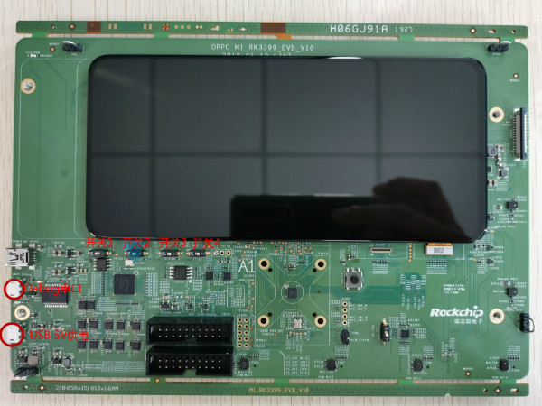
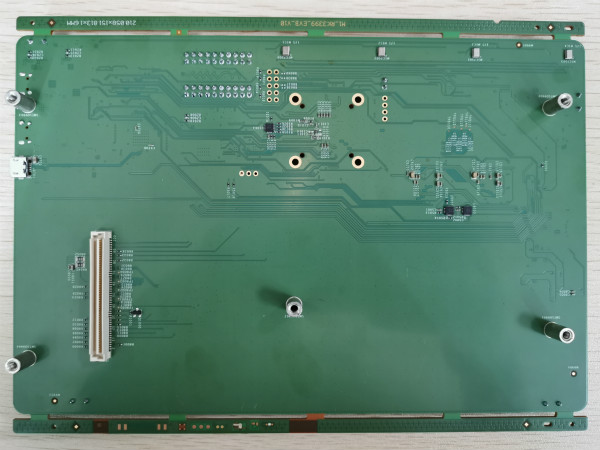
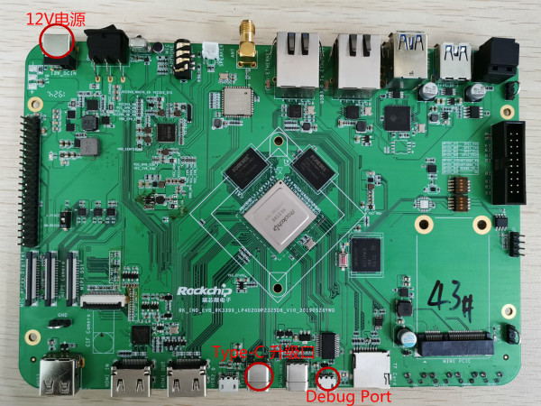
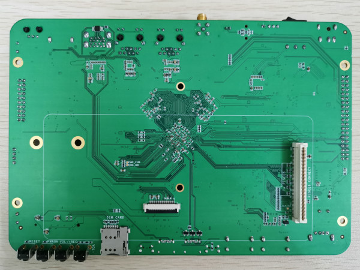
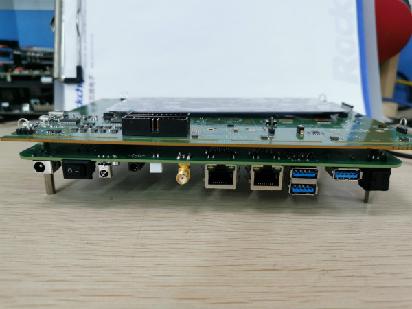

# ** M1_RK3399_EVB User Guide**

Release Version: 1.0

Author Email: zyw@rock-chips.com

Date: 2019.07

Security Level: For RK internal use only

***

**Preface**

**Overview**

**Product Versions**

| **Chip Name** | **Kernel Version** |
| ------------ | ------------ |
| M1           | RTthread  |

**Intended Audience**

This document (this guide) is mainly intended for the following engineers:

Technical Support Engineers

Software Development Engineers

**Revision History**

| **Date**   | **Version** | **Author** | **Description** |
| ---------- | -------- | -------- | ------------ |
| 2019-07-27 | V1.0     | Zhong Yongwang   |              |

***

[TOC]

***

## Board Introduction

   The M1_RK3399_EVB board itself does not have the ability to boot from Flash. To work without Jtag, it needs to be used together with an RK3399 EVB board: RK_IND_EVB_RK3399_LP4D200P232SD8_V10_20190528YWQ

  M1 EVB board front view
   

  M1 EVB board back view
   

 RK3399 front view
 

 RK3399 back view
 

 The two boards are combined together via a 100-pin connector on the back:
 

## Interface Introduction

   The M1 can be powered by the RK3399 EVB, and the M1 EVB does not need to connect its own power supply. After the RK3399 is powered on, a small red LED next to the debug port on the M1 board will light up.
   If the M1 EVB needs to work independently from the RK3399 EVB board, it needs to be connected to a USB 5V power supply. This DC port only provides power and does not have the USB firmware upgrade function.

## Firmware Download

### Download Firmware via RK3399

The RK3399 kernel needs to enable the olpc module, and uses spi2apb to download firmware to the M1's sram. This kernel can be downloaded from here:

	smb://10.10.10.164/rtos_repository/RK2108-Pisces/04-Firmware/RK3399_IMAGE_FOR_M1_EVB/Image-rk3399_all_20190726_v0.2
Usage:

	1. Reflash the kernel and resource files to enable the board's firmware download function
	sudo upgrade_tool di -k kernel.img
	sudo upgrade_tool di -resource resource.img
	
	2. Connect the board with type-c,
	$adb root
	$adb remount
	$adb push flash.sh /data
	$adb push rtthread.bin /mnt/sdcard/
	
	3. Run on the board:
	$su
	#/data/flash.sh
	
	4. After successful execution, the log of successful firmware download will be printed
	rk3399_mid:/ # /data/flash.sh
	[  157.981306] spi_rk_olpc spi32766.0: before request firmware
	[  157.982019] spi_rk_olpc spi32766.0: request firmware rtthread.bin success!
	[  157.982260] spi_rk_olpc spi32766.0: good status:0xff0aa55
	[  157.982285] spi_rk_olpc spi32766.0: 223
	[  157.982304] spi2apb_safe_write addr = 20000000, 60000
	[  158.040556] spi2apb_safe_write addr = 2000ea60, 60000
	[  158.098868] spi2apb_safe_write addr = 2001d4c0, 60000
	[  158.157036] spi2apb_safe_write addr = 2002bf20, 40836
	[  158.196785] spi_rk_olpc spi32766.0: 228
	[  158.196822] spi2apb_safe_write addr = 200ff000, 20
	flash rtthread.bin ok!!!!!!
	
	[  158.202540] spi_rk_olpc spi32766.0: download firmware success!

	5. To replace the firmware, just adb push your own rtthread.bin to /mnt/sdcard/
	
	Note: If the R1003 resistor on the board (directly above the M1 chip) is not mounted, remember to press the reset button on the M1 EVB to reboot the board after replacing the firmware, otherwise the firmware download will fail. If the R1003 resistor is already mounted, the reset is already handled in the script.
	
	------------------
	android firmware
	\\10.10.10.164\Oreo_Repository\RK3399\firmware\rk3399-rk809-oppo\RK3399-SAPPHIRE-EXCAVATOR-	EDP_8.1.0_FOR_MALI_20190703.0850_RELEASE_TEST_USERDEBUG
	
	PS. The rtthread_ap.bin in this directory is the version that enables RK3399 display by default. After executing /data/flash.sh, type reboot to restart RK3399, and you can enter the android interface.
	Note: If you restarted M1 without executing /data/flash.sh to download the firmware, the mipi screen will not output by default.

### Auto Download Firmware on RK3399 Boot

The following android 7.1 firmware can automatically download the M1 firmware on boot. Its boot.img contains a /lib/firmware/rtthread.bin, and in init.rockchip.rc it calls gpio72 reset and echo "raw rtthread.bin" > /dev/rk_olpc.

	smb://10.10.10.164/rtos_repository/RK2108-Pisces/04-Firmware/RK3399_IMAGE_FOR_M1_EVB/Image-rk3399_all_20190726_auto_download_m1_firmware

After booting, you will see some firmware download logs:

	[    4.122780] spi_rk_olpc spi32766.0: before request firmware
	[    4.123208] spi_rk_olpc spi32766.0: request firmware rtthread.bin success!
	[    4.123358] spi_rk_olpc spi32766.0: good status:0xff0aa55
	[    4.123372] spi_rk_olpc spi32766.0: 223
	[    4.123385] spi2apb_safe_write addr = 20000000, 60000
	[    4.181361] spi2apb_safe_write addr = 2000ea60, 60000
	[    4.239655] spi2apb_safe_write addr = 2001d4c0, 60000
	[    4.297960] spi2apb_safe_write addr = 2002bf20, 37812
	[    4.334959] spi_rk_olpc spi32766.0: 228
	[    4.335081] spi2apb_safe_write addr = 200ff000, 20
	[    4.339450] spi_rk_olpc spi32766.0: download firmware success!

At the same time, the M1 debug port will also show output:

 	 \ | /
 	- RT -     Thread Operating System
 	 / | \     3.1.3 build Jul 26 2019
 	 2006 - 2019 Copyright by rt-thread team
 	mount fs[elm] on / failed.
 	testing sleep 1s:
 	msh />actual tick is:1000

The specific init.rockchip.rc modifications are as follows:

 	on early-init
 	...
 	    write /sys/class/gpio/export 72
 	    write /sys/class/gpio/gpio72/direction out
 	    write /sys/class/gpio/gpio72/value 0
 	    write /sys/class/gpio/gpio72/value 1
	
 	on post-fs
 	...
 	    write /dev/rk_olpc "raw rtthread.bin"

## JTag Debugging

If you want the M1 EVB to work independently from the RK3399, you may need JTag.
Two switches need to be toggled on the hardware:

	"Switch 2" set to "1"
	"Switch 4" set to "ON"

M1's Uart0 and JTag pins are multiplexed, so you need to switch GPIO0_C7 and GPIO0_D0 to function2, otherwise the Jtag will disconnect after the system starts up. The specific method is to enable M4_JTAG_ENABLE in scons --menuconfig. If your board has been hardware-modified (debug serial port changed to Uart1), you can enable RT_USING_UART1 and change RT_CONSOLE_DEVICE_NAME to =uart1.

For debugging methods, please refer to 《Rockchip_User_Guide_J-Link_CN》
