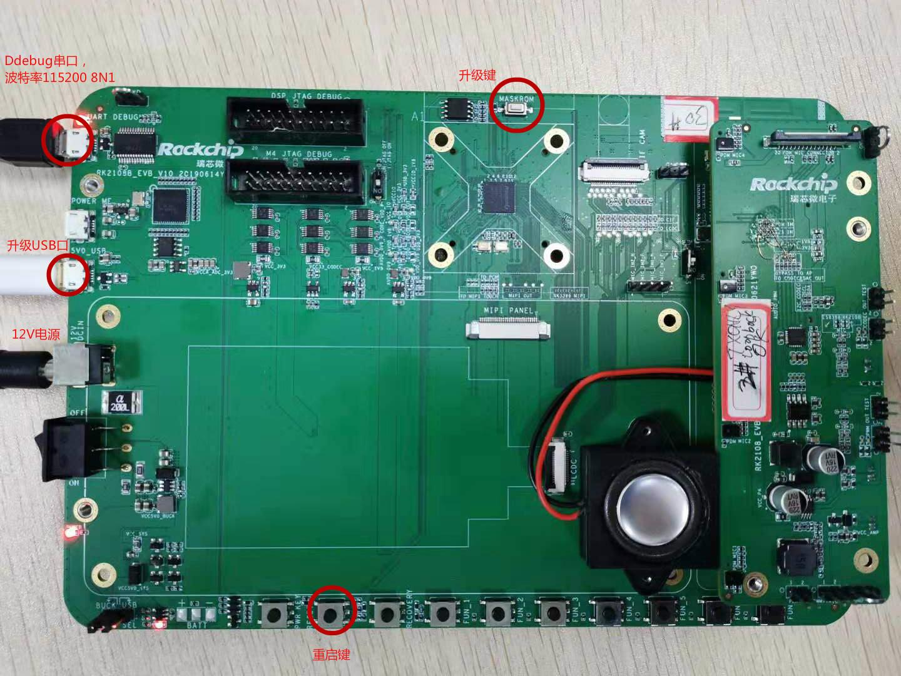
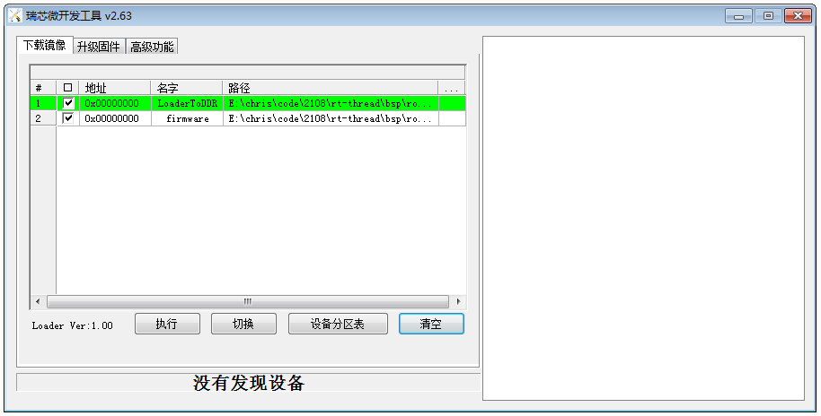
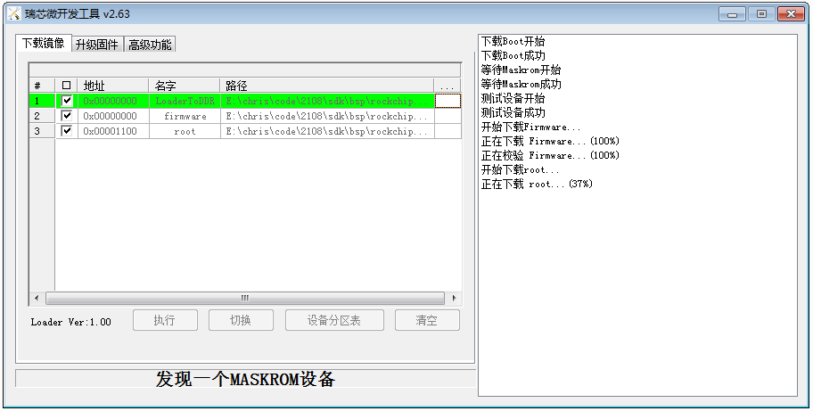

# RK2108B_EVB User Guide

Release Version: 1.0

Author Email: zyw@rock-chips.com

Date: 2019.08

Security Level: Internal use only for RK

***

**Preface**

**Overview**

**Product Versions**

| **Chip Name** | **Kernel Version** |
| ------------ | ------------ |
| RK2108   | RTthread  |

**Intended Audience**

This document (this guide) is mainly intended for the following engineers:

Technical support engineers

Software development engineers

**Revision History**

| **Date**   | **Version** | **Author** | **Change Description** |
| ---------- | -------- | -------- | ------------ |
| 2019-08-13 | V1.0     | Zhong Yongwang |              |

***

[TOC]

***

## Board Introduction

 Front view of RK2108B_EVB_V10 board
   

  Notes:

1) The board requires a 12V power supply to power on;

2) Connect the OTG port to the PC to complete firmware upgrade;

3) The Debug serial port has a built-in FT232 USB-to-serial chip. Windows requires driver installation; Ubuntu can use minicom or other serial tools;

4) With the OTG port connected to the PC, press and hold the MaskRom button while briefly pressing the Reset button. The board enters upgrade mode. Release the MaskRom button to start downloading the firmware.

## SDK Download

```
repo init --repo-url ssh://10.10.10.29:29418/android/tools/repo -u ssh://10.10.10.29:29418/rtos/rt-thread/manifests -b master
```

Ensure your public key has access permission on server 29.

## Compiling the SDK

Build system setup:

	sudo add-apt-repository ppa:team-gcc-arm-embedded/ppa
	sudo apt-get update
	sudo apt-get install gcc-arm-embedded scons clang-format astyle libncurses5-dev gcc

Compile:

```
cd rt-thread/bsp/rockchip/rk2108
scons -j8
mkimage.sh
```

The generated firmware is in the Image directory. Firmware.img is the newly compiled firmware file.

The default configuration used for compilation is rtconfig.h. To modify the configuration, run:

```
cd rt-thread/bsp/rockchip/rk2108
cp board/rk2108b_evb/defconfig .config
scons --menuconfig
```

Note: scons --menuconfig first uses the .config in the current directory as the base configuration. After modification, it saves and generates a new .config and rtconfig.h. So we copied defconfig to .config beforehand. The actual file used for compilation is rtconfig.h.

You can also compile directly using board/rk2108b_evb/defconfig as the configuration:

```
cd rt-thread/bsp/rockchip/rk2108
scons --useconfig=board/rk2108b_evb/defconfig
scons -j8
mkimage.sh
```

Note: scons --useconfig=board/rk2108b_evb/defconfig only generates rtconfig.h for compilation; it does not modify .config. Therefore, if you run scons --menuconfig again, it will use the .config settings to generate rtconfig.h.

*For more details, please refer to "Rockchip_Developer_Guide_RT-Thread_CN"*

## Firmware Upgrade

### Linux Upgrade Tool

Download the Linux upgrade tool, link:

```
smb://10.10.10.164/rtos_repository/RK2108-Pisces/03-Tools/Linux_Upgrade_Tool_v1.38.zip
```

Usage:

```
First put the board into Maskrom state
cd rt-thread/bsp/rockchip/rk2108
sudo ./upgrade_tool db Image/rk2108_db_loader.bin
sudo ./upgrade_tool wl 0 Image/Firmware.img
sudo ./upgrade rd
```

### Windows Upgrade Tool

Download the Windows upgrade tool, link:

	smb://10.10.10.164/rtos_repository/RK2108-Pisces/03-Tools/DriverAssitant_v4.91.zip
	smb://10.10.10.164/rtos_repository/RK2108-Pisces/03-Tools/AndroidTool_Release_v2.63.rar

Before upgrading, install the USB driver DriverAssitant_v4.91.

Open the upgrade tool and select firmware:

	Item 1 "LoaderToDDR" select bsp/rockchip/rk2108/Image/rk2108_db_loader.bin
	Item 2 "Firmware" select bsp/rockchip/rk2108/Image/Firmware.img



After pressing Reset on the RK2108 EVB, the debug port will show output:

	 \ | /
	- RT -     Thread Operating System
	 / | \     3.1.3 build Jul 26 2019
	 2006 - 2019 Copyright by rt-thread team
	mount fs[elm] on / failed.
	testing sleep 1s:
	msh />actual tick is:1000

## JTAG Debugging

Refer to "Rockchip_User_Guide_J-Link_CN" for debugging methods.

The JTAG port and UART0 port on RK2108 share IO pins, so JTAG and Debug serial port cannot be used simultaneously. If JTAG is needed, enable it in scons --menuconfig:

```
M4_JTAG_ENABLE [=y]
```

If you need to use both JTAG and Debug serial port simultaneously, it is recommended to use UART2 via a jumper wire (but this will disable BT). After wiring, modify the following configuration to enable the Debug serial port:

```
RT_CONSOLE_DEVICE_NAME [=uart2]
RT_USING_UART2 [=y]
```

If you need to use UART2 to connect Bluetooth, you can wire UART1_TX_M0 and UART1_RX_M0 to the Debug port, and modify the iomux.c code to set GPIO0_D1 and GPIO0_D2 to PIN_CONFIG_MUX_FUNC2 mode.

Additionally, RK2108 firmware is compiled in XIP mode by default and must be written to Flash before running. JTAG cannot directly download this type of firmware to SRAM. If you need to use the JTAG host tool (Ozone, JLinkExe) to download the rtthread.elf firmware, you need to disable the XIP switch (see below).

## File System

RK2108 supports the FAT file system by default. The partition table can be found in bsp/rockchip/rk2108/board/rk2108b_evb/mnt.c:

```
struct rt_flash_partition flash_parts[] =
{
    /* gpt */
    {
        .name       = PARTITION_GPT,
        .offset     = 0x0,
        .size       = 0x10000,
        .mask_flags = PART_FLAG_RDONLY,
    },

    /* loader */
    {
        .name       = PARTITION_LOADER,
        .offset     = 0x10000,
        .size       = 0x10000,
        .mask_flags = PART_FLAG_RDONLY,
    },

    /* firmware */
    {
        .name       = PARTITION_FIRMWARE,
        .offset     = 0x20000,
        .size       = 0x200000,
        .mask_flags = PART_FLAG_RDWR,
    },

    /* root */
    {
        .name       = PARTITION_ROOT,
        .offset     = 0x220000,
        .size       = 0xde0000,
        .mask_flags = PART_FLAG_RDWR,
    },

    /* end */
    {
        .name = RT_NULL,
    }
};
```

The units in the partition table are Bytes. The offsets and sizes used by the upgrade tool below are in sectors. The root partition offset is 0x220000, corresponding to block number: 0x220000/512 = 0x1100, size in blocks = 0xde0000/512 = 0x6f00.

In the current code project, the Firmware.img obtained by compiling with scons && ./mkimage.sh does not include this root partition. You need to create the root partition firmware yourself and use the download tool to download the root partition. Method:

Create a 10MB VFAT partition:

```
dd if=/dev/zero of=./root.img bs=4096 count=2560
mkfs.msdos -S 4096 root.img
mkdir rootfs
sudo mount -t vfat ./root.img ./rootfs
cp -r /path/to/your/root/dir/* ./rootfs
sudo umount ./rootfs
# root.img is now your root filesystem
```

### Write root partition:

#### Linux operation:

```
sudo upgrade_tool db rk2108_db_loader.bin
sudo upgrade_tool wl 0x1100 root.img
```

#### Windows operation:



### Read root partition from board:

Linux only:

```
$sudo upgrade_tool db rk2108_db_loader.bin
$sudo upgrade_tool select 1, enter operation mode

Rockusb>RL 0x1100 0x6f00 root_out.img
```

## Other Issues

1. ### How to Submit Patches

   git checkout -b xxx //Create a new local branch named xxx

   Modify code...

   Patches in bsp/rockchip/common/hal directory: **git push rk xxx:refs/for/master**

   Patches in other directories: **git push rk xxx:refs/for/develop**

2. ### How to Disable XIP

   ```
   vi rt-thread/bsp/rockchip/rk2108/rtconfig.py
   ```

   Search for "XIP", default is = 'Y'. To disable XIP, change to = 'N'
