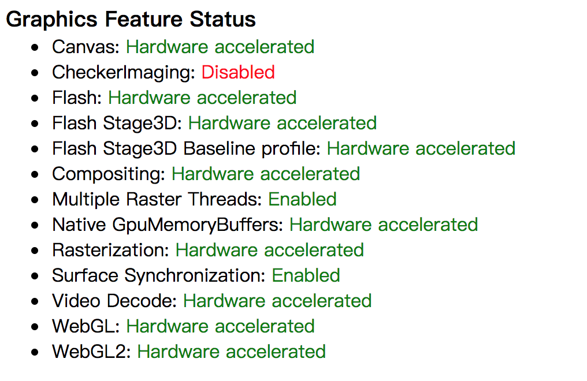
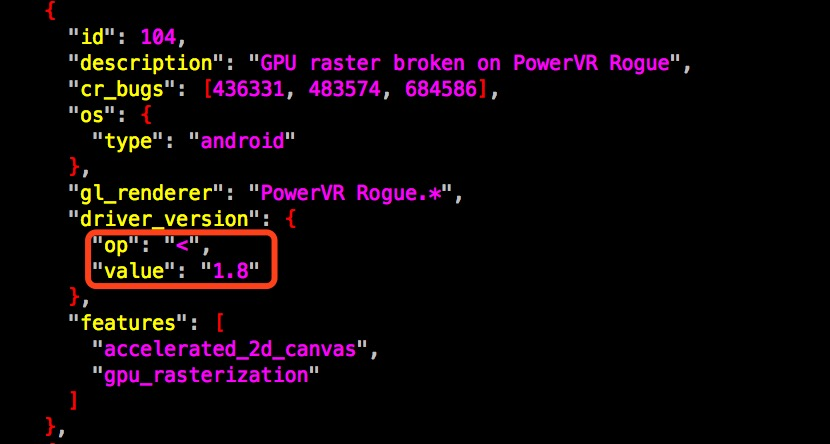
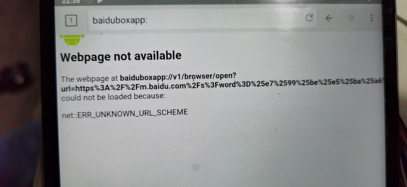

# **Browser FAQ**

ID: RK-PC-YF-128

Release Version: V1.1.0

Date: 2020-09-15

Security Level: □Top-Secret   □Secret   □Internal   ■Public

---

**DISCLAIMER**

This document is provided "as is". Fuzhou Rockchip Electronics Co., Ltd. ("the Company") makes no express or implied representations or warranties regarding the accuracy, reliability, completeness, merchantability, fitness for a particular purpose, or non-infringement of any statements, information, or content in this document. This document is for reference as a usage guide only.

Due to product version upgrades or other reasons, this document may be updated or modified from time to time without any notice.

**Trademark Statement**

"Rockchip", "瑞芯微", and "瑞芯" are registered trademarks of the Company and belong to the Company.

All other registered trademarks or trademarks mentioned in this document are owned by their respective owners.

**Copyright © 2020 Fuzhou Rockchip Electronics Co., Ltd.**

Beyond the scope of fair use, without the written permission of the Company, no individual or entity may excerpt, copy, or distribute any part or all of the content of this document in any form.

Fuzhou Rockchip Electronics Co., Ltd.

Address:     No. 18, Area A, Software Park, Tongpan Road, Fuzhou, Fujian Province

Website:     [www.rock-chips.com](http://www.rock-chips.com)

Customer Service Tel: +86-4007-700-590

Customer Service Fax: +86-591-83951833

Customer Service Email: [fae@rock-chips.com](mailto:fae@rock-chips.com)

---

**Preface**

**Overview**

**Product Versions**

| **Chip Name** | **Kernel Version** |
| ------------- | ------------------ |
| Full series   | Generic            |

**Intended Audience**

This document (guide) is mainly applicable to the following engineers:

Technical Support Engineers

Software Development Engineers

**Revision History**

| **Date**     | **Version** | **Author** | **Description**                            |
| ------------ | ----------- | ---------- | ------------------------------------------ |
| 2017-05-17   | V1.0        | Chen Mouchun |                                            |
| 2020-09-15   | V1.1        | Chen Mouchun | Added Baidu issue description            |

---

[TOC]

---

## Webview & Browser & Chrome

   Before reading this article, it is necessary to clarify the differences between these three. Webview is a core component of the Android framework. All applications can conveniently integrate web functionality by embedding Webview, without needing to port the huge and complex Web Engine themselves. Browser is a full-featured web browser provided by Android, which is also implemented through Webview. Finally, Chrome is based on the Chromium open-source project and is compiled from the same code as the most popular desktop Chrome browser.

## HTML5

   HTML5 is the latest W3C web standard, replacing previous HTML, XHTML, and HTML DOM, adding many new features:

- Canvas element for drawing
- Video and audio elements for media playback
- Better support for local offline storage
- New special content elements like article, footer, header, nav, section
- New form controls like calendar, date, time, email, url, search

   Many people equate HTML5 with audio/video and gaming, which is incorrect. HTML5 includes many new features, not all of which are listed above. For more details, see the complete [HTML5 specification](https://www.w3.org/TR/html5/).

## Webview FAQ

### How to Upgrade Webview

   The Web Engine itself is very large, has many peripheral dependencies, and is fully open. As system components or web content are updated, bugs and compatibility issues may arise. The latest Webview is already based on the Chromium main branch, with releases like Chrome, providing a stable version every month. For Browser and other Webview-based applications, if unknown problems are encountered, try upgrading Webview to see if it resolves the issue. Starting from Android 5.1, the general upgrade steps are as follows (older Android versions are incompatible with the latest Webview):

- Step1: Choose a stable version

   Android Webview currently has many distributions (only stable versions are discussed):

   Name | PackageName | Acquisition Method | Auto Update[^1] | Stability
   - | :-: | -: |:-: |:-:
   Android WebView | com.android.webview | Android built-in | No | Highest
   Chrome Stable[^3] | com.android.chrome | Chrome built-in | Yes | High
   Google WebView[^2] | com.google.android.webview | Shipped with GMS | Yes | High
   Custom Webview | com.android.webview | Self-compiled | No | Medium

   From the table above, *Google WebView & Chrome Stable* can be upgraded via Google Play. Devices with GMS certification use these two Webviews by default and are the easiest to upgrade. You can upgrade the GMS package directly or replace the Webview APK individually.
   [^1]: Updated via Google Play
   [^2]: This is the default Webview in the GMS package and requires Google GMS certification to integrate
   [^3]: Supports Android 7.0 and later only

- Step2: Modify the system Webview package name (optional)

   Starting from Android 5.1, the Webview implementation is decoupled from the framework layer and controlled by a package name that determines which Webview implementation to load. The default package name is *com.android.webview*. To switch to a different Webview implementation, change the system default package name as follows (skip this step if only upgrading the version without switching distributions):

     1. For Android 6.0 and earlier
   Older Android versions have the configuration file at /path_to_android/frameworks/base/core/res/res/values/config.xml, with the following relevant configuration:
<string name="config_webViewPackageName" translatable="false">com.android.webview</string>
   Change com.android.webview to the package name of the target distribution, e.g., com.google.android.webview.
     2. For Android 7.0 and later
        Newer Android versions have the configuration file at /path_to_android/frameworks/base/core/res/res/xml/config_webview_packages.xml, modify it as follows:

```xml
<?xml version="1.0" encoding="utf-8"?>
    <!-- Copyright 2015 The Android Open Source Project

         Licensed under the Apache License, Version 2.0 (the "License");
         you may not use this file except in compliance with the License.
         You may obtain a copy of the License at

              http://www.apache.org/licenses/LICENSE-2.0

         Unless required by applicable law or agreed to in writing, software
         distributed under the License is distributed on an "AS IS" BASIS,
         WITHOUT WARRANTIES OR CONDITIONS OF ANY KIND, either express or implied.
         See the License for the specific language governing permissions and
         limitations under the License.
    -->

    <webviewproviders>
        <!-- The default WebView implementation -->
        <webviewprovider description="Android WebView" packageName="com.android.webview" availableByDefault="true"></webviewprovider>
        <webviewprovider description="Chrome Stable" packageName="com.android.chrome" availableByDefault="true" />
        <webviewprovider description="Google WebView" packageName="com.google.android.webview" availableByDefault="true" isFallback="true" />
</webviewproviders>
```

   During boot, the system searches for installed and enabled packages in the order defined in this configuration file and returns the first match. For example, if all three distributions in the configuration above are installed and enabled, the default package name will be *com.android.webview*. It is not recommended to change the order, as they are already sorted by stability.

- Step3: Manually install and test

```shell
  # Uninstall any webview updates
  adb uninstall com.google.android.webview  # It is fine if this fails
  adb uninstall com.android.webview  # It is fine if this fails
  # On Android 8.0 and up:
  adb disable-verity; adb reboot

  # Remove webview from system partition
  adb root
  adb remount
  adb shell stop
  adb shell rm -rf /system/app/webview /system/app/WebViewGoogle /system/app/WebViewStub
  adb shell start
  Install the built apk.
  adb install -r -d out/Release/apks/SystemWebView.apk
```

   After installation, verify whether the issue is resolved and whether new problems are introduced.

- Step4: Integrate into release firmware

   After verification, integrate into the firmware for release as follows:

     1. For Android 5.1

```shell
    # webview_xxx.apk is the Webview APK to replace
    cp webview_xxx.apk webview.zip
    mv webview_xxx.apk webview.apk

    # Extract libwebviewchromium.so
    unzip webview.zip

    # Preload into Android project
    cp webview.apk vendor/rockchip/common/webkit/
    cp libwebviewchromium.so vendor/rockchip/common/webkit/
```

   Modify /path_to_android/vendor/rockchip/common/webkit/webkit.mk as follows:

```shell
PRODUCT_COPY_FILES += \
    vendor/rockchip/common/webkit/webview.apk:system/app/webview/webview.apk \
    vendor/rockchip/common/webkit/libwebviewchromium.so:system/lib/libwebviewchromium.so
```

     2. For Android 6.0 and later

```shell
# webview_xxx.apk is the Webview APK to replace
cp external/chromium-webview/prebuilt/$ARCH/webview.apk
```

### Video Cannot Play

   Unless otherwise specified, "video" here refers to HTML5 Video. "Cannot play" means it is reproducible, not random or specific-condition-triggered.

#### Gesture Restriction

   HTML5 Video on Android requires a user gesture (touch or mouse operation) to trigger playback. If a webpage calls the HTML5 Video play function directly in a non-gesture-triggered listener, it will be ignored. To disable this feature, use the following code:

```java
webview.getSettings().setMediaPlaybackRequiresUserGesture(false);
```

   To make this effective for all apps using Webview, modify /path_to_android/frameworks/base/core/java/android/webkit/WebView.java:

```java
public WebSettings getSettings() {
        checkThread();
    	mProvider.getSettings().setMediaPlaybackRequiresUserGesture(false);
        return mProvider.getSettings();
    }
```

#### Security Restrictions

   Starting from a certain version of Webview, mixing HTTPS and HTTP is no longer allowed. That is, HTTPS websites cannot embed HTTP content. Some customers have reported that Webview on Android 6.0 and later cannot play QQ videos. Checking logcat reveals that the video URL violates this security rule and is blocked. To disable this feature, use the following code:

```java
webview.getSettings().setMixedContentMode(WebSettings.MIXED_CONTENT_ALWAYS_ALLOW);
```

#### Other Issues

   There are also less common playback restrictions that can cause playback failure. For example, local video sources require proper access permissions, and full-screen playback requires a wake lock permission. These must be correctly declared in the APK's Manifest. Logcat will throw an exception indicating which permission failed. Additionally, the GPU's maximum texture size limits the maximum video resolution, so older GPUs may not support 4k video. Logcat will provide clear hints, and opening Chrome and entering *chrome://gpu* in the address bar, then scrolling down to the *Video Acceleration Information* table, provides detailed video limitations.

### Video Stuttering

   Currently, the most common video stuttering issues are categorized as follows:

- Software decoding, limited by CPU processing power

   Solution:

     1. First confirm whether the SoC supports hardware decoding for this video format. If supported, check whether there is an incorrect judgment or unimplemented feature in the Media framework layer. Webview currently uses two methods to call Media: MediaPlayer and MediaCodec, with the latter being the default for newer versions.
     2. If hardware does not support it, try asking the website to change the video format. Most websites identify supported video formats through UserAgent detection and HTML5 Audio/Video [canPlayType()](http://www.w3school.com.cn/tags/av_met_canplaytype.asp) functions. In this case, first check the website's JavaScript source code. Even obfuscated, most logic can be guessed. If canPlayType is called, remove the current video format from the media framework's supported list, i.e., remove it from MediaCodecList[^4]. Create a simple webpage to verify your changes based on this [Demo](http://www.w3school.com.cn/tiy/t.asp?f=html5_av_met_canplaytype). If canPlayType still returns incorrect results after modifying MediaCodecList, check the entire call path, as there are extensive Blacklist modifications in the intermediate code. See part of the [code](https://cs.chromium.org/chromium/src/media/base/android/java/src/org/chromium/media/MediaCodecUtil.java?type=cs&q=isDecoderSupportedForDevice&sq=package:chromium&g=0&l=359) for reference.

- Active frame dropping, observed in some apps like iQiyi

   Solution:

     1. The app can only actively drop frames when using MediaCodec or OMX decoding. Since third-party app source code is unavailable, it is generally impossible to know why frames are being dropped. The simplest solution is to prevent the app from dropping frames, e.g., modify MediaCodec.releaseOutputBuffer(int index, boolean render), where render=false indicates the app wants to drop the frame; simply ignore this parameter.

- Insufficient memory bandwidth. The entire hardware decoding process can be divided into three stages (Webview only): VPU decoding, scaling/cropping, GPU texturing. Only the middle stage is sometimes handled by the CPU (often with RGA acceleration), but the entire process has certain memory bandwidth requirements, so the bottleneck is often memory bandwidth.

   Solution:

     1. Increase memory frequency to verify the effect.

   [^4]: /path_to_android/frameworks/base/media/java/android/media/MediaCodecList.java

### Video Cannot Loop or Auto-Play

   Looping and auto-play are controlled by attributes in the webpage. See these demos: [loop](http://www.w3school.com.cn/tags/av_prop_loop.asp) & [autoplay](http://www.w3school.com.cn/tags/av_prop_autoplay.asp). For a complete description of audio/video interfaces and properties, see [W3C](http://www.w3school.com.cn/tags/html_ref_audio_video_dom.asp).

### Animation or Game Stuttering

   Animations and games are primarily implemented using CSS and HTML5 Canvas, both of which support GPU hardware acceleration. However, Chromium has a blacklist mechanism that determines whether to enable hardware acceleration based on the GPU and various software driver versions to resolve compatibility bugs. If web animations stutter, and updating to a newer version does not help, open *chrome://gpu* in Chrome to see the current hardware acceleration status, similar to below:



   Focus on these items: Canvas & Rasterization & WebGL & WebGL2. Red indicates disabled. For specific reasons, scroll down to Problems Detected, which provides a brief description and bug number. Search for this bug number in /path_to_chromium/gpu/config to find the condition. For example:



   The image above indicates that for the PowerVR Rogue series on Android, if the GPU driver version is less than 1.8, both Canvas & Rasterization acceleration are disabled. In this case, upgrading the PowerVR driver to version 1.8 or higher resolves the issue.

### Black Screen, White Screen, and Flickering

   When encountering these issues, first check logcat for clear error messages, such as Graphics Buffer overflow, GPU crash, OpenGL errors, or framework exceptions. Then seek help from engineers responsible for those modules. If logcat shows no obvious errors, try upgrading the Webview version. If the issue persists, upgrade the GPU driver version. In most cases, these issues are caused by compatibility problems between Webview and the graphics driver.

### How to Modify UserAgent

   The purpose of modifying the UserAgent is to disguise the device, e.g., as a Desktop or iPad. Use the following code to modify the Webview UserAgent:

```java
webview.getSettings().setUserAgentString("");
```

   To modify Chrome's UserAgent, use the following method:

```shell
echo 'chrome --user-agent="Mozilla/5.0 (Linux; Android 4.4; Nexus 7 Build/KRT16M) AppleWebKit/537.36 (KHTML, like Gecko) Chrome/30.0.1599.92 Safari/537.36"' > /data/local/chrome-command-line
```

   To preload into firmware, modify /path_to_android/vendor/rockchip/common/webkit/webkit.mk, uncomment the relevant lines:

```shell
PRODUCT_COPY_FILES += \
        vendor/rockchip/common/webkit/chrome-command-line:system/etc/chrome-command-line \
        vendor/rockchip/common/webkit/chrome.sh:system/bin/chrome.sh
```

   Also modify /path_to_android/vendor/rockchip/common/webkit/chrome-command-line to replace the desired UserAgent.

   ==Note==: Modifying the UserAgent may cause compatibility issues. For example, if you masquerade as an iPad Safari browser, the server may return pages that only Safari can support, causing problems.

### How to Implement URL Filtering

   Android itself does not support URL filtering. To implement this functionality, there are three methods:

- Directly modify /etc/hosts

   Example of blocking access to Baidu:

  ```shell
  127.0.0.1       localhost
  ::1             ip6-localhost
  0.0.0.0         www.baidu.com
  ```

  This method is simple and globally effective, but has clear disadvantages: no wildcard support, no whitelist mechanism, inconvenient updates, and can be bypassed via socket programming.

- Modify /path_to_chromium/net/url_request/url_request.cc. All Webview requests pass through this class, where URLs can be filtered by controlling whether the Read function returns data.

  This method has the clear disadvantage of only working for browsers using Webview, not those with their own Web Engine. The advantage is flexibility; both blacklists and whitelists are possible, and updates are easy.

- Use netfilter and iptables for packet filtering

  This method provides the most flexible and strict control. Many firewalls implement this way and it is hard to bypass. See this [tutorial](https://blog.csdn.net/zhanglianyu00/article/details/50177873) for details.

### Cannot Open Downloaded Files

   This is mainly due to the server setting an incorrect mime-type for the file, e.g., setting *text/plain* for an APK file. This causes the browser to report the wrong type to the download manager, resulting in failure to open via notifications or the download manager, though it can be opened correctly via a file manager. To fix this, modify as follows:

```shell
commit c906b4b4f9a120d28a099fece4a5820127a32201
Author: mouchun chen <cmc@rock-chips.com>
Date:   Wed Jan 7 18:09:29 2015 +0800

    fix wrong mimetype when download file

diff --git a/src/com/android/browser/DownloadHandler.java b/src/com/android/browser/DownloadHandler.java
index 7a24aa4..8c1441d 100755
--- a/src/com/android/browser/DownloadHandler.java
+++ b/src/com/android/browser/DownloadHandler.java
@@ -222,7 +222,9 @@ public class DownloadHandler {
                 Log.d(LOGTAG, "referer: " + referer);
         request.setNotificationVisibility(
                 DownloadManager.Request.VISIBILITY_VISIBLE_NOTIFY_COMPLETED);
-        if (mimetype == null) {
+        if (mimetype == null
+                       || mimetype.equalsIgnoreCase("text/plain")
+                       || mimetype.equalsIgnoreCase("application/octet-stream")) {
             if (TextUtils.isEmpty(addressString)) {
                 return;
             }
```

### Does It Support Adobe Flash

   Adobe stopped supporting the Flash plugin on Android starting from Android 4.3. The last version that supports the plugin is Android 5.1. There are currently two alternatives: Adobe AIR and HTML5. New content can use either, with HTML5 being recommended. For old Flash content, if the source file (FLA file) is available, it can be exported to either alternative using newer versions of Adobe Flash development tools.

### How to Handle Crashes and ANR

   For these types of issues, to improve processing efficiency, please do the following before passing them to me:

- First, briefly review the log information

   For crashes, first check logcat to see where the crash occurred. If it is in peripheral modules such as the framework, Media, or Graphics, directly forward to the relevant module engineer. If it crashes within the browser, forward to me. If the crash is in the Native layer, first provide the Crash Dump symbol table as follows:

  ```shell
  addr2line -e out/target/product/rk3399/symbols/system/lib/libc.so 2000
  ```

  Replace libc.so with the library that crashed and 2000 with the crash location, as found in the Crash Dump.

   For ANR, provide both logcat and /data/anr/traces.txt. First review traces.txt to see where the main thread is blocked. If confirmed to be in a peripheral module, directly forward to the relevant engineer.

- If possible, test with other solutions to see if similar issues occur

- Try whether a newer version of Chrome or Webview resolves the issue

  ==Note==: Starting from Android 6.0, Webview is also distributed as a pre-installed APK, so there is no symbol table. If the crash occurs in libwebviewchromium.so, it cannot be debugged. Chrome has always been distributed as an APK, but its crashes are automatically sent to Google, which selectively reviews them.

### Video Has Audio but No Picture

   For this type of issue, first try the following modification:

```shell
# setprop sys.hwc.compose_policy 0
# stop
# start
```

### Accessing Baidu Homepage Shows Error: net::err_unknown_url_scheme

   This issue is caused by Baidu. Baidu's server detects mobile devices and tries to redirect to its own app on the first visit. Since the device does not have the Baidu app installed, it cannot recognize the `baiduboxapp` scheme, resulting in an access error. The browser will display the following error: 

   Since this prompt only appears on the first visit, it can be ignored. To solve it, modify the `UserAgent` as described in the previous section. Currently, the `Desktop` `UserAgent` is known to work, but it may cause some webpages to display in desktop mode. Some mobile vendors' `UserAgent` might also work.

## How to Build Webview

   See Google's [documentation](https://chromium.googlesource.com/chromium/src/+/master/docs/android_build_instructions.md). Note that Chromium commits are very frequent, so the latest branch stability is not guaranteed and may not even compile. For firmware releases, it is best to use the stable branch LKGR or a specific stable version. Refer to the latest Chrome version by entering *chrome://version* in the address bar. To switch to a specific version, see this [documentation](https://www.chromium.org/developers/how-tos/get-the-code/working-with-release-branches).

## How to Debug

   Sometimes certain webpage elements display abnormally, and the webpage Layout information is needed. On older Android versions (4.2 and earlier), entering *about:debug* in the address bar could trigger dump, with Layout information output as text to the /sdcard directory. Newer Webview versions lack similar debugging tools, but Chrome supports remote debugging. See [Google documentation](https://developers.google.com/web/tools/chrome-devtools/remote-debugging/?hl=zh-cn) for details.

   Another scenario: when an APK using Webview or another Web Engine displays abnormally, there are few debugging options on the device side. If the webpage author is unavailable to help, try the following:

- If a comparison solution works fine

   Check two aspects: whether the Android version differs; try switching to the same version. If switching Android version is difficult, try switching Webview versions (if Webview is used). Check if the UserAgent differs by using tcpdump to capture packets and compare; try modifying the UserAgent.

- Use the device's UserAgent with the desktop Chrome development tools (Settings -> More Tools -> Developer Tools). The toolbar has a mobile-like button with device emulation features. Emulate your device and load the same webpage, then use the Elements tab to find the abnormal element. This should at least narrow down the scope. Finally, the server can consider an alternative implementation for that element.
