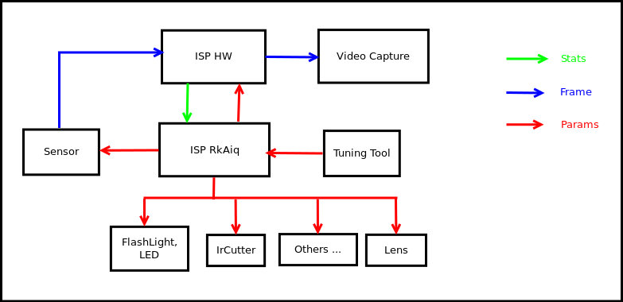
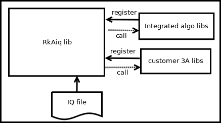
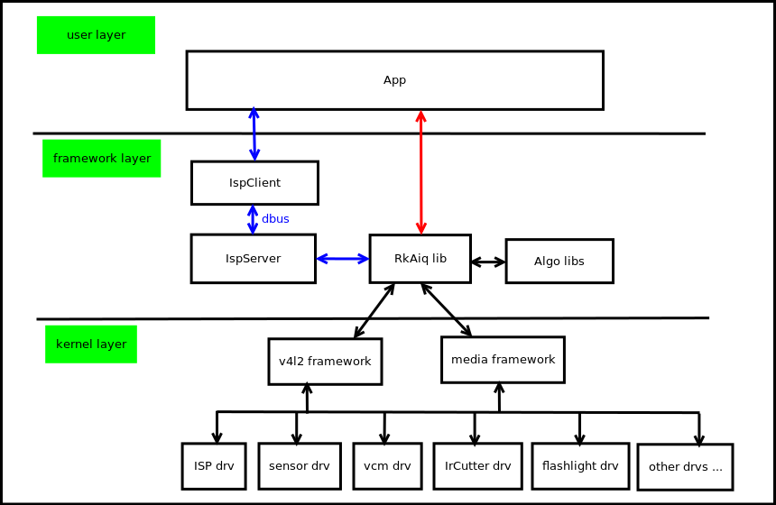
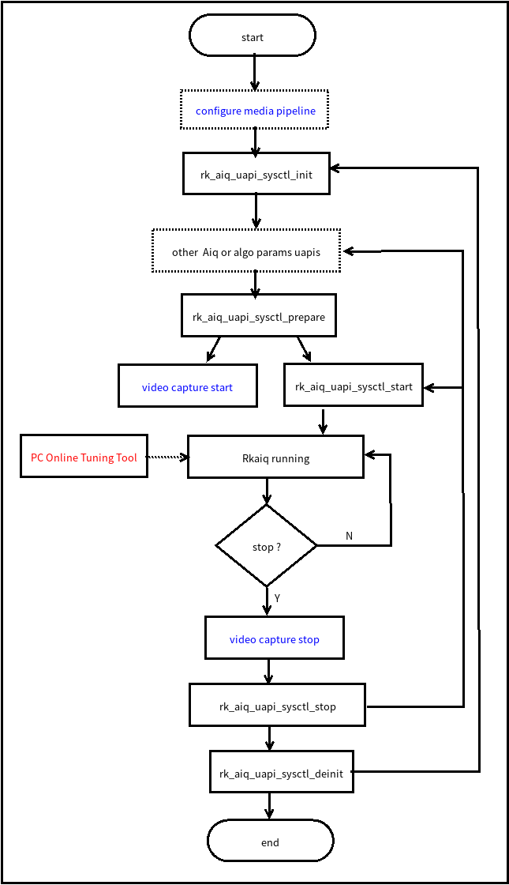

# Rockchip Development Guide ISP2x

Document ID: RK-KF-GX-601

Release Version: V1.1.0

Date: 2020-08-14

Security Level: □Top-Secret   □Secret   □Internal   ■Public

**DISCLAIMER**

THIS DOCUMENT IS PROVIDED "AS IS". ROCKCHIP ELECTRONICS CO., LTD. ("ROCKCHIP") DOES NOT PROVIDE ANY WARRANTY OF ANY KIND, EXPRESSED, IMPLIED OR OTHERWISE, WITH RESPECT TO THE ACCURACY, RELIABILITY, COMPLETENESS, MERCHANTABILITY, FITNESS FOR ANY PARTICULAR PURPOSE OR NON-INFRINGEMENT OF ANY REPRESENTATION, INFORMATION AND CONTENT IN THIS DOCUMENT. THIS DOCUMENT IS FOR REFERENCE ONLY.

THIS DOCUMENT MAY BE UPDATED OR CHANGED WITHOUT ANY NOTICE AT ANY TIME DUE TO THE UPGRADES OF THE PRODUCT OR ANY OTHER REASONS.

**Trademark Statement**

"Rockchip", "Rockchip", "Rockchip" shall be Rockchip's registered trademarks and owned by Rockchip.

All the other trademarks or registered trademarks mentioned in this document shall be owned by their respective owners.

**All rights reserved. ©2020. Rockchip Electronics Co., Ltd.**

Without permission from Rockchip, any individual or organization shall not extract, copy, or distribute any part of this document in any form, beyond reasonable use.

Rockchip Electronics Co., Ltd.

Rockchip Electronics Co., Ltd.

Address: No. 18, Area A, Software Park, Tongpan Road, Fuzhou, Fujian Province

Website:     [www.rock-chips.com](http://www.rock-chips.com)

Customer service Tel: +86-4007-700-590

Customer service Fax: +86-591-83951833

Customer service e-Mail: [fae@rock-chips.com](mailto:fae@rock-chips.com)

---

**Preface**

**Overview**

This document aims to describe the role of the RkAiq (Rockchip Auto Image Quality) module, the overall workflow, and the related API interfaces. It mainly provides assistance to
engineers who use the RkAiq module for ISP function development.

**Product Version**``

| **Chip Name** | **Kernel Version** |
| ------------ | ------------ |
| RV1126/RV1109 | Linux 4.19   |

**Target Audience**

This document (this guide) is mainly applicable to the following engineers:

ISP module software development engineer

System integration software development engineer

**Chip System Support Status**

| **Chip Name** | **BuildRoot** | **Debian** | **Yocto** | **Android** |
| ------------ | ------------- | ---------- | --------- | ----------- |
| RV1126       | Y             | N          | N         | N           |
| RV1109       | Y             | N          | N         | N           |

**Revision History**

| **Version** | **Author** | **Date** | **Description** |
| ---------- | --------| :--------- | ------------ |
| V1.0.0    | Zhong Yichong Zhang Yunlong Xu Hongfei| 2020-06-09 | Initial version     |
| V1.0.1    | Zhang Yunlong Xu Hongfei Zhu Linjing Chi Xiaofang | 2020-08-04 | Added statistics chapter |
| V1.1.0    | Zhang Yunlong         | 2020-08-14 | Added backlight compensation, highlight suppression and other interface descriptions |

---

**Table of Contents**

[TOC]

---

## Overview

ISP20 includes a series of image processing algorithm modules, mainly including: dark current correction, bad pixel correction, 3A, HDR, lens shading correction, lens distortion correction, 3DLUT, denoising (including RAW domain denoising, multi-frame denoising, color denoising, etc.), sharpening, etc.

ISP20 includes both hardware algorithm implementation and software logic control. RkAiq is the implementation of the software logic control part.

The main functions implemented by the RkAiq software module are: obtaining image statistics from the ISP driver, combining with IQ tuning parameters, using a series of algorithms to calculate new ISP, Sensor and other hardware parameters, and continuously iterating this process to achieve the optimal image effect.

### Functional Description


<center>Figure 1-1 ISP20 System Block Diagram</center>

The overall ISP20 hardware and software block diagram is shown in Figure 1-1. The Sensor outputs the data stream to the ISP HW, and the ISP HW outputs the image after a series of image processing algorithms. RkAiq continuously obtains statistical data from the ISP HW, and generates new parameters through algorithms such as 3A to feed back to each hardware module. The Tuning tool can debug parameters online in real time, and after debugging, the new iq parameter file can be saved and generated.

### RkAiq Architecture


<center>Figure 1-2 RkAiq Overall Architecture Diagram</center>

The ISP20 RkAiq software design concept is shown in Figure 1-2. It is mainly divided into the following four parts:

1. RkAiq lib dynamic library. This library contains the main logic part, responsible for obtaining statistics from the driver and transmitting them to each algorithm library.
2. Integrated algo libs. The static algorithm libraries provided by Rockchip have been registered by default into the RkAiq lib dynamic library.
3. Customer 3A libs. Customers can implement their own 3A algorithm libraries or other algorithm libraries according to the algorithm interface definition. After registering the custom algorithm library with the RkAiq lib dynamic library, they can choose to run the custom library or the Rockchip library through the provided interface.
4. IQ file. The iq tuning result file, which stores algorithm-related parameters and some system static parameters such as CIS.

### Software Architecture


<center>Figure 1-3 Software Architecture Block Diagram</center>

The ISP20 software block diagram is shown in Figure 1-3. It is mainly divided into the following three layers:

1. kernel layer. This layer contains all hardware drivers of the Camera system, mainly ISP driver, sensor driver, vcm driver, flashlight driver, IrCutter driver, etc. The drivers are all based on the V4L2 and Media frameworks.
2. framework layer. This layer is the integration layer of the RkAiq lib. The Rkaiq lib has two integration methods:
  - IspServer method
    In this method, the Rkaiq lib runs in the IspServer independent process, and the client communicates with it through dbus. In addition, this method can provide images with ISP debugging effects for existing third-party applications such as v4l-ctl without modifying the source code.
  - Direct integration method
    The RkAiq lib can be directly integrated into the application.
3. user layer. User application layer.

### Software Flow


<center>Figure 1-4 Flowchart</center>

The RkAiq interface call flow is shown in Figure 1-4. The dashed box parts in the figure are optional, and the blue font parts are the configurations that the application needs to cooperate with the RkAiq flow.

- configure media pipeline. Optional, configure the ISP20 pipeline, such as sensor output resolution, etc. The driver has default configuration.

- rk_aiq_uapi_sysctl_init. Initialize RkAiq, including IQ tuning parameters and initialization of each algorithm library.

- other Aiq or algo params uapis. Optional, you can configure the required parameters through the API interface provided by each algorithm, and register third-party algorithm libraries, etc.

- rk_aiq_uapi_sysctl_prepare. Prepare the initialization parameters of each algorithm library and each hardware module, and set them to the driver.

- video capture start. This flow is the start of the ISP data stream on the application side. This flow needs to be called after rk_aiq_uapi_sysctl_prepare.

- rk_aiq_uapi_sysctl_start. Start the internal RkAiq flow. After the interface is successfully called, the sensor starts to output data, the ISP starts to process data, and outputs the processed image.

- Rkaiq running. RkAiq continuously obtains statistical data from the ISP driver, calls 3A and other algorithms to calculate new parameters, and applies the new parameters to the driver.

- PC Online Tuning Tool. The PC side can adjust parameters online through the Tuning Tool.

- video capture stop. Before stopping the RkAiq flow, the data stream part needs to be stopped first.

- rk_aiq_uapi_sysctl_stop. Stop the RkAiq running flow. It can be restarted after adjusting parameters or directly restarted.

- rk_aiq_uapi_sysctl_deinit. De-initialize RkAiq.

### API Description

The APIs provided by RKAiq are divided into two levels: functional level APIs and module level APIs. The functional level APIs are encapsulated based on the module level APIs, mainly designed for some simple functions of the product application based on the module. The module level APIs provide detailed parameter settings and queries for the module, without distinguishing APIs by function.

## System Control

### Functional Overview

The system control part includes AIQ common attribute configuration, initializing AIQ, running AIQ, exiting AIQ, setting AIQ modules, etc.

### API Reference

#### rk_aiq_uapi_sysctl_init

**【Description】**
Initialize AIQ context.

**【Syntax】**

```c
rk_aiq_sys_ctx_t*
rk_aiq_uapi_sysctl_init (const char* sns_ent_name,
                         const char* iq_file_dir,
                         rk_aiq_error_cb err_cb,
                         rk_aiq_metas_cb metas_cb);
```

**【Parameters】**

| **Parameter Name** | **Description** | **Input/Output** |
| ------------ | ------------ | ------------ |
| sns_ent_name | sensor entity name  | Input |
| iq_file_dir | calibration parameter file path  | Input |
| err_cb | error callback function, can be NULL | Input |
| metas_cb | meta data callback function, can be NULL | Input |

**【Return Value】**

| **Return Value** | **Description** |
| ------------ | ------------ |
| rk_aiq_sys_ctx_t\* | AIQ context pointer  |

**【Requirements】**

- Header file: rk_aiq_user_api_sysctl.h
- Library file: librkaiq.so

**【Note】**

- Should be called before other functions.

#### rk_aiq_uapi_sysctl_deinit

**【Description】**
De-initialize AIQ context.

**【Syntax】**

```c
void
rk_aiq_uapi_sysctl_deinit( rk_aiq_sys_ctx_t* ctx);
```

**【Parameters】**

| **Parameter Name** | **Description** | **Input/Output** |
| ------------ | ------------ | ------------ |
| ctx | AIQ context pointer  | Input |

**【Return Value】**

| **Return Value** | **Description** |
| ------------ | ------------ |
| None | None |

**【Requirements】**

- Header file: rk_aiq_user_api_sysctl.h
- Library file: librkaiq.so

**【Note】**

- Should not be called when AIQ is in start state.

#### rk_aiq_uapi_sysctl_prepare

**【Description】**
Prepare AIQ running environment.

**【Syntax】**

```c
XCamReturn
rk_aiq_uapi_sysctl_prepare(const rk_aiq_sys_ctx_t* ctx,
                           uint32_t  width,
                           uint32_t  height,
                           rk_aiq_working_mode_t mode);
```

**【Parameters】**

| **Parameter Name** | **Description** | **Input/Output** |
| ------------ | ------------ | ------------ |
| ctx | AIQ context pointer  | Input |
| width | resolution width of sensor output, only used for verification  | Input |
| height | resolution height of sensor output, only used for verification  | Input |
| mode | ISP Pipeline working mode (NORMAL/HDR) | Input |

**【Return Value】**

| **Return Value** | **Description** |
| ------------ | ------------ |
| 0 | Success  |
| Non-zero | Failure, see error code table for details  |

**【Requirements】**

- Header file: rk_aiq_user_api_sysctl.h
- Library file: librkaiq.so

**【Note】**

- Should be called before rk_aiq_uapi_sysctl_start function.
- If this function needs to be called after rk_aiq_uapi_sysctl_start, first call rk_aiq_uapi_sysctl_stop, then call rk_aiq_uapi_sysctl_prepare to re-prepare the running environment.

#### rk_aiq_uapi_sysctl_start

**【Description】**
Start the AIQ control system. After AIQ starts, it will continuously obtain 3A statistical information from the ISP driver, run 3A algorithms, and apply the calculated new parameters.

**【Syntax】**

```c
XCamReturn
rk_aiq_uapi_sysctl_start(const rk_aiq_sys_ctx_t* ctx);
```

**【Parameters】**

| **Parameter Name** | **Description** | **Input/Output** |
| ------------ | ------------ | ------------ |
| ctx | AIQ context pointer  | Input |

**【Return Value】**

| **Return Value** | **Description** |
| ------------ | ------------ |
| 0 | Success  |
| Non-zero | Failure, see error code table for details  |

**【Requirements】**

- Header file: rk_aiq_user_api_sysctl.h
- Library file: librkaiq.so

**【Note】**

- Should be called after rk_aiq_uapi_sysctl_prepare function.

#### rk_aiq_uapi_sysctl_stop

**【Description】**
Stop the AIQ control system.

**【Syntax】**

```c
XCamReturn
rk_aiq_uapi_sysctl_stop(const rk_aiq_sys_ctx_t* ctx);
```

**【Parameters】**

| **Parameter Name** | **Description** | **Input/Output** |
| ------------ | ------------ | ------------ |
| ctx | AIQ context pointer  | Input |

**【Return Value】**

| **Return Value** | **Description** |
| ------------ | ------------ |
| 0 | Success  |
| Non-zero | Failure, see error code table for details  |

**【Requirements】**

- Header file: rk_aiq_user_api_sysctl.h
- Library file: librkaiq.so

#### rk_aiq_uapi_sysctl_getStaticMetas

**【Description】**
Query sensor static information, such as resolution, data format, etc.

**【Syntax】**

```c
XCamReturn
rk_aiq_uapi_sysctl_getStaticMetas(const char* sns_ent_name, rk_aiq_static_info_t* static_info);
```

**【Parameters】**

| **Parameter Name** | **Description** | **Input/Output** |
| ------------ | ------------ | ------------ |
| sns_ent_name | sensor entity name  | Input |
| static_info | static information structure pointer  | Output |

**【Return Value】**

| **Return Value** | **Description** |
| ------------ | ------------ |
| 0 | Success  |
| Non-zero | Failure, see error code table for details  |

**【Requirements】**

- Header file: rk_aiq_user_api_sysctl.h
- Library file: librkaiq.so

#### rk_aiq_uapi_sysctl_enumStaticMetas

**【Description】**
Enumerate static information obtained by AIQ.

**【Syntax】**

```c
XCamReturn
rk_aiq_uapi_sysctl_enumStaticMetas(int index, rk_aiq_static_info_t* static_info);
```

**【Parameters】**

| **Parameter Name** | **Description** | **Input/Output** |
| ------------ | ------------ | ------------ |
| index | index number, starting from 0  | Input |
| static_info | static information structure pointer  | Output |

**【Return Value】**

| **Return Value** | **Description** |
| ------------ | ------------ |
| 0 | Success  |
| Non-zero | Failure, see error code table for details  |

**【Requirements】**

- Header file: rk_aiq_user_api_sysctl.h
- Library file: librkaiq.so

#### rk_aiq_uapi_sysctl_setModuleCtl

**【Description】**
AIQ module switch setting.

**【Syntax】**

```c
XCamReturn
rk_aiq_uapi_sysctl_setModuleCtl(const rk_aiq_sys_ctx_t* ctx, rk_aiq_module_id_t mId, bool mod_en);
```

**【Parameters】**

| **Parameter Name** | **Description** | **Input/Output** |
| ------------ | ------------ | ------------ |
| ctx | AIQ context pointer  | Input |
| mId | module ID  | Input |
| mod_en | true to enable, false to disable  | Input |

**【Return Value】**

| **Return Value** | **Description** |
| ------------ | ------------ |
| 0 | Success  |
| Non-zero | Failure, see error code table for details  |

**【Requirements】**

- Header file: rk_aiq_user_api_sysctl.h
- Library file: librkaiq.so

#### rk_aiq_uapi_sysctl_getModuleCtl

**【Description】**
AIQ module status query.

**【Syntax】**

```c
XCamReturn
rk_aiq_uapi_sysctl_getModuleCtl(const rk_aiq_sys_ctx_t* ctx, rk_aiq_module_id_t mId, bool *mod_en);
```

**【Parameters】**

| **Parameter Name** | **Description** | **Input/Output** |
| ------------ | ------------ | ------------ |
| ctx | AIQ context pointer  | Input |
| mId | module ID  | Input |
| mod_en | current status  | Output |

**【Return Value】**

| **Return Value** | **Description** |
| ------------ | ------------ |
| 0 | Success  |
| Non-zero | Failure, see error code table for details  |

**【Requirements】**

- Header file: rk_aiq_user_api_sysctl.h
- Library file: librkaiq.so

#### rk_aiq_uapi_sysctl_regLib

**【Description】**
Register a custom algorithm library.

**【Syntax】**

```c
XCamReturn
rk_aiq_uapi_sysctl_regLib(const rk_aiq_sys_ctx_t* ctx,
                          RkAiqAlgoDesComm* algo_lib_des);
```

**【Parameters】**

| **Parameter Name** | **Description** | **Input/Output** |
| ------------ | ------------ | ------------ |
| ctx | AIQ context pointer  | Input |
| algo_lib_des | algorithm description structure, field id is the identifier ID generated by AIQ  | Input & Output |

**【Return Value】**

| **Return Value** | **Description** |
| ------------ | ------------ |
| 0 | Success  |
| Non-zero | Failure, see error code table for details  |

**【Requirements】**

- Header file: rk_aiq_user_api_sysctl.h
- Library file: librkaiq.so

#### rk_aiq_uapi_sysctl_unRegLib

**【Description】**
Unregister a custom algorithm library.

**【Syntax】**

```c
XCamReturn
rk_aiq_uapi_sysctl_unRegLib(const rk_aiq_sys_ctx_t* ctx,
                            const int algo_type,
                            const int lib_id);
```

**【Parameters】**

| **Parameter Name** | **Description** | **Input/Output** |
| ------------ | ------------ | ------------ |
| ctx | AIQ context pointer  | Input |
| algo_type | algorithm module type to operate on | Input |
| lib_id | algorithm library identifier ID | Input |

**【Return Value】**

| **Return Value** | **Description** |
| ------------ | ------------ |
| 0 | Success  |
| Non-zero | Failure, see error code table for details  |

**【Requirements】**

- Header file: rk_aiq_user_api_sysctl.h
- Library file: librkaiq.so

#### rk_aiq_uapi_sysctl_enableAxlib

**【Description】**
Set the running status of the custom algorithm library.

**【Syntax】**

```c
XCamReturn
rk_aiq_uapi_sysctl_enableAxlib(const rk_aiq_sys_ctx_t* ctx,
                               const int algo_type,
                               const int lib_id,
                               bool enable);
```

**【Parameters】**

| **Parameter Name** | **Description** | **Input/Output** |
| ------------ | ------------ | ------------ |
| ctx | AIQ context pointer  | Input |
| algo_type | algorithm module type to operate on | Input |
| lib_id | algorithm library identifier ID | Input |
| enable | status setting | Input |

**【Return Value】**

| **Return Value** | **Description** |
| ------------ | ------------ |
| 0 | Success  |
| Non-zero | Failure, see error code table for details  |

**【Requirements】**

- Header file: rk_aiq_user_api_sysctl.h
- Library file: librkaiq.so

**【Note】**

- If lib_id is the same as the currently running algorithm library, this function can be called in any state except uninitialized.
- Otherwise, it can only be called in the prepared state, and the algorithm library identified by algo_type will be replaced by the new algorithm library identified by lib_id.

#### rk_aiq_uapi_sysctl_getAxlibStatus

**【Description】**
Get the algorithm library status.

**【Syntax】**

```c
bool
rk_aiq_uapi_sysctl_getAxlibStatus(const rk_aiq_sys_ctx_t* ctx,
                                  const int algo_type,
                                  const int lib_id);
```

**【Parameters】**

| **Parameter Name** | **Description** | **Input/Output** |
| ------------ | ------------ | ------------ |
| ctx | AIQ context pointer  | Input |
| algo_type | algorithm module type to operate on | Input |
| lib_id | algorithm library identifier ID | Input |

**【Return Value】**

| **Return Value** | **Description** |
| ------------ | ------------ |
| false | Disabled state  |
| true | Enabled state  |

**【Requirements】**

- Header file: rk_aiq_user_api_sysctl.h
- Library file: librkaiq.so

#### rk_aiq_uapi_sysctl_getEnabledAxlibCtx

**【Description】**
Get the context structure of the enabled algorithm library.

**【Syntax】**

```c
const RkAiqAlgoContext*
rk_aiq_uapi_sysctl_getEnabledAxlibCtx(const rk_aiq_sys_ctx_t* ctx, const int algo_type);
```

**【Parameters】**

| **Parameter Name** | **Description** | **Input/Output** |
| ------------ | ------------ | ------------ |
| ctx | AIQ context pointer  | Input |
| algo_type | algorithm module type to operate on | Input |

**【Return Value】**

| **Return Value** | **Description** |
| ------------ | ------------ |
| NULL | Get failed  |
| Non-NULL | Get succeeded  |

**【Requirements】**

- Header file: rk_aiq_user_api_sysctl.h
- Library file: librkaiq.so

**【Note】**

- The returned algorithm context structure will be used by internal private functions. For user-defined algorithm libraries, this function should be called after rk_aiq_uapi_sysctl_enableAxlib, otherwise NULL will be returned.

#### rk_aiq_uapi_sysctl_setCpsLtCfg

**【Description】**
Set the supplementary light control information.

**【Syntax】**

```c
XCamReturn
rk_aiq_uapi_sysctl_setCpsLtCfg(const rk_aiq_sys_ctx_t* ctx,
                       rk_aiq_cpsl_cfg_t* cfg);
```

**【Parameters】**

| **Parameter Name** | **Description** | **Input/Output** |
| ------------ | ------------ | ------------ |
| ctx | AIQ context pointer  | Input |
| cfg | supplementary light configuration structure pointer | Input |

**【Return Value】**

| **Return Value** | **Description** |
| ------------ | ------------ |
| 0 | Success  |
| Non-zero | Failure, see error code table for details  |

**【Requirements】**

- Header file: rk_aiq_user_api_sysctl.h
- Library file: librkaiq.so

#### rk_aiq_uapi_sysctl_getCpsLtInfo

**【Description】**
Get the supplementary light control information.

**【Syntax】**

```c
XCamReturn
rk_aiq_uapi_sysctl_getCpsLtInfo(const rk_aiq_sys_ctx_t* ctx,
                       rk_aiq_cpsl_info_t* info);
```

**【Parameters】**

| **Parameter Name** | **Description** | **Input/Output** |
| ------------ | ------------ | ------------ |
| ctx | AIQ context pointer  | Input |
| info | supplementary light configuration structure pointer | Output |

**【Return Value】**

| **Return Value** | **Description** |
| ------------ | ------------ |
| 0 | Success  |
| Non-zero | Failure, see error code table for details  |

**【Requirements】**

- Header file: rk_aiq_user_api_sysctl.h
- Library file: librkaiq.so

#### rk_aiq_uapi_sysctl_queryCpsLtCap

**【Description】**
Query the support capability of the supplementary light.

**【Syntax】**

```c
XCamReturn
rk_aiq_uapi_sysctl_queryCpsLtCap(const rk_aiq_sys_ctx_t* ctx,
                       rk_aiq_cpsl_cap_t* cap);
```

**【Parameters】**

| **Parameter Name** | **Description** | **Input/Output** |
| ------------ | ------------ | ------------ |
| ctx | AIQ context pointer  | Input |
| cap | supplementary light support capability query structure pointer | Output |

**【Return Value】**

| **Return Value** | **Description** |
| ------------ | ------------ |
| 0 | Success  |
| Non-zero | Failure, see error code table for details  |

**【Requirements】**

- Header file: rk_aiq_user_api_sysctl.h
- Library file: librkaiq.so

#### rk_aiq_uapi_sysctl_getBindedSnsEntNmByVd

**【Description】**
Query the sensor entity name bound to the video node.

**【Syntax】**

```c
const char* rk_aiq_uapi_sysctl_getBindedSnsEntNmByVd(const char* vd);
```

**【Parameters】**

| **Parameter Name** | **Description** | **Input/Output** |
| ------------ | ------------ | ------------ |
| vd | video path, e.g. /dev/video20  | Input |

**【Return Value】**

| **Return Value** |
| ------------ |
| sensor entity name string pointer |

**【Note】**

- The parameter must be the ISPP scale node path.

**【Requirements】**

- Header file: rk_aiq_user_api_sysctl.h
- Library file: librkaiq.so

### Data Types

#### rk_aiq_working_mode_t

**【Description】**
AIQ pipelineworking mode

**【Definition】**

```c
typedef enum {
    RK_AIQ_WORKING_MODE_NORMAL,
    RK_AIQ_WORKING_MODE_ISP_HDR2    = 0x10,
    RK_AIQ_WORKING_MODE_ISP_HDR3    = 0x20,
} rk_aiq_working_mode_t;
```

**【Members】**

| **Member Name** | **Description** |
| ------------ | ------------ |
| RK_AIQ_WORKING_MODE_NORMAL | Normal mode  |
| RK_AIQ_WORKING_MODE_ISP_HDR2 | Two-frame HDR mode |
| RK_AIQ_WORKING_MODE_ISP_HDR3 | Three-frame HDR mode |

**【Notes】**

- The modes supported by sensor and AIQ need to be queried first. If the set mode is not supported, the setting is invalid.

#### rk_aiq_static_info_t

**【Description】**
AIQ static information

**【Definition】**

```c
typedef struct {
    rk_aiq_sensor_info_t    sensor_info;
    rk_aiq_lens_info_t      lens_info;
    bool has_lens_vcm;
    bool has_fl;
    bool fl_strth_adj_sup;
    bool has_irc;
    bool fl_ir_strth_adj_sup;
} rk_aiq_static_info_t;
```

**【Members】**

| **Member Name** | **Description** |
| ------------ | ------------ |
| sensor_info | sensor name, supported resolutions, etc.  |
| lens_info | lens information |
| has_lens_vcm | whether it has vcm |
| has_fl | whether it has flash |
| fl_strth_adj_sup | whether flash strength is adjustable |
| bool has_irc | whether it has IR-CUT |
| bool fl_ir_strth_adj_sup |  |

#### rk_aiq_sensor_info_t

**【Description】**
sensorinformation

**【Definition】**

```c
typedef struct {
    char sensor_name[32];
    rk_frame_fmt_t  support_fmt[SUPPORT_FMT_MAX];
    int32_t num;
    /* binded pp stream media index */
    int8_t binded_strm_media_idx;
} rk_aiq_sensor_info_t;
```

**【Members】**

| **Member Name** | **Description** |
| ------------ | ------------ |
| sensor_name | sensor name  |
| support_fmt | supported formats |
| num | number of supported formats |
| has_fl | whether it has flash |
| binded_strm_media_idx | media node number mounted by this sensor |

#### rk_aiq_module_id_t

**【Description】**
AIQ module ID

**【Definition】**

```c
typedef enum {
    RK_MODULE_INVAL = 0,
    RK_MODULE_DPCC,
    RK_MODULE_BLS,
    RK_MODULE_LSC,
    RK_MODULE_AWB_GAIN,
    RK_MODULE_CTK,
    RK_MODULE_GOC,
    RK_MODULE_SHARP,
    RK_MODULE_AE,
    RK_MODULE_AWB,
    RK_MODULE_NR,
    RK_MODULE_GIC,
    RK_MODULE_3DLUT,
    RK_MODULE_LDCH,
    RK_MODULE_TNR,
    RK_MODULE_FEC,
    RK_MODULE_MAX
}rk_aiq_module_id_t;
```

**【Members】**

| **Member Name** | **Description** |
| ------------ | ------------ |
| RK_MODULE_DPCC | Defect Pixel Cluster Correction  |
| RK_MODULE_BLS | Black Level Subtraction |
| RK_MODULE_LSC | Lens Shading Correction |
| RK_MODULE_AWB_GAIN | White Balance Gain |
| RK_MODULE_CTK | Color Correction |
| RK_MODULE_GOC | Gamma Out Curve |
| RK_MODULE_SHARP | Sharpening |
| RK_MODULE_AE | Auto Exposure |
| RK_MODULE_AWB | Auto White Balance |
| RK_MODULE_NR | Noise Reduction |
| RK_MODULE_GIC | Green Imbalance Correction |
| RK_MODULE_3DLUT | 3D Look-Up Table |
| RK_MODULE_LDCH | Local Dehazing/Contrast |
| RK_MODULE_TNR | Temporal Noise Reduction |
| RK_MODULE_FEC | Fisheye Correction |

#### rk_aiq_cpsl_cfg_t

**【Description】**
Supplementary light setting information structure

**【Definition】**

```c
typedef struct rk_aiq_cpsl_cfg_s {
    RKAiqOPMode_t mode;
    rk_aiq_cpsls_t lght_src;
    bool gray_on; /*!< force to gray if light on */
    union {
        struct {
            float sensitivity; /*!< Range [0-100] */
            uint32_t sw_interval; /*!< switch interval time, unit  seconds */
        } a; /*< auto mode */
        struct {
            uint8_t on; /*!< disable 0, enable 1 */
            float strength_led; /*!< Range [0-100] */
            float strength_ir; /*!< Range [0-100] */
        } m; /*!< manual mode */
    } u;
} rk_aiq_cpsl_cfg_t;
```

**【Members】**

| **Member Name** | **Description** |
| ------------ | ------------ |
| mode | working mode  |
| lght_src | light source type |
| gray_on | whether to switch the image to black and white after switching to night mode |
| sensitivity | switch sensitivity in auto mode, range [0,100] |
| sw_interval | switch interval in auto mode, in seconds |
| on | whether to switch to night mode in manual mode |
| strength_led | LED light strength in manual mode, range [0,100] |
| strength_ir | IR light strength in manual mode, range [0,100] |

#### rk_aiq_cpsl_info_t

**【Description】**
Supplementary light query information structure

**【Definition】**

```c
typedef struct rk_aiq_cpsl_info_s {
    int32_t mode;
    uint8_t on;
    bool gray;
    float strength_led;
    float strength_ir;
    float sensitivity;
    uint32_t sw_interval;
    int32_t lght_src;
} rk_aiq_cpsl_info_t;
```

**【Members】**

| **Member Name** | **Description** |
| ------------ | ------------ |
| mode | working mode  |
| lght_src | light source type |
| gray | whether to switch the image to black and white after switching to night mode |
| sensitivity | switch sensitivity in auto mode, range [0,100] |
| sw_interval | switch interval in auto mode, in seconds |
| on | whether to switch to night mode in manual mode |
| strength_led | LED light strength in manual mode, range [0,100] |
| strength_ir | IR light strength in manual mode, range [0,100] |

#### rk_aiq_cpsl_cap_t

**【Description】**
Supplementary light support capability structure

**【Definition】**

```c
typedef struct rk_aiq_cpsl_cap_s {
    int32_t supported_modes[RK_AIQ_OP_MODE_MAX];
    uint8_t modes_num;
    int32_t supported_lght_src[RK_AIQ_CPSLS_MAX];
    uint8_t lght_src_num;
    rk_aiq_range_t strength_led;
    rk_aiq_range_t sensitivity;
    rk_aiq_range_t strength_ir;
} rk_aiq_cpsl_cap_t;
```

**【Members】**

| **Member Name** | **Description** |
| ------------ | ------------ |
| supported_modes | supported working modes  |
| modes_num | number of supported modes |
| gray | whether to switch the image to black and white after switching to night mode |
| supported_lght_src | supported light sources |
| lght_src_num | number of supported light sources |
| strength_led | LED strength range |
| sensitivity | sensitivity range |
| strength_ir | IR light strength range |

## AE

### Overview

The function implemented by the AE module is: obtain the current image exposure amount through the automatic metering system, and then automatically configure the lens aperture, sensor shutter and gain to obtain the best image quality.

### Important Concepts

- Exposure time: the time the sensor accumulates charge, which is the period from when the sensor pixel starts exposure to when the charge is read out.
- Exposure gain: the total amplification factor for the sensor's output charge. Generally there are digital gain and analog gain.
- Analog gain introduces less noise, so analog gain is generally preferred.
- Aperture: the aperture is a mechanical device in the lens that can change the size of the light-passing hole.
- Anti-flicker: screen flicker caused by the mismatch between the power frequency of the electric light and the frame rate of the sensor. Generally, the anti-flicker effect is achieved by limiting the exposure time and modifying the frame rate of the sensor.

### Functional Description

The AE module consists of two parts: AE statistical information and AE control strategy algorithm.

### Functional Level API Reference

#### rk_aiq_uapi_setExpMode

**【Description】**
Set the exposure mode.

**【Syntax】**

```c
XCamReturn rk_aiq_uapi_setExpMode(const rk_aiq_sys_ctx_t* ctx, opMode_t mode);
```

**【Parameters】**

| **Parameter Name** | **Description** | **Input/Output** |
| ------------ | ------------- | ------------- |
| sys_ctx      | AIQ context pointer | Input          |
| mode         | exposure mode      | Input          |

**【Return Value】**

| **Return Value** | **Description** |
| ---------- | ------------------ |
| 0          | Success               |
| Non-zero        | Failure, see error code table for details |

**【Requirements】**

- Header file: rk_aiq_user_api_imgproc.h
- Library file: librkaiq.so

#### rk_aiq_uapi_getExpMode

**【Description】**
Get the exposure mode.

**【Syntax】**

```c
XCamReturn rk_aiq_uapi_getExpMode(const rk_aiq_sys_ctx_t* ctx, opMode_t *mode);
```

**【Parameters】**

| **Parameter Name** | **Description** | **Input/Output** |
| ------------ | ------------- | ------------- |
| sys_ctx      | AIQ context pointer | Input          |
| mode         | exposure mode      | Output          |

**【Return Value】**

| **Return Value** | **Description** |
| ---------- | ------------------ |
| 0          | Success               |
| Non-zero        | Failure, see error code table for details |

**【Requirements】**

- Header file: rk_aiq_user_api_imgproc.h
- Library file: librkaiq.so

#### rk_aiq_uapi_setAeMode

**【Description】**
Set the AE working mode.

**【Syntax】**

```c
XCamReturn rk_aiq_uapi_setAeMode(const rk_aiq_sys_ctx_t* ctx, aeMode_t mode);
```

**【Parameters】**

| **Parameter Name** | **Description** | **Input/Output** |
| ------------ | ------------- | ------------- |
| sys_ctx      | AIQ context pointer | Input          |
| mode         | working mode      | Input          |

**【Return Value】**

| **Return Value** | **Description** |
| ---------- | ------------------ |
| 0          | Success               |
| Non-zero        | Failure, see error code table for details |

**【Requirements】**

- Header file: rk_aiq_user_api_imgproc.h
- Library file: librkaiq.so

#### rk_aiq_uapi_getAeMode

**【Description】**
Get the AE working mode.

**【Syntax】**

```c
XCamReturn rk_aiq_uapi_getAeMode(const rk_aiq_sys_ctx_t* ctx, aeMode_t *mode);
```

**【Parameters】**

| **Parameter Name** | **Description** | **Input/Output** |
| ------------ | ------------- | ------------- |
| sys_ctx      | AIQ context pointer | Input          |
| mode         | working mode      | Output          |

**【Return Value】**

| **Return Value** | **Description** |
| ---------- | ------------------ |
| 0          | Success               |
| Non-zero        | Failure, see error code table for details |

**【Requirements】**

- Header file: rk_aiq_user_api_imgproc.h
- Library file: librkaiq.so

#### rk_aiq_uapi_setExpGainRange

**【Description】**
Set the gain range.

**【Syntax】**

```c
XCamReturn rk_aiq_uapi_setExpGainRange(const rk_aiq_sys_ctx_t* ctx, paRange_t *gain);
```

**【Parameters】**

| **Parameter Name** | **Description** | **Input/Output** |
| ------------ | ------------- | ------------- |
| sys_ctx      | AIQ context pointer | Input          |
| gain         | exposure gain range  | Input          |

**【Return Value】**

| **Return Value** | **Description** |
| ---------- | ------------------ |
| 0          | Success               |
| Non-zero        | Failure, see error code table for details |

**【Requirements】**

- Header file: rk_aiq_user_api_imgproc.h
- Library file: librkaiq.so

#### rk_aiq_uapi_getExpGainRange

**【Description】**
Get the gain range.

**【Syntax】**

```c
XCamReturn rk_aiq_uapi_getExpGainRange(const rk_aiq_sys_ctx_t* ctx, paRange_t *gain);
```

**【Parameters】**

| **Parameter Name** | **Description** | **Input/Output** |
| ------------ | ------------- | ------------- |
| sys_ctx      | AIQ context pointer | Input          |
| gain         | exposure gain range  | Output          |

**【Return Value】**

| **Return Value** | **Description** |
| ---------- | ------------------ |
| 0          | Success               |
| Non-zero        | Failure, see error code table for details |

**【Requirements】**

- Header file: rk_aiq_user_api_imgproc.h
- Library file: librkaiq.so

#### rk_aiq_uapi_setExpTimeRange

**【Description】**
Set the exposure time range.

**【Syntax】**

```c
XCamReturn rk_aiq_uapi_setExpTimeRange(const rk_aiq_sys_ctx_t* ctx, paRange_t *time);
```

**【Parameters】**

| **Parameter Name** | **Description** | **Input/Output** |
| ------------ | ------------- | ------------- |
| sys_ctx      | AIQ context pointer | Input          |
| time         | exposure time range  | Input          |

**【Return Value】**

| **Return Value** | **Description** |
| ---------- | ------------------ |
| 0          | Success               |
| Non-zero        | Failure, see error code table for details |

**【Requirements】**

- Header file: rk_aiq_user_api_imgproc.h
- Library file: librkaiq.so

#### rk_aiq_uapi_getExpTimeRange

**【Description】**
Get the exposure time range.

**【Syntax】**

```c
XCamReturn rk_aiq_uapi_getExpTimeRange(const rk_aiq_sys_ctx_t* ctx, paRange_t *time);
```

**【Parameters】**

| **Parameter Name** | **Description** | **Input/Output** |
| ------------ | ------------- | ------------- |
| sys_ctx      | AIQ context pointer | Input          |
| time         | exposure time range  | Output          |

**【Return Value】**

| **Return Value** | **Description** |
| ---------- | ------------------ |
| 0          | Success               |
| Non-zero        | Failure, see error code table for details |

**【Requirements】**

- Header file: rk_aiq_user_api_imgproc.h
- Library file: librkaiq.so

#### rk_aiq_uapi_setBLCMode

**【Description】**
Backlight compensation switch and area setting.

**【Syntax】**

```c
XCamReturn rk_aiq_uapi_setBLCMode(const rk_aiq_sys_ctx_t* ctx, bool on, aeMeasAreaType_t areaType);
```

**【Parameters】**

| **Parameter Name** | **Description** | **Input/Output** |
| ------------ | ------------- | ------------- |
| ctx      | AIQ context pointer | Input          |
| on         | switch  | Input          |
| areaType         | compensation area selection  | Input          |

**【Return Value】**

| **Return Value** | **Description** |
| ---------- | ------------------ |
| 0          | Success               |
| Non-zero        | Failure, see error code table for details |

**【Note】**

- This interface is only available in linear mode.

**【Requirements】**

- Header file: rk_aiq_user_api_imgproc.h
- Library file: librkaiq.so

#### rk_aiq_uapi_setBLCStrength

**【Description】**
Set the dark area enhancement strength.

**【Syntax】**

```c
XCamReturn rk_aiq_uapi_setBLCStrength(const rk_aiq_sys_ctx_t* ctx, int strength);
```

**【Parameters】**

| **Parameter Name** | **Description** | **Input/Output** |
| ------------ | ------------- | ------------- |
| ctx      | AIQ context pointer | Input          |
| strength         | enhancement strength, range [1,100]  | Input          |

**【Return Value】**

| **Return Value** | **Description** |
| ---------- | ------------------ |
| 0          | Success               |
| Non-zero        | Failure, see error code table for details |

**【Note】**

- This interface is only available in linear mode.

**【Requirements】**

- Header file: rk_aiq_user_api_imgproc.h
- Library file: librkaiq.so

#### rk_aiq_uapi_setHLCMode

**【Description】**
Highlight suppression switch.

**【Syntax】**

```c
XCamReturn rk_aiq_uapi_setHLCMode(const rk_aiq_sys_ctx_t* ctx, bool on);
```

**【Parameters】**

| **Parameter Name** | **Description** | **Input/Output** |
| ------------ | ------------- | ------------- |
| ctx      | AIQ context pointer | Input          |
| on         | switch  | Input          |

**【Return Value】**

| **Return Value** | **Description** |
| ---------- | ------------------ |
| 0          | Success               |
| Non-zero        | Failure, see error code table for details |

**【Note】**

- This interface is only available in linear mode.

**【Requirements】**

- Header file: rk_aiq_user_api_imgproc.h
- Library file: librkaiq.so

#### rk_aiq_uapi_setHLCStrength

**【Description】**
Set the highlight suppression strength.

**【Syntax】**

```c
XCamReturn rk_aiq_uapi_setHLCStrength(const rk_aiq_sys_ctx_t* ctx, int strength);
```

**【Parameters】**

| **Parameter Name** | **Description** | **Input/Output** |
| ------------ | ------------- | ------------- |
| ctx      | AIQ context pointer | Input          |
| strength         | suppression strength, range [1,100]  | Input          |

**【Return Value】**

| **Return Value** | **Description** |
| ---------- | ------------------ |
| 0          | Success               |
| Non-zero        | Failure, see error code table for details |

**【Note】**

- This interface is only available in linear mode.

**【Requirements】**

- Header file: rk_aiq_user_api_imgproc.h
- Library file: librkaiq.so

#### rk_aiq_uapi_setAntiFlickerMode

**【Description】**
Set the anti-flicker mode.

**【Syntax】**

```c
XCamReturn rk_aiq_uapi_setAntiFlickerMode(const rk_aiq_sys_ctx_t* ctx, antiFlickerMode_t mode);
```

**【Parameters】**

| **Parameter Name** | **Description** | **Input/Output** |
| ------------ | ------------- | ------------- |
| sys_ctx      | AIQ context pointer | Input          |
| mode         | anti-flicker mode      | Input          |

**【Return Value】**

| **Return Value** | **Description** |
| ---------- | ------------------ |
| 0          | Success               |
| Non-zero        | Failure, see error code table for details |

**【Requirements】**

- Header file: rk_aiq_user_api_imgproc.h
- Library file: librkaiq.so

#### rk_aiq_uapi_getAntiFlickerMode

**【Description】**
Get the anti-flicker mode.

**【Syntax】**

```c
XCamReturn rk_aiq_uapi_getAntiFlickerMode(const rk_aiq_sys_ctx_t* ctx, antiFlickerMode_t *mode);
```

**【Parameters】**

| **Parameter Name** | **Description** | **Input/Output** |
| ------------ | ------------- | ------------- |
| sys_ctx      | AIQ context pointer | Input          |
| mode         | anti-flicker mode      | Output          |

**【Return Value】**

| **Return Value** | **Description** |
| ---------- | ------------------ |
| 0          | Success               |
| Non-zero        | Failure, see error code table for details |

**【Requirements】**

- Header file: rk_aiq_user_api_imgproc.h
- Library file: librkaiq.so

#### rk_aiq_uapi_setExpPwrLineFreqMode

**【Description】**
Set the anti-flicker frequency.

**【Syntax】**

```c
XCamReturn rk_aiq_uapi_setExpPwrLineFreqMode(const rk_aiq_sys_ctx_t* ctx, expPwrLineFreq_t freq);
```

**【Parameters】**

| **Parameter Name** | **Description** | **Input/Output** |
| ------------ | ------------- | ------------- |
| sys_ctx      | AIQ context pointer | Input          |
| freq         | anti-flicker frequency      | Input          |

**【Return Value】**

| **Return Value** | **Description** |
| ---------- | ------------------ |
| 0          | Success               |
| Non-zero        | Failure, see error code table for details |

**【Requirements】**

- Header file: rk_aiq_user_api_imgproc.h
- Library file: librkaiq.so

#### rk_aiq_uapi_getExpPwrLineFreqMode

**【Description】**
Get the anti-flicker frequency.

**【Syntax】**

```c
XCamReturn rk_aiq_uapi_getExpPwrLineFreqMode(const rk_aiq_sys_ctx_t* ctx, expPwrLineFreq_t *freq);
```

**【Parameters】**

| **Parameter Name** | **Description** | **Input/Output** |
| ------------ | ------------- | ------------- |
| sys_ctx      | AIQ context pointer | Input          |
| freq         | anti-flicker frequency      | Output          |

**【Return Value】**

| **Return Value** | **Description** |
| ---------- | ------------------ |
| 0          | Success               |
| Non-zero        | Failure, see error code table for details |

**【Requirements】**

- Header file: rk_aiq_user_api_imgproc.h
- Library file: librkaiq.so

### Functional Level API Data Types

#### opMode_t

**【Description】**
Define auto/manual mode

**【Definition】**

```c
typedef enum opMode_e {
    OP_AUTO = 0,
    OP_MANUALl = 1,
    OP_INVAL
} opMode_t;
```

**【Members】**

| **Member Name** | **Description** |
| ------------ | ---------- |
| OP_AUTO      | Auto mode   |
| OP_MANUALl   | Manual mode   |
| OP_INVAL     | Invalid value     |

#### aeMode_t

**【Description】**
Define AE working mode

**【Definition】**

```c
typedef enum aeMode_e {
    AE_AUTO = 0,
    AE_IRIS_PRIOR = 1,
    AE_SHUTTER_PRIOR = 2
} aeMode_t;
```

**【Members】**

| **Member Name** | **Description** |
| ---------------- | -------- |
| OP_AUTO          | Auto select |
| AE_IRIS_PRIOR    | Aperture priority |
| AE_SHUTTER_PRIOR | Shutter priority |

#### paRange_t

**【Description】**
Define parameter range

**【Definition】**

```c
typedef struct paRange_s {
    float max;
    float min;
} paRange_t;
```

**【Members】**

| **Member Name** | **Description** |
| ------------ | -------- |
| max          | Upper limit   |
| min          | Lower limit   |

#### aeMeasAreaType_t

**【Description】**
Define AE measurement area type

**【Definition】**

```c
typedef enum aeMeasAreaType_e {
    AE_MEAS_AREA_AUTO = 0,
    AE_MEAS_AREA_UP,
    AE_MEAS_AREA_BOTTOM,
    AE_MEAS_AREA_LEFT,
    AE_MEAS_AREA_RIGHT,
    AE_MEAS_AREA_CENTER,
} aeMeasAreaType_t;
```

**【Members】**

| **Member Name** | **Description** |
| ------------ | -------- |
| AE_MEAS_AREA_AUTO          | Auto   |
| AE_MEAS_AREA_UP          | Upper area   |
| AE_MEAS_AREA_BOTTOM          | Lower area   |
| AE_MEAS_AREA_LEFT          | Left area   |
| AE_MEAS_AREA_RIGHT          | Right area   |
| AE_MEAS_AREA_CENTER          | Center area   |

#### expPwrLineFreq_t

**【Description】**
Define anti-flicker frequency

**【Definition】**

```c
typedef enum expPwrLineFreq_e {
       EXP_PWR_LINE_FREQ_DIS   = 0,
       EXP_PWR_LINE_FREQ_50HZ  = 1,
       EXP_PWR_LINE_FREQ_60HZ  = 2,
} expPwrLineFreq_t;
```

**【Members】**

| **Member Name** | **Description** |
| ---------------------- | -------- |
| EXP_PWR_LINE_FREQ_DIS  | Disabled |
| EXP_PWR_LINE_FREQ_50HZ | 50 Hz   |
| EXP_PWR_LINE_FREQ_60HZ | 60 Hz   |

#### antiFlickerMode_t

**【Description】**
Define anti-flicker mode

**【Definition】**

```c
typedef enum antiFlickerMode_e {
    ANTIFLICKER_NORMAL_MODE = 0,
    ANTIFLICKER_AUTO_MODE = 1,
} antiFlickerMode_t;
```

**【Members】**

| **Member Name** | **Description** |
| ----------------------- | ------------ |
| ANTIFLICKER_NORMAL_MODE | Normal mode     |
| ANTIFLICKER_AUTO_MODE   | Auto select mode |

### Module Level API Reference

#### rk_aiq_user_api_ae_setExpSwAttr

**【Description】**
Set AE exposure software attributes.

**【Syntax】**

```c
XCamReturn
rk_aiq_user_api_ae_setExpSwAttr(const rk_aiq_sys_ctx_t* ctx,
                                const Uapi_ExpSwAttr_t expSwAttr);
```

**【Parameters】**

| **Parameter Name** | **Description** | **Input/Output** |
| ------------ | ------------ | ------------ |
| ctx | AIQ context pointer  | Input |
| expSwAttr | AE exposure software attribute structure | Input |

**【Return Value】**

| **Return Value** | **Description** |
| ------------ | ------------ |
| 0 | Success  |
| Non-zero | Failure, see error code table for details  |

**【Requirements】**

- Header file: rk_aiq_user_api_ae.h、rk_aiq_uapi_ae_int.h
- Library file: librkaiq.so

#### rk_aiq_user_api_ae_getExpSwAttr

**【Description】**
Get AE exposure software attributes.

**【Syntax】**

```c
XCamReturn
rk_aiq_user_api_ae_getExpSwAttr(const rk_aiq_sys_ctx_t* ctx,                                             Uapi_ExpSwAttr_t* pExpSwAttr);
```

**【Parameters】**

| **Parameter Name** | **Description** | **Input/Output** |
| ------------ | ------------ | ------------ |
| ctx | AIQ context pointer  | Input |
| pExpSwAttr | AE exposure software attribute structurepointer | Output |

**【Return Value】**

| **Return Value** | **Description** |
| ------------ | ------------ |
| 0 | Success  |
| Non-zero | Failure, see error code table for details  |

**【Requirements】**

- Header file: rk_aiq_user_api_ae.h、rk_aiq_uapi_ae_int.h
- Library file: librkaiq.so

#### rk_aiq_user_api_ae_setLinAeRouteAttr

**【Description】**
Set the AE exposure distribution strategy in linear mode.

**【Syntax】**

```c
XCamReturn
rk_aiq_user_api_ae_setLinAeRouteAttr(const rk_aiq_sys_ctx_t* ctx, const Uapi_LinAeRouteAttr_t linAeRouteAttr);
```

**【Parameters】**

| **Parameter Name** | **Description** | **Input/Output** |
| ------------ | ------------ | ------------ |
| ctx | AIQ context pointer  | Input |
| linAeRouteAttr | AE exposure distribution strategy structure | Input |

**【Return Value】**

| **Return Value** | **Description** |
| ------------ | ------------ |
| 0 | Success  |
| Non-zero | Failure, see error code table for details  |

**【Requirements】**

- Header file: rk_aiq_user_api_ae.h、rk_aiq_uapi_ae_int.h
- Library file: librkaiq.so

#### rk_aiq_user_api_ae_getLinAeRouteAttr

**【Description】**
Get the AE exposure distribution strategy in linear mode.

**【Syntax】**

```c
XCamReturn
rk_aiq_user_api_ae_getLinAeRouteAttr(const rk_aiq_sys_ctx_t* ctx, Uapi_LinAeRouteAttr_t* pLinAeRouteAttr);
```

**【Parameters】**

| **Parameter Name** | **Description** | **Input/Output** |
| ------------ | ------------ | ------------ |
| ctx | AIQ context pointer  | Input |
| pLinAeRouteAttr | AE exposure distribution strategy structurepointer | Output |

**【Return Value】**

| **Return Value** | **Description** |
| ------------ | ------------ |
| 0 | Success  |
| Non-zero | Failure, see error code table for details  |

**【Requirements】**

- Header file: rk_aiq_user_api_ae.h、rk_aiq_uapi_ae_int.h
- Library file: librkaiq.so

#### rk_aiq_user_api_ae_setLinAeRouteAttr

**【Description】**
Set the AE exposure distribution strategy in HDR mode.

**【Syntax】**

```c
XCamReturn
rk_aiq_user_api_ae_setHdrAeRouteAttr(const rk_aiq_sys_ctx_t* ctx, const Uapi_HdrAeRouteAttr_t hdrAeRouteAttr);
```

**【Parameters】**

| **Parameter Name** | **Description** | **Input/Output** |
| ------------ | ------------ | ------------ |
| ctx | AIQ context pointer  | Input |
| hdrAeRouteAttr | AE exposure distribution strategy structure | Input |

**【Return Value】**

| **Return Value** | **Description** |
| ------------ | ------------ |
| 0 | Success  |
| Non-zero | Failure, see error code table for details  |

**【Requirements】**

- Header file: rk_aiq_user_api_ae.h、rk_aiq_uapi_ae_int.h
- Library file: librkaiq.so

#### rk_aiq_user_api_ae_getHdrAeRouteAttr

**【Description】**
Get the AE exposure distribution strategy in HDR mode.

**【Syntax】**

```c
XCamReturn
rk_aiq_user_api_ae_getHdrAeRouteAttr(const rk_aiq_sys_ctx_t* ctx, Uapi_HdrAeRouteAttr_t* pHdrAeRouteAttr);
```

**【Parameters】**

| **Parameter Name** | **Description** | **Input/Output** |
| ------------ | ------------ | ------------ |
| ctx | AIQ context pointer  | Input |
| pHdrAeRouteAttr | AE exposure distribution strategy structurepointer | Output |

**【Return Value】**

| **Return Value** | **Description** |
| ------------ | ------------ |
| 0 | Success  |
| Non-zero | Failure, see error code table for details  |

**【Requirements】**

- Header file: rk_aiq_user_api_ae.h、rk_aiq_uapi_ae_int.h
- Library file: librkaiq.so

#### rk_aiq_user_api_ae_queryExpResInfo

**【Description】**
Get AE internal status information.

**【Syntax】**

```c
XCamReturn
rk_aiq_user_api_ae_queryExpResInfo(const rk_aiq_sys_ctx_t* ctx, Uapi_ExpQueryInfo_t* pExpResInfo);
```

**【Parameters】**

| **Parameter Name** | **Description** | **Input/Output** |
| ------------ | ------------ | ------------ |
| ctx | AIQ context pointer  | Input |
| pExpResInfo | AE exposure internal status information structure pointer | Output |

**【Return Value】**

| **Return Value** | **Description** |
| ------------ | ------------ |
| 0 | Success  |
| Non-zero | Failure, see error code table for details  |

**【Requirements】**

- Header file: rk_aiq_user_api_ae.h、rk_aiq_uapi_ae_int.h
- Library file: librkaiq.so

#### rk_aiq_user_api_ae_setLinExpAttr

**【Description】**
Set AE linear mode exposure parameters.

**【Syntax】**

```c
XCamReturn
rk_aiq_user_api_ae_setLinExpAttr(const rk_aiq_sys_ctx_t* ctx, const Uapi_LinExpAttr_t linExpAttr);
```

**【Parameters】**

| **Parameter Name** | **Description** | **Input/Output** |
| ------------ | ------------ | ------------ |
| ctx | AIQ context pointer  | Input |
| linExpAttr | AE exposure parameter structure | Input |

**【Return Value】**

| **Return Value** | **Description** |
| ------------ | ------------ |
| 0 | Success  |
| Non-zero | Failure, see error code table for details  |

**【Requirements】**

- Header file: rk_aiq_user_api_ae.h、rk_aiq_uapi_ae_int.h
- Library file: librkaiq.so

#### rk_aiq_user_api_ae_getLinExpAttr

**【Description】**
Get AE linear mode exposure parameters.

**【Syntax】**

```c
XCamReturn
rk_aiq_user_api_ae_getLinExpAttr(const rk_aiq_sys_ctx_t* ctx, Uapi_LinExpAttr_t* pLinExpAttr);
```

**【Parameters】**

| **Parameter Name** | **Description** | **Input/Output** |
| ------------ | ------------ | ------------ |
| ctx | AIQ context pointer  | Input |
| pLinExpAttr | AE exposure parameter structurepointer | Output |

**【Return Value】**

| **Return Value** | **Description** |
| ------------ | ------------ |
| 0 | Success  |
| Non-zero | Failure, see error code table for details  |

**【Requirements】**

- Header file: rk_aiq_user_api_ae.h、rk_aiq_uapi_ae_int.h
- Library file: librkaiq.so

#### rk_aiq_user_api_ae_setHdrExpAttr

**【Description】**
Set AE HDR mode exposure parameters.

**【Syntax】**

```c
XCamReturn
rk_aiq_user_api_ae_setHdrExpAttr(const rk_aiq_sys_ctx_t* ctx, const Uapi_HdrExpAttr_t hdrExpAttr);
```

**【Parameters】**

| **Parameter Name** | **Description** | **Input/Output** |
| ------------ | ------------ | ------------ |
| ctx | AIQ context pointer  | Input |
| hdrExpAttr | AE exposure parameter structure | Input |

**【Return Value】**

| **Return Value** | **Description** |
| ------------ | ------------ |
| 0 | Success  |
| Non-zero | Failure, see error code table for details  |

**【Requirements】**

- Header file: rk_aiq_user_api_ae.h、rk_aiq_uapi_ae_int.h
- Library file: librkaiq.so

#### rk_aiq_user_api_ae_getHdrExpAttr

**【Description】**
Get AE HDR mode exposure parameters.

**【Syntax】**

```c
XCamReturn
rk_aiq_user_api_ae_getHdrExpAttr(const rk_aiq_sys_ctx_t* ctx, Uapi_HdrExpAttr_t* pHdrExpAttr);
```

**【Parameters】**

| **Parameter Name** | **Description** | **Input/Output** |
| ------------ | ------------ | ------------ |
| ctx | AIQ context pointer  | Input |
| pHdrExpAttr | AE exposure parameter structurepointer | Output |

**【Return Value】**

| **Return Value** | **Description** |
| ------------ | ------------ |
| 0 | Success  |
| Non-zero | Failure, see error code table for details  |

**【Requirements】**

- Header file: rk_aiq_user_api_ae.h、rk_aiq_uapi_ae_int.h
- Library file: librkaiq.so

### Module Level API Data Types

#### CalibDb_AecDayNightMode_t

**【Description】**
Define day and night modes

**【Definition】**

```c
typedef enum _CalibDb_AecDayNightMode_e {
    AEC_DNMODE_MIN = -1,
    AEC_DNMODE_DAY = 0,
    AEC_DNMODE_NIGHT = 1,
    AEC_DNMODE_MAX = 2,
} CalibDb_AecDayNightMode_t;
```

**【Members】**

| **Member Name** | **Description** |
| ------------ | ------------ |
| AEC_DNMODE_DAY | Day mode  |
| AEC_DNMODE_NIGHT | Night mode |

#### CalibDb_FlickerFreq_t

**【Description】**
Define anti-flicker frequency

**【Definition】**

```c
typedef enum _CalibDb_FlickerFreq_e {
    AEC_FLICKER_FREQUENCY_OFF   = 0,
    AEC_FLICKER_FREQUENCY_50HZ = 1,
    AEC_FLICKER_FREQUENCY_60HZ = 2,
} CalibDb_FlickerFreq_t;
```

**【Members】**

| **Member Name** | **Description** |
| ------------ | ------------ |
| AEC_FLICKER_FREQUENCY_OFF | No frequency set, use auto mode  |
| AEC_FLICKER_FREQUENCY_50HZ | 50 Hz |
| AEC_FLICKER_FREQUENCY_60HZ | 60 Hz |

#### CalibDb_AntiFlickerMode_t

**【Description】**
Define anti-flicker mode

**【Definition】**

```c
typedef enum _CalibDb_AntiFlickerMode_e {
    AEC_ANTIFLICKER_NORMAL_MODE = 0,
    AEC_ANTIFLICKER_AUTO_MODE = 1,
} CalibDb_AntiFlickerMode_t;
```

**【Members】**

| **Member Name** | **Description** |
| ------------ | ------------ |
| AEC_ANTIFLICKER_NORMAL_MODE | Normal anti-flicker mode  |
| AEC_ANTIFLICKER_AUTO_MODE | Auto anti-flicker mode |

**【Notes】**

- AEC_ANTIFLICKER_NORMAL_MODE is the normal anti-flicker mode. The exposure time can be adjusted according to the brightness, and the minimum exposure time is fixed at 1/120 sec (60Hz) or 1/100 sec (50Hz), not limited by the minimum exposure time.
- In environments with lights: the exposure time can match the light source frequency, preventing image flicker.
- In high brightness environments: the higher the brightness, the shorter the required exposure time. However, the minimum exposure time in normal anti-flicker mode cannot match the light source frequency, causing overexposure.
- AEC_ANTIFLICKER_AUTO_MODE is the auto anti-flicker mode. The exposure time can be adjusted according to the brightness, and the minimum exposure time can reach the sensor's minimum exposure time. The main difference from normal anti-flicker mode is in high brightness environments.
- In high brightness environments: the minimum exposure time can reach the sensor's minimum exposure time, effectively suppressing overexposure, but anti-flicker becomes ineffective at this point.

#### CalibDb_AntiFlickerAttr_t

**【Description】**
Define anti-flicker attributes

**【Definition】**

```c
typedef struct CalibDb_AntiFlickerAttr_s {
    bool                           enable;
    CalibDb_FlickerFreq_t          Frequency;
    CalibDb_AntiFlickerMode_t      Mode;
} CalibDb_AntiFlickerAttr_t;
```

**【Members】**

| **Member Name** | **Description** |
| ------------ | ------------ |
| enable | enable status  |
| Frequency | anti-flicker frequency  |
| Mode | anti-flicker mode |

#### CalibDb_AeSpeed_t

**【Description】**
Define AE condition speed attributes

**【Definition】**

```c
typedef struct CalibDb_AeSpeed_s {
    float                   DampOverStill;
    float                   DampUnderStill;
    float                   DampDark2BrightStill;
    float                   DampBright2DarkStill;
    float                   DampOverVideo;
    float                   DampUnderVideo;
} CalibDb_AeSpeed_t;
```

**【Members】**

| **Member Name** | **Description** |
| ------------ | ------------ |
| DampOverStill | Exposure adjustment speed when image brightness is higher than target, range [0, 1] |
| DampUnderStill | Exposure adjustment speed when image brightness is lower than target, range [0, 1] |
| DampDark2BrightStill | Exposure adjustment speed when scene changes from dark to bright, range [0, 1] |
| DampBright2DarkStill | Exposure adjustment speed when scene changes from bright to dark, range [0, 1] |
| DampOverVideo | Exposure adjustment speed when image brightness is higher than target, range [0, 1] |
| DampUnderVideo | Exposure adjustment speed when image brightness is lower than target, range [0, 1] |

#### CalibDb_AeRange_t

**【Description】**
Define AE parameter range

**【Definition】**

```c
typedef struct CalibDb_AeRange_s {
    float                   Min;
    float                   Max;
} CalibDb_AeRange_t;
```

**【Members】**

| **Member Name** | **Description** |
| ------------ | ------------ |
| Min | Lower limit  |
| Max | Upper limit  |

#### CalibDb_LinAeRange_t

**【Description】**
Define AE linear mode parameter range

**【Definition】**

```c
typedef struct CalibDb_LinAeRange_s {
    CalibDb_AeRange_t      stExpTimeRange;
    CalibDb_AeRange_t      stGainRange;
    CalibDb_AeRange_t      stIspDGainRange;
    CalibDb_AeRange_t      stPIrisRange;
} CalibDb_LinAeRange_t;

```

**【Members】**

| **Member Name** | **Description** |
| ------------ | ------------ |
| stExpTimeRange | exposure time range, set max and min values, in milliseconds  |
| stGainRange | Sensor analog gain range, set max and min values  |
| stIspDGainRange | ISP digital gain range, set max and min values  |
| stPIrisRange | aperture size range, only supports P-Iris aperture control |

**【Notes】**

- When the maximum/minimum value of each exposure component is the default value 0, the set exposure component range will not take effect. The actual maximum/minimum value of each exposure component is determined by the minimum and maximum values of the first corrected exposure decomposition route node.
- When the maximum/minimum value of each exposure component is not 0, the set exposure component range takes effect. If the set exposure component range does not exceed the sensor or ISP limits, the actual maximum/minimum value of each exposure component shall be the set exposure component range, and the exposure decomposition route will be corrected a second time, with the node maximum/minimum value changed to the set exposure component maximum/minimum value; if it exceeds the sensor or ISP limits, the actual maximum/minimum value of each exposure component shall be the maximum and minimum values of the first corrected exposure decomposition route node.

#### CalibDb_HdrAeRange_t

**【Description】**
Define AE HDR mode parameter range

**【Definition】**

```c
typedef struct CalibDb_HdrAeRange_s {
    CalibDb_AeRange_t      stExpTimeRange[3];
    CalibDb_AeRange_t      stGainRange[3];
    CalibDb_AeRange_t      stIspDGainRange[3];
    CalibDb_AeRange_t      stPIrisRange;
} CalibDb_HdrAeRange_t;
```

**【Members】**

| **Member Name** | **Description** |
| ------------ | ------------ |
| stExpTimeRange | exposure time range, set max and min values, in seconds. Array 0/1/2 are short frame, medium frame, long frame respectively.  |
| stGainRange | Sensor analog gain range, set max and min values，Array 0/1/2 are short frame, medium frame, long frame respectively.  |
| stIspDGainRange | ISP digital gain range, set max and min values，Array 0/1/2 are short frame, medium frame, long frame respectively.  |
| stPIrisRange | aperture value range, set max and min values |

**【Notes】**

- stExpTimeRange[3] pre-defines 3 elements, indicating support for up to long, medium, and short 3-frame HDR. The actual number of elements used depends on the sensor's support.
- When the maximum/minimum value of each exposure component is the default value 0, the set exposure component range will not take effect. The actual maximum/minimum value of each exposure component is determined by the minimum and maximum values of the first corrected exposure decomposition route node.
- When the maximum/minimum value of each exposure component is not 0, the set exposure component range takes effect. If the set exposure component range does not exceed the sensor or ISP limits, the actual maximum/minimum value of each exposure component shall be the set exposure component range, and the exposure decomposition route will be corrected a second time, with the node maximum/minimum value changed to the set exposure component maximum/minimum value; if it exceeds the sensor or ISP limits, the actual maximum/minimum value of each exposure component shall be the maximum and minimum values of the first corrected exposure decomposition route node.

#### CalibDb_AeFrmRateAttr_t

**【Description】**
Define AE frame rate attributes

**【Definition】**

```c
typedef struct CalibDb_AeFrmRateAttr_s {
    bool             isFpsFix;
    uint8_t          FpsValue;
} CalibDb_AeFrmRateAttr_t;
```

**【Members】**

| **Member Name** | **Description** |
| ------------ | ------------ |
| isFpsFix | auto exposure frame rate fixed enable, default is FALSE, i.e. auto frame drop mode; when TRUE, fixed frame rate  |
| FpsValue | only valid when frame rate is fixed. When default value is 0, the driver frame rate is used fixedly; when the value is not 0, the set frame rate value is used  |

#### CalibDb_AeAttr_t

**【Description】**
Define AE attributes

**【Definition】**

```c
typedef struct CalibDb_AeAttr_s {
    CalibDb_AeSpeed_t        stAeSpeed;
    uint8_t                  BlackDelayFrame;
    uint8_t                  WhiteDelayFrame;
    bool                     SetAeRangeEn;
    CalibDb_LinAeRange_t     stLinAeRange;
    CalibDb_HdrAeRange_t     stHdrAeRange;
    CalibDb_AeFrmRateAttr_t  stFrmRate;
} CalibDb_AeAttr_t;
typedef CalibDb_AeAttr_t  Uapi_AeAttr_t;
```

**【Members】**

| **Member Name** | **Description** |
| ------------ | ------------ |
| stAeSpeed | auto exposure adjustment speed  |
| BlackDelayFrame | auto exposure delay attribute, when image brightness is lower than target for more than BlackDelayFrame frames, Ae starts adjustment  |
| WhiteDelayFrame | auto exposure delay attribute, when image brightness exceeds target for more than WhiteDelayFrame frames, Ae starts adjustment  |
| SetAeRangeEn | whether to set AE parameter range  |
| stLinAeRange | linear mode auto exposure range  |
| stHdrAeRange | HDR mode auto exposure range  |
| stFrmRate | auto exposure frame rate mode, fixed frame rate mode or auto frame drop mode  |

#### AecExpSeparateName_t

**【Description】**
Define Name string type

**【Definition】**

```c
#define AEC_EXP_SEPARATE_NAME       ( 20U )
typedef  char  AecExpSeparateName_t[AEC_EXP_SEPARATE_NAME];
```

#### CalibDb_LinAeRoute_Attr_t

**【Description】**
Define AE linear strategy attributes

**【Definition】**

```c
typedef struct CalibDb_LinAeRoute_Attr_s {
    AecExpSeparateName_t     name;
    float                    TimeDot[AEC_ROUTE_MAX_NODES];
    float                    GainDot[AEC_ROUTE_MAX_NODES];
    float                    IspgainDot[AEC_ROUTE_MAX_NODES];
    float                    PIrisDot[AEC_ROUTE_MAX_NODES];
    int                      array_size;
} CalibDb_LinAeRoute_Attr_t;
typedef CalibDb_LinAeRoute_Attr_t   Uapi_LinAeRouteAttr_t;
```

**【Members】**

| **Member Name** | **Description** |
| ------------ | ------------ |
| name | mode name, divided into normal mode and IR mode  |
| TimeDot | exposure time node, in seconds  |
| GainDot | gain node  |
| IspgainDot | ISP digital gain node  |
| PIrisDot | aperture node  |
| array_size | number of exposure decomposition nodes  |

**【Notes】**

- The default number of exposure decomposition nodes is 6. It is recommended to set at least 6 nodes.
- The exposure amount of a node is the product of exposure time, sensor analog gain, sensor digital gain, ISP digital gain, and aperture. The node exposure amount must increase monotonically, i.e., the exposure amount of the latter node must be greater than that of the previous node. The first node has the smallest exposure amount, and the last node has the largest exposure amount.
- The actual maximum/minimum value of each exposure component is jointly determined by the exposure decomposition nodes and the manually configured exposure component maximum/minimum values. First, the exposure decomposition route node maximum/minimum values are corrected initially. When the node maximum/minimum values do not exceed the sensor or ISP limits, the node maximum/minimum values remain unchanged. When the node maximum/minimum values exceed the sensor or ISP limits, the node maximum/minimum values are subject to the sensor or ISP limits. When the manually configured exposure component maximum/minimum value is 0, the final effective exposure decomposition route follows the first corrected decomposition route. When the manually configured exposure component maximum/minimum value is not 0 and does not exceed the sensor or ISP limits, a second correction is performed on the exposure decomposition route, and the node maximum/minimum values are subject to the manually set range. If the manually set exposure component maximum/minimum value exceeds the sensor or ISP limits, the node maximum/minimum values of the exposure components in the exposure decomposition route shall follow the first correction result.
- The set exposure decomposition route nodes are not the final effective exposure decomposition route.
- If the exposure amount of adjacent nodes increases, one exposure component should increase while other exposure components remain fixed.

**【Related Definitions】**

- AEC_ROUTE_MAX_NODES
- AecExpSeparateName_t

#### CalibDb_HdrAeRoute_Attr_t

**【Description】**
Define AE HDR strategy attributes

**【Definition】**

```c
typedef struct CalibDb_HdrAeRoute_Attr_s {
    AecExpSeparateName_t     name;
    float                    HdrTimeDot[3][AEC_ROUTE_MAX_NODES];
    float                    HdrGainDot[3][AEC_ROUTE_MAX_NODES];
    float                    HdrIspDGainDot[3][AEC_ROUTE_MAX_NODES];
    float                    PIrisDot[AEC_ROUTE_MAX_NODES];
    int                      array_size;
} CalibDb_HdrAeRoute_Attr_t;
typedef CalibDb_HdrAeRoute_Attr_t Uapi_HdrAeRouteAttr_t;
```

**【Members】**

| **Member Name** | **Description** |
| ------------ | ------------ |
| name | mode name, divided into normal mode and IR mode  |
| HdrTimeDot | exposure time node, in seconds，Array 0/1/2 are short frame, medium frame, long frame respectively  |
| HdrGainDot | gain node，Array 0/1/2 are short frame, medium frame, long frame respectively  |
| HdrIspDGainDot | ISP digital gain node, array 0/1/2 are short frame, medium frame, long frame respectively  |
| PIrisDot | aperture node，Array 0/1/2 are short frame, medium frame, long frame respectively  |
| array_size | number of exposure decomposition nodes，Array 0/1/2 are short frame, medium frame, long frame respectively  |

**【Notes】**

- The default number of exposure decomposition nodes is 6. It is recommended to set at least 6 nodes.
- The exposure amount of a node is the product of exposure time, sensor analog gain, sensor digital gain, ISP digital gain, and aperture. The node exposure amount must increase monotonically, i.e., the exposure amount of the latter node must be greater than that of the previous node. The first node has the smallest exposure amount, and the last node has the largest exposure amount.
- The actual maximum/minimum value of each exposure component is jointly determined by the exposure decomposition nodes and the manually configured exposure component maximum/minimum values. First, the exposure decomposition route node maximum/minimum values are corrected initially. When the node maximum/minimum values do not exceed the sensor or ISP limits, the node maximum/minimum values remain unchanged. When the node maximum/minimum values exceed the sensor or ISP limits, the node maximum/minimum values are subject to the sensor or ISP limits. When the manually configured exposure component maximum/minimum value is 0, the final effective exposure decomposition route follows the first corrected decomposition route. When the manually configured exposure component maximum/minimum value is not 0 and does not exceed the sensor or ISP limits, a second correction is performed on the exposure decomposition route, and the node maximum/minimum values are subject to the manually set range. If the manually set exposure component maximum/minimum value exceeds the sensor or ISP limits, the node maximum/minimum values of the exposure components in the exposure decomposition route shall follow the first correction result.
- The set exposure decomposition route nodes are not the final effective exposure decomposition route.
- If the exposure amount of adjacent nodes increases, one exposure component should increase while other exposure components remain fixed.

**【Related Definitions】**

- AEC_ROUTE_MAX_NODES
- AecExpSeparateName_t

#### Uapi_ExpQueryInfo_t

**【Description】**
Define AE exposure parameter query

**【Definition】**

```c
typedef struct Uapi_ExpQueryInfo_s {
    bool              IsConverged;
    bool              IsExpMax;
    float             LumaDeviation;
    float             HdrLumaDeviation[3];
    float             MeanLuma;
    float             HdrMeanLuma[3];
    RKAiqAecExpInfo_t CurExpInfo;
    unsigned short    Piris;
    float             LinePeriodsPerField;
    float             PixelPeriodsPerLine;
    float             PixelClockFreqMHZ;
} Uapi_ExpQueryInfo_t;
```

**【Members】**

| **Member Name** | **Description** |
| ------------ | ------------ |
| IsConverged | whether auto exposure has converged |
| IsExpMax | whether ISP exposure has reached the maximum value |
| LumaDeviation | the difference between the AEC target value and the actual image brightness in linear mode. A positive value means the actual brightness is greater than the target brightness; a negative value means the actual brightness is less than the target brightness |
| HdrLumaDeviation | the difference between the AEC target value and the actual image brightness in HDR mode. A positive value means the actual brightness is greater than the target brightness; a negative value means the actual brightness is less than the target brightness |
| MeanLuma | average brightness in linear mode |
| HdrMeanLuma | average brightness in HDR mode |
| CurExpInfo | current exposure information |
| Piris | aperture |
| LinePeriodsPerField | VTS |
| PixelPeriodsPerLine | HTS |
| PixelClockFreqMHZ | pixel clock frequency (MHz) |

#### CalibDb_AecDynamicSetpoint_t

**【Description】**
Define AE dynamic target value

**【Definition】**

```c
typedef struct CalibDb_AecDynamicSetpoint_s {
    AecDynamicSetpointName_t      name;
    float ExpValue[AEC_SETPOINT_MAX_NODES];
    float DySetpoint[AEC_SETPOINT_MAX_NODES];
    int   array_size;
} CalibDb_AecDynamicSetpoint_t;
```

**【Members】**

| **Member Name** | **Description** |
| ------------ | ------------ |
| name | mode name, divided into normal mode and IR mode  |
| ExpValue | dynamic exposure amount node attribute, the node value is the ratio of current exposure amount to maximum exposure amount, range [0,1]  |
| DySetpoint | dynamic target brightness value node attribute, the node value changes dynamically with the exposure amount. The larger the exposure amount node value, the smaller the target brightness node value, corresponding one-to-one with the exposure amount node  |
| array_size |  number of dynamic target brightness value nodes |

**【Related Definitions】**

- AecDynamicSetpointName_t
- AEC_SETPOINT_MAX_NODES

#### Uapi_LinExpAttr_t

**【Description】**

Define AE linear exposure parameters

**【Definition】**

```c
typedef struct Uapi_LinExpAttr_s {
    float                   SetPoint;
    float                   NightSetPoint;
    float                   EvBias;
    float                   Tolerance;
    int                     StrategyMode;
    bool                    DySetPointEn;
    Uapi_AeDySetpoint_t     DySetpoint[AEC_DNMODE_MAX];
} Uapi_LinExpAttr_t;
```

**【Members】**

| **Member Name** | **Description** |
| ------------ | ------------ |
| SetPoint | target brightness value for auto exposure adjustment in normal mode, range [0,255]  |
| NightSetPoint | target brightness value for auto exposure adjustment in IR/night mode, range [0,255]  |
| EvBias | percentage deviation of exposure amount during auto exposure adjustment, unit %, range [-200,+200]  |
| Tolerance | tolerance of image brightness during auto exposure adjustment, unit %, range [0,100]  |
| StrategyMode | auto exposure strategy mode, highlight priority or low light priority  |
| DySetPointEn | dynamic target brightness value enable switch for auto exposure adjustment. When enable=TRUE, dynamic target brightness value is used; when enable=FALSE, fixed target brightness value is used, dynamic target brightness value becomes invalid  |
| DySetpoint | dynamic target brightness value attribute for auto exposure adjustment, changes dynamically with exposure amount, divided into normal mode and night/IR mode  |

**【Notes】**

- SetPoint represents the target brightness value in normal mode, i.e., the target brightness value used when night mode or IR mode is not enabled. NightSetPoint represents the target brightness value in night mode or IR mode. Night mode and IR mode cannot be enabled at the same time. Enabling IR mode requires hardware support.
- When DySetPointEn = TRUE, the fixed target brightness values SetPoint and NightSetPoint are invalid, and dynamic target brightness values are used. When DySetPointEn = FALSE, dynamic target brightness values are invalid, and the same target brightness is always used for all scenes.
- The exposure amount deviation EvBias is used for fine-tuning the (fixed/dynamic) target brightness value (SetPoint/IRSetPoint) in special scenes. The actual effective target brightness is (SetPoint/IRSetPoint) * (1+EvBias/100).
- The tolerance of the auto exposure image brightness is Tolerance. When auto exposure converges, the image brightness value B should be within the range [actual effective target brightness * (1-Tolerance/100), actual effective target brightness * (1+Tolerance/100)].

**【Related Definitions】**

- Uapi_AeDySetpoint_t

#### Uapi_HdrExpAttr_t

**【Description】**
Define AE HDR exposure parameters

**【Definition】**

```c
typedef struct Uapi_HdrExpAttr_s {
    float                   Tolerance;
    int                     StrategyMode;
    float                   Evbias;
    int                     ExpRatioType;
    Cam1x6FloatMatrix_t     RatioExpDot;
    Cam1x6FloatMatrix_t     M2SRatioFix;
    Cam1x6FloatMatrix_t     L2MRatioFix;
    Cam1x6FloatMatrix_t     M2SRatioMax;
    Cam1x6FloatMatrix_t     L2MRatioMax;
} Uapi_HdrExpAttr_t;
```

**【Members】**

| **Member Name** | **Description** |
| ------------ | ------------ |
| Tolerance | tolerance of image brightness during auto exposure adjustment, unit %, range [0,100]  |
| StrategyMode | auto exposure strategy mode, highlight priority or low light priority  |
| Evbias | percentage deviation of exposure amount during auto exposure adjustment, unit %, range [-200,+200]  |
| ExpRatioType | exposure ratio mode, only effective in HDR mode multi-frame synthesis. AUTO: automatically calculate the exposure ratio of long and short frames according to the scene. FIX: use fixed exposure ratio for long and short frames |
| RatioExpDot | represents the exposure amount node. According to the exposure amount, dynamically set the fixed exposure ratio value or the maximum exposure ratio value, corresponding one-to-one. The number of fixed nodes is 6  |
| M2SRatioFix | The number of fixed nodes is 6. When ExpRatioType is AUTO, it is invalid. When ExpRatioType is FIX, it indicates the exposure ratio of medium frame to short frame, corresponding one-to-one with the exposure amount node RatioExpDot  |
| L2MRatioFix | The number of fixed nodes is 6. When ExpRatioType is AUTO, it is invalid. When ExpRatioType is FIX, it indicates the exposure ratio of long frame to medium frame, corresponding one-to-one with the exposure amount node RatioExpDot. Invalid for HDR 2-frame synthesis, valid for 3-frame synthesis  |
| M2SRatioMax  | The number of fixed nodes is 6. When ExpRatioType is AUTO, it indicates the dynamic maximum exposure ratio of medium frame to short frame, corresponding one-to-one with the exposure amount node RatioExpDot. When ExpRatioType is FIX, it is invalid   |
|  L2MRatioMax | The number of fixed nodes is 6. When ExpRatioType is AUTO, it indicates the dynamic maximum exposure ratio of long frame to medium frame, corresponding one-to-one with the exposure amount node RatioExpDot. Invalid for HDR 2-frame synthesis, valid for 3-frame synthesis. When ExpRatioType is FIX, it is invalid   |

**【Related Definitions】**

- Cam1x6FloatMatrix_t

## AWB

### Overview

The function of the AWB module is to compensate for the color deviation caused by the color temperature environment and the inherent color channel gain deviation of the capturing device itself by changing the gain of the color channels of the capturing device, so that the obtained image can correctly reflect the true colors of the object.

### Important Concepts

- Color temperature: Color temperature is defined based on the absolute blackbody. When the radiation of the light source in the visible region is completely
  the same as that of the absolute blackbody, the temperature of the blackbody at this time is called the color temperature of the light source.
- White balance: Under light sources of different color temperatures, the response of white in the sensor will be biased towards blue or red. The white balance algorithm
  adjusts the intensity of the R, G, and B color channels to make white appear truly.

### Functional Description

The AWB module consists of two parts: WB information statistics and AWB strategy control algorithm.

### Functional Level API Reference

#### rk_aiq_uapi_setWBMode

**【Description】**
Set the white balance mode.

**【Syntax】**

```c
XCamReturn rk_aiq_uapi_setWBMode(const rk_aiq_sys_ctx_t* ctx, opMode_t mode);
```

**【Parameters】**

| **Parameter Name** | **Description** | **Input/Output** |
| ------------ | ------------- | ------------- |
| sys_ctx      | AIQ context pointer | Input          |
| mode         | white balance mode    | Input          |

**【Return Value】**

| **Return Value** | **Description** |
| ---------- | ------------------ |
| 0          | Success               |
| Non-zero        | Failure, see error code table for details |

**【Requirements】**

- Header file: rk_aiq_user_api_imgproc.h
- Library file: librkaiq.so

#### rk_aiq_uapi_getWBMode

**【Description】**
Get the white balance mode.

**【Syntax】**

```c
XCamReturn rk_aiq_uapi_getWBMode(const rk_aiq_sys_ctx_t* ctx, opMode_t *mode);
```

**【Parameters】**

| **Parameter Name** | **Description** | **Input/Output** |
| ------------ | ------------- | ------------- |
| sys_ctx      | AIQ context pointer | Input          |
| mode         | white balance mode    | Output          |

**【Return Value】**

| **Return Value** | **Description** |
| ---------- | ------------------ |
| 0          | Success               |
| Non-zero        | Failure, see error code table for details |

**【Requirements】**

- Header file: rk_aiq_user_api_imgproc.h
- Library file: librkaiq.so

#### rk_aiq_uapi_lockAWB

**【Description】**
Lock the current white balance parameters.

**【Syntax】**

```c
XCamReturn rk_aiq_uapi_lockAWB(const rk_aiq_sys_ctx_t* ctx);
```

**【Parameters】**

| **Parameter Name** | **Description** | **Input/Output** |
| ------------ | ------------- | ------------- |
| sys_ctx      | AIQ context pointer | Input          |

**【Return Value】**

| **Return Value** | **Description** |
| ---------- | ------------------ |
| 0          | Success               |
| Non-zero        | Failure, see error code table for details |

**【Requirements】**

- Header file: rk_aiq_user_api_imgproc.h
- Library file: librkaiq.so

#### rk_aiq_uapi_unlockAWB

**【Description】**
Unlock the locked white balance parameters.

**【Syntax】**

```c
XCamReturn rk_aiq_uapi_unlockAWB(const rk_aiq_sys_ctx_t* ctx);
```

**【Parameters】**

| **Parameter Name** | **Description** | **Input/Output** |
| ------------ | ------------- | ------------- |
| sys_ctx      | AIQ context pointer | Input          |

**【Return Value】**

| **Return Value** | **Description** |
| ---------- | ------------------ |
| 0          | Success               |
| Non-zero        | Failure, see error code table for details |

**【Requirements】**

- Header file: rk_aiq_user_api_imgproc.h
- Library file: librkaiq.so

#### rk_aiq_uapi_setMWBScene

**【Description】**
Set the white balance scene.

**【Syntax】**

```c
XCamReturn rk_aiq_uapi_setMWBScene(const rk_aiq_sys_ctx_t* ctx, rk_aiq_wb_scene_t scene);
```

**【Parameters】**

| **Parameter Name** | **Description** | **Input/Output** |
| ------------ | ------------- | ------------- |
| sys_ctx      | AIQ context pointer | Input          |
| scene        | white balance scene    | Input          |

**【Return Value】**

| **Return Value** | **Description** |
| ---------- | ------------------ |
| 0          | Success               |
| Non-zero        | Failure, see error code table for details |

**【Requirements】**

- Header file: rk_aiq_user_api_imgproc.h
- Library file: librkaiq.so

#### rk_aiq_uapi_getMWBScene

**【Description】**
Get the white balance scene.

**【Syntax】**

```c
XCamReturn rk_aiq_uapi_getMWBScene(const rk_aiq_sys_ctx_t* ctx, rk_aiq_wb_scene_t *scene);
```

**【Parameters】**

| **Parameter Name** | **Description** | **Input/Output** |
| ------------ | ------------- | ------------- |
| sys_ctx      | AIQ context pointer | Input          |
| scene        | white balance scene    | Output          |

**【Return Value】**

| **Return Value** | **Description** |
| ---------- | ------------------ |
| 0          | Success               |
| Non-zero        | Failure, see error code table for details |

**【Requirements】**

- Header file: rk_aiq_user_api_imgproc.h
- Library file: librkaiq.so

#### rk_aiq_uapi_setMWBGain

**【Description】**
Set the white balance gain coefficients.

**【Syntax】**

```c
XCamReturn rk_aiq_uapi_setMWBGain(const rk_aiq_sys_ctx_t* ctx, rk_aiq_wb_gain_t *gain);
```

**【Parameters】**

| **Parameter Name** | **Description** | **Input/Output** |
| ------------ | -------------- | ------------- |
| sys_ctx      | AIQ context pointer  | Input          |
| gain         | white balance gain coefficients | Input          |

**【Return Value】**

| **Return Value** | **Description** |
| ---------- | ------------------ |
| 0          | Success               |
| Non-zero        | Failure, see error code table for details |

**【Requirements】**

- Header file: rk_aiq_user_api_imgproc.h
- Library file: librkaiq.so

#### rk_aiq_uapi_getMWBGain

**【Description】**
Get the white balance gain coefficients.

**【Syntax】**

```c
XCamReturn rk_aiq_uapi_getMWBGain(const rk_aiq_sys_ctx_t* ctx, rk_aiq_wb_gain_t *gain);
```

**【Parameters】**

| **Parameter Name** | **Description** | **Input/Output** |
| ------------ | -------------- | ------------- |
| sys_ctx      | AIQ context pointer  | Input          |
| gain         | white balance gain coefficients | Output          |

**【Return Value】**

| **Return Value** | **Description** |
| ---------- | ------------------ |
| 0          | Success               |
| Non-zero        | Failure, see error code table for details |

**【Requirements】**

- Header file: rk_aiq_user_api_imgproc.h
- Library file: librkaiq.so

#### rk_aiq_uapi_setMWBCT

**【Description】**
Set the white balance color temperature parameters.

**【Syntax】**

```c
XCamReturn rk_aiq_uapi_setMWBCT(const rk_aiq_sys_ctx_t* ctx, unsigned int ct);
```

**【Parameters】**

| **Parameter Name** | **Description** | **Input/Output** |
| ------------ | -------------- | ------------- |
| sys_ctx      | AIQ context pointer  | Input          |
| ct           | white balance color temperature parameter | Input          |

**【Return Value】**

| **Return Value** | **Description** |
| ---------- | ------------------ |
| 0          | Success               |
| Non-zero        | Failure, see error code table for details |

**【Requirements】**

- Header file: rk_aiq_user_api_imgproc.h
- Library file: librkaiq.so

#### rk_aiq_uapi_getMWBCT

**【Description】**
Get the white balance gain coefficients.

**【Syntax】**

```c
XCamReturn rk_aiq_uapi_getMWBCT(const rk_aiq_sys_ctx_t* ctx, unsigned int *ct);
```

**【Parameters】**

| **Parameter Name** | **Description** | **Input/Output** |
| ------------ | ------------- | ------------- |
| sys_ctx      | AIQ context pointer | Input          |
| ct           | white balance color temperature    | Output          |

**【Return Value】**

| **Return Value** | **Description** |
| ---------- | ------------------ |
| 0          | Success               |
| Non-zero        | Failure, see error code table for details |

**【Requirements】**

- Header file: rk_aiq_user_api_imgproc.h
- Library file: librkaiq.so

### Functional Level API Data Types

#### rk_aiq_wb_op_mode_t

**【Description】**
Define white balance working mode

**【Definition】**

```c
typedef enum rk_aiq_wb_op_mode_s {
    RK_AIQ_WB_MODE_INVALID                     = 0,
    RK_AIQ_WB_MODE_MANUAL                      = 1,
    RK_AIQ_WB_MODE_AUTO                        = 2,
    RK_AIQ_WB_MODE_MAX
} rk_aiq_wb_op_mode_t;
```

**【Members】**

| **Member Name** | **Description** |
| --------------------- | -------- |
| RK_AIQ_WB_MODE_MANUAL | Manual mode |
| RK_AIQ_WB_MODE_AUTO   | Auto mode |

#### rk_aiq_wb_scene_t

See above.

#### rk_aiq_wb_gain_t

See above.

#### rk_aiq_wb_cct_t

See above.

### Module Level API Reference

#### rk_aiq_user_api_awb_SetAttrib

**【Description】**
Get white balance attributes.

**【Syntax】**

```c
XCamReturn
rk_aiq_user_api_awb_SetAttrib(const rk_aiq_sys_ctx_t* sys_ctx, rk_aiq_wb_attrib_t attr);
```

**【Parameters】**

| **Parameter Name** | **Description** | **Input/Output** |
| ------------ | ------------ | ------------ |
| sys_ctx | AIQ context pointer  | Input |
| attr | white balance parameter attributes | Input |

**【Return Value】**

| **Return Value** | **Description** |
| ------------ | ------------ |
| 0 | Success  |
| Non-zero | Failure, see error code table for details  |

**【Requirements】**

- Header file: rk_aiq_user_api_awb.h、rk_aiq_uapi_awb_int.h
- Library file: librkaiq.so

#### rk_aiq_user_api_awb_GetAttrib

**【Description】**
Get white balance attributes.

**【Syntax】**

```c
XCamReturn
rk_aiq_user_api_awb_GetAttrib(const rk_aiq_sys_ctx_t* sys_ctx, rk_aiq_wb_attrib_t *attr);
```

**【Parameters】**

| **Parameter Name** | **Description** | **Input/Output** |
| ------------ | ------------ | ------------ |
| sys_ctx | AIQ context pointer  | Input |
| attr | white balance parameter attributes | Output |

**【Return Value】**

| **Return Value** | **Description** |
| ------------ | ------------ |
| 0 | Success  |
| Non-zero | Failure, see error code table for details  |

**【Requirements】**

- Header file: rk_aiq_user_api_awb.h、rk_aiq_uapi_awb_int.h
- Library file: librkaiq.so

#### rk_aiq_user_api_awb_GetCCT

**【Description】**
Get white balance color temperature parameters.

**【Syntax】**

```c
XCamReturn
rk_aiq_user_api_awb_GetCCT(const rk_aiq_sys_ctx_t* sys_ctx, rk_aiq_wb_cct_t *cct);
```

**【Parameters】**

| **Parameter Name** | **Description** | **Input/Output** |
| ------------ | ------------ | ------------ |
| sys_ctx | AIQ context pointer  | Input |
| cct | white balance color temperature parameters | Output |

**【Return Value】**

| **Return Value** | **Description** |
| ------------ | ------------ |
| 0 | Success  |
| Non-zero | Failure, see error code table for details  |

**【Requirements】**

- Header file: rk_aiq_user_api_awb.h、rk_aiq_uapi_awb_int.h
- Library file: librkaiq.so

#### rk_aiq_user_api_awb_QueryWBInfo

**【Description】**
Get white balance gain coefficients and detect color temperature.

**【Syntax】**

```c
XCamReturn
rk_aiq_user_api_awb_QueryWBInfo(const rk_aiq_sys_ctx_t* sys_ctx, rk_aiq_wb_querry_info_t *wb_querry_info);
```

**【Parameters】**

| **Parameter Name** | **Description** | **Input/Output** |
| ------------ | ------------ | ------------ |
| sys_ctx | AIQ context pointer  | Input |
| wb_querry_info | color-related status parameters | Output |

**【Return Value】**

| **Return Value** | **Description** |
| ------------ | ------------ |
| 0 | Success  |
| Non-zero | Failure, see error code table for details  |

**【Requirements】**

- Header file: rk_aiq_user_api_awb.h、rk_aiq_uapi_awb_int.h
- Library file: librkaiq.so

### Module Level API Data Types

#### rk_aiq_wb_op_mode_t

**【Description】**
Define white balance working mode

**【Definition】**

```c
typedef enum rk_aiq_wb_op_mode_s {
    RK_AIQ_WB_MODE_INVALID        = 0,
    RK_AIQ_WB_MODE_MANUAL         = 1,
    RK_AIQ_WB_MODE_AUTO           = 2,
    RK_AIQ_WB_MODE_MAX
} rk_aiq_wb_op_mode_t;
```

**【Members】**

| **Member Name** | **Description** |
| ------------ | ------------ |
| RK_AIQ_WB_MODE_MANUAL | White balance manual mode  |
| RK_AIQ_WB_MODE_AUTO | White balance auto mode  |

#### rk_aiq_wb_mwb_mode_t

**【Description】**
Define manual white balance mode type

**【Definition】**

```c
typedef enum rk_aiq_wb_mwb_mode_e {
    RK_AIQ_MWB_MODE_INVAILD              = 0,
    RK_AIQ_MWB_MODE_CCT                  = 1,
    RK_AIQ_MWB_MODE_WBGAIN               = 2,
    RK_AIQ_MWB_MODE_SCENE                = 3,
} rk_aiq_wb_mwb_mode_t;
```

**【Members】**

| **Member Name** | **Description** |
| ------------ | ------------ |
| RK_AIQ_MWB_MODE_CCT | Color temperature  |
| RK_AIQ_MWB_MODE_WBGAIN | Gain coefficients  |
| RK_AIQ_MWB_MODE_SCENE | Scene  |

#### rk_aiq_wb_gain_t

**【Description】**
Define white balance gain parameters

**【Definition】**

```c
typedef struct rk_aiq_wb_gain_s {
    float rgain;
    float grgain;
    float gbgain;
    float bgain;
} rk_aiq_wb_gain_t;
```

**【Members】**

| **Member Name** | **Description** |
| ------------ | ------------ |
| rgain | R channel gain  |
| grgain | G channel gain  |
| gbgain | GB channel gain  |
| bgain | B channel gain  |

#### rk_aiq_wb_scene_t

**【Description】**
Define white balance gain parameters

**【Definition】**

```c
typedef enum rk_aiq_wb_scene_e {
    RK_AIQ_WBCT_INCANDESCENT = 0,
    RK_AIQ_WBCT_FLUORESCENT,
    RK_AIQ_WBCT_WARM_FLUORESCENT,
    RK_AIQ_WBCT_DAYLIGHT,
    RK_AIQ_WBCT_CLOUDY_DAYLIGHT,
    RK_AIQ_WBCT_TWILIGHT,
    RK_AIQ_WBCT_SHADE
} rk_aiq_wb_scene_t;
```

**【Members】**

| **Member Name** | **Description** |
| ------------ | ------------ |
| RK_AIQ_WBCT_INCANDESCENT | Incandescent |
| RK_AIQ_WBCT_FLUORESCENT | Fluorescent  |
| RK_AIQ_WBCT_WARM_FLUORESCENT | Warm fluorescent  |
| RK_AIQ_WBCT_DAYLIGHT | Daylight  |
| RK_AIQ_WBCT_CLOUDY_DAYLIGHT | Cloudy daylight  |
| RK_AIQ_WBCT_TWILIGHT | Twilight  |
| RK_AIQ_WBCT_SHADE | Shade  |

#### rk_aiq_wb_cct_t

**【Description】**
Define white balance gain parameters

**【Definition】**

```c
typedef struct rk_aiq_wb_cct_s {
    float CCT;
    float CCRI;
} rk_aiq_wb_cct_t;
```

**【Members】**

| **Member Name** | **Description** |
| ------------ | ------------ |
| CCT | Correlated color temperature  |
| CCRI | Correlated color rendering index  |

#### rk_aiq_wb_mwb_attrib_t

**【Description】**
Define manual white balance attributes

**【Definition】**

```c
typedef struct rk_aiq_wb_mwb_attrib_s {
    rk_aiq_wb_mwb_mode_t mode;
    union MWBPara_u {
        rk_aiq_wb_gain_t gain;
        rk_aiq_wb_scene_t scene;
        rk_aiq_wb_cct_t cct;
    } para;
} rk_aiq_wb_mwb_attrib_t;
```

**【Members】**

| **Member Name** | **Description** |
| ------------ | ------------ |
| mode | mode selection  |
| para | parameter configuration corresponding to the mode  |

#### rk_aiq_wb_awb_attrib_t

**【Description】**
Define auto white balance attributes

**【Definition】**

```c
typedef struct rk_aiq_wb_awb_attrib_s {
    rk_aiq_wb_awb_alg_method_t algMethod;
    float tolerance;
    unsigned int runInterval;
    bool sceneAdjustEn;
    bool colorBalanceEn;
    bool cagaEn;
    bool wbGainAdjustEn;
    bool wbGainDaylightClipEn;
    bool wbGainClipEn;
} rk_aiq_wb_awb_attrib_t;
```

**【Members】**

| **Member Name** | **Description** |
| ------------ | ------------ |
| algMethod | white balance strategy selection  |
| tolerance | tolerance  |
| runInterval | running frame interval  |
| sceneAdjustEn | scene adjustment enable  |
| colorBalanceEn | color balance enable  |
| cagaEn | enable to make the image after white balance correction as consistent as possible with the color appearance perceived by the human eye  |
| wbGainAdjustEn | color adjustment enable |
| wbGainDaylightClipEn | outdoor minimum color temperature limit enable |
| wbGainClipEn | color temperature range limit enable |

#### rk_aiq_wb_attrib_t

**【Description】**
Define white balance attributes

**【Definition】**

```c
typedef struct rk_aiq_wb_attrib_s {
    bool byPass;
    rk_aiq_wb_op_mode_t mode;
    rk_aiq_wb_mwb_attrib_t stManual;
    rk_aiq_wb_awb_attrib_t stAuto;
} rk_aiq_wb_attrib_t;
```

**【Members】**

| **Member Name** | **Description** |
| ------------ | ------------ |
| byPass | skip module processing  |
| mode | mode selection  |
| stManual | parameter configuration in manual mode  |
| stAuto | parameter configuration in auto mode  |

#### rk_aiq_wb_querry_info_t

**【Description】**
Define white balance query information

**【Definition】**

```c
typedef struct rk_aiq_wb_querry_info_s {
    rk_aiq_wb_gain_t gain;
    rk_aiq_wb_cct_t cctGloabl;
    bool awbConverged;
} rk_aiq_wb_querry_info_t;
```

**【Members】**

| **Member Name** | **Description** |
| ------------ | ------------ |
| gain | gain  |
| cctGloabl | global color temperature parameters  |
| awbConverged | whether white balance has converged  |

---

## IMGPROC

### Overview

imgproc refers to modules that affect the image effect.

### FEC

#### Functional Description

Geometric characteristic distortions such as perspective distortion, pincushion, and barrel distortion caused by optical system and electronic scanning system distortions can all cause geometric characteristic distortion of the image. Fisheye image distortion correction is the operation of converting a fisheye image into an ideal image using some transformation method.

#### Important Concepts

- Distortion actually refers to the distortion of the captured object relative to the object itself.

#### Functional Level API Reference

##### rk_aiq_user_api_afec_enable

**【Description】** Enable distortion correction.

**【Syntax】**

```
XCamReturn rk_aiq_user_api_afec_enable(const rk_aiq_sys_ctx_t* sys_ctx);
```

**【Parameters】**

| **Parameter Name** | **Description** | **Input/Output** |
| ------------ | ------------- | ------------- |
| sys_ctx      | AIQ context pointer | Input          |

**【Return Value】**

| **Return Value** | **Description** |
| ---------- | ------------------ |
| 0          | Success               |
| Non-zero        | Failure, see error code table for details |

**【Requirements】**

- Header file: rk_aiq_user_api_afec.h、rk_aiq_uapi_afec_int.h
- Library file: librkaiq.so

##### rk_aiq_user_api_afec_disable

**【Description】** Disable distortion correction.

**【Syntax】**

```
XCamReturn rk_aiq_user_api_afec_disable(const rk_aiq_sys_ctx_t* sys_ctx);
```

**【Parameters】**

| **Parameter Name** | **Description** | **Input/Output** |
| ------------ | ------------- | ------------- |
| sys_ctx      | AIQ context pointer | Input          |

**【Return Value】**

| **Return Value** | **Description** |
| ---------- | ------------------ |
| 0          | Success               |
| Non-zero        | Failure, see error code table for details |

**【Requirements】**

- Header file: rk_aiq_user_api_afec.h、rk_aiq_uapi_afec_int.h
- Library file: librkaiq.so

### HDR

#### Functional Description

#### Functional Level API Reference

##### rk_aiq_uapi_setHDRMode

**【Description】**  Set HDR working mode.

**【Syntax】**

```
XCamReturn rk_aiq_uapi_setHDRMode(const rk_aiq_sys_ctx_t* ctx, opMode_t mode);
```

**【Parameters】**

| **Parameter Name** | **Description** | **Input/Output** |
| ------------ | ------------- | ------------- |
| ctx      | AIQ context pointer | Input          |
| mode      | working mode | Input          |

**【Return Value】**

| **Return Value** | **Description** |
| ---------- | ------------------ |
| 0          | Success               |
| Non-zero        | Failure, see error code table for details |

**【Requirements】**

- Header file: rk_aiq_user_api_imgproc.h
- Library file: librkaiq.so

##### rk_aiq_uapi_getHDRMode

**【Description】**  Get HDR working mode.

**【Syntax】**

```
XCamReturn rk_aiq_uapi_getHDRMode(const rk_aiq_sys_ctx_t* ctx, opMode_t *mode);
```

**【Parameters】**

| **Parameter Name** | **Description** | **Input/Output** |
| ------------ | ------------- | ------------- |
| ctx      | AIQ context pointer | Input          |
| mode      | working mode | Output          |

**【Return Value】**

| **Return Value** | **Description** |
| ---------- | ------------------ |
| 0          | Success               |
| Non-zero        | Failure, see error code table for details |

**【Requirements】**

- Header file: rk_aiq_user_api_imgproc.h
- Library file: librkaiq.so

##### rk_aiq_uapi_setMHDRStrth

**【Description】**  Set HDR strength in manual mode.

**【Syntax】**

```
XCamReturn rk_aiq_uapi_setMHDRStrth(const rk_aiq_sys_ctx_t* ctx, bool on, unsigned int level);
```

**【Parameters】**

| **Parameter Name** | **Description** | **Input/Output** |
| ------------ | ------------- | ------------- |
| ctx      | AIQ context pointer | Input          |
| on      | switch | Input          |
| level      | strength, range [1,100] | Input          |

**【Return Value】**

| **Return Value** | **Description** |
| ---------- | ------------------ |
| 0          | Success               |
| Non-zero        | Failure, see error code table for details |

**【Requirements】**

- Header file: rk_aiq_user_api_imgproc.h
- Library file: librkaiq.so

##### rk_aiq_uapi_getMHDRStrth

**【Description】**  Get HDR strength in manual mode.

**【Syntax】**

```
XCamReturn rk_aiq_uapi_getMHDRStrth(const rk_aiq_sys_ctx_t* ctx, bool *on, unsigned int* level);
```

**【Parameters】**

| **Parameter Name** | **Description** | **Input/Output** |
| ------------ | ------------- | ------------- |
| ctx      | AIQ context pointer | Input          |
| on      | switch | Output          |
| level      | strength | Output          |

**【Return Value】**

| **Return Value** | **Description** |
| ---------- | ------------------ |
| 0          | Success               |
| Non-zero        | Failure, see error code table for details |

**【Requirements】**

- Header file: rk_aiq_user_api_imgproc.h
- Library file: librkaiq.so

### Noise Removal

#### Functional Description

Image denoising

#### Functional Level API Reference

##### rk_aiq_uapi_setNRMode

**【Description】**  Set denoising mode.

**【Syntax】**

```
XCamReturn rk_aiq_uapi_setNRMode(const rk_aiq_sys_ctx_t* ctx, opMode_t mode);
```

**【Parameters】**

| **Parameter Name** | **Description** | **Input/Output** |
| ------------ | ------------- | ------------- |
| ctx      | AIQ context pointer | Input          |
| mode      | working mode | Input          |

**【Return Value】**

| **Return Value** | **Description** |
| ---------- | ------------------ |
| 0          | Success               |
| Non-zero        | Failure, see error code table for details |

**【Requirements】**

- Header file: rk_aiq_user_api_imgproc.h
- Library file: librkaiq.so

##### rk_aiq_uapi_getNRMode

**【Description】**  Get current denoising mode.

**【Syntax】**

```
XCamReturn rk_aiq_uapi_getNRMode(const rk_aiq_sys_ctx_t* ctx, opMode_t* mode);
```

**【Parameters】**

| **Parameter Name** | **Description** | **Input/Output** |
| ------------ | ------------- | ------------- |
| ctx      | AIQ context pointer | Input          |
| mode      | working mode | Output         |

**【Return Value】**

| **Return Value** | **Description** |
| ---------- | ------------------ |
| 0          | Success               |
| Non-zero        | Failure, see error code table for details |

**【Requirements】**

- Header file: rk_aiq_user_api_imgproc.h
- Library file: librkaiq.so

##### rk_aiq_uapi_setANRStrth

**【Description】**  Set normal denoising strength.

**【Syntax】**

```
XCamReturn rk_aiq_uapi_setANRStrth(const rk_aiq_sys_ctx_t* ctx, unsigned int level);
```

**【Parameters】**

| **Parameter Name** | **Description** | **Input/Output** |
| ------------ | ------------- | ------------- |
| ctx      | AIQ context pointer | Input          |
| level      | denoising strength | Input         |

**【Return Value】**

| **Return Value** | **Description** |
| ---------- | ------------------ |
| 0          | Success               |
| Non-zero        | Failure, see error code table for details |

**【Requirements】**

- Header file: rk_aiq_user_api_imgproc.h
- Library file: librkaiq.so

##### rk_aiq_uapi_getANRStrth

**【Description】**  Get normal denoising strength.

**【Syntax】**

```
XCamReturn rk_aiq_uapi_getANRStrth(const rk_aiq_sys_ctx_t* ctx, unsigned int* level);
```

**【Parameters】**

| **Parameter Name** | **Description** | **Input/Output** |
| ------------ | ------------- | ------------- |
| ctx      | AIQ context pointer | Input          |
| level      | denoising strength | Output         |

**【Return Value】**

| **Return Value** | **Description** |
| ---------- | ------------------ |
| 0          | Success               |
| Non-zero        | Failure, see error code table for details |

**【Requirements】**

- Header file: rk_aiq_user_api_imgproc.h
- Library file: librkaiq.so

##### rk_aiq_uapi_setMSpaNRStrth

**【Description】**  Set spatial denoising strength.

**【Syntax】**

```
XCamReturn rk_aiq_uapi_setMSpaNRStrth(const rk_aiq_sys_ctx_t* ctx, bool on, unsigned int level);
```

**【Parameters】**

| **Parameter Name** | **Description** | **Input/Output** |
| ------------ | ------------- | ------------- |
| ctx      | AIQ context pointer | Input          |
| on      | switch | Input         |
| level      | denoising strength | Input         |

**【Return Value】**

| **Return Value** | **Description** |
| ---------- | ------------------ |
| 0          | Success               |
| Non-zero        | Failure, see error code table for details |

**【Requirements】**

- Header file: rk_aiq_user_api_imgproc.h
- Library file: librkaiq.so

##### rk_aiq_uapi_getMSpaNRStrth

**【Description】**  Get spatial denoising strength.

**【Syntax】**

```
XCamReturn rk_aiq_uapi_getMSpaNRStrth(const rk_aiq_sys_ctx_t* ctx, bool *on, unsigned int *level);
```

**【Parameters】**

| **Parameter Name** | **Description** | **Input/Output** |
| ------------ | ------------- | ------------- |
| ctx      | AIQ context pointer | Input          |
| on      | switch | Output         |
| level      | denoising strength | Output         |

**【Return Value】**

| **Return Value** | **Description** |
| ---------- | ------------------ |
| 0          | Success               |
| Non-zero        | Failure, see error code table for details |

**【Requirements】**

- Header file: rk_aiq_user_api_imgproc.h
- Library file: librkaiq.so

##### rk_aiq_uapi_setMTNRStrth

**【Description】**  Set temporal denoising strength.

**【Syntax】**

```
XCamReturn rk_aiq_uapi_setMTNRStrth(const rk_aiq_sys_ctx_t* ctx, bool on, unsigned int level);
```

**【Parameters】**

| **Parameter Name** | **Description** | **Input/Output** |
| ------------ | ------------- | ------------- |
| ctx      | AIQ context pointer | Input          |
| on      | switch | Input         |
| level      | denoising strength | Input         |

**【Return Value】**

| **Return Value** | **Description** |
| ---------- | ------------------ |
| 0          | Success               |
| Non-zero        | Failure, see error code table for details |

**【Requirements】**

- Header file: rk_aiq_user_api_imgproc.h
- Library file: librkaiq.so

##### rk_aiq_uapi_getMTNRStrth

**【Description】**  Get temporal denoising strength.

**【Syntax】**

```
XCamReturn rk_aiq_uapi_getMTNRStrth(const rk_aiq_sys_ctx_t* ctx, bool *on， unsigned int *level);
```

**【Parameters】**

| **Parameter Name** | **Description** | **Input/Output** |
| ------------ | ------------- | ------------- |
| ctx      | AIQ context pointer | Input          |
| on      | switch | Output         |
| level      | denoising strength | Output         |

**【Return Value】**

| **Return Value** | **Description** |
| ---------- | ------------------ |
| 0          | Success               |
| Non-zero        | Failure, see error code table for details |

**【Requirements】**

- Header file: rk_aiq_user_api_imgproc.h
- Library file: librkaiq.so

### Defog

#### Functional Description

Defog achieves dehazing enhancement by dynamically changing the contrast and brightness of the image.

#### Functional Level API Reference

##### rk_aiq_uapi_setDhzMode

**【Description】**

Set the defog working mode.

**【Syntax】**

```
XCamReturn rk_aiq_uapi_setDhzMode(const rk_aiq_sys_ctx_t* ctx, opMode_t mode);
```

**【Parameters】**

| **Parameter Name** | **Description** | **Input/Output** |
| ------------ | ------------- | ------------- |
| ctx      | AIQ context pointer | Input          |
| mode      | mode | Input         |

**【Return Value】**

| **Return Value** | **Description** |
| ---------- | ------------------ |
| 0          | Success               |
| Non-zero        | Failure, see error code table for details |

**【Requirements】**

- Header file: rk_aiq_user_api_imgproc.h
- Library file: librkaiq.so

##### rk_aiq_uapi_getDhzMode

**【Description】**

Get the current defog working mode.

**【Syntax】**

```
XCamReturn rk_aiq_uapi_getDhzMode(const rk_aiq_sys_ctx_t* ctx, opMode_t* mode);
```

**【Parameters】**

| **Parameter Name** | **Description** | **Input/Output** |
| ------------ | ------------- | ------------- |
| ctx      | AIQ context pointer | Input          |
| mode      | mode | Output         |

**【Return Value】**

| **Return Value** | **Description** |
| ---------- | ------------------ |
| 0          | Success               |
| Non-zero        | Failure, see error code table for details |

**【Requirements】**

- Header file: rk_aiq_user_api_imgproc.h
- Library file: librkaiq.so

##### rk_aiq_uapi_setMDhzStrth

**【Description】**

Set the defog working strength.

**【Syntax】**

```
XCamReturn rk_aiq_uapi_setMDhzStrth(const rk_aiq_sys_ctx_t* ctx, bool on, unsigned int level);
```

**【Parameters】**

| **Parameter Name** | **Description** | **Input/Output** |
| ------------ | ------------- | ------------- |
| ctx      | AIQ context pointer | Input          |
| on      | switch | Input         |
| level      | strength | Input         |

**【Return Value】**

| **Return Value** | **Description** |
| ---------- | ------------------ |
| 0          | Success               |
| Non-zero        | Failure, see error code table for details |

**【Requirements】**

- Header file: rk_aiq_user_api_imgproc.h
- Library file: librkaiq.so

##### rk_aiq_uapi_getMDhzStrth

**【Description】**

Get the defog working strength.

**【Syntax】**

```
XCamReturn rk_aiq_uapi_getMDhzStrth(const rk_aiq_sys_ctx_t* ctx, bool *on, unsigned int *level);
```

**【Parameters】**

| **Parameter Name** | **Description** | **Input/Output** |
| ------------ | ------------- | ------------- |
| ctx      | AIQ context pointer | Input          |
| on      | switch | Output         |
| level      | strength | Output         |

**【Return Value】**

| **Return Value** | **Description** |
| ---------- | ------------------ |
| 0          | Success               |
| Non-zero        | Failure, see error code table for details |

**【Requirements】**

- Header file: rk_aiq_user_api_imgproc.h
- Library file: librkaiq.so

##### rk_aiq_uapi_enableDhz

**【Description】**

Enable the defog function.

**【Syntax】**

```
XCamReturn rk_aiq_uapi_enableDhz(const rk_aiq_sys_ctx_t* ctx);
```

**【Parameters】**

| **Parameter Name** | **Description** | **Input/Output** |
| ------------ | ------------- | ------------- |
| ctx      | AIQ context pointer | Input          |

**【Return Value】**

| **Return Value** | **Description** |
| ---------- | ------------------ |
| 0          | Success               |
| Non-zero        | Failure, see error code table for details |

**【Note】**

- After enabling the defog function, the contrast setting automatically becomes invalid.

**【Requirements】**

- Header file: rk_aiq_user_api_imgproc.h
- Library file: librkaiq.so

##### rk_aiq_uapi_disableDhz

**【Description】**

Disable the defog function.

**【Syntax】**

```
XCamReturn rk_aiq_uapi_disableDhz(const rk_aiq_sys_ctx_t* ctx);
```

**【Parameters】**

| **Parameter Name** | **Description** | **Input/Output** |
| ------------ | ------------- | ------------- |
| ctx      | AIQ context pointer | Input          |

**【Return Value】**

| **Return Value** | **Description** |
| ---------- | ------------------ |
| 0          | Success               |
| Non-zero        | Failure, see error code table for details |

**【Requirements】**

- Header file: rk_aiq_user_api_imgproc.h
- Library file: librkaiq.so

##### rk_aiq_uapi_setContrast

**【Description】**

Set contrast.

**【Syntax】**

```
XCamReturn rk_aiq_uapi_setContrast(const rk_aiq_sys_ctx_t* ctx, unsigned int level);
```

**【Parameters】**

| **Parameter Name** | **Description** | **Input/Output** |
| ------------ | ------------- | ------------- |
| ctx      | AIQ context pointer | Input          |
| level      | contrast strength, range [0,100] | Input          |

**【Return Value】**

| **Return Value** | **Description** |
| ---------- | ------------------ |
| 0          | Success               |
| Non-zero        | Failure, see error code table for details |

**【Note】**

- After enabling the defog function, the contrast setting automatically becomes invalid.

**【Requirements】**

- Header file: rk_aiq_user_api_imgproc.h
- Library file: librkaiq.so

### ACM

#### Functional Description

ACM (Auto Color Management) provides basic preferred color adjustment functions. By adjusting the brightness and saturation within a certain range,
it achieves the adjustment of preferred colors.

#### API Reference

##### rk_aiq_uapi_setBrightness

**【Description】**

Set brightness.

**【Syntax】**

```
XCamReturn rk_aiq_uapi_setBrightness(const rk_aiq_sys_ctx_t* ctx, unsigned int level);
```

**【Parameters】**

| **Parameter Name** | **Description** | **Input/Output** |
| ------------ | ------------- | ------------- |
| ctx      | AIQ context pointer | Input          |
| level      | brightness percentage, range [0,100] | Input          |

**【Return Value】**

| **Return Value** | **Description** |
| ---------- | ------------------ |
| 0          | Success               |
| Non-zero        | Failure, see error code table for details |

**【Requirements】**

- Header file: rk_aiq_user_api_imgproc.h
- Library file: librkaiq.so

##### rk_aiq_uapi_getBrightness

**【Description】**

Get brightness.

**【Syntax】**

```
XCamReturn rk_aiq_uapi_getBrightness(const rk_aiq_sys_ctx_t* ctx, unsigned int* level);
```

**【Parameters】**

| **Parameter Name** | **Description** | **Input/Output** |
| ------------ | ------------- | ------------- |
| ctx      | AIQ context pointer | Input          |
| level      | brightness percentage | Output          |

**【Return Value】**

| **Return Value** | **Description** |
| ---------- | ------------------ |
| 0          | Success               |
| Non-zero        | Failure, see error code table for details |

**【Requirements】**

- Header file: rk_aiq_user_api_imgproc.h
- Library file: librkaiq.so

##### rk_aiq_uapi_setSaturation

**【Description】**

Set saturation.

**【Syntax】**

```
XCamReturn rk_aiq_uapi_setSaturation(const rk_aiq_sys_ctx_t* ctx, unsigned int level);
```

**【Parameters】**

| **Parameter Name** | **Description** | **Input/Output** |
| ------------ | ------------- | ------------- |
| ctx      | AIQ context pointer | Input          |
| level      | saturation percentage | Input          |

**【Return Value】**

| **Return Value** | **Description** |
| ---------- | ------------------ |
| 0          | Success               |
| Non-zero        | Failure, see error code table for details |

**【Requirements】**

- Header file: rk_aiq_user_api_imgproc.h
- Library file: librkaiq.so

##### rk_aiq_uapi_getSaturation

**【Description】**

Get saturation.

**【Syntax】**

```
XCamReturn rk_aiq_uapi_getSaturation(const rk_aiq_sys_ctx_t* ctx, unsigned int* level);
```

**【Parameters】**

| **Parameter Name** | **Description** | **Input/Output** |
| ------------ | ------------- | ------------- |
| ctx      | AIQ context pointer | Input          |
| level      | saturation percentage | Output          |

**【Return Value】**

| **Return Value** | **Description** |
| ---------- | ------------------ |
| 0          | Success               |
| Non-zero        | Failure, see error code table for details |

**【Requirements】**

- Header file: rk_aiq_user_api_imgproc.h
- Library file: librkaiq.so

### Sharpen

#### Functional Description

The Sharpen module is used to enhance image clarity, including adjusting the sharpening attributes of image edges and enhancing image details
and textures.

#### Functional Level API Reference

##### rk_aiq_uapi_setSharpness

**【Description】**

Set the sharpness level.

**【Syntax】**

```
XCamReturn rk_aiq_uapi_setSharpness(const rk_aiq_sys_ctx_t* ctx, unsigned int level);
```

**【Parameters】**

| **Parameter Name** | **Description** | **Input/Output** |
| ------------ | ------------- | ------------- |
| ctx      | AIQ context pointer | Input          |
| level      | sharpness level percentage | Input          |

**【Return Value】**

| **Return Value** | **Description** |
| ---------- | ------------------ |
| 0          | Success               |
| Non-zero        | Failure, see error code table for details |

**【Requirements】**

- Header file: rk_aiq_user_api_imgproc.h
- Library file: librkaiq.so

##### rk_aiq_uapi_getSharpness

**【Description】**

Set the sharpness level.

**【Syntax】**

```
XCamReturn rk_aiq_uapi_getSharpness(const rk_aiq_sys_ctx_t* ctx, unsigned int* level);
```

**【Parameters】**

| **Parameter Name** | **Description** | **Input/Output** |
| ------------ | ------------- | ------------- |
| ctx      | AIQ context pointer | Input          |
| level      | sharpness level percentage | Output          |

**【Return Value】**

| **Return Value** | **Description** |
| ---------- | ------------------ |
| 0          | Success               |
| Non-zero        | Failure, see error code table for details |

**【Requirements】**

- Header file: rk_aiq_user_api_imgproc.h
- Library file: librkaiq.so

### Gamma

#### Functional Description

The Gamma module performs a non-linear conversion of the brightness space of the image to adapt to the output device.

#### Functional Level API Reference

##### rk_aiq_uapi_setGammaCoef

**【Description】**

Set gamma.

**【Syntax】**

```
XCamReturn rk_aiq_uapi_setGammaCoef(const rk_aiq_sys_ctx_t* ctx, unsigned int level);
```

**【Parameters】**

| **Parameter Name** | **Description** | **Input/Output** |
| ------------ | ------------- | ------------- |
| ctx      | AIQ context pointer | Input          |
| level      | gamma percentage | Input          |

**【Return Value】**

| **Return Value** | **Description** |
| ---------- | ------------------ |
| 0          | Success               |
| Non-zero        | Failure, see error code table for details |

**【Requirements】**

- Header file: rk_aiq_user_api_imgproc.h
- Library file: librkaiq.so

### ASD

#### Functional Level API Reference

##### rk_aiq_user_api_asd_GetAttrib

**【Description】**

Get the calculation result of the current ambient brightness.

**【Syntax】**

```
XCamReturn rk_aiq_user_api_asd_GetAttrib(const rk_aiq_sys_ctx_t* sys_ctx, asd_attrib_t* attr);
```

**【Parameters】**

| **Parameter Name** | **Description** | **Input/Output** |
| ------------ | ------------- | ------------- |
| sys_ctx      | AIQ context pointer | Input          |
| attr      | calculation result | Output          |

**【Return Value】**

| **Return Value** | **Description** |
| ---------- | ------------------ |
| 0          | Success               |
| Non-zero        | Failure, see error code table for details |

**【Requirements】**

- Header file: rk_aiq_user_api_asd.h
- Library file: librkaiq.so

#### Data Types

##### asd_attrib_t

**【Description】**

Current ambient brightness calculation result

**【Definition】**

```c
typedef struct asd_attrib_s {
    float cur_m2r;
} asd_attrib_t;
```

**【Members】**

| **Member Name** | **Description** |
| -------------- | ----------- |
| cur_m2r       | current average brightness, calculation method: exp_val_ratio = cur_exp_val / max_exp_va, cur_m2r = mean_luma / exp_val_ratio |

### Other

#### API Reference

##### rk_aiq_uapi_setGrayMode

**【Description】**

Set the working mode of the grayscale image mode.

**【Syntax】**

```
XCamReturn rk_aiq_uapi_setGrayMode(const rk_aiq_sys_ctx_t* ctx, rk_aiq_gray_mode_t mode);
```

**【Parameters】**

| **Parameter Name** | **Description** | **Input/Output** |
| ------------ | ------------- | ------------- |
| ctx      | AIQ context pointer | Input          |
| mode      | working mode | Input          |

**【Return Value】**

| **Return Value** | **Description** |
| ---------- | ------------------ |
| 0          | Success               |
| Non-zero        | Failure, see error code table for details |

**【Requirements】**

- Header file: rk_aiq_user_api_imgproc.h
- Library file: librkaiq.so

##### rk_aiq_uapi_getGrayMode

**【Description】**

Set the working mode of the grayscale image mode.

**【Syntax】**

```
rk_aiq_gray_mode_t rk_aiq_uapi_setGrayMode(const rk_aiq_sys_ctx_t* ctx);
```

**【Parameters】**

| **Parameter Name** | **Description** | **Input/Output** |
| ------------ | ------------- | ------------- |
| ctx      | AIQ context pointer | Input          |

**【Return Value】**

| **Return Value** | **Description** |
| ---------- | ------------------ |
| rk_aiq_gray_mode_t          | working mode               |

**【Requirements】**

- Header file: rk_aiq_user_api_imgproc.h
- Library file: librkaiq.so

##### rk_aiq_uapi_setFrameRate

**【Description】**

Set the image output frame rate.

**【Syntax】**

```
XCamReturn rk_aiq_uapi_setFrameRate(const rk_aiq_sys_ctx_t* ctx, frameRateInfo_t info);
```

**【Parameters】**

| **Parameter Name** | **Description** | **Input/Output** |
| ------------ | ------------- | ------------- |
| ctx      | AIQ context pointer | Input          |
| frameRateInfo_t      | frame rate information structure | Input          |

**【Return Value】**

| **Return Value** | **Description** |
| ---------- | ------------------ |
| 0          | Success               |
| Non-zero        | Failure, see error code table for details |

**【Requirements】**

- Header file: rk_aiq_user_api_imgproc.h
- Library file: librkaiq.so

##### rk_aiq_uapi_getFrameRate

**【Description】**

Get the image output frame rate information.

**【Syntax】**

```
XCamReturn rk_aiq_uapi_getFrameRate(const rk_aiq_sys_ctx_t* ctx, frameRateInfo_t* info);
```

**【Parameters】**

| **Parameter Name** | **Description** | **Input/Output** |
| ------------ | ------------- | ------------- |
| ctx      | AIQ context pointer | Input          |
| frameRateInfo_t      | frame rate information structure | Output          |

**【Return Value】**

| **Return Value** | **Description** |
| ---------- | ------------------ |
| 0          | Success               |
| Non-zero        | Failure, see error code table for details |

**【Requirements】**

- Header file: rk_aiq_user_api_imgproc.h
- Library file: librkaiq.so

##### rk_aiq_uapi_setMirroFlip

**【Description】**

Set image mirror and flip.

**【Syntax】**

```
XCamReturn rk_aiq_uapi_setMirroFlip(const rk_aiq_sys_ctx_t* ctx, bool mirror, bool flip);
```

**【Parameters】**

| **Parameter Name** | **Description** | **Input/Output** |
| ------------ | ------------- | ------------- |
| ctx      | AIQ context pointer | Input          |
| mirror      | whether to mirror | Input          |
| flip      | whether to flip | Input          |

**【Return Value】**

| **Return Value** | **Description** |
| ---------- | ------------------ |
| 0          | Success               |
| Non-zero        | Failure, see error code table for details |

**【Requirements】**

- Header file: rk_aiq_user_api_imgproc.h
- Library file: librkaiq.so

##### rk_aiq_uapi_getMirroFlip

**【Description】**

Get image mirror and flip information.

**【Syntax】**

```
XCamReturn rk_aiq_uapi_getMirrorFlip(const rk_aiq_sys_ctx_t* ctx, bool* mirror, bool* flip);
```

**【Parameters】**

| **Parameter Name** | **Description** | **Input/Output** |
| ------------ | ------------- | ------------- |
| ctx      | AIQ context pointer | Input          |
| mirror      | whether to mirror | Output          |
| flip      | whether to flip | Output          |

**【Return Value】**

| **Return Value** | **Description** |
| ---------- | ------------------ |
| 0          | Success               |
| Non-zero        | Failure, see error code table for details |

**【Requirements】**

- Header file: rk_aiq_user_api_imgproc.h
- Library file: librkaiq.so

#### Data Types

##### rk_aiq_gray_mode_t

**【Description】**

Grayscale switching working mode

**【Definition】**

```c
typedef enum rk_aiq_gray_mode_e {
    RK_AIQ_GRAY_MODE_CPSL,
    RK_AIQ_GRAY_MODE_OFF,
    RK_AIQ_GRAY_MODE_ON,
} rk_aiq_gray_mode_t;
```

**【Members】**

| **Member Name** | **Description** |
| -------------- | ----------- |
| RK_AIQ_GRAY_MODE_CPSL       | Controlled by CPSL algorithm |
| RK_AIQ_GRAY_MODE_OFF        | Disable grayscale mode |
| RK_AIQ_GRAY_MODE_ON         | Enable grayscale mode |

---

## Statistics Information

### Overview

 3A statistical information provided by ISP and related configurations

### Functional Description

#### AE Statistics Information

AE hardware statistics mainly include the following parts: 256-segment weighted histogram statistics based on raw image, block-based R/G/B/Y mean statistics based on raw image; 32-segment weighted histogram statistics based on pre-gamma RGB image, block-based R/G/B/Y mean statistics based on pre-gamma RGB image.

##### AE Statistics Based on Raw Image

- The statistics of this module are divided into block brightness statistics and histogram statistics. According to the supported block size and whether it contains sub-window statistics, the statistics mode can be further divided into big mode and lite mode.

- Big mode: supports up to 15x15 global blocks, minimum 1x1 block. Each block can output 10bit R/B channel mean brightness and 12bit G channel mean brightness. Default uses 15x15 blocks. Based on global blocks, supports independent setting of 4 sub-windows. Each sub-window can output 29bit R/B channel brightness sum and 32bit G channel sum. The brightness mean needs to be calculated in software by dividing by the number of pixels in each sub-window. The weighted histogram statistics in this mode, based on the number of blocks and corresponding allocated weights, perform 256-segment 8bit brightness statistics. The valid bit count for the number of pixels in each brightness segment is 28bit.

- Lite mode: supports up to 5x5 blocks, minimum 1x1 block. Each block can output 10bit R/B channel mean brightness and 12bit G channel mean brightness. Default uses 5x5 blocks. Does not support independent sub-window settings. The weighted histogram statistics in this mode, based on the number of blocks and corresponding allocated weights, perform 256-segment 8bit brightness statistics. The valid bit count for the number of pixels in each brightness segment is 28bit.

##### AE Statistics Based on RGB Image

- The statistics of this module are divided into block brightness statistics and histogram statistics.
- Block brightness statistics: supports up to 15x15 blocks, minimum 1x1 block. Each block can output 10bit R/B channel mean brightness and 12bit G channel mean brightness. Default uses 15x15 blocks. Based on global blocks, supports independent setting of 4 sub-windows. Each sub-window can output 32bit Y channel brightness sum. The brightness mean needs to be calculated in software by dividing by the number of pixels in each sub-window.
- Histogram statistics: supports up to 15x15 blocks, minimum 5x5 blocks. The weighted histogram statistics in this mode, based on the number of blocks and corresponding allocated weights, perform 32-segment 8bit brightness statistics. The valid bit count for the number of pixels in each brightness segment is 16bit.

#### AWB Statistics Information

AWB hardware statistics include global statistics and regional statistics.

Global statistics: R, G, B mean values by color temperature region within the global AWB statistics window, and the number of valid statistical points. The color temperature region supports 7 color temperatures.

Regional statistics: 15x15 blocks within the global AWB statistics window, with R, G, B mean values for each block.

### API Reference

#### rk_aiq_uapi_sysctl_get3AStats

**【Description】**
Get 3A statistical information.

**【Syntax】**

```c
XCamReturn
rk_aiq_uapi_sysctl_get3AStats(const rk_aiq_sys_ctx_t* ctx, rk_aiq_isp_stats_t *stats);
```

**【Parameters】**

| **Parameter Name** | **Description** | **Input/Output** |
| ------------ | ------------------ | ------------- |
| ctx          | AIQ context pointer      | Input          |
| stats        | statistics information structure pointer | Output          |

**【Return Value】**

| **Return Value** | **Description** |
| ---------- | ------------------ |
| 0          | Success               |
| Non-zero        | Failure, see error code table for details |

**【Requirements】**

- Header file: rk_aiq_user_api_sysctl.h
- Library file: librkaiq.so

### Data Types

#### rk_aiq_isp_stats_t

**【Description】**
AIQ 3A Statistics Information

**【Definition】**

```c
typedef struct {
    rk_aiq_isp_aec_stats_t aec_stats;
    rk_aiq_awb_stat_res_v200_t awb_stats_v200;
    rk_aiq_isp_af_stats_t  af_stats;
} rk_aiq_isp_stats_t;
```

**【Members】**

| **Member Name** | **Description** |
| -------------- | ----------- |
| aec_stats      | AE statistics  |
| awb_stats_v200 | AWB statistics |
| af_stats       | AF statistics  |

#### RKAiqAecStats_t

**【Description】**
Define AE data information. For details, refer to the functional description in the AE section.

**【Definition】**

```c
typedef struct RKAiqAecStats_s {
    RkAiqAecHwStatsRes_t ae_data;
    RKAiqAecExpInfo_t ae_exp;
} RKAiqAecStats_t;
```

**【Members】**

| **Member Name** | **Description** |
| -------------------- | -------------------- |
| RkAiqAecHwStatsRes_t | AE module hardware statistics   |
| RKAiqAecExpInfo_t    | AE module sensor exposure information |

#### RKAiqAecExpInfo_t

**【Description】**
AE module exposure parameter information

**【Definition】**

```c
typedef struct RKAiqAecExpInfo_s {
    RkAiqExpParamComb_t LinearExp;
    RkAiqExpParamComb_t HdrExp[3];
    unsigned short line_length_pixels;
    unsigned short frame_length_lines;
    float pixel_clock_freq_mhz;
} RKAiqAecExpInfo_t;
```

**【Members】**

| **Member Name** | **Description** |
| -------------------- | ----------------------------------------- |
| LinearExp            | Non-HDR mode exposure parameter information                   |
| HdrExp               | HDR mode exposure parameter information                     |
| line_length_pixels   | HTS, determined by the sensor configuration sequence           |
| frame_length_lines   | VTS, determined by the sensor configuration sequence           |
| pixel_clock_freq_mhz | pclk, in MHz, determined by the sensor configuration sequence |

**【Notes】**

- HdrExp represents exposure parameter information in HDR mode, supporting up to 3TO1. HDR 2TO1: index 0 represents short frame exposure parameters, index 1 represents long frame exposure parameters, index 2 is invalid. HDR 3TO1: index 0 represents short frame exposure parameters, index 1 represents medium frame exposure parameters, index 2 represents long frame exposure parameters.

#### RkAiqExpParamComb_t

**【Description】**
AE module exposure parameter details

**【Definition】**

```c
typedef struct {
    RkAiqExpRealParam_t exp_real_params; //real value
    RkAiqExpSensorParam_t exp_sensor_params;//reg value
} RkAiqExpParamComb_t;
```

```c
typedef struct RkAiqExpRealParam_s {
    float integration_time;
    float analog_gain;
    float digital_gain;
    float isp_dgain;
    int   iso;
    int   dcg_mode;
} RkAiqExpRealParam_t;
```

```c
typedef struct RkAiqExpSensorParam_s {
    unsigned short fine_integration_time;
    unsigned short coarse_integration_time;
    unsigned short analog_gain_code_global;
    unsigned short digital_gain_global;
    unsigned short isp_digital_gain;
} RkAiqExpSensorParam_t;
```

**【Members】**

| **Member Name** | **Description** |
| ----------------------- | --------------------------------------------------------- |
| integration_time        | exposure integration time, in seconds                                    |
| analog_gain             | sensor analog gain/Total gain                                |
| digital_gain            | sensor digital gain, temporarily invalid. Digital gain value is merged into analog_gain |
| isp_dgain               | ISP digital gain, temporarily invalid                                   |
| iso                     | ISO sensitivity, temporarily invalid                                          |
| dcg_mode                | dual conversion gain mode                                  |
| fine_integration_time   | fine exposure integration time register value, temporarily invalid                        |
| coarse_integration_time | exposure integration time register value [line count]                              |
| analog_gain_code_global | sensor analog gain register value                                    |
| digital_gain_global     | sensor digital gain register value, temporarily invalid                          |
| isp_digital_gain        | ISP digital gain register value, temporarily invalid                             |

**【Notes】**

- Different sensors have different digital gain functions. Some are used to increase the ISO sensitivity range, and some are used to compensate for the accuracy of analog gain. Therefore, digital gain is not listed separately for now, and its value and corresponding register value are all incorporated into the analog gain.
- The dual conversion gain mode has three states: value -1 means the sensor does not support DCG, value 0 means LCG, value 1 means HCG

#### RkAiqAecHwStatsRes_t

**【Description】**
AE module hardware statistics information

**【Definition】**

```c
typedef struct RkAiqAecHwStatsRes_s {
    Aec_Stat_Res_t chn[3];
    Aec_Stat_Res_t extra;
    struct yuvae_stat yuvae;
    struct sihist_stat sihist;
} RkAiqAecHwStatsRes_t;
```

**【Members】**

| **Member Name** | **Description** |
| -------------- | ------------------------------------------------------------ |
| Aec_Stat_Res_t | AE module raw-based statistics, compatible with HDR and non-HDR modes, supporting up to HDR 3TO1 S/M/L statistics. |
| yuvae_stat     | AE module block information based on pre-gamma RGB image                             |
| sihist_stat    | AE module histogram information based on pre-gamma RGB image                           |

**【Notes】**

- Aec_Stat_Res_t chn[3]: represents the statistics of the 3 Raw data paths before the HDR Merge module. In non-HDR mode, index 0 is used, other indices are invalid. In HDR 2TO1 mode, index 0 represents short frame data path statistics, index 1 represents long frame data path statistics, index 2 is invalid. In HDR 3TO1 mode, index 0 represents short frame data path statistics, index 1 represents medium frame data path statistics, index 2 represents long frame data path statistics. There are BLC and AWB modules before the raw-based statistics module, so the raw-based statistics are affected by the gain values of BLC and AWB.

- Aec_Stat_Res_t extra: In HDR mode, extra represents the raw image statistics after HDR synthesis and debayer. There are BLC, AWB, HDRMERGE, and TMO modules before this statistics module, so its statistics are affected by the gains of BLC, AWB, HDRMERGE, and TMO.

#### Aec_Stat_Res_t

**【Description】**
AE module statistics based on raw image

**【Definition】**

```c
typedef struct Aec_Stat_Res_s {
    //rawae
    struct rawaebig_stat rawae_big;
    struct rawaelite_stat rawae_lite;
    //rawhist
    struct rawhist_stat rawhist_big;
    struct rawhist_stat rawhist_lite;
} Aec_Stat_Res_t;
```

**【Members】**

| **Member Name** | **Description** |
| -------------- | ------------------------------- |
| rawaebig_stat  | block statistics based on raw image - big mode  |
| rawaelite_stat | lite mode block statistics based on raw image |
| rawhist_stat   | histogram statistics based on raw image       |

**【Notes】**

- For the difference between big and lite modes of raw-based statistics, refer to the functional description module. Since the main difference between big and lite modes is the number of blocks for mean brightness statistics and whether sub-window mean brightness statistics are supported, the big and lite mode histogram statistics based on raw image share the same data structure.

#### rawaebig_stat

**【Description】**
big mode statistics based on raw image, including global window block R/G/B mean brightness and sub-window R/G/B brightness sum

**【Definition】**

```c
struct rawaebig_stat {
    unsigned short channelr_xy[RAWAEBIG_WIN_NUM];
    unsigned short channelg_xy[RAWAEBIG_WIN_NUM];
    unsigned short channelb_xy[RAWAEBIG_WIN_NUM];
    unsigned int   channely_xy[RAWAEBIG_WIN_NUM]; //not HW!
    unsigned long int wndx_sumr[RAWAEBIG_SUBWIN_NUM];
    unsigned long int wndx_sumg[RAWAEBIG_SUBWIN_NUM];
    unsigned long int wndx_sumb[RAWAEBIG_SUBWIN_NUM];
    unsigned short wndx_channelr[RAWAEBIG_SUBWIN_NUM]; //not HW!
    unsigned short wndx_channelg[RAWAEBIG_SUBWIN_NUM]; //not HW!
    unsigned short wndx_channelb[RAWAEBIG_SUBWIN_NUM]; //not HW!
    unsigned char wndx_channely[RAWAEBIG_SUBWIN_NUM]; //not HW!
};
#define RAWAEBIG_WIN_NUM    225
#define RAWAEBIG_SUBWIN_NUM  4
```

**【Members】**

| **Member Name** | **Description** |
| ------------ | ----------------------------------------------------------- |
| channelr_xy  | lite mode global window block r channel mean brightness. Valid bits: 10bit. |
| channelg_xy  | big mode global window block g channel mean brightness. Valid bits: 12bit. |
| channelb_xy  | big mode global window block b channel mean brightness. Valid bits: 10bit. |
| wndx_sumr    | big mode sub-window r channel brightness sum. Valid bits: 29bit.         |
| wndx_sumg    | big mode sub-window g channel brightness sum. Valid bits: 32bit.         |
| wndx_sumb    | big mode sub-window b channel brightness sum. Valid bits: 29bit.         |

**【Notes】**

- Big mode statistics based on raw image only contain R/G/B 3-channel statistics. If Y channel statistics are needed, code can be added in software to calculate from R/G/B statistics.
- Big mode global window block statistics based on raw image provide divided mean brightness values, while sub-windows provide the entire window brightness sum. Code needs to be added in software to calculate the sub-window mean brightness statistics.
- The parameters channely_xy, wndx_channelr, wndx_channelg, wndx_channelb, wndx_channely in the structure are all software-calculated parameters. Code needs to be added to calculate them from hardware statistics.

#### rawaelite_stat

**【Description】**
lite mode statistics based on raw image, including global window block R/G/B mean brightness

**【Definition】**

```c
struct rawaelite_stat {
    unsigned short channelr_xy[RAWAELITE_WIN_NUM];
    unsigned short channelg_xy[RAWAELITE_WIN_NUM];
    unsigned short channelb_xy[RAWAELITE_WIN_NUM];
    unsigned int   channely_xy[RAWAELITE_WIN_NUM]; //not HW!
};
#define RAWAELITE_WIN_NUM  25
```

**【Members】**

| **Member Name** | **Description** |
| ------------ | ----------------------------------------------------------- |
| channelr_xy  | lite mode global window block r channel mean brightness. Valid bits: 10bit. |
| channelg_xy  | big mode global window block g channel mean brightness. Valid bits: 12bit. |
| channelb_xy  | big mode global window block b channel mean brightness. Valid bits: 10bit. |

**【Notes】**

- Lite mode statistics based on raw image only contain R/G/B 3-channel statistics. If Y channel statistics are needed, code can be added in software to calculate from R/G/B statistics.
- The channely_xy in the structure is a software-calculated parameter. Code needs to be added to calculate it from hardware statistics.

#### rawhist_stat

**【Description】**
histogram statistics based on raw image

**【Definition】**

```c
struct rawhist_stat {
    unsigned int bins[RAWHIST_BIN_N_MAX];
};
#define RAWHIST_BIN_N_MAX  256
```

**【Members】**

| **Member Name** | **Description** |
| ------------ | --------------------------------------- |
| bins         | histogram segments, 256 segments, valid bits: 28bit |

#### yuvae_stat

**【Description】**
block mean brightness statistics based on pre-gamma RGB image, including global window block Y channel mean brightness and sub-window Y channel brightness sum

**【Definition】**

```c
struct yuvae_stat {
    unsigned long int ro_yuvae_sumy[YUVAE_SUBWIN_NUM];
    unsigned char mean[YUVAE_WIN_NUM];
};
#define YUVAE_SUBWIN_NUM 4
#define YUVAE_WIN_NUM 225
```

**【Members】**

| **Member Name** | **Description** |
| ------------- | ------------------------------------------ |
| ro_yuvae_sumy | sub-window Y channel brightness sum, valid bits: 32bit    |
| mean          | global window block Y channel mean brightness, valid bits: 8bit |

**【Notes】**

- Lite mode statistics based on raw image only contain R/G/B 3-channel statistics. If Y channel statistics are needed, code can be added in software to calculate from R/G/B statistics.
- The channely_xy in the structure is a software-calculated parameter. Code needs to be added to calculate it from hardware statistics.

#### sihist_stat

**【Description】**
histogram statistics based on pre-gamma RGB image

**【Definition】**

```c
struct sihist_stat {
    unsigned int bins[SIHIST_BIN_N_MAX];
};
#define SIHIST_BIN_N_MAX  32
```

**【Members】**

| **Member Name** | **Description** |
| ------------ | --------------------------------------- |
| bins         | histogram segments, 32 segments, valid bits: 16bit |

#### rk_aiq_awb_stat_res_v200_t

**【Description】**
Define white balance hardware statistics

**【Definition】**

```c
typedef struct rk_aiq_awb_stat_res_v200_s {
    rk_aiq_awb_stat_wp_res_light_v200_t light[RK_AIQ_AWB_MAX_WHITEREGIONS_NUM];
    rk_aiq_awb_stat_blk_res_v200_t blockResult[RK_AIQ_AWB_GRID_NUM_TOTAL];
    rk_aiq_awb_stat_wp_res_light_v200_t  multiwindowLightResult[RK_AIQ_AWB_MAX_WHITEREGIONS_NUM];
    rk_aiq_awb_stat_wp_res_v200_t excWpRangeResult[RK_AIQ_AWB_STAT_WP_RANGE_NUM_V200];
} rk_aiq_awb_stat_res_v200_t;
```

**【Members】**

| **Member Name** | **Description** |
| ---------------------- | ------------------------------------------------------------ |
| light                  | white point statistics for different light sources in the main window, up to RK_AIQ_AWB_MAX_WHITEREGIONS_NUM light sources |
| blockResult            | RGB accumulation for each block. The image is divided into non-overlapping same-size 15x15 (RK_AIQ_AWB_GRID_NUM_TOTAL) blocks |
| multiwindowLightResult | white point statistics for different light sources within several sub-windows, up to RK_AIQ_AWB_MAX_WHITEREGIONS_NUM light sources |
| excWpRangeResult       | non-white point statistics in non-white point regions, up to RK_AIQ_AWB_STAT_WP_RANGE_NUM_V200 non-white point regions |

**【Notes】**

If users want to obtain the global white point statistics of the main window, they can be simply converted from the white point statistics under all light sources.

#### rk_aiq_awb_stat_wp_res_light_v200_t

**【Description】**
Define white point statistics under a certain light source

**【Definition】**

```c
typedef struct rk_aiq_awb_stat_wp_res_light_v200_s {
    rk_aiq_awb_stat_wp_res_v200_t xYType[RK_AIQ_AWB_XY_TYPE_MAX_V200];
} rk_aiq_awb_stat_wp_res_light_v200_t;
```

**【Members】**

| **Member Name** | **Description** |
| ------------ | ------------------------------------------------------------ |
| xYType       | white point statistics of different size XY frames under a certain light source, up to RK_AIQ_AWB_XY_TYPE_MAX_V200 frames |

#### rk_aiq_awb_stat_wp_res_v200_t

**【Description】**
Define white point statistics under a certain XY frame size for a given light source, and non-white point statistics in non-white point regions

**【Definition】**

```c
typedef struct rk_aiq_awb_stat_wp_res_v200_s {
    unsigned int WpNo;
    unsigned int Rvalue;
    unsigned int Gvalue;
    unsigned int Bvalue;
} rk_aiq_awb_stat_wp_res_v200_t;
```

**【Members】**

| **Member Name** | **Description** |
| ------------ | ----------------------- |
| WpNo         | (non-) white point count          |
| Rvalue       | (non-) white point R channel accumulation sum |
| Gvalue       | (non-) white point G channel accumulation sum |
| Bvalue       | (non-) white point B channel accumulation sum |

#### rk_aiq_awb_stat_blk_res_v200_t

**【Description】**
Define block statistics

**【Definition】**

```c
typedef struct rk_aiq_awb_stat_blk_res_v200_s {
    unsigned int Rvalue;
    unsigned int Gvalue;
    unsigned int Bvalue;
    bool isWP[RK_AIQ_AWB_STORE_LS_WPFLAG_NUM];
} rk_aiq_awb_stat_blk_res_v200_t;
```

**【Members】**

| **Member Name** | **Description** |
| ------------ | ------------------------------------------------------------ |
| isWP         | flag indicating whether the block contains white points of a certain light source, recording up to RK_AIQ_AWB_STORE_LS_WPFLAG_NUM light source flags |
| Rvalue       | R channel accumulation sum of all points in the block                                      |
| Gvalue       | G channel accumulation sum of all points in the block                                     |
| Bvalue       | B channel accumulation sum of all points in the block                                     |

---

## Debug

### Version Information

1. AIQ provides version release date, AIQ version, IQ parser version, and version information of each ISP algorithm module.

2. Under the default print level, loading and running the AIQ library will not print. You can set the log level of the xcore module to print AIQ version information:

```shell
export persist_camera_engine_log=0x1000000ff2
```

3. The printed version information is as follows:

```
************************** VERSION INFOS **************************
version release date: 2020-06-05
                 AIQ: v0.1.6
           IQ PARSER: v1.0.0
RK INTEGRATED ALGO MODULES:
                 AWB: v0.0.9
                 AEC: v0.1.1
                  AF: v0.0.9
                AHDR: v0.0.9
                 ANR: v0.0.9
              ASHARP: v0.0.9
             ADEHAZE: v0.0.9
              AGAMMA: v0.0.9
              A3DLUT: v0.0.9
                ABLC: v0.0.9
                ACCM: v0.0.9
                ACGC: v0.0.9
                 ACP: v0.0.9
            ADEBAYER: v0.0.1
               ADPCC: v0.0.9
                AGIC: v0.0.9
                 AIE: v0.0.1
               ALDCH: v0.0.9
                ALSC: v0.0.9
                AORB: v0.0.9
                AR2Y: v0.0.9
                 ASD: v0.0.9
                AWDR: v0.0.9
************************ VERSION INFOS END ************************
```

### Log Switch

1. AIQ uses 64 bits to represent the log levels of all modules. The bitmap and description of each module are as follows:

```
bit: [63-39]   38      37       36    35   34     33    32    31
mean:  [U]   [CAMHW][ANALYZER][XCORE][ASD][AFEC][ACGC][AORB][ASHARP]

bit:  30   29   28     27     26       25      24   23       22
mean:[AIE][ACP][AR2Y][ALDCH][A3DLUT][ADEHAZE][AWDR][AGAMMA][ACCM]

bit:      21     20    19   18    17    16     15   14  13   12
mean:[ADEBAYER][AGIC][ALSC][ANR][AHDR][ADPCC][ABLC][AF][AWB][AEC]

bit:    11-4        3-0
mean:[sub modules][level]

    [U] means unused now.
    [level] : use 4 bits to define log levels.
    each module log has following ascending levels:
    0: error
    1: warning
    2: info
    3: debug
    4: verbose
    5: low1
    6-7: unused, now the same as debug
    [sub modules] : use bits 4-11 to define the sub modules of each module, thespecific meaning of each bit is decided by the module itself. These bitsis designed to implement the sub module's log switch.
    [modules] : AEC, AWB, AF ...

    set debug level example:
    eg. set module af log level to debug, and enable all sub modules of af:
    Android:
    setprop persist.vendor.rkisp.log 0x4ff4
    Linux:
    export persist_camera_engine_log=0x4ff4

    And if only want enable the sub module 1 log of af:
    Android:
    setprop persist.vendor.rkisp.log 0x4014
    Linux:
    export persist_camera_engine_log=0x4014
```

2. Module log level configuration:

    As described above, in the Linux environment, the log level of each module is controlled by setting the environment variable persist_camera_engine_log.

   For example, to enable the log switch of the AF module with verbose level, set bit[14] = 1, bit[3-0] = 4, so execute before running the application:

```shell
export persist_camera_engine_log=0x4014
```

   To view the current log level, use the following command:

```
[root@RV1126_RV1109:/]# echo $persist_camera_engine_log
0x4014
```

### Dynamic Capture of Raw/YUV Images

#### Principle of Raw Image Capture

   The current rough flow of the software ISP data stream is: sensor(raw) -> csi-tx -> isp-rx -> ... -> isp-> ... ->ispp -> ... -> out-yuv. The raw image data of csi-tx -> isp-rx can be obtained at the hwi layer of AIQ. AIQ obtains the number of raw file frames the user wants to save through the /tmp/.capture_cnt intermediate file, and AIQ writes the raw images of the corresponding frame count to the /tmp directory.

#### Steps to Capture Raw Image

1. Run the application, such as rkisp_demo. Other applications are also supported.

```shell
rkisp_demo --device /dev/video14 --width 1280 --height 720 --vop --rkaiq --hdr
```

2. Echo the number of raw image frames to capture, e.g., capture 3 frames

```shell
echo 3 > /tmp/.capture_cnt
```

3. The captured raw images and corresponding meta information will be generated in the /tmp directory

```
[root@RV1126_RV1109:/]# ls -l /tmp/raw_2017-08-15_20-40-58/
total 35932
-rw-r--r-- 1 root root 6128640 Aug 15 20:40 frame476_2688x1520_long.raw
-rw-r--r-- 1 root root 6128640 Aug 15 20:40 frame476_2688x1520_short.raw
-rw-r--r-- 1 root root 6128640 Aug 15 20:40 frame477_2688x1520_long.raw
-rw-r--r-- 1 root root 6128640 Aug 15 20:40 frame477_2688x1520_short.raw
-rw-r--r-- 1 root root 6128640 Aug 15 20:40 frame478_2688x1520_long.raw
-rw-r--r-- 1 root root 6128640 Aug 15 20:40 frame478_2688x1520_short.raw
-rw-r--r-- 1 root root     381 Aug 15 20:40 meta_data
```

#### Running rkisp_demo to Capture Raw and Corresponding YUV Images

1. Add the --sync-to-raw parameter and run rkisp_demo. Only rkisp_demo supports this.

```shell
rkisp_demo --device /dev/video14 --width 1280 --height 720 --vop --rkaiq --hdr --sync-to-raw
```

2. Echo the number of raw/yuv frames to capture, e.g., capture 3 frames

```shell
echo 3 > /tmp/.capture_cnt
```

3. The captured raw images, meta information, and yuv images will be generated in the /tmp directory

  ```
[root@RV1126_RV1109:/]# ls -l /tmp/raw_2017-08-15_20-40-58/
total 35932
-rw-r--r-- 1 root root 6128640 Aug 15 20:40 frame476_2688x1520_long.raw
-rw-r--r-- 1 root root 6128640 Aug 15 20:40 frame476_2688x1520_short.raw
-rw-r--r-- 1 root root 6128640 Aug 15 20:40 frame477_2688x1520_long.raw
-rw-r--r-- 1 root root 6128640 Aug 15 20:40 frame477_2688x1520_short.raw
-rw-r--r-- 1 root root 6128640 Aug 15 20:40 frame478_2688x1520_long.raw
-rw-r--r-- 1 root root 6128640 Aug 15 20:40 frame478_2688x1520_short.raw
-rw-r--r-- 1 root root     381 Aug 15 20:40 meta_data

[root@RV1126_RV1109:/]# ls -l /tmp/yuv_2017-08-15_20-40-58/
total 17964
-rw-r--r-- 1 root root 6128640 Aug 15 20:40 frame476.yuv
-rw-r--r-- 1 root root 6128640 Aug 15 20:40 frame477.yuv
-rw-r--r-- 1 root root 6128640 Aug 15 20:41 frame478.yuv
[root@RV1126_RV1109:/]#
  ```

4. As shown above, raw images, meta information, and yuv images correspond one-to-one

---

## Error Codes

| **Error Code** | **Description** |
| ------------ | ------------ |
| 0 | Success  |
| -1 | Failure  |
| -2 | Invalid parameter  |
| -3 | Insufficient memory  |
| -4 | File operation failed  |
| -5 | ANALYZER module error  |
| -6 | ISP module error  |
| -7 | sensor driver error  |
| -8 | Thread operation error  |
| -9 | IOCTL operation error  |
| -10 | Sequence error  |
| -20 | Timeout  |
| -21 | Out of range  |
| -255 | Unknown error  |

---

## Abbreviations

| **Abbreviation** | **Full Name** |
| ------------ | ------------ |
| CIS | Camera Image Sensor |
| RkAiq | Rockchip Automatical Image Quality |
| ISP   | Image Signal Process |
| IQ Tuning | Image Quality Tuning |
