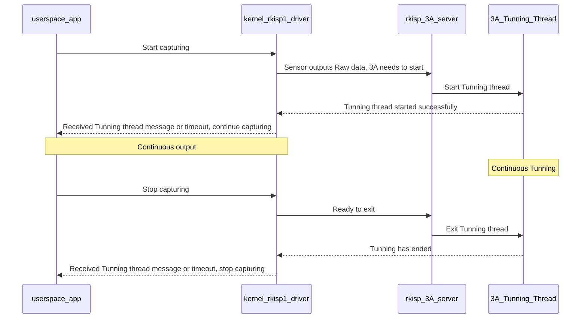
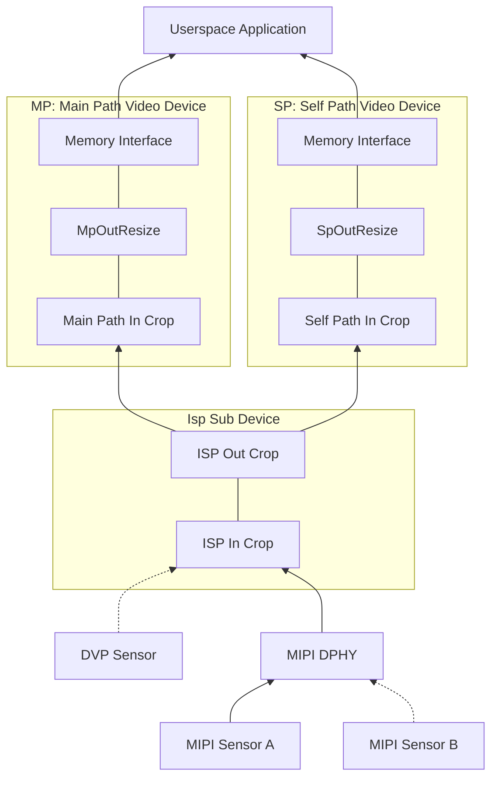

# Rockchip Linux 4.4 Camera Development Guide

Document ID: RK-KF-YF-347

Release Version: V2.0.0

Date: 2020-03-18

Security Level: □Top-Secret   □Secret   □Internal   ■Public

**DISCLAIMER**

THIS DOCUMENT IS PROVIDED "AS IS". ROCKCHIP ELECTRONICS CO., LTD. ("ROCKCHIP") DOES NOT PROVIDE ANY WARRANTY OF ANY KIND, EXPRESSED, IMPLIED OR OTHERWISE, WITH RESPECT TO THE ACCURACY, RELIABILITY, COMPLETENESS, MERCHANTABILITY, FITNESS FOR ANY PARTICULAR PURPOSE OR NON-INFRINGEMENT OF ANY REPRESENTATION, INFORMATION AND CONTENT IN THIS DOCUMENT. THIS DOCUMENT IS FOR REFERENCE ONLY. THIS DOCUMENT MAY BE UPDATED OR CHANGED WITHOUT ANY NOTICE AT ANY TIME DUE TO THE UPGRADES OF THE PRODUCT OR ANY OTHER REASONS.

**Trademark Statement**

"Rockchip", "Rockchip", "Rockchip" shall be Rockchip's registered trademarks and owned by Rockchip. All the other trademarks or registered trademarks mentioned in this document shall be owned by their respective owners.

**All rights reserved. ©2020. Rockchip Electronics Co., Ltd.**

Beyond the scope of fair use, neither any entity nor individual shall extract, copy, or distribute this document in any form in whole or in part without the written approval of Rockchip.

Rockchip Electronics Co., Ltd.

Address: No. 18, Area A, Software Park, Tongpan Road, Fuzhou, Fujian Province

Website:     [www.rock-chips.com](http://www.rock-chips.com)

Customer service Tel: +86-4007-700-590

Customer service Fax: +86-591-83951833

Customer service e-Mail: [fae@rock-chips.com](mailto:fae@rock-chips.com)

---

**Preface**

**Overview**

This document mainly introduces the ISP and CIF driver structure for Rockchip series chips, as well as how to write/port Sensor drivers, upper-layer debugging methods, application development interfaces, 3A integration, etc.
The ISP, CIF and Sensor drivers described in this document all comply with V4L2 standards as much as possible, providing compatible and adaptive interfaces. At the same time, it simplifies the difficulty of writing and porting Sensor drivers as much as possible. However, users still need to understand the use of V4L2 tools and related concepts.

**Product Versions**

| **Chip Name** | **Kernel Version** | **ISP Support** | **CIF Support** |
| :----------- | :----------- | :-------------- | :-------------- |
| RK3399       | 4.4          | Yes, two        | No              |
| RK3326/PX30  | 4.4          | Yes, one        | Yes, one        |
| RK3288       | 4.4          | Yes, one        | Yes, one        |
| RK312x/PX3SE | 4.4          | No              | Yes, one        |
| RK180x       | 4.4          | Yes, one        | Yes, one        |

**Intended Audience**

This document (guide) is mainly applicable to the following engineers:

Technical Support Engineers

Software Development Engineers

**Revision History**

| **Version** | **Author** | **Date**   | **Description**                        |
| ---------- | -------- | :----------- | ------------ |
| V1.0.0     | ZhengSQ  | 2018-07-10   | Initial version                        |
| V2.0.0     | ZhengSQ  | 2020-03-18   | Added application interfaces, updated 3A application methods,<br/>adjusted chapter order, corrected errors |

---

**Table of Contents**

[TOC]

---

## Historical Version Introduction and Terminology

### Terminology

- 3A, refers to auto focus (AF), auto exposure (AE) and auto white balance (AWB) algorithms, or the 3A algorithm dynamic link library provided by RK
- Async Sub Device, refers to V4L2 sub devices registered asynchronously under the Media Controller structure, such as Sensor, MIPI DPHY
- Bayer Raw, also written as Raw Bayer, refers to frame formats such as RGGB, BGGR, GBRG, GRBG output by the device (Sensor or ISP)
- Buildroot, refers to a series of Linux SDKs released by Rockchip based on Buildroot
- Camera, generally refers to the complete system composed of VIP or ISP in Rockchip chips and their connected Sensors, as well as their drivers
- CIF, refers to the VIP module in RK chips, used to receive Sensor data and save it to Memory, only transfers data, no ISP function
- DVP, a parallel data transmission interface, i.e. Digital Video Port
- Entity, refers to each node under the Media Controller framework
- FCC, FourCC, refers to Four Character (FCC) codes, which are image formats represented by 4 characters in the Linux Kernel, see the FourCC chapter for details
- HSYNC, refers to the horizontal sync signal of the DVP interface
- ISP, Image Signal Processing, used to receive and process images. In this document, it refers to both the hardware itself and the ISP driver
- IOMMU, Input-Output Memory Management Unit, refers to the IOMMU module in Rockchip series chips, used to map physically scattered memory pages into contiguous memory visible to CIF and ISP. In this document, it refers to both the hardware itself and the IOMMU driver
- IQ, Image Quality, refers to the IQ xml debugged for Bayer Raw Camera, used for 3A tuning
- Media Controller, a media framework in the Linux kernel, mainly used for topology management
- MIPI, refers to the MIPI protocol in this document
- MIPI-DPHY, refers to the MIPI-DPHY protocol, or the controller conforming to the MIPI-DPHY protocol in Rockchip chips
- MP, i.e. Main Path, refers to an output node of the Rockchip ISP driver, which can output high-resolution images, generally used for taking photos and capturing Raw images
- PCLK, refers to the Sensor output Pixel Clock
- Pipeline, refers to the link formed by the interconnection of various Entities of the Media Controller
- RKCIF, refers to the driver name of CIF
- RKISP1, refers to the driver name of ISP
- SP, i.e. Self Path, refers to an output node of the Rockchip ISP driver, which can only output up to 1080p resolution
- Userspace, i.e. Linux user space (as opposed to Linux kernel space)
- V4L2, i.e. Video4Linux2, the video processing module of the Linux kernel
- VIP, Video Input Processor in Rockchip chips, formerly used as an alias for CIF
- VSYNC, refers to the vertical sync signal of the DVP interface

### Historical Versions of ISP and CIF Drivers

The RKISP1 and RKCIF drivers described in this document are based on Media Controller, V4L2 Framework, VB2, and the Sensor is registered asynchronously as an Async Sub Device. Their code is located in `drivers/media/platform/rockchip/isp1/` and `drivers/media/platform/rockchip/cif/` directories respectively; Sensor code is located in the `drivers/media/i2c` directory.

Other older versions are no longer maintained or supported. The details are as follows:

| **Driver Name** | **Type** | **Kernel** | **Within Scope** | **Code Location**                           |
| :----------- | :------- | :--------- | :----------------- | :----------- |
| RKISP1       | ISP      | 4.4        | Yes                | drivers/media/platform/rockchip/isp1 |
| RKCIF        | CIF      | 4.4        | Yes                | drivers/media/platform/rockchip/cif  |
| RK-ISP10     | ISP      | 4.4        | No                 | drivers/media/platform/rk-isp10/     |
| RK-CAMSYS    | CIF      | 4.4        | No                 | drivers/media/video                  |

### FAQ Document

To facilitate customers in quickly debugging Sensors, there is a corresponding FAQ document titled *Rockchip_Trouble_Shooting_Linux4.4_Camera_CN*. It is generally located in the same directory as this document.

## Sensor Driver Development and Porting

The Sensor driver is located in the `drivers/media/i2c` directory. Note that this chapter describes Sensor drivers with Media Controller attributes, so drivers under the `drivers/media/i2c/soc_camera` directory are not applicable.
The Sensor driver is largely independent from the RKCIF or RKISP1 driver. Both are registered asynchronously, and their connection relationship is declared via `remote-endpoint` in the dts. Therefore, the Sensor driver described in this chapter is applicable to both RKCIF and RKISP1.
Under the Media Controller structure, the Sensor generally acts as a Sub Device and connects to Rkcif, Rkisp1 or Mipi Dphy driver via Pads. This chapter mainly introduces the Sensor driver code, dts configuration, and how to debug the Sensor driver.

This chapter summarizes Sensor driver development and porting into 5 parts:

- Write the power-on sequence according to the datasheet, mainly including vdd, reset, powerdown, clk, etc.
- Configure the Sensor registers to output the required resolution and format
- Write the callback functions required by `struct v4l2_subdev_ops`, generally including set_fmt, get_fmt, s_stream, s_power
- Add v4l2 controller to set parameters such as fps, exposure, gain, test pattern
- Write the probe() function and add Media Control and Sub Device initialization code

As a good practice, after completing driver coding, corresponding Documentation should also be added. Refer to `Documentation/devicetree/bindings/media/i2c/`. This allows board-level dts to be quickly configured according to the documentation.

In board-level dts, referencing the Sensor driver generally requires:

- Configuring the correct clk and io mux
- Setting the regulator and gpio required for the power-on sequence according to the schematic
- Adding a port child node to establish a connection with cif or isp

This chapter uses ov5695 and ov2685 as examples to analyze the Sensor driver.

### Power-On Sequence

Different Sensors have different power-on timing requirements. For example, most OV Sensors do not have strict timing requirements - as long as mclk, vdd, reset and powerdown are in the correct state, I2C communication can proceed correctly and images can be output, without needing to care about the power-on sequence or delays. However, a small number of Sensors have very strict power-on requirements, such as the OV2685 which must strictly follow the power-on timing.

In the DataSheet provided by the Sensor manufacturer, there is generally a power-on timing diagram - just configure it in sequence. Taking `drivers/media/i2c/ov5695.c` as an example, `__ov5695_power_on()` is used to power on the Sensor. The code is as follows (abbreviated).

```c
static int __ov5695_power_on(struct ov5695 *ov5695)
{
	int ret;
	u32 delay_us;
	struct device *dev = &ov5695->client->dev;

	ret = clk_set_rate(ov5695->xvclk, OV5695_XVCLK_FREQ);

	if (clk_get_rate(ov5695->xvclk) != OV5695_XVCLK_FREQ)
		dev_warn(dev, "xvclk mismatched, modes are based on 24MHz\n");
	ret = clk_prepare_enable(ov5695->xvclk);

	if (!IS_ERR(ov5695->reset_gpio))
		gpiod_set_value_cansleep(ov5695->reset_gpio, 1);

	ret = regulator_bulk_enable(OV5695_NUM_SUPPLIES, ov5695->supplies);

	if (!IS_ERR(ov5695->reset_gpio))
		gpiod_set_value_cansleep(ov5695->reset_gpio, 0);

	if (!IS_ERR(ov5695->pwdn_gpio))
		gpiod_set_value_cansleep(ov5695->pwdn_gpio, 1);

	/* 8192 cycles prior to first SCCB transaction */
	delay_us = ov5695_cal_delay(8192);
	usleep_range(delay_us, delay_us * 2);

	return 0;
}

```

The power-on sequence of OV5695 is briefly described as follows:

- First provide xvclk (i.e. mclk)
- Then enable the reset pin
- Power on each vdd. `regulator_bulk` is used here because vdd, vodd, avdd have no strict order. If there are strict requirements between vdds, they need to be handled separately. Refer to the OV2685 driver code
- Set Sensor Reset and powerdown pin to working state. Reset and powerdown may only need one. Configure according to actual needs based on Sensor package and hardware schematic
- Finally, according to OV5695 timing requirements, delay 8192 clk cycles before the power-on is complete

Note that although many Sensors can work normally without following the datasheet power-on requirements, operating according to the manufacturer's recommended timing is undoubtedly the most reliable.

Similarly, the datasheet will also include a Power Down Sequence, which also needs to be implemented as required.

#### Checking if Power-On Sequence is Correct

In the .probe() stage, it attempts to read the chip id, such as `ov5695_check_sensor_id()` for ov5695. If the chip id can be read correctly, the power-on sequence is generally considered correct and the Sensor can communicate via i2c normally.

### Sensor Initialization Register List

In OV5695 and OV2685, `struct ov5695_mode` and `struct ov2685_mode` are defined respectively to represent different initialization modes of the Sensor, meaning the Sensor can output images at different resolutions, different fps, etc. A Mode can include resolution, Mbus Code, fps, register initialization list, etc.
For the register initialization list, fill in directly as provided by the manufacturer. Note that the end of the list uses `REG_NULL` to indicate termination. **Be careful that REG_NULL does not conflict with register addresses**.

### v4l2_subdev_ops Callback Functions

v4l2_subdev_ops callback functions are the core of the logical control in the Sensor driver. The callback functions include a rich set of interfaces. For details, refer to the kernel code `include/media/v4l2-subdev.h`. It is recommended that the Sensor driver includes at least the following callback functions:

- .open(), Called when Userspace opens the /dev/v4l-subdev? node. .open() must be implemented when the upper layer needs to set controls for the sensor independently
- .s_power(), Includes power on and power off. Power on or off here
- .s_stream(), i.e. set stream. Includes stream on and stream off. Generally configure registers here to output images
- .enum_mbus_code(), Enumerate the mbus_codes supported by the driver
- .enum_frame_size(), Enumerate the resolutions supported by the driver
- .get_fmt(), Return the currently selected format/size of the Sensor. If .get_fmt() is missing, the media-ctl tool cannot view the currently configured format of the sensor entity
- .set_fmt(), Set the Sensor format/size

Among the above callbacks, .s_power() and .s_stream() are more complex. In the ov5695 driver code, pm_runtime is used to manage power. In .s_stream(), `v4l2_ctrl_handler_setup()` is used to actually configure the control information (v4l2 control may be updated when the sensor is powered off) and write to registers.

### V4l2 Controller

For scenarios that require dynamically updating exposure, gain, blanking, the v4l2 controller part is necessary. Generally, Raw Bayer Sensors require it.

In the OV5695 driver code:

- `ov5695_initialize_controls()`, used to declare which controls are supported and set information such as min/max values
- `struct v4l2_ctrl_ops`, specifies the `ov5695_set_ctrl()` callback function to respond to upper-layer settings

### Probe Function and Registering Media Entity, v4l2 subdev

In the Probe function, first parse the dts to obtain regulator, gpio, clk and other information for powering the sensor on/off. Then register the media entity, v4l2 subdev, and v4l2 controller information. Note that v4l2 subdev registration is asynchronous. The following are several key function calls:

- `v4l2_i2c_subdev_init()`, Register as a v4l2 subdev, providing callback functions in parameters
- `ov5695_initialize_controls()`, Initialize v4l2 controls
- `media_entity_init()`, Register as a media entity. OV5695 has only one output, i.e. Source Pad
- `v4l2_async_register_subdev()`, Declare that the Sensor needs asynchronous registration. Since both RKISP1 and RKCIF use asynchronous Sub Device registration, this call is necessary

### dts Example: MIPI Sensor

According to the hardware design, mainly configure pinctl (iomux), clk, gpio, remote port.
The following example is the OV5695 dts node in rk3326-evb-lp3-v10-linux.dts.

```
	ov5695: ov5695@36 {
		compatible = "ovti,ov5695";
		reg = <0x36>;

		clocks = <&cru SCLK_CIF_OUT>;
		clock-names = "xvclk";

		avdd-supply = <&vcc2v8_dvp>;
		dovdd-supply = <&vcc1v8_dvp>;
		dvdd-supply = <&vdd1v5_dvp>;

		/*reset-gpios = <&gpio2 14 GPIO_ACTIVE_HIGH>;*/
		pwdn-gpios = <&gpio2 14 GPIO_ACTIVE_HIGH>;

		rockchip,camera-module-index = <0>;
		rockchip,camera-module-facing = "back";
		rockchip,camera-module-name = "TongJu";
		rockchip,camera-module-lens-name = "CHT842-MD";

		port {
			ucam_out: endpoint {
				remote-endpoint = <&mipi_in_ucam>;
				data-lanes = <1 2>;
			};
		};
	};

```

Notes:

- pinctrl, Initialize necessary pin iomux. This example includes reset pin initialization and clk iomux
- clock, Specify the clock named xvclk (the driver will look up the clock named xvclk), i.e. 24M clock
- vdd supply, The three power supplies required by OV5695
- port child node, Defines an endpoint, declaring that a connection needs to be established with mipi_in_wcam. Similarly, mipi dphy will reference wcam_out
- data-lanes specifies that OV5695 uses two lanes. **In the wcam_out node, data-lanes needs to match**

### dts Example: DVP Sensor

Compared to MIPI Sensor, the DVP Sensor dts does not need to configure data-lanes, the endpoint links to cif, and the rest is the same.

Take gc2155 in `arch/arm64/boot/dts/rockchip/rk3326-evb-lp3-v10-linux.dts` as an example:

- In the gc2155 dts node, remote-endpoint points to cif_in
- No need to configure data-lanes parameter

### Sensor Debugging

After completing the Sensor driver porting, check whether it works normally.

**If you encounter problems during debugging, first check the FAQ document.**

#### Whether the Sensor is Registered Successfully

The first key point in Sensor debugging is whether i2c communication is successful and whether the chip id check is correct. If so, it indicates that the power-on sequence is fine. In the driver, relevant log messages are generally printed. Different Sensors have different logs, so no further examples are given here.
Use `media-ctl` to get the topology structure and check whether the Sensor has been registered as an entity. If so, it means the Sensor has been registered successfully.

#### Whether Capturing Produces Output

Obtain images using capture tools such as `v4l2-ctl`, `gstreamer`, camera app, etc.

#### Check if Controls are Effective

Use v4l2-ctl to set related parameters such as gain, exposure, blanking and generate images to check if the sensor controls are effective. For example, does increasing gain or exposure increase image brightness; does increasing blanking decrease the frame rate.

## Debugging Tools and Common Commands

This chapter mainly introduces common image capture tools.
**Since most commands are quite long, the escape character '\' is used to split a single command into multiple lines for readability. Users can directly copy and paste. However, if the user puts the command on a single line, please remove the escape character '\'.**

### v4l-utils

In the Linux SDK released by Rockchip, the v4l-utils package is integrated by default. Users can enable or disable the v4l-utils package through the buildroot compilation switch. For example:

```shell
# grep -rn LIBV4L_UTILS -- buildroot/configs/rockchip/camera.config
BR2_PACKAGE_LIBV4L_UTILS=y
```

Users can also obtain the source code from the official website at www.linuxtv.org for compilation.

The v4l-utils package can be installed directly via the apt tool on Ubuntu systems, as follows:

```shell
# sudo apt-get install v4l-utils
```

### Using media-ctl to View Topology

media-ctl is a tool in the v4l-utils package, mainly used to view and configure the information of each Entity in the Media Framework, such as format, crop, link enable, etc. Using this tool can more flexibly extend Camera functionality.

**For common application scenarios, users do not need to configure specific Entity information - just use the defaults.**

#### Display Topology

Use the following command to display the topology. Note, **when both cif and isp are enabled, or when multiple isps are enabled, or when a usb camera is plugged in, there may be multiple media devices, such as /dev/media0, /dev/media1, /dev/media2.**

```shell
# media-ctl -p -d /dev/media0
```

For developers, the main concern is whether the Sensor Entity is found. **If the Sensor Entity is not found, it means the Sensor registration has a problem. Please debug according to the FAQ document.**

For example, after connecting an ov5695 camera to the RK3326 SDK board, the following output can be seen (abbreviated).

```shell
# media-ctl -p -d /dev/media1
- entity 9: m00_b_ov5695 2-0036 (1 pad, 1 link)
            type V4L2 subdev subtype Sensor flags 0
            device node name /dev/v4l-subdev2
        pad0: Source
                [fmt:SBGGR10_1X10/2592x1944@10000/300000 field:none]
                -> "rockchip-mipi-dphy-rx":0 [ENABLED,DYNAMIC]
```

From the ov5695 entity information, we can see:

- The full name of this Entity is: `m00_b_ov5695 2-0036`
- It is a `V4L2 subdev` (Sub-Device) `Sensor`
- Its corresponding node is `/dev/v4l-subdev2`, which can be opened by applications (such as v4l2-ctl) for configuration
- It has only one output (`Source`) node, denoted as `pad0`
- Its output format is `[fmt:SBGGR10_1X10/2592x1944@10000/300000 field:none]`, where SBGGR10_1X10 is an abbreviation for mbus-code. The next section will list common mbus-codes
- Its Source pad0 is linked (`->`) to `"rockchip-mipi-dphy-rx"`'s `pad0` and the current status is `ENABLED`. `DYNAMIC` means the status can be changed to DISABLED

If the same ISP or CIF is connected to two Sensors simultaneously, only one is ENABLED, as shown in this example (abbreviated).

```
[root@rk3326_64:/]# media-ctl -p -d /dev/media1
- entity 9: irs16x5c 1-003d (1 pad, 1 link)
            type V4L2 subdev subtype Sensor flags 0
            device node name /dev/v4l-subdev2
        pad0: Source
                [fmt:SBGGR12_1X12/224x1557@10000/300000 field:none]
                -> "rockchip-mipi-dphy-rx":0 [ENABLED,DYNAMIC]

- entity 10: irs16x5c 2-003d (1 pad, 1 link)
             type V4L2 subdev subtype Sensor flags 0
             device node name /dev/v4l-subdev3
        pad0: Source
                [fmt:SBGGR12_1X12/224x1557@10000/300000 field:none]
                -> "rockchip-mipi-dphy-rx":0 [DYNAMIC]

```

In the above example:

- Both Sensors irs16x5c are connected to "rockchip-mipi-dphy-rx":0, but only entity 9 is ENABLED
- If you need to switch Sensors, the operation needs to be performed when the entire link is stopped, i.e., you cannot change the configuration of each Entity in the pipeline during image capture

#### Switching Sensors

If multiple Sensors are connected, you can switch between them using the following command.

```shell
# media-ctl -d /dev/media0 \
    -l '"ov5695 7-0036":0->"rockchip-sy-mipi-dphy":0[0]'
# media-ctl -d /dev/media0 \
    -l '"ov2685 7-003c":0->"rockchip-sy-mipi-dphy":0[1]'
```

- The command format is `media-ctl -l "entity name":pad->"entity name":pad[Status]`
- The entire link needs to be in single quotes because it contains special characters: > [ ]
- Entity names need double quotes because they contain spaces
- Status uses 0 or 1 to indicate Active or In-Active

#### Modifying Entity Format and Size

Example 1: OV5695 supports output at multiple resolutions, default is 2592x1944. Change the output resolution to 1920x1080.

```shell
# media-ctl -d /dev/media1 \
    --set-v4l2 '"m00_b_ov5695 2-0036":0[fmt:SBGGR10_1X10/1920x1080]'
```

After modifying the OV5695 output, the rkisp1-isp-subdev size and video device crop also need to be modified accordingly, because the size of the subsequent stage cannot be larger than that of the previous stage.

```shell
# media-ctl -d /dev/media1 \
    --set-v4l2 '"rkisp1-isp-subdev":0[fmt:SBGGR10_1X10/1920x1080]'
# media-ctl -d /dev/media1 \
    --set-v4l2 '"rkisp1-isp-subdev":0[crop:(0,0)/1920x1080]'
# media-ctl -d /dev/media1 \
    --set-v4l2 '"rkisp1-isp-subdev":2[crop:(0,0)/1920x1080]'
# v4l2-ctl -d /dev/video1 \
    --set-selection=target=crop,top=0,left=0,width=1920,height=1080
```

Example 2: For raw bayer sensors, rkisp1 outputs yuv format by default. Modify the fmt of rkisp1-isp-subdev to the Sensor's fmt to allow the MP node to output raw images.

```
# media-ctl -d /dev/media1 \
    --set-v4l2 '"rkisp1-isp-subdev":2[fmt:SBGGR10/2592x1944]'
```

Some notes on the above examples:

- Pay attention to special characters; use single or double quotes
- Make sure not to miss or add extra spaces in the quotes
- Use `media-ctl --help` for more detailed usage help

#### Common mbus-code Formats

Mbus-code, full name Media Bus Pixel Codes, describes the format used for transmission on the physical bus, such as the image format transmitted from the sensor to the isp via mipi dphy, or the format transmitted between sub-modules inside the ISP. It is important to distinguish Mbus-code from FourCC; the latter refers to the image format stored in Memory.

Mbus-code is defined in `include/uapi/linux/media-bus-format.h` in the kernel.

The following table lists several mbus-codes commonly used in this document.

| **Macro defined in Kernel** | **Mbus-code abbreviation** | **Type**  | **Bpp** | **Bus width** | **Samples** |
| :------------------------- | :-------          | :-------  | :------ | :------------ | :---------- |
| MEDIA_BUS_FMT_SBGGR8_1X8   | SBGGR8_1X8        | Bayer Raw | 8       | 8             | 1           |
| MEDIA_BUS_FMT_SRGGB8_1X8   | SRGGB8_1X8        | Bayer Raw | 8       | 8             | 1           |
| MEDIA_BUS_FMT_SBGGR10_1X10 | SBGGR10_1X10      | Bayer Raw | 10      | 10            | 1           |
| MEDIA_BUS_FMT_SRGGB10_1X10 | SRGGB10_1X10      | Bayer Raw | 10      | 10            | 1           |
| MEDIA_BUS_FMT_SBGGR12_1X12 | SBGGR12_1X12      | Bayer Raw | 12      | 12            | 1           |
| MEDIA_BUS_FMT_SRGGB12_1X12 | SRGGB12_1X12      | Bayer Raw | 12      | 12            | 1           |
| MEDIA_BUS_FMT_YUYV8_2X8    | YVYU8_2X8         | YUV 422   | 16      | 8             | 2           |
| MEDIA_BUS_FMT_UYUV8_2X8    | UYUV8_2X8         | YUV 422   | 16      | 8             | 2           |
| MEDIA_BUS_FMT_Y8_1X8       | Y8_1X8            | YUV GREY  | 8       | 8             | 1           |
| MEDIA_BUS_FMT_RGB888_1X24  | RGB888_1X24       | RGB 888   | 24      | 24            | 1           |

media-ctl can list all supported mbus codes.

```shell
# media-ctl --known-mbus-fmts
```

#### Finding Video Devices

There are multiple Entities in the topology structure - some are sub devices and some are video devices. The former corresponds to the /dev/v4l-subdev device node, while the latter corresponds to /dev/video. Among the multiple video devices, users most often care about which device can output images.

```shell
# media-ctl -d /dev/media1 -e "rkisp1_selfpath"
/dev/video2
# media-ctl -d /dev/media1 -e "rkisp1_mainpath"
/dev/video1
```

The above two commands respectively show the device paths for the SP and MP nodes of RKISP1 in the /dev/media1 link. RKISP1 has two video output devices, both capable of outputting images.

If using RKCIF, similarly:

```shell
# media-ctl -d /dev/media0 -e "stream_cif"
/dev/video0
```

The above command shows the video device path for RKCIF in the /dev/media0 link. RKCIF has only one video output node.

```shell
# v4l2-ctl -d /dev/video1 --all
```

The above command displays some main parameters of /dev/video1, such as crop, fmt, v4l2 controls, etc.

### Using v4l2-ctl to Capture Images

The media-ctl tool operates through media devices such as /dev/media0, managing the format, size, and links of each node in the Media topology. The v4l2-ctl tool operates on video devices such as /dev/video0, /dev/video1, performing a series of operations like set_fmt, reqbuf, qbuf, dqbuf, stream_on, stream_off on video devices. This document mainly uses v4l2-ctl for capturing frame data, setting exposure, gain, VTS and other v4l2_controls.

It is recommended to first view the v4l2-ctl help documentation. The help documentation is extensive and divided into many parts. We are mainly concerned with the streaming and vidcap sections.

View a summary of the help documentation as follows:

```shell
# v4l2-ctl --help
```

View the full help documentation (relatively extensive) as follows:

```shell
# v4l2-ctl --help-all
```

View parameters related to streaming as follows:

```shell
# v4l2-ctl --help-streaming
```

View parameters related to vidcap as follows. It mainly includes get-fmt, set-fmt, etc.

```shell
# v4l2-ctl --help-vidcap
```

#### Capturing Frames with v4l2-ctl

Example 1: Capture 1 frame of NV12 data output by RKCIF, save to /tmp/nv12.bin, resolution 640x480. Before saving data, discard the first 3 frames (i.e., the first 3 frames are returned to userspace but not saved to file).

```shell
# v4l2-ctl -d /dev/video0 \
    --set-fmt-video=width=640,height=480,pixelformat=NV12 \
    --stream-mmap=3 \
    --stream-skip=3 \
    --stream-to=/tmp/nv12.bin \
    --stream-count=1 \
    --stream-poll
```

Example 2: Capture 10 frames of NV12 data output by RKISP, save to /tmp/nv12.bin, resolution 1920x1080.

```shell
# v4l2-ctl -d /dev/video1 \
    --set-selection=target=crop,top=0,left=0,width=1920,height=1080 \
    --set-fmt-video=width=1920,height=1080,pixelformat=NV12 \
    --stream-mmap=3 \
    --stream-to=/tmp/nv12.bin \
    --stream-count=10 \
    --stream-poll
```

Parameter descriptions:

- -d, Specify the operation target as /dev/video0 device
- --set-selection, Specify cropping of the input image. Especially when the upstream size of RKISP1 changes, ensure selection does not exceed the upstream output size. For RKCIF, cropping is set via the --set-crop parameter
- --set-fmt-video, Specify width, height and pixelformat (expressed in FourCC). NV12 is the pixelformat expressed in FourCC
- --stream-mmap, Specify the buffer type as mmap, i.e., buffers allocated by the kernel that are physically contiguous or mapped via iommu
- --stream-skip, Specify to discard (not save to file) the first 3 frames
- --stream-to, Specify the file path to save frame data
- --stream-count, Specify the number of frames to capture, excluding those discarded by --stream-skip
- --stream-poll, This option instructs v4l2-ctl to use asynchronous I/O, i.e., use select to wait for frame data completion before dqbuf, ensuring dqbuf does not block. Otherwise, dqbuf will block until a data frame arrives

#### Setting Exposure, Gain and Other Controls

If the Sensor driver implements v4l2 controls, you can set parameters such as exposure and gain via v4l2-ctl before capturing images.
RKCIF or RKISP will inherit the sub device's controls, so the Sensor's v4l2 controls can be seen via /dev/video3.

Below are the OV5695 related settings viewed on an RK3326 SDK board, including exposure, gain, blanking, test_pattern, etc.

```shell
# v4l2-ctl -d /dev/video1 -l

User Controls

          exposure 0x00980911 (int) : min=4 max=2228 step=1 default=1104 value=1104
              gain 0x00980913 (int) : min=0 max=16383 step=1 default=1024 value=1024

Image Source Controls

 vertical_blanking 0x009e0901 (int) : min=1152 max=31687 step=1 default=1152 value=1152
     analogue_gain 0x009e0903 (int) : min=16 max=248 step=1 default=248 value=248

Image Processing Controls

      test_pattern 0x009f0903 (menu): min=0 max=4 default=0 value=0

```

These controls can be modified with v4l2-ctl. For example, modify exposure and analogue_gain as follows:

```shell
# v4l2-ctl -d /dev/video3 --set-ctrl 'exposure=1216,analogue_gain=10'
```

#### Capturing Raw Images

The MP node of RKISP1 can capture Raw images. In this case, the ISP is in bypass state and does not modulate the data.

Example: Capture the Raw Bayer data output by Sensor OV5695. Format is SBGGR10_1X10, size 2592x1944.

```shell
# media-ctl -d /dev/media0 \
    --set-v4l2 '"ov5695 7-0036":0[fmt:SBGGR10_1X10/2592x1944]'
# media-ctl -d /dev/media0 \
    --set-v4l2 '"rkisp1-isp-subdev":0[fmt:SBGGR10_1X10/2592x1944]'
# media-ctl -d /dev/media0 \
    --set-v4l2 '"rkisp1-isp-subdev":0[crop:(0,0)/2592x1944]'
# media-ctl -d /dev/media0 \
    --set-v4l2 '"rkisp1-isp-subdev":2[fmt:SBGGR10_1X10/2592x1944]'
# media-ctl -d /dev/media0 \
    --set-v4l2 '"rkisp1-isp-subdev":2[crop:(0,0)/2592x1944]'
# v4l2-ctl -d /dev/video4 \
    --set-ctrl 'exposure=1216,analogue_gain=10' \
    --set-selection=target=crop,top=0,left=0,width=2592,height=1944 \
    --set-fmt-video=width=2592,height=1944,pixelformat=BG10 \
    --stream-mmap=3 \
    --stream-to=/tmp/mp.raw.out \
    --stream-count=1 \
    --stream-poll
```

Notes:

- Line 4: media-ctl sets the isp-subdev output format to match the sensor
- Lines 3 and 5: set crop to match the Sensor size, i.e., no cropping
- Line 6: If the image is too dark, adjust expo/gain to increase brightness (optional). The Sensor driver must implement this v4l2 control
- Lines 7 and 8: v4l2-ctl sets selection to no cropping, and output pixelformat FourCC is BG10
- Note that although the ISP does not process the Raw image, it still zero-pads the lower bits of the 10-bit data to 16 bits. Regardless of whether the Sensor inputs 10-bit or 12-bit, the upper layer always receives 16 bits per pixel

Add a PGM header to the Bayer Raw file to convert it to a pgm image that can be directly opened and viewed on Ubuntu. Just add three lines of PGM header.

Example: Convert raw image to pgm format for viewing.

```shell
# cat > /tmp/raw.pgm << EOF
P5
2592 1944
65535
EOF

# cat /tmp/mp.raw.out >> /tmp/raw.pgm
```

Notes:

- Line 2: P5 is a fixed identifier
- Line 3: Indicates the resolution of the Raw image, i.e., width and height, separated by a space
- Line 4: Indicates the depth, 65535 means 16-bit. For 8-bit, change to 255 accordingly
- Line 7: Append the raw data after the pgm file header
- Note that the pgm header has only three lines; do not add extra blank lines

#### Common FourCC Formats

FourCC, full name Four Character Codes, uses 4 characters (i.e., 32 bits) to name image formats. In the Linux Kernel, the macro is defined as follows:

```c
#define v4l2_fourcc(a,b,c,d) \
	(((__u32)(a)<<0)|((__u32)(b)<<8)|((__u32)(c)<<16)|((__u32)(d)<<24))
```

The format defined by FourCC is the format of image/video stored in memory. This should be distinguished from mbus-code.

The following lists several formats commonly used in this document. For more detailed definitions, refer to `videodev2.h` in the kernel code.

| **Macro defined in Kernel** | **FourCC** |
| :-----------             | :--------: |
| V4L2_PIX_FMT_NV12        | NV12       |
| V4L2_PIX_FMT_NV21        | NV21       |
| V4L2_PIX_FMT_NV16        | NV16       |
| V4L2_PIX_FMT_NV61        | NV61       |
| V4L2_PIX_FMT_NV12M       | NM12       |
| V4L2_PIX_FMT_YUYV        | YUYV       |
| V4L2_PIX_FMT_YUV420      | YU12       |
| V4L2_PIX_FMT_SBGGR10     | BG10       |
| V4L2_PIX_FMT_SGBRG10     | GB10       |
| V4L2_PIX_FMT_SGRBG10     | BA10       |
| V4L2_PIX_FMT_SRGGB10     | RG10       |
| V4L2_PIX_FMT_GREY        | GREY       |

### Displaying YUV Images with mplayer on Ubuntu

In the previous sections, some commands captured frame data and saved it to files. On the Ubuntu environment, mplayer can be used to parse and display them.

mplayer can be installed via apt as follows:

```shell
# sudo apt-get install mplayer
```

Display an NV12 image of size 640x480 as follows:

```shell
# W=640; H=480; mplayer /tmp/nv12.bin -loop 0 -demuxer rawvideo -fps 30 \
    -rawvideo w=${W}:h=${H}:size=$((${W}*${H}*3/2)):format=NV12
```

Display a YUYV image of size 640x480 as follows:

```shell
# W=640; H=480; mplayer /tmp/yuyv.bin -loop 0 -demuxer rawvideo -fps 30 \
    -rawvideo w=${W}:h=${H}:size=$((${W}*${H}*2)):format=YUY2
```

In the above examples:

- W and H are variables specifying width and height for convenient subsequent reference
- fps specifies the playback rate; if fps is 1, one frame is played per second
- size refers to the size per frame
- format specifies the format. `mplayer -rawvideo format=help` shows all supported formats

**On Windows, tools such as 7yuv can be used to parse images.**

### Using GStreamer

In the Linux SDK released by Rockchip, GStreamer can be used to preview Camera images and encode.

The v4l2src plugin can be used to obtain images from the video device. By default, `rkisp_3A_server` will also start for Tuning, so that images with normal brightness and color can be obtained.

#### Displaying Images with GStreamer

The following command can display Camera images on the screen.

```shell
# export LD_LIBRARY_PATH=$LD_LIBRARY_PATH:/usr/lib/gstreamer-1.0
# export XDG_RUNTIME_DIR=/tmp/.xdg
# gst-launch-1.0 v4l2src device=/dev/video1 ! \
    video/x-raw,format=NV12,width=2592,height=1944,framerate=30/1 ! kmssink
```

#### GStreamer Video and Image Encoding

The Linux SDK also includes hardware encoding. The following command can encode the Camera data stream and save it to a file.

```shell
# gst-launch-1.0 v4l2src device=/dev/video1 num-buffers=100 ! \
    video/x-raw,format=NV12,width=1920,height=1088,framerate=30/1 ! \
    videoconvert ! mpph264enc ! h264parse ! mp4mux ! \
    filesink location=/tmp/h264.mp4
```

```shell
# gst-launch-1.0 -v v4l2src device=/dev/video1 num-buffers=10 ! \
    video/x-raw,format=NV12,width=1920,height=1080 ! mppjpegenc ! \
    multifilesink location=/tmp/test%05d.jpg
```

Notes:

- mppjpegenc and mpph264enc encoders are hardware encoders provided by the rockchipmpp plugin
- mpp encoder requires height to be 16-aligned, so the kernel needs to include the patch: `fea937b015e7 media: rockchip: isp1/cif: set height alignment to 16 in queue_setup`

### Headless Board Debugging

The Rockchip Linux SDK provides librkuvc.so, which allows the board to be used as a uvc camera connected to a PC via usb otg.

The application development section provides example code for reference.

### Enabling Debug Switches

The RKISP1 or RKCIF drivers contain some v4l2_dbg() logs, which can be enabled via commands as follows:

```shell
# echo 1 > /sys/module/video_rkcif/parameters/debug
```

or

```shell
# echo 1 > /sys/module/video_rkisp1/parameters/debug
```

In addition, VB2 and V4L2 also have corresponding debug switches.

Enable VB2 related logs as follows:

```shell
# echo 7 > /sys/module/videobuf2_core/parameters/debug
```

VB2 logs mainly include buffer rotation, such as reqbuf, qbuf, dqbuf and buffer status changes. Note that the vb2 module switch is a global switch; logs from other modules using vb2 (such as VPU/ISP, etc.) will also be enabled.

Enable V4L2 related logs, such as ioctl calls. The following command enables all V4L2 related logs:

```shell
# echo 0x1f > /sys/class/video4linux/video0/dev_debug
```

You can also enable only a subset of logs. The following Kernel macros define which logs each bit enables. Just enable the bits corresponding to the logs you need. These macros are defined in the kernel header file `include/media/v4l2-ioctl.h`.

```c
/* Just log the ioctl name + error code */
#define V4L2_DEV_DEBUG_IOCTL            0x01
/* Log the ioctl name arguments + error code */
#define V4L2_DEV_DEBUG_IOCTL_ARG        0x02
/* Log the file operations open, release, mmap and get_unmapped_area */
#define V4L2_DEV_DEBUG_FOP              0x04
/* Log the read and write file operations and the VIDIOC_(D)QBUF ioctls */
#define V4L2_DEV_DEBUG_STREAMING        0x08
/* Log poll() */
#define V4L2_DEV_DEBUG_POLL             0x10
```

## 3A Integration Method

This section applies only to RKISP1. RKCIF does not have ISP functionality and does not require 3A.

To support 3A, various methods have been added in previous versions, such as:

- Providing the librkisp.so library for application linking
- Writing rkisp and rkv4l2src gstreamer plugins to support GStreamer

However, these methods are cumbersome for applications and not well suited for adapting existing programs such as VLC or Chrome browsers.

After RKISP1 driver v0.1.5 and camera_engine_rkisp v2.2.0, a new `rkisp_3A_server` process was added, which automatically triggers and completes 3A Tuning. As a result:

- Applications no longer need the 3A library librkisp.so and only handle the data stream
- The v4l2src plugin of GStreamer can be used directly; open-source tools such as vlc can also be used directly, and can obtain images with normal 3A

### Deploying rkisp_3A_server

This includes the Kernel RKISP1 driver, camera_engine_rkisp, and related startup scripts. If you have updated to the latest Rockchip Linux SDK, 3A is integrated by default. Its three main components are as follows:

- RKISP1 driver version v0.1.5 or newer. The version number is defined in `kernel/drivers/media/platform/rockchip/isp1/version.h`
- camera_engine_rkisp package updated to v2.2.0 or above. Path: `external/camera_engine_rkisp`
- Compilation script and auto-start script for camera_engine_rkisp. Path: `buildroot/package/rockchip/camera_engine_rkisp`

The files compiled from camera_engine_rkisp are as follows:

```
/usr/bin/rkisp_3A_server
/usr/lib/librkisp.so
/usr/lib/librkisp_api.so
/usr/lib/rkisp/
              ├── ae
              │   └── librkisp_aec.so
              ├── af
              │   └── librkisp_af.so
              └── awb
                  └── librkisp_awb.so
/etc/iqfiles/
/etc/init.d/S40rkisp_3A
```

Where:

- rkisp_3A_server, an executable file responsible for monitoring and starting 3A tuning as needed
- librkisp.so, implements the main interfaces of 3A, and calls the aec, af, awb libraries respectively. The latter do not have open source code
- iqfiles directory, stores the Sensor's iq parameters as xml files
- S40rkisp_3A, the startup script for rkisp_3A_server, starts automatically at boot

Rockchip provides a Debian system; apart from the different startup method, the logic is the same as the Linux SDK.

### Enabling rkisp_3A_server Log

Enable logs by declaring environment variables. For example, to enable AEC log:

```shell
# export persist_camera_engine_log=0x40
```

Add the above line to /etc/init.d/S40rkisp_3A, and the log will be saved to /var/log/messages. If there are many logs, the messages file will be split into multiple files, such as /var/log/messages.0, /var/log/messages.1. **When packaging logs, remember to package all logs. For example:**

```shell
# tar zcvf /tmp/camera-log.tar.gz /var/log/messages*
```

Logs can be enabled by module, as described below:

```
      bits:   31-28  27-24   23-20   19-16 15-12  11-8  7-4   3-0
      module: [u]    [u]    [xcore]  [ISP] [AF]   [AWB] [AEC] [NO]
             *[u] means unused now.
      each module log has following ascending levels:
             0: error
             1: warning
             2: info
             3: verbose
             4: debug
             5: low1
             6-7: unused, now the same as debug

```

**Please note: If the user needs to start rkisp_3A_server in the terminal and enable logs, because there are many logs, they should not be printed directly to a slow device (such as serial port, shell default output). It is recommended to redirect logs to a file. As shown below:**

```shell
# /etc/init.d/S40rkisp_3A stop
# export persist_camera_engine_log=0x40
# /usr/bin/rkisp_3A_server --mmedia=/dev/media0 > /tmp/log 2>&1
```

As shown above, first stop the service, set the environment variable, then manually execute the command to start rkisp_3A_server, and redirect logs to the /tmp/log file.

### XML Loading Acceleration

For products that require fast image display at boot, we provide an XML loading acceleration feature. Enable it via the macro definition:

```shell
# make menuconfig

 │ │ --- Rockchip BSP packages                                              │ │
 │ │ [*]  Rockchip Camera Engine for linux                                  │ │
 │ │ [*]   Rockchip Camera Engine 3A service run in booting                 │ │
 │ │        Specify a directory to store xml speed up bin (disabled)  --->  │ │
 │ │ ()    Rockchip Camera Engine IQ xml file                               │ │
```

Depending on whether rootfs is writable, select the `Specify a directory to store xml speed up bin` option.

```
             │ │                 (X) disabled                              │ │
             │ │                 ( ) /etc/iqfiles-db                       │ │
             │ │                 ( ) /userdata/iqfiles-db                  │ │
```

If rootfs is read-only, you can only select `/userdata/iqfiles-db`. This option specifies a directory for storing xml bin files, and the file system needs to be writable.

### rkisp_3A_server Execution Timing

The following shows the timing diagram of rkisp_3A_server.



## Application Development

Besides directly using v4l2-ctl, GStreamer, VLC, etc. to obtain and preview images, users can also write programs based on the V4L2 interface to obtain and process images.

**Applications can also link the librkisp.so library directly to obtain richer image information, such as:**

- Manually control exposure time and gain
- Set exposure metering weights for a specific area (spot metering)
- Obtain brightness statistics, such as average brightness of each area and the histogram of the entire image
- Control maximum fps and gain to improve image quality

The above functions require the application to link librkisp.so. Therefore, you need to stop the rkisp_3A_server process first, and let the application handle 3A initialization and startup on its own.

```shell
# /etc/init.d/S40rkisp_3A stop
```

Or directly delete S40rkisp_3A.

```shell
# rm /etc/init.d/S40rkisp_3A
```

### Using librkisp_api.so Interface

For quick usage, camera_engine_rkisp provides the rkisp_api interface, compiled as librkisp_api.so, which can be called directly. It also serves as a reference. Its main API is declared in the rkisp_api.h header file.

Example 1: Open and obtain a 1920x1080 image.

```c
int test_capture_mmap_quick()
{
    const struct rkisp_api_ctx *ctx;
    const struct rkisp_api_buf *buf;
    int count = 10;

    ctx = rkisp_open_device("/dev/video1", 0);
    if (ctx == NULL)
        return -1;

    rkisp_set_fmt(ctx, 1920, 1080, ctx->fcc);

    if (rkisp_start_capture(ctx))
        return -1;

    do {
        buf = rkisp_get_frame(ctx, 0);

        /* Deal with the buffer */

        rkisp_put_frame(ctx, buf);
    } while (count--);

    rkisp_stop_capture(ctx);
    rkisp_close_device(ctx);

    return 0;
}
```

In the above code, rkisp_3A_server is still needed for 3A tuning. If the application needs to obtain more 3A related information, simply modify the parameter when opening:

```c
    ctx = rkisp_open_device("/dev/video1", 1);
```

The obtained buf will contain more statistical information.

Example 2: Modify the Sensor resolution, for example, change the default output resolution of ov5695 to 1920x1080.

```c
    const struct rkisp_api_ctx *ctx;

    ctx = rkisp_open_device("/dev/video1", 0);
    if (ctx == NULL)
        return -1;
    rkisp_set_sensor_fmt(ctx, 1920, 1080, MEDIA_BUS_FMT_SBGGR10_1X10);
```

### Using DMA Buffer for Shared Memory

Sharing buffers between multiple modules can reduce memory copying and improve efficiency. DMA Buffer is one concrete method. DMA Buffer can share memory between Camera, RGA (image processing module), DRM (display), and MPP (encoding).

By default, rkisp_api uses mmap to allocate memory from the kernel. It can export memory to userspace as a DMA Buffer for use by other modules. Conversely, it can also accept DMA Buffers from other modules and write directly to the target buffer when the kernel captures data frames, thus avoiding one copy.

Example 1: Use MMAP to export DMA Buffer for other modules.

```c
    const struct rkisp_api_ctx *ctx;
    const struct rkisp_api_buf *buf;

    ctx = rkisp_open_device("/dev/video1", 0);
    if (ctx == NULL || rkisp_start_capture(ctx))
        return -1;

    rkisp_get_frame(ctx, 0);
    printf("size: %d, dmabuf fd: %d\n", buf->size, buf->fd);
```

In the above example, `buf->fd` is the DMA Buffer descriptor, which can be used directly by other modules. However, note:

- Before the buffer is fully used, do not call rkisp_put_frame()
- After the buffer is used, do not forget to call rkisp_put_frame()

Example 2: Use DMA Buffer from other modules. The kernel fills the captured Camera data directly into the target buffer.

```c
int test_capture_ext_dmabuf()
{
    ctx = rkisp_open_device("/dev/video1", 0);
    if (ctx == NULL)
        return -1;

    for (i = 0, ret = 0; i < buf_count; i++) {
        if (drmGetBuffer(dev.drm_fd, width, height, FORMAT, &buf[i]))
            goto out;
        dmabuf_fd[i] = buf[i].dmabuf_fd;
    }
    rkisp_set_fmt(ctx, width, height, ctx->fcc);
    rkisp_set_buf(ctx, buf_count, dmabuf_fd, buf[0].size);

    if (rkisp_start_capture(ctx))
        goto out;

    buf = rkisp_get_frame(ctx, 0);
    printf("The ext buf fd is: %d\n", buf->fd);
    rkisp_put_frame(ctx, buf);

    rkisp_stop_capture(ctx);

out:
    while (--i >= 0)
        drmPutBuffer(dev.drm_fd, &buf[i]);

    rkisp_close_device(ctx);
}
```

In the above example, `rkisp_set_buf()` provides the DRM DMA Buffer directly to the Camera. The Buffer is allocated through the drm interface. This mainly introduces the usage of the rkisp_api interface. The `drmGetBuffer()`, `drmPutBuffer()` and other functions are not detailed here.

### Setting Regional Exposure Weights

In some special scenarios, the default global exposure method may not produce the best results. Users can change the key metering area and increase the weight value of this area to achieve optimal brightness in that area. Of course, other areas may become overexposed or darker. For example:

- Face recognition under backlighting. Without HDR, backlighting makes the face area dark, which is not conducive to recognition. After detecting the face area, increase the weight of this area to make the face clearer
- Floor mopping robots identifying ground objects. The lower part of the image is what the application cares about, and due to differences in object reflectivity, the brightness of the upper and lower parts often differs significantly. The metering weight of the lower part of the image can be increased.

Example 1: Calling the weight setting interface.

```c
    unsigned char weights[] = {
         1,  1,  5,  9, 15, 31, 15,  5,  1,
         1,  1,  5,  9, 15, 31, 15,  5,  1,
         1,  1,  5,  9, 15, 31, 15,  5,  1,
         1,  1,  5,  9, 15, 31, 15,  5,  1,
         1,  1,  5,  9, 15, 31, 15,  5,  1,
         1,  1,  5,  9, 15, 31, 15,  5,  1,
         1,  1,  5,  9, 15, 31, 15,  5,  1,
         1,  1,  5,  9, 15, 31, 15,  5,  1,
         1,  1,  5,  9, 15, 31, 15,  5,  1,
    };
    rkisp_set_expo_weights(ctx, weights, 81);
```

In the above example, a 9x9 array is defined, each element has a value range of [1, 31], corresponding to 81 areas of the image. The larger the value, the greater the weight of that area.

### Using librkuvc.so to Emulate a uvc Camera

The Rockchip Linux SDK integrates the librkuvc.so library, whose source code is located at `external/uvc_app`. After obtaining Camera images, they can be compressed and transmitted to a PC via librkuvc.so.

Example 1: Calling librkuvc.so.

```c
#include "uvc_control.h"
#include "uvc_video.h"

int test_uvc_mmap()
{
    const struct rkisp_api_ctx *ctx;
    const struct rkisp_api_buf *buf;
    uint32_t flags = 0;
    int extra_cnt = 0;

    ctx = rkisp_open_device("/dev/video1", 0);

    if (ctx == NULL)
        return -1;

    if (rkisp_set_fmt(ctx, 640, 480, V4L2_PIX_FMT_NV12))
        return -1;

    if (rkisp_start_capture(ctx))
        return -1;

    flags = UVC_CONTROL_LOOP_ONCE;
    uvc_control_run(flags);

    do {
        buf = rkisp_get_frame(ctx, 0);
        extra_cnt++;
        uvc_read_camera_buffer(buf->buf, buf->fd, buf->size, &extra_cnt, sizeof(extra_cnt));

        rkisp_put_frame(ctx, buf);
    } while (1);

    uvc_control_join(flags);

    rkisp_stop_capture(ctx);
    rkisp_close_device(ctx);

    return 0;
}
```

In the above example, memory is allocated by the Camera driver, and the DMA Buffer is provided to the UVC encoder.

```shell
# GCC=buildroot/output/rockchip_rk3326_64/host/bin/aarch64-buildroot-linux-gnu-gcc
# SYSROOT=buildroot/output/rockchip_rk3326_64/staging
# ENGINE=external/camera_engine_rkisp
# $GCC --sysroot=$SYSROOT camera_uvc.c \
        -L$ENGINE/build/lib/ -lrkisp -lrkisp_api \
        -L $SYSROOT/usr/lib/ -lrkuvc \
        -I $SYSROOT/usr/include/uvc/ \
        -I./ \
        -o camera_uvc
```

Compile and copy camera_uvc to /usr/bin directory. On the development board, call it as follows:

```shell
# /usr/bin/uvc_MJPEG.sh
# /usr/bin/camera_uvc
```

A few notes:

- uvc_MJPEG.sh only needs to be initialized once after boot
- Supported resolutions: 640x480, 1280x720, 1920x1080, 2560x1440. For changes, check /usr/bin/uvc_MJPEG.sh

**Hardware requirement: mpp encoding requires buffer height to be 16-aligned, otherwise memory access will go out of bounds.**

## RKISP1 Driver Introduction

The RKISP1 driver code is located in the `drivers/media/platform/rockchip/isp1` directory. It mainly implements hardware configuration, interrupt handling, buffer rotation control, and power control of subdevices (such as mipi dphy and sensor) based on the v4l2/media framework.

The content of each file in the driver is briefly introduced as follows:

```shell
# tree drivers/media/platform/rockchip/isp1/
drivers/media/platform/rockchip/isp1/
├── capture.c    # Contains MP/SP configuration, vb2, frame interrupt handling
├── dev.c        # Contains probe, Sensor registration, clock, pipeline, iommu
├── isp_params.c # 3A related parameter settings
├── isp_stats.c  # 3A related statistics
├── regs.c       # Register read/write operations
├── rkisp1.c     # Corresponds to the rkisp-isp-sd entity, includes data reception from mipi/dvp and crop functionality
```

The Mipi Dphy code is located at `drivers/phy/rockchip/phy-rockchip-mipi-rx.c`. It is also a v4l2 sub-device.

The following diagram shows the nodes that users commonly encounter during development and use, from Sensor to ISP output connection.



As shown in the figure above, RKISP1 has the following characteristics:

- Can adapt to MIPI or DVP interfaces. When connecting a MIPI Sensor, a MIPI DPHY is required
- Can connect multiple Sensors, but only one can be Active at a time
- After the image is input to the ISP, it can be split into two paths: MP and SP output. Based on the same original image, both paths can output simultaneously
- MP, i.e. Main Path. Can output full resolution images, up to 4416x3312. MP can output yuv or raw images, and only MP can output raw images
- SP, i.e. Self Path. Maximum supported resolution is 1920x1080. SP can output yuv or rgb images, but cannot output raw images
- Both MP and SP have crop and resize functions that do not affect each other

Comparison of MP and SP output features:

| **Output Device** | **Maximum Resolution** | **Supported Formats** | **Crop/Resize** |
| :----------- | :------------- | :----------- | :-------------- |
| SP           | 1920x1080      | YUV, RGB     | Supported       |
| MP           | 4416x3312      | YUV, RAW     | Supported       |

RKISP1 also has other nodes such as rkisp1-input-params and rkisp1-statistics, which are specifically for 3A tuning; rkisp1_rawpath and rkisp1_dmapath are used in special scenarios and are generally not needed during App development.

### Rkisp1 dts Board-Level Configuration

In the RK Linux SDK release, if the chip supports ISP, the rkisp1 node is already defined in its dtsi, such as the isp node in rk3288-rkisp1.dtsi, and the rkisp1_0 and rkisp1_1 nodes in rk3399.dtsi. The following table describes the ISP information for each chip.

| **Chip Name** | **dts Node Name** | **Corresponding mipi dphy**       | **Corresponding iommu** |
| :----------- | :-------------- | :------------------             | :-------------- |
| RK3399       | rkisp1_0        | mipi_dphy_rx0                   | isp0_mmu        |
| RK3399       | rkisp1_1        | mipi_dphy_tx1rx1                | isp1_mmu        |
| RK3288       | rkisp1          | mipi_phy_rx0 or mipi_phy_tx1rx1 | isp_mmu         |
| PX30/RK3326  | rkisp1          | mipi_dphy_rx0                   | isp_mmu         |
| RK1808       | rkisp1          | mipi_dphy_rx                    | isp_mmu         |

In the above table:

- RK3399 has two isps corresponding to different dphys and mmus
- RK3288 has only one isp, but the hardware can select rx0 or tx1rx1 for dphy

For board-level configuration, simply enable the corresponding nodes and establish remote-endpoint link relationships. Refer to existing kernel configurations such as `arch/arm64/boot/dts/rockchip/rk3326-evb-lp3-v10-linux.dts`, enable Sensor, mipi_dphy_rx0, rkisp1, isp_mmu respectively, and set remote-endpoint to associate the nodes.

**Note that for MIPI Sensors, the data-lane parameter needs to be correctly configured with the same value in both the Sensor and mipi_dphy_rx0.**

## RKCIF Driver Introduction

TODO
