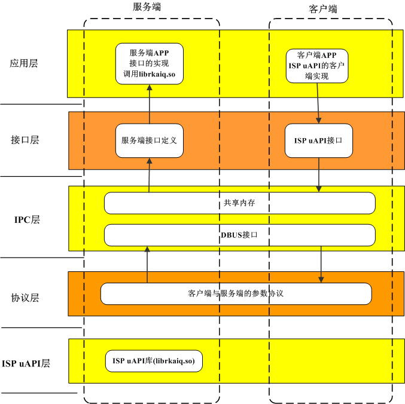

# ISP IPC Module Framework Description and Interface Specification

ID: RK-KF-YF-519

Release Version: V1.0.0

Date: 2020-06-19

Security Level: □Top-Secret   □Secret   □Internal   ■Public

**DISCLAIMER**

This document is provided "as is". Rockchip Electronics Co., Ltd. ("the Company") makes no express or implied representations or warranties regarding the accuracy, reliability, completeness, merchantability, fitness for a particular purpose, or non-infringement of any statements, information, or content in this document. This document is for reference only as a usage guide.

Due to product version upgrades or other reasons, this document may be updated or modified from time to time without any notice.

**Trademark Statement**

"Rockchip" is a registered trademark of the Company.

All other registered trademarks or trademarks mentioned in this document are owned by their respective owners.

**Copyright © 2020 Rockchip Electronics Co., Ltd.**

Beyond the scope of fair use, without the written permission of the Company, no individual or entity may excerpt, copy, or distribute any part or all of the content of this document in any form.

Rockchip Electronics Co., Ltd.

Address:     No. 18, Area A, Software Park, Tongpan Road, Fuzhou, Fujian Province

Website:     [www.rock-chips.com](http://www.rock-chips.com)

Customer Service Tel: +86-4007-700-590

Customer Service Fax: +86-591-83951833

Customer Service Email: [fae@rock-chips.com](mailto:fae@rock-chips.com)

---

**Preface**

**Overview**

This document aims to describe the role of the RkAiq (Rk Auto Image Quality) module, the overall workflow, and the related API interfaces. It is mainly intended to assist engineers developing ISP functions using the RkAiq module.

**Product Versions**

| **Chip Name** | **Kernel Version** |
| ------------- | ------------------ |
| RV1126/RV1109 | Linux 4.19         |

**Intended Audience**

This document (guide) is mainly applicable to the following engineers:

ISP module software development engineers

System integration software development engineers

**Chip System Support Status**

| **Chip Name** | **BuildRoot** | **Debian** | **Yocto** | **Android** |
| ------------- | ------------- | ---------- | --------- | ----------- |
| RV1126        | Y             | N          | N         | N           |
| RV1109        | Y             | N          | N         | N           |

**Revision History**

| **Version** | **Author** | **Date**   | **Description** |
| ----------- | ---------- | :--------- | --------------- |
| V1.0.0      | Qiu En     | 2020-06-19 | Initial version |

---

**Table of Contents**

[TOC]

---

## Framework Overview

### Overview

This module mainly implements the protocol specification for communication between the ispclient application and the ispserver process, as well as the specification for inter-process communication interfaces. Clients use the interface files we provide to interact between the client application and the ispserver process. ispserver mainly depends on the rkaiq library and interacts with isp through the rkaiq library. ispclient does not directly interact with the rkaiq library.

### Software Architecture Diagram



<center>Figure 1-1 ISP20 IPC Module Framework Diagram</center>

The ISP20 IPC module framework diagram is shown in Figure 1-1. The module is designed using a layered model.

- ISP uAPI layer: mainly responsible for calling the interfaces provided by the aiq library.
- Protocol layer: the inter-process communication protocol, using a JSON protocol structure.
- IPC layer: mainly provides basic interfaces for inter-process communication, mainly using dbus and shared memory.
- Interface layer: the final interfaces provided to clients; protocol encapsulation is transparent to the client.
- Application layer: interface calls at the application layer.

---

## Interface Specification

### Interface Layer Specification

Interfaces provided to the server and client.

#### Server:

##### **[Interface Specification]**

```
uAPI interface name + _ipc + (void *args)
void* args: pointer to the shared memory structure. args is the structure of interface parameters, defined in the protocol layer section.
```

##### **[Interface Path]**

`$project/isp2-ipc/interface/`

##### **[Interface Description]**

Since the interface functions correspond to the uAPI interfaces of the rkaiq library, refer to the functional description section of `Rockchip_Developer_Guide_ISP20_RkAiq_CN.md` for details on each interface. ==Note: When compiling the server, ensure linking against the librkaiq.so library.==

#### Client:

The implementation of the uAPI .h file interfaces. The client can work without depending on the rkaiq library. It calls the server interface via dbus (`uAPI interface name + _ipc + (void *args)`), which then calls the aiq library. Header file path: `$sysroot/usr/include/rkaiq/uApi` directory. ==Note: When compiling the client, ensure linking against ispclient.so.==

### Protocol Layer Specification

Since the IPC layer communication mechanism is based on shared memory and DBUS, shared memory is mainly used to transmit interface parameter data. dbus is mainly used to synchronize shared memory, allowing the client to notify the server to synchronize shared memory.

#### **[Protocol Specification]**

```c
   typedef struct uAPI interface name {
     rk_aiq_sys_ctx_t* sys_ctx;
     Parameter 2;
     ....
     Parameter N;
     xCamReturn returnvalue;
   }
```

- The structure name uses the interface name, for unified handling and code simplification.
- The structure fields represent each parameter of the interface.
- The returnvalue field represents the return value of each interface.
- The structure data is stored in shared memory and synchronized via dbus. The dbus protocol is transmitted based on json.
- The json structure mainly informs the other party of the interface name and shared memory id.

#### **[Protocol Path]**

`$project/isp2-ipc/protocol/`

One protocol file corresponds to one header file of uAPI, and each structure corresponds to the parameters of the corresponding interface.

#### **[Protocol Description]**

The client communicates with the server via the protocol; the protocol is included in ispclient when used by the client. Refer to `Rockchip_Developer_Guide_ISP20_RkAiq_CN.md` for the meaning of each protocol field.

---

## DBSERVER Mode Adaptation

The dbserver mode mainly uses a database approach for inter-process communication. The client writes ISP configuration data to the database, then broadcasts a message to ispserver via dbus. After receiving the message, ispserver calls the aiq interface to update the configuration. To enable this feature, turn on the `BR2_PACKAGE_DBSERVER` configuration in `buildroot/config/xxx.config.h`.

## Source Code Structure

```
isp2-ipc
├── client*******************************Client library implementation
│   ├── CMakeLists.txt
│   ├── dbusconfig***********************dbus configuration file
│   └── impl*****************************Client uAPI interface implementation
├── CMakeLists.txt
├── common*******************************Common directory
├── demo*********************************Client test demo
├── interface****************************Server interface definitions
├── libs*********************************aiq library directory
│   └── librkaiq.so
├── LICENSE
├── protocol*****************************Protocol definition directory
└── server*******************************Server implementation
    ├── impl*****************************Server interface implementation, mainly implements interface interfaces
    └── main.c***************************Server main program interface
```

To obtain this code, add `BR2_PACKAGE_ISP2_IPC=y` to `buildroot/config/xxxconfig.h`. After compilation, the server code generates the ispserver binary file.

## A Acronyms

| **Abbreviation** | **Full Name**                        |
| ---------------- | ------------------------------------ |
| isp2-ipc         | ISP2.0 Interprocess Communication    |
| RkAiq            | Rockchip Automatical Image Quality   |
| ISP              | Image Signal Process                 |
