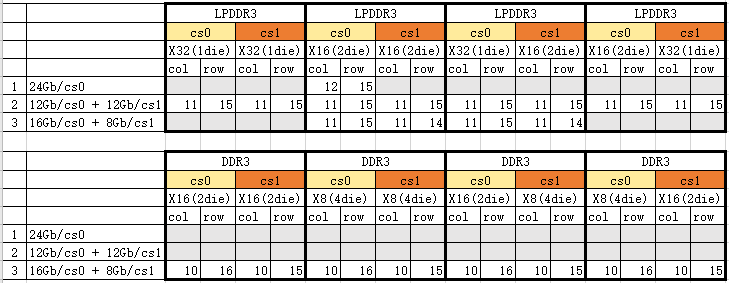
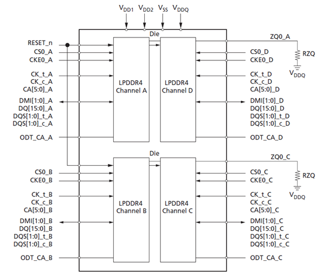

# DDR Layout Precautions

ID: RK-SM-YF-38

Release Version: V1.5.0

Date: 2021-01-21

Security Level: □Top-Secret □Secret ■Internal □Public

---

**DISCLAIMER**

This document is provided "as is". Rockchip Electronics Co., Ltd. ("the Company") makes no express or implied representations or warranties regarding the accuracy, reliability, completeness, merchantability, fitness for a particular purpose, or non-infringement of any statements, information, or content in this document. This document is for reference as a usage guide only.

Due to product version upgrades or other reasons, this document may be updated or modified from time to time without any notice.

**Trademark Statement**

"Rockchip", "瑞芯微", and "瑞芯" are registered trademarks of the Company and belong to the Company.

All other registered trademarks or trademarks mentioned in this document are owned by their respective owners.

**Copyright © 2020 Rockchip Electronics Co., Ltd.**

Without the Company's written permission, no individual or entity may extract or copy part or all of the content of this document, or distribute it in any form, beyond the scope of fair use.

Rockchip Electronics Co., Ltd.

Address: No. 18, Area A, Software Park, Tongpan Road, Fuzhou, Fujian Province

Website: [www.rock-chips.com](http://www.rock-chips.com)

Customer Service Phone: +86-4007-700-590

Customer Service Fax: +86-591-83951833

Customer Service Email: [fae@rock-chips.com](mailto:fae@rock-chips.com)

---

**Preface**

Records DDR layout precautions for all platforms.

**Overview**

**Product Versions**

| **Chip Name** | **Kernel Version** |
| ------------ | ------------ |
| All chips (including 28 series, 29 series, 30 series, 31 series, 32 series, 33 series, PX series, 1108A, RV11 series) | All kernel versions |

**Intended Audience**

This document (guide) is mainly applicable to the following engineers:

Hardware Engineers

**Revision History**

| **Date**   | **Version** | **Author** | **Revision Description** |
| ---------- | ---------- | ---------- | ------------------------ |
| 2017.11.02 | V1.0       | He Canyang |                          |
| 2017.11.09 | V1.1       | Chen Wei   | Changed some phrasing     |
| 2017.01.14 | V1.2       | Tang Yunping | Added RK3326 description and LPDDR2/LPDDR3 requirements |
| 2018.10.08 | V1.3       | Chen Youmin | Added total capacity 3GB description and RK3399 single-channel routing requirements |
| 2020.06.02 | V1.4.0     | Tang Yunping | Added RV1126/RV1109 related requirements |
| 2020.01.21 | V1.5.0     | Tang Yunping | Added RK3566/RK3568 related requirements, updated RV1126/1109 description |

**Table of Contents**

---
[TOC]
---

## Terminology

- **Component**: Refers to various DDR memories: DDR3 memory, DDR4 memory, LPDDR3 memory, LPDDR4 memory, LPDDR2 memory

- **CS**: Chip Select signal of the controller or DDR memory

- **rank**: Same as CS, chip select signal

- **byte**: Every 8 DDR signal lines of the controller form one byte. So byte0 refers to DQ0-DQ7, byte1 refers to DQ8-DQ15, byte2 refers to DQ16-DQ23, byte3 refers to DQ24-DQ31. Note that DQ here refers to the controller's DQ; the component's DQ may not be connected one-to-one with the controller's DQ.

- **bank**: Refers to the number of banks in the DDR memory

- **column**: Refers to the number of columns in the DDR memory

- **row**: Refers to the number of rows in the DDR memory

- **AXI SPLIT**: Asymmetric capacity combination mode, e.g., the high address space has 16bit width, the low address space has 32bit width. For example, a typical combination is 256x16+256x16, while an AXI SPLIT combination is 256x16+128x16=768MB, leaving only 16bit width in the high address space, as shown in the diagram below.

  

---
## General Requirements

General requirements apply to all platforms. Special requirements for each controller are listed separately below.

**1. DQ swapping cannot exceed the byte group; swapping can only be done within a byte. Some controllers have special requirements where even intra-byte swapping is not allowed. See the specific controller's special requirements.**

Reason: According to the DDR protocol, DQ signals of each byte group are always synchronized with the DQS signal of that group. If DQ is moved to another byte group, the DQS synchronization signal will be used incorrectly.

**2. DDR components with different bank/column counts on 2 CS pins need software confirmation for support.**

Reason: Different bank/column counts require a ddr_config with 2 CS selects. Our ddr_config and controller use one register to control 2 CS, so the columns of both CS must be identical.
Some controllers support configuring 1-2 different columns, and sometimes DDR components with different banks or columns happen to have a matching ddr_config configuration item available. It depends on the column difference. For specific cases, please check with software.

**3. If a component has only one CS, it must be connected to the controller's CS0.**

Reason: Controller design limitation.

**4. If only one channel is used, only channel 0 is supported.**

Reason: Hardcoded in code, otherwise the code becomes complex.

**5. If a component's 2 CS have different capacities, the smaller capacity should be placed on the controller's CS1.**

Reason: This is a software assumption; otherwise software would need modification, making it complex, and some chips may not support it.

**6. All platforms do not support components with more than 2 CS.**

LPDDR4 has components with more than 2 CS. If used, only 2 CS can be utilized.

**7. If a component has only one ODT (like LPDDR3), it should be connected to ODT0.**

Reason: Controller design limitation.

**8. 6Gb and 12Gb usage is special (8Gb, 4Gb, 2Gb do not have this restriction).**

Currently, only 2 CS on one channel both being 6Gb or both being 12Gb is supported. Mixing 6Gb/12Gb with 8Gb/4Gb/2Gb across 2 CS is not supported.
For example:

| CS0  | CS1  | Support              |
| ---- | ---- | -------------------- |
| 6Gb  | 6Gb  | Supported            |
| 12Gb | 12Gb | Supported            |
| 6Gb  | 12Gb | Not supported. Violates requirement 5, and this combination is also not supported |
| 12Gb | 6Gb  | Not supported. This combination is also not supported |
| 8Gb  | 6Gb  | Not supported. 8Gb and 6Gb mixed across 2 CS |
| 12Gb | 8Gb  | Not supported. 12Gb and 8Gb mixed across 2 CS |
| 6Gb  | 4Gb  | Not supported. 6Gb and 4Gb mixed across 2 CS |
| 12Gb | 4Gb  | Not supported. 12Gb and 4Gb mixed across 2 CS |

**9. Component RZQ cannot be shared.**

If multiple components are mounted on a board or a component has multiple RZQ pins (e.g., dual die LPDDR3), each RZQ pin must have its own 240ohm resistor.

**10. DDR4 currently has no special connection requirements.**

**11. When connecting external LPDDR2 or LPDDR3, DDR0's DQ0-DQ7 should be connected one-to-one to the DRAM's DQ0-DQ7.**

Since LPDDR2/LPDDR3 Mode Register Read data is returned via DQ0-DQ7, DQ0-DQ7 connections must be one-to-one. If one-to-one correspondence cannot be guaranteed, confirm with software.

**12. Dual-channel DRAM total capacity 3GB support**

Supported component combinations for dual-channel DRAM total capacity 3GB are shown in the diagram below:

  
  Note: 1) RK3288, RK3399 support dual-channel.

**13. Single-channel DRAM total capacity 3GB support**

Supported component combinations for single-channel DRAM total capacity 3GB are shown in the diagram below:

  

---
## RK3399 Special Requirements

**1. CS2 is a replica of CS0, CS3 is a replica of CS1, with behavior identical to the replicated signal.**

Therefore, for DDR3 and LPDDR3, only 2 CS can actually be used. CS2 and CS3 are mainly for LPDDR4, because an LPDDR4 component's channel is 16bit. When the controller needs 32bit, 2CS, 4 CS signals are required.

**2. CLK routing must be longer than any DQS in that channel. DDR PHY requirement.**

Reason: The vendor cannot provide an accurate value for how much longer CLK needs to be than DQS. In layout, make it as long as possible.

**3. LPDDR3 D0-D15 must be connected one-to-one with the controller.**

Reason: LPDDR3 CA training is used, data is output sequentially to D0-D15, so these signals cannot be swapped and must be connected one-to-one.

**4. LPDDR3 D16 and D24 data lines must also be connected one-to-one with the controller.**

Reason: The cadence solution uses DQ Calibration for training. LPDDR3 DQ Calibration outputs data from D0, D8, D16, D24; other data lines may not output data. Therefore, D16 and D24 also need one-to-one connections. (D0, D8 are already required by the previous rule.)

**5. Note the composition relationship between one controller channel and two LPDDR4 component channels.**

    a. LPDDR4 366/272 ball packages are all 64bit bandwidth, with every 16bit as a channel. RK3399 is 32bit per channel, so each RK3399 channel connects to 2*channel of LPDDR4.
    b. LPDDR4 366/272 components share one ZQ between every 2 channels.
    c. Design requirement: Channels that do not share ZQ should be combined into a 32bit connection to RK3399. As shown below, Channel A and Channel D cannot be combined. Channel B and Channel C cannot be combined. These two channel groups share one ZQ.

Based on the Channel A/B/C/D definitions from Micron, Samsung, and Hynix components, using Channel A + Channel C to form one 32bit, and Channel B + Channel D to form another 32bit avoids the ZQ sharing problem for all three vendors. Therefore, revised LPDDR4 designs all use this connection method.

**6. LPDDR4 RZQ must be connected to VDDQ through a 240ohm resistor, not GND. Note that the RK3399 controller side remains unchanged, RZQ still connects to GND through a 240ohm resistor.**

**7. When connecting LPDDR4, the controller's DDR0_ODT0/1 and DDR1_ODT0/1 should be left floating, not connected to the LPDDR4 component. The component's ODT_CA_X should be pulled up to VDDQ with a 10K resistor by default, with a DNP pull-down resistor reserved.**

**8. LPDDR4 data lines (DQ) cannot be swapped, whether within a group or between groups.**

    That is, DDRx_D0-D15 must be connected one-to-one to one LPDDR4 component channel's D0-D15; DDRx_D16-D31 must be connected one-to-one to another LPDDR4 component channel's D0-D15. Reason:

    For a single LPDDR4 channel (16bit): MRR function requires DQ[0:7]; CA training function requires DQS0, DQ[0:6], DQ[8:13]; RD DQ Calibration uses DQ[0:15] and DMI[1:0]. Therefore, all data lines cannot be swapped.

   Additional note:

    Assume DDRx_D0-D15 is connected to LPDDR4 component channel A, and DDRx_D16-D31 is connected to LPDDR4 component channel C.
    If you want to swap the A/C channel interconnection (DDRx_D0-D15 to channel C, DDRx_D16-D31 to channel A), this swap method is allowed. However, requirement 5 must be met to ensure that channels sharing ZQ on LPDDR4 are not combined into 32bit.

**9. If only channel 0 is used, channel 1 also needs power.**

Reason: RK3399 DDR frequency scaling uses the CIC module to control DDR frequency switching. The CIC module requires both channels to switch simultaneously. Even if no DRAM is connected to channel 1, channel 1's controller and PHY must still be initialized. Otherwise, when the CIC module controls DDR frequency switching, channel 1 anomalies can cause the CIC module state to error, leading to DDR frequency scaling failure.

  Therefore, for single-channel usage scenarios (channel 0 has DRAM, channel 1 does not), channel 1 must also be powered (DDR1_AVDD_0V9, DDR1_CLK_VDD, DDR1_VDD). Otherwise, the controller and PHY on channel 1 cannot complete initialization, affecting the DDR frequency scaling function.

---
## RK3326, PX30 Special Requirements

**1. Supported bit-width combinations**

1. 32bit maximum bit width (large capacity 16bit + small capacity 16bit), e.g., 256x16+128x16=768MB.
2. 16bit maximum bit width (large capacity 8bit + small capacity 8bit), e.g., 512x8+256x8=768MB.

**2. Component requirements**

In AXI SPLIT mode, all components must have the same column and bank configuration.

**3. Connection requirements**

1. In AXI SPLIT mode, when using 16bit bit-width components, the AP DDR controller's byte0/1 must be connected to one component, and byte2/3 connected to one component.
2. In AXI SPLIT mode, the larger capacity component must be connected to the AP DDR controller's lower address area, e.g., byte0 or byte0/1. For example, 16bit a component + 16bit b component form 32bit bit width; if a has larger capacity, then a is connected to byte0/1.
3. If 2 CS are used, only CS1 supports AXI SPLIT. Two methods are allowed:
   1. Asymmetric capacity on CS1: e.g., if CS0 is 32bit total width, use large 16bit + small 16bit components on CS1 to form 32bit; if CS0 is 16bit total width, use large 8bit + small 8bit components on CS1 to form 16bit.
   2. Mount only half-width components on CS1, requiring `row <= CS0` components. E.g., if CS0 is 32bit total width, mount 16bit components on CS1; if CS0 is 16bit total width, mount 8bit components on CS1.

**4. The following table lists all supported AXI SPLIT capacity combinations. AXI SPLIT combinations not in this table are not supported.**

| No. | CS0                          | CS1                                 | Support |
| --- | ---------------------------- | ----------------------------------- | ------- |
| 1   | 16bit max width (large 8bit + small 8bit) | No component | Supported |
| 2   | 32bit max width (large 16bit + small 16bit) | No component | Supported |
| 3   | 32bit fixed width            | 32bit max width (large 16bit + small 16bit) | Supported |
| 4   | 32bit fixed width            | 16bit fixed width, connected to Byte0/1 (`row <= cs0` component row) | Supported |
| 5   | 16bit fixed width            | 16bit max width (large 8bit + small 8bit) | Supported |
| 6   | 16bit fixed width            | 8bit fixed width, connected to Byte0 (`row <= cs0` component row) | Supported |

**5. Conventional applications are the same as other platforms.**

---

## RV1126/RV1109 Requirements

**1. DQ swapping**

1. DDR3: All DQ can be arbitrarily swapped within the group, and DQS groups can be arbitrarily swapped between groups.

2. DDR4: Since read training uses MPR stagger mode, data returned on different DQs of DDR4 components has 4 types. Assuming the 4 returned data types are named pattern0-3: DQ0, DQ4, DQ8, DQ12 return pattern0; DQ1, DQ5, DQ9, DQ13 return pattern1; DQ2, DQ6, DQ10, DQ14 return pattern2; DQ3, DQ7, DQ11, DQ15 return pattern3. During read training, the PHY can configure the data type returned by each DQ. Since the pattern for each DQ in read training is hardcoded in loader code, after writing the pattern order of one connection method into the loader to ensure compatibility across all templates, subsequent DDR4 templates must ensure the DQ connected to the PHY DQ has the same returned pattern as set in the loader. Otherwise, read training will fail. For example, if PHY DQ0 is connected to component DQ14 and actually returns pattern2, the new template can connect DQ0 to DQ10 or DQ14. Currently, Loader is configured based on template "RV1126_RV1109_EVB_DDR4P216DD6_V10_2020219".

3. LPDDR3: Since MRR data is returned from DQ0-7, Loader currently swaps the MRR returned data according to the connection order of template "RV1126_RV1109_EVB_LP3S178P132SD6_V10_20191227" to obtain the correct MRR value. Therefore, subsequent templates must maintain the same connection order for DQ0-7 as this template, otherwise MRR results will be incorrect.

4. LPDDR4: Since CA Training uses all DQs, all DQs must maintain one-to-one correspondence. The byte order of LPDDR4 on the PHY side differs from other types. Refer to "RV1126_RV1109_EVB_LP4S200P132SD6_V10_20200205.pdf" for details.

5. For DDR3/4 templates that have different capacity components on high/low 16bit, templates with 16bit total width, and 16bit/32bit compatible templates — these 3 template types must maintain the same PHY and DQS correspondence. Changes to this correspondence are not allowed.

    Reason: For 16bit bit-width mode, components must be connected to DQS0 and DQS1. For high/low 16bit with different capacities, the larger capacity component must be on DQS0 and DQS1. This version of PHY provides PHY BYTE whole-group swap functionality. Refer to PHY document "4.4.1 DQ PAD Map" section. If Loader swaps PHY DQS2 group with DQS1 group, then the DQS2 group as named on PHY IO is effectively the DQS1 group. In 16bit mode, PHY DQS0 and DQS2 need to be connected to the components. Current DDR3/DDR4 loader configuration is based on templates "RV1126&RV1109_EVB_DDR3P216SD6_V10_20191227" and "RV1126_RV1109_EVB_DDR4P216DD6_V10_2020219". Other templates must also follow these two templates' order.

**2. Length matching control**

1. For CA/CMD: LPDDR4 currently does not have CA training resolved, so length matching is also required. Once CA training is resolved, LP4 CA can skip length matching. Other component types must have length matching. Although DDR3/DDR4 can enable 2T mode, the PHY does not use 2T mode during read/write training, wrlvl, and read gate, so enabling 2T mode does not relax this requirement.

2. The phase difference between CLK and DQS should be controlled within ±640ps.

    Reason: 1. The component wrlvl principle determines that the phase difference between DQS and CLK cannot exceed 1 cycle. 2. The PHY wrlvl principle: CLK has a fixed de-skew value, DQS de-skew starts from 0 and increases to find the point where DQS aligns with the CLK rising edge. PHY de-skew has 64 units, each 20ps. The current CLK de-skew default value is 0x20, so the phase difference between CLK and DQS can be -640ps to 640ps. However, some de-skew margin must be reserved for DQS and DQ training and CLK/CMD. Hardware has agreed to control the CLK and DQS phase difference within ±150ps.

3. DQS/DQ can skip length matching for all component types, but the following must be ensured:

   1. The length difference between DQS and DQ should be controlled within 200ps.

       Reason: During read training and write training, DQS de-skew stays at the middle value 0x20, while DQ increases from 0 to 0x3f. To give DQ approximately 400ps of margin on each side to reach the middle value, the actual length difference of DQ relative to DQS must be controlled within ±200ps.

   2. De-skew has ±20% error due to temperature and voltage variations. The typical value for each de-skew unit is 20ps, but the actual value may be 16-24ps. Since unequal lengths are compensated by de-skew, when the length difference between DQS and DQ is 200ps, the de-skew difference between DQS and DQ is set to 10 units. The actual compensation value may be 160-240ps, consuming ±40ps of margin. Ensure that an additional ±40ps margin can be reserved at extreme frequencies; otherwise, consider reducing the length difference between DQS and DQ.

   3. Since write training PHY does not perform DM training, PHY directly sets DM and intra-group DQ0 to the same de-skew value. Therefore, DM0 and DQ0, DM1 and DQ8, DM2 and DQ16, DM3 and DQ24 must be length matched.

---

## RK3566/3568 Requirements

### DQ Swapping

Except that DDR4 DQ can now be arbitrarily swapped, other rules are similar to RV1126. Specific rules are as follows.

1. DDR3: All DQ can be arbitrarily swapped within the group, and DQS groups can be arbitrarily swapped between groups.

2. DDR4: Uses pre-written data in DDR for read training. Therefore, non-ECC versions can arbitrarily swap all DQ within the group and DQS groups between groups. For ECC versions, since data written to the ECC byte is automatically generated and uncontrollable, pre-written data in DDR cannot be used for read training. MPR register-based read training (same as RV1126) must be used instead. Therefore, all DQ on all ECC DDR4 boards must maintain the same order.

3. LPDDR3: Since MRR data is returned from the component's DQ0-7, Loader must swap the returned data according to the PCB DQ connection order. Therefore, all LPDDR3 template components' DQS0 and DQ0-DQ7 connection order to the controller must be consistent. Other DQS/DQ order is not required.

4. LPDDR4/LPDDR4x: Since CA Training uses all DQs, all DQs must maintain one-to-one correspondence. Specific byte order should follow the final result of communication between hardware colleagues and Inno.

5. DDR3/4 templates with 16bit total width and 16bit/32bit compatible templates — these 2 template types must maintain the same PHY and DQS correspondence. Changes to this correspondence are not allowed.

    Reason: For 16bit bit-width mode, components must be connected to DQS0 and DQS1. For high/low 16bit with different capacities, the larger capacity component must be on DQS0 and DQS1. This version of PHY provides PHY BYTE whole-group swap functionality. If Loader swaps PHY DQS2 group with DQS1 group, then the DQS2 group as named on PHY IO is effectively the DQS1 group. In 16bit mode, PHY DQS0 and DQS2 need to be connected to the components.

### Length Control

**1. CMD/Address Lines**

1. DDR3/DDR4: 2T mode is enabled by default. This version's 2T can add half a cycle of margin before and after. Therefore, CMD/ADDRESS lines other than CS/CKE/ODT can skip length matching, with delay controlled within half a cycle. CS/CKE/ODT still require length matching to CLK since they don't have 2T mode.
2. LPDDR3: Since there is no 2T or CA training, strict CA length matching is required.
3. LPDDR4/4x: 1/2cs cases with CA training, CA can skip length matching.
4. LPDDR4/4x 4CS case: CA training is abnormal, CA requires strict length matching.

**2. CLK to DQS Length Difference**

The CLK and DQS de-skew for RK3566/RK3568 is 4UI. To leave enough margin for CA/DQ training, it is recommended to control the CLK/DQS length difference within ±1UI. UI: half a CLK cycle, e.g., 312ps at 1.6GHz (3200Mbps).

**3. DQS/DQ Length Matching**

RK3566/RK3568 have the following optimizations: 1. PVT compensation for de-skew, 2. Adjustment range increased to 4UI, 3. DM training in TX direction added for all component types; RX direction has DM training only for LPDDR4/LPDDR4x.

RX direction DM is also needed when DDR4 enables DBI function. So if DDR4 DBI is enabled, DM must be length matched with the first DQ in the group; otherwise, DM does not need length matching. Currently, there is no requirement to enable DBI function, so DDR4 DM can also skip length matching. If DBI is needed in the future, consider re-layout.

DQS/DQ, aside from the possible DM special requirements for DDR4 mentioned above, can all skip length matching.
