# **DDR Problem Record**

Release Version: 1.3

Author Email: hcy@rock-chips.com

Date: 2019.08.13

Security Level: Internal

---

**Preface**
Records all DDR issues encountered, regardless of platform, for compilation into a DDR problem troubleshooting manual during Q4.

**Overview**

**Product Versions**

| **Chip Name** | **Kernel Version** |
| ------------ | ------------ |
| All chips    | All kernel versions |

**Intended Audience**

This document (guide) is mainly applicable to the following engineers:

Technical Support Engineers

Software Development Engineers

**Revision History**

| **Date**   | **Version** | **Author** | **Description**  |
| ---------- | :--------: | :-------: | :-------------: |
| 2017.10.26 |   V1.0    |  He Canyang  |                 |
| 2017.11.29 |   V1.1    |  Tang Yunping |  Added description |
| 2018.07.30 |   V1.2    |  Tang Yunping |  Added description |
| 2019.08.13 |   V1.3    |  He Canyang  | Directory structure adjustment |

---

[TOC]

---

## RK3228B

### Issue: Unable to Factory Reset

**Keywords: Unable to factory reset, OS_REG cleared, GRF_OS_REG cleared, LPDDR3 board unable to factory reset**

**Description**

When selecting factory reset from the menu, the machine restarts but boots normally instead of entering recovery mode.
This issue only occurs on the customer's machine using LPDDR3 memory; another model using DDR3 does not have this problem.

**Factory Reset Principle**

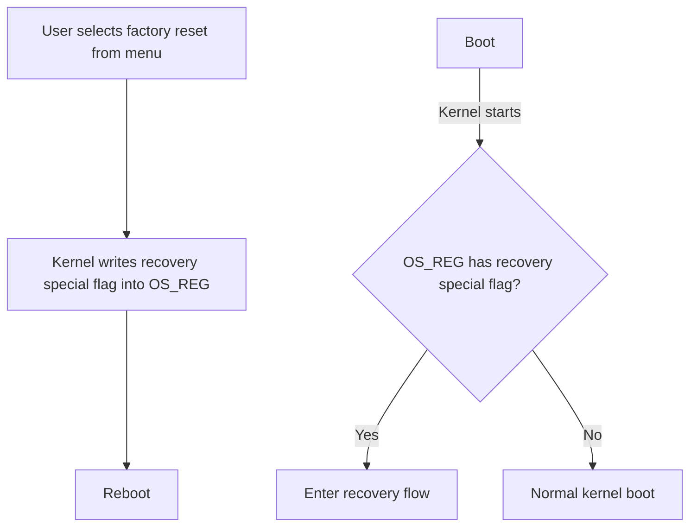
```mermaid
graph TD
	A[User selects factory reset from menu]-->B[Kernel writes recovery special flag into OS_REG]
	B-->C[Reboot]

	D[Boot]-->|Kernel starts|E{OS_REG has recovery special flag?}
	E-->|Yes|F[Enter recovery flow]
	E-->|No|G[Normal kernel boot]
```

The OS_REG used differs by platform. Some platforms have PMU_OS_REG which is not cleared after reboot.
Some platforms do not have PMU_OS_REG but have GRF_OS_REG, which is also not cleared after reboot.
For 3229, GRF_OS_REG is used.

Also, OS_REG generally has 4 registers, whose specific usage is negotiated and defined by the kernel lead, loader lead, and DDR lead together, and this convention is followed across all chips. For this issue, the flag for entering recovery mode is recorded in GRF_OS_REG[0].

**Analysis Process**

From the kernel log showing failure to enter recovery mode, we can see that the kernel did not enter the recovery flow but instead went through the normal kernel boot flow. Therefore, the issue must lie with the OS_REG flag.

Two possible causes:

1. The flag was not written before reboot.
2. After reboot, during the restart process, the flag was modified by code before the kernel. Since the customer said it relates to DDR, the primary suspicion is that the DDR initialization code cleared the OS_REG flag.

Investigation process:

1. Print the value of GRF_OS_REG[0] before kernel reboot.

   Result: The OS_REG flag was correctly written.

2. Print the value of GRF_OS_REG[0] at the start of kernel.

   Result: The OS_REG flag had become 0.

   Therefore, it was suspected that it was cleared during the flow before the kernel.

3. Print the value of GRF_OS_REG[0] at the start of uboot.

   Result: The OS_REG flag had become 0.

4. Check the DDR initialization code.

   Result: No operation on GRF_OS_REG[0], and certainly no different operations based on DDR type.

   Therefore, the DDR code could not have cleared the OS_REG flag.

5. Print the value of GRF_OS_REG[0] at the start of DDR initialization.

   Result: The OS_REG flag had already become 0.

   This was strange; it was already 0 at the very beginning of DDR initialization, suggesting it was not cleared by software but by hardware.

   This ruled out the possibility of different DDR types causing the issue.

6. Repeat the above process with a DDR3 machine that can successfully factory reset.

   Result: On the DDR3 machine, the GRF_OS_REG[0] value was maintained until the kernel check point.

   Therefore, the issue was confirmed to be a hardware difference between the two machines. From the above observations, clearing OS_REG would require either a power loss or a RESET signal.

Finally, the hardware measured the power and reset signals and found the cause.

**Root Cause**

During REBOOT testing, VCCIO collapsed to 2.5V, while the RESET detection threshold for VCCIO is 2.63V. This caused the RESET signal to become active, resetting the CPU, and thus the OS_REG flag was lost. On the next boot, the flag could not be detected, and recovery mode could not be entered. Below is the waveform of the power collapse.

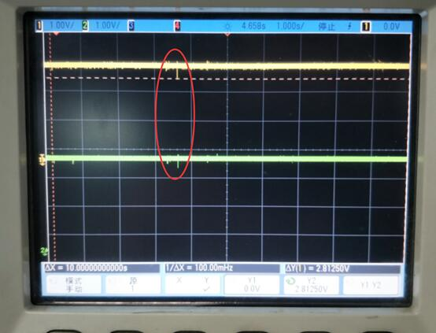

**Solution**

Since the collapse was caused by the DC-DC converter, the best solution is to replace the DC-DC. However, for customers who cannot replace it, the solution is:

Change the output capacitor C532 to 22uF, and add a 22uF capacitor to pin 3 of U509. This ensures the VCCIO collapse does not trigger reset, and the function returns to normal.
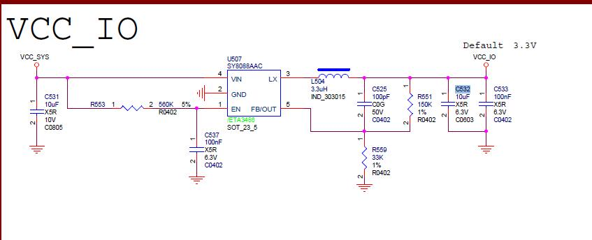
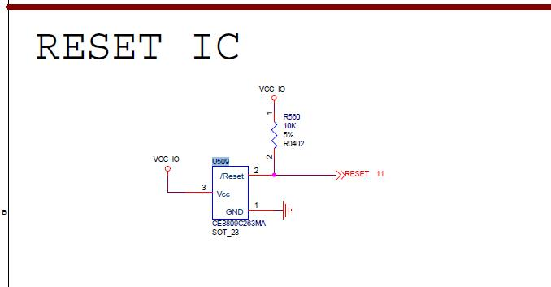

---

## PX3

### Issue: 2GB DDR3L only recognized as 1GB

**Keywords: Capacity recognition error, incorrect capacity, missing a CS, missing a chip select**

**Description**

The customer's board has 2x 512Mx16bit memory chips soldered, with a total capacity of 2GB, but the boot log shows only 1GB recognized.

**Analysis Process**

Investigation process:

1. Asked the customer to provide the DDR3L datasheet and schematic.
2. Checking the DDR3L datasheet (512Mx16bit) and the DDR information in the boot log, it was found that the DDR3L has 2 CS, but only one CS was recognized in the boot log.

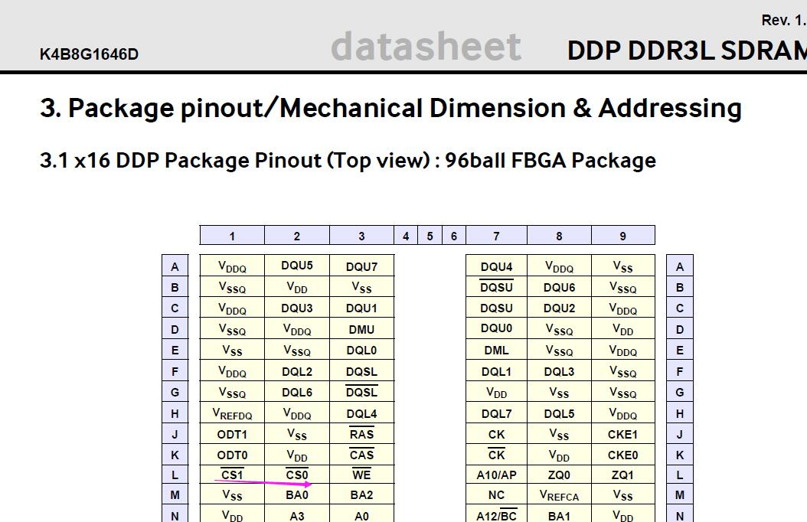

3. The PX3 chip has a design limitation: when the number of row addresses is 16, the CS signal is repurposed as the row15 signal. Therefore, with 16 rows, only one CS is supported. See the "interconnect" section for details.

   For a 512Mx16bit chip that is not dual-die, there are 16 row signals.

4. Carefully reading the DDR3L datasheet confirmed it was dual-die and not 16 row signals. Therefore, the issue of only one CS being recognized was not due to this chip limitation.
5. Checking the customer's schematic revealed that the board only has CS0 connected to the memory chip.

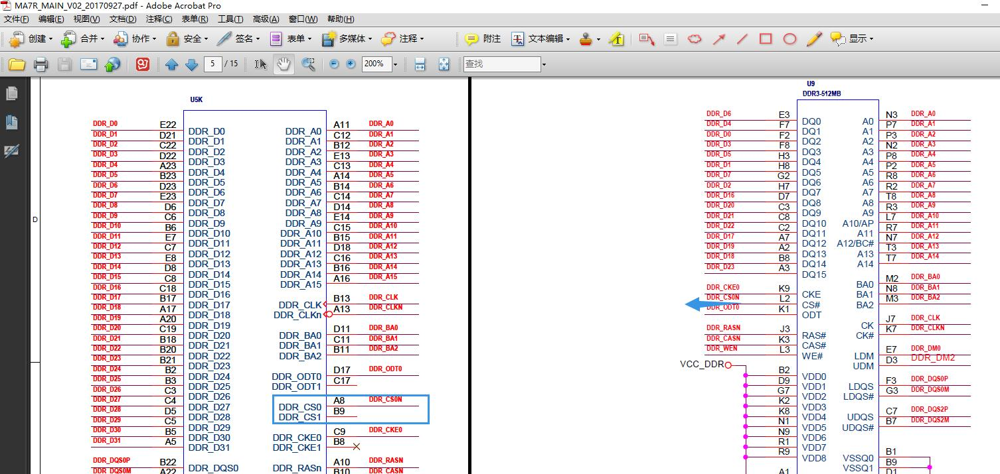

**Root Cause**

The DDR3L is a 2-CS memory chip, but the customer's schematic only connected CS0 to the chip. This resulted in half the capacity.

**Solution**

Cannot be resolved unless the customer redesigns the board.

### Issue: Cannot enter test mode with loader without disassembly

**Keywords: Cannot enter test mode, cannot enter maskrom, loader without disassembly, DDR tool test failure**

**Description**

The customer's board enters loader mode, and when testing with the DDR test tool, it fails.
If tested directly in maskrom mode, the DDR test tool succeeds.

**Analysis Process**

Investigation process:

1. The loader without disassembly feature was only supported after a certain version. It was unclear whether the customer's version supported it. The customer was asked to provide the serial log. The DDR version was confirmed to support this feature.

2. Using the loader without disassembly requires a specific version of the DDR test tool. The customer confirmed they had the latest version.

3. Asked the customer to provide the RKPX3Loader_miniall.bin they were using.

4. Since the DDR test tool only has a 3188 version, and PX3 uses PX3 test items, it was suspected that this might be related to PX3's specificity. A PX3 machine was found, the customer's loader was burned, and the machine entered loader mode via button press. The DDR test tool was then used.

   Result: The test mode was entered successfully, and the test passed.

   It was strange that the customer's machine couldn't do it.

5. Asked the customer to send the DDR test tool log. The following was observed:

   Therefore, the DDR test tool never even got to maskrom mode, so it had nothing to do with the DDR test code, but rather with the loader.

```c
15:56:35 126 Rockchip DDR User Test Tool_20151103 v1.33 start run
15:57:20 081 Wait for Maskrom failed!
15:58:39 064 Wait for Maskrom failed!
16:00:55 023 Wait for Maskrom failed!
```

6. It was unclear whether the loader failed to switch to maskrom or if there was an exception after switching to maskrom.

   The customer was asked to capture the serial log. If PX3 enters maskrom mode normally, it would continuously print:

   `▒RK310B▒▒RK310B▒▒RK310B` characters.

   Result: No maskrom mode character printing was seen on the serial port. This confirmed that the device did not switch to maskrom mode.

7. The customer was told that in loader mode, the tool status bar first shows "Device Found", then when the DDR test tool starts running, the status bar changes to "No Device Found", and then back to "Device Found" before testing begins.

   Result: From the customer's video, the machine stayed at the loader "Device Found" status without ever disconnecting. This confirmed the issue was that the loader did not restart.

8. Zhao Yifeng was asked to handle the issue, and it was traced to his area.

   Result: The cause was found.

**Root Cause**

The user was using a miniall loader, RKPX3Loader_miniall.bin. This type of loader has special handling:
With this loader, when used with uboot, the code runs in uboot when the PC tool shows loader status.
Without uboot, the code runs in miniloader when the PC tool shows loader status.
In this version of miniall, the miniloader supports switching to test mode for the DDR test tool, but the customer's uboot did not.

The reason the customer could not test while we could is that our machine was not used with uboot, so the loader status we saw was handled by miniloader for switching to test mode. The customer had uboot, so the loader status they saw was handled by uboot for switching test mode, which this version of uboot did not support.

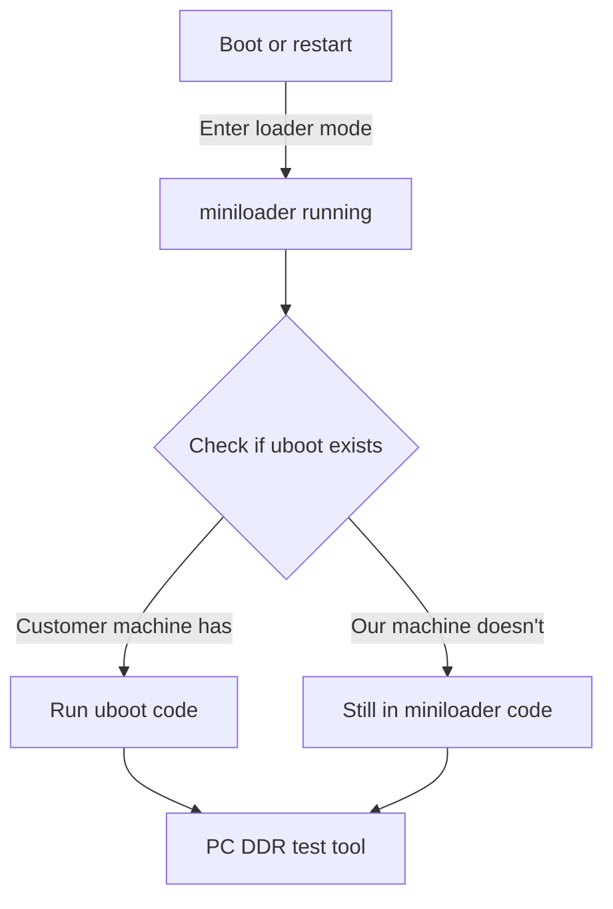
```mermaid
graph TD
	A[Boot or restart]-->|Enter loader mode|B[miniloader running]
	B-->C{Check if uboot exists}
	C-->|Customer machine has|D[Run uboot code]
	C-->|Our machine doesn't|E[Still in miniloader code]
	D-->F[PC DDR test tool]
	E-->F
```

**Solution**

Add support for switching to test mode in uboot, referring to the RK3128 platform.

---

## RK3126/RK3128

### Issue: Reboot test failure

**Keywords: Reboot failure, probabilistic**

**Description**

Some memory chips fail probabilistically at DDR initialization during reboot testing. After flashing firmware, reboot fails at DDR initialization.

This DDR initialization failure only occurs during reboot; normal power-off and power-on boot works fine.

**Analysis Process**

1. By adding debug prints, it was found that during reboot failure, the system stalled at read gate training and could not complete training normally.
2. Using an oscilloscope to check the DQS signal during training, it was found that after sending a read command, no DQS signal returned.
3. Since power-off and power-on always works and the issue only occurs during reboot, it appears that the memory chip's state was affected by DDR access during the previous boot, causing internal logic confusion and failure to correctly respond to read commands.

**Root Cause**

From the analysis above, the cause of the memory chip anomaly is that the 3126 removed the DDR reset pin due to pin constraints. As a result, the reset action was not performed during normal initialization. The chip was affected by the state from the previous boot, and when initialization was triggered again while the chip was in a normal access state, it caused internal logic confusion.

**Solution**

Before reboot, switch the memory chip to self-refresh mode, then reboot. This way, when the chip reinitializes, it starts from self-refresh mode, avoiding logic confusion.

Therefore, the reboot code in both uboot and kernel needs to be modified to put the DRAM into self-refresh mode before reboot.

### Issue: x4 memory initialization failure

**Keywords: x4 memory, initialization failure, Col error!, W FF !=R, reproducible, white-label chips**

**Description**

During DDR initialization, column detection fails. Swapping the chip positions and re-soldering mostly resolves the issue.

**Analysis Process**

1. For x4 chips, our controller has one DQS corresponding to 2 chip DQSs. During read, two chips output data simultaneously, creating a contention situation. If the DQS output phases of the two chips differ significantly, signal integrity is compromised.

   The following image shows the measured read DQS signal under DLL bypass. The measured waveform shows that the DQS outputs of the two chips on DQS1 have a significant phase difference, causing a serious step in the rising edge, severely affecting signal quality.

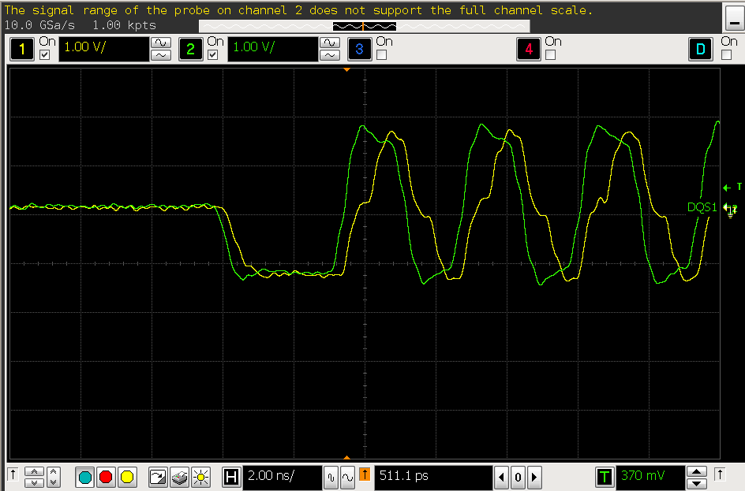

2. According to the JEDEC standard, when DLL bypass is enabled, the DDR tDQSCK is in the range of 0.75-1.25 tCK, which is quite wide. With DLL enabled, tDQSCK is within ±225ps, which is relatively smaller. Therefore, DLL was enabled to check the DQS signal under DLL enabled mode. The following image shows that the DQS output phases under DLL enabled mode are more consistent.

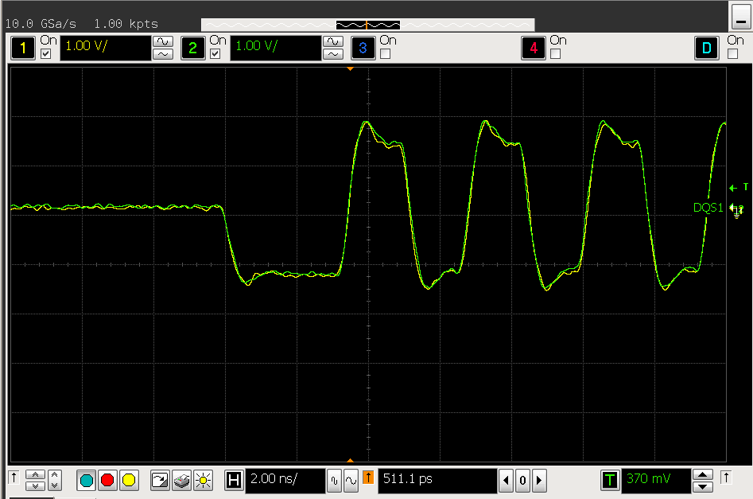

3. After enabling DLL, two out of three boards showed aligned DQS. However, one board showed the following waveform. The cause of this waveform was that one chip's DQS was normal while the other three chips' DQS were delayed by one cycle. Experimentation showed that sending MR0 with DLL reset during initialization caused this phenomenon. Sending MR0 without DLL reset, or sending MR0 with DLL reset followed by another MR0 without DLL reset, restored normal operation. However, DLL reset in JEDEC is self-clearing, meaning this particular chip violated JEDEC specifications and required manual clearing of the DLL reset bit.

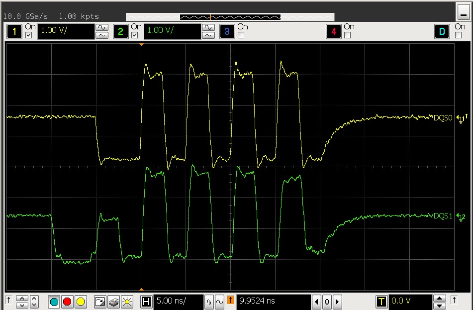

**Root Cause**

1. Our controller does not natively support x4 chips. One controller DQS corresponds to two chips, resulting in a 2-drive-1 situation during read. If the two chips on one DQS have phase differences, signal quality issues arise.
2. Some chips violate the JEDEC specification for the DLL Reset bit in MR0, requiring manual clearing to function normally.

**Solution**

1. For x4 chips with two chips connected to the same DQS, enable DLL to minimize the phase difference between chips caused by inconsistency.
2. For chips that violate JEDEC specifications by requiring manual clearing of the DLL Reset bit, manually clear the bit to resolve the issue.

### Issue: x4 chip reboot hang

**Keywords: x4 chips, reboot, reproducible, white-label chips**

**Description**

After reboot, the system consistently hangs at training. Since the 3126 has no DDR reset pin, this persists even after applying the self-refresh patch.

**Analysis Process**

1. Waveform measurements showed a similar issue to the previous chips where the DLL reset bit in MR0 needed manual clearing. As shown below, one chip's DQS output was normal while another chip's DQS was delayed by 2 cycles, causing the entire waveform to be abnormal. However, re-sending MR0 did not resolve this issue.

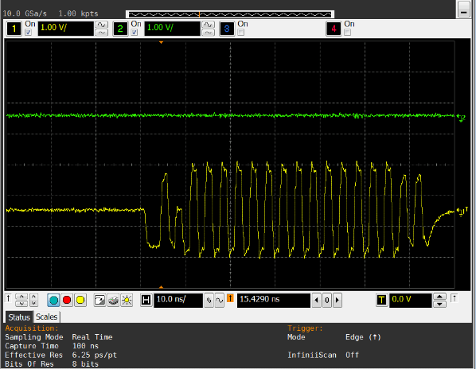

2. From the waveform, one chip had CL=8 while the other three had CL=6. CL=8 was the CL value from the previous boot at 400MHz.
3. During normal power-on boot, the CL setting for frequency changes in the system was successful.

**Root Cause**

The root cause is unknown. The symptom suggests that after reboot, the MR write to one chip failed.

**Solution**

Before reboot, call the DDR frequency change command to change the DDR frequency to the same 300MHz as the loader initialization. This way, the CL during initialization is correct.

### Issue: Probabilistic boot initialization error, Col error

**Keywords: Initialization error, Col error, white-label chips**

**Description**

Redmine #112646. The system probabilistically hangs at DDR initialization reporting Col error. After reset, it can probabilistically boot normally.

**Analysis Process**

1. Hot boot mostly works. When the chip cools down to room temperature, anomalies occur probabilistically.
2. Replacing with Nanya chips resolves the issue.
3. Placing machines with low reproduction rate in a freezer for 10 minutes caused the issue to reproduce consistently. Heating the DDR chips allowed DDR initialization to succeed and the machine to run normally.

**Root Cause**

White-label chips probabilistically exhibit anomalies at room temperature. Heating allows normal boot.

**Solution**

Replace the defective chips.

### Issue: System error, crash

**Keywords: panic, white-label chips**

**Description**

The system easily crashes during operation. Frequency reduction has no effect.

**Analysis Process**

1. Reducing DDR frequency to 200MHz did not improve the issue, suggesting signal quality issues were less likely.
2. Some machines reported march errors.
3. Some machines passed march testing and board stability testing but still crashed easily in the system. Both stressapptest and memtester easily reported errors.
4. For the available machines, labeled 1#, 2#, 3#, 4#:

   1#: DDR test tool reported errors.
   2#, 4#: DDR test tool passed, but memtester in the system reported errors.
   3#: Video stress test ran for 24 hours normally.

   For 1#, we encountered this issue before. The march test in the DDR test tool was specifically added for this type of chip. For chips with internal defects, we cannot do anything other than replacing the chips.

   2# underwent the following experiments:

   1. Measured DDR read signals; read signal quality was good.
   2. Increasing DDR voltage to 1.66V showed no improvement.
   3. Reducing DDR frequency to 200MHz, enabling ODT, memtester still reported errors. Multiple test items in memtester reported errors at the same address, clearly indicating a memory cell anomaly rather than signal quality.
   4. Running DDR at 200MHz with 400MHz timing (doubling all DRAM timing) showed no improvement; memtester still reported errors.
   5. Strengthening and weakening drive strength and ODT strength, memtester still reported errors.

   4# showed similar memtester errors as 2#. Reducing DDR frequency to 200MHz and running DDR at 200MHz with 400MHz timing had no effect.

**Root Cause**

The march test in the DDR test tool and memtester in the system both detected issues at lower frequencies, indicating basic memory cell defects in white-label chips.

**Solution**

White-label chips with memory cell defects can only be resolved by replacing the chips.

### Issue: rk3126c DDR2 system unstable, prone to panic

**Keywords: panic**

**Description**

Customer's rk3126c DDR2 board easily panics when entering the system.

**Analysis Process**

1. Reducing ARM frequency showed some improvement, but the system still panicked easily. Even when the system successfully entered, memtester easily reported errors.
2. Reducing DDR frequency to 200MHz allowed relatively stable system entry.
3. ARM ripple was measured to be high. Improving ripple had little effect on crashes.
4. It was found that the GND under the main chip was not soldered. After re-soldering, the system worked normally.

**Root Cause**

The GND under the customer's main chip was not soldered, causing overall poor power distribution inside the chip, leading to system instability.

**Solution**

Re-solder the GND under the main chip.

---

## RK3229

### Issue: 4bit DDR3 crashes above 600MHz

**Keywords: Green screen, cannot run at high frequency**

**Description**

When the frequency exceeds 600MHz, the system crashes, and the screen displays abnormally.

**Analysis Process**

1. Using the DDR test tool, during the crosstalk test, data errors occurred after writing to all address spaces. Data anomalies appeared after each refresh. Re-sending MR0 restored most data to normal, but some address space data remained erroneous.
2. The customer had added a 100nF capacitor on the ddr_rst pin near the controller. Removing the capacitor or moving it to the chip end allowed stable operation at 800MHz.
3. Through the oscilloscope, the reset pin had significant noise. With the capacitor, the max was 2V and min was 600mV. Without the capacitor, the min was 800mV.

**Root Cause**

The 100nF capacitor added near the DDR reset pin caused resonance, probabilistically triggering the chip's reset.

**Solution**

Move the capacitor to the memory chip end.

### Issue: DDR2 support

**Keywords: ddr2, ddr controller 1:2 mode**

**Description**

After normal initialization, all data read from memory was 0; writes were unsuccessful.

**Analysis Process**

1. Checked the DDR timing settings; they matched the 3126 and were correct.
2. Measured signals and found that during write, the DM signal masked all written data.
3. Suspected DFI timing. The calculation method for DFI timing differs between ddr controller 1:1 mode and 1:2 mode.

   In 1:2 mode: tdfirddataen = (cl-1)/2-1, tdfiphywrlat = (cwl-1)/2-1. Since tdfiphywrlat must be > 0, cwl must be >= 5. Therefore, the minimum settings for CL and CWL are 6 and 5.

**Root Cause**

In 1:2 mode: tdfirddataen = (cl-1)/2-1, tdfiphywrlat = (cwl-1)/2-1. Since tdfiphywrlat must be > 0, cwl must be >= 5. Therefore, the minimum settings for CL and CWL are 6 and 5.

**Solution**

Set the minimum CL and CWL to 6 and 5 to resolve the issue.

### Issue: Stress test error

**Keywords: stressapptest, memtester error**

**Description**

Stress test reports errors. Increasing logic voltage resolves the issue.

**Analysis Process**

1. Scanning the rx DQS de-skew window revealed that one DQS had a small rx window. The normal DQS rx effective window was DLL=0°, de-skew=2 to DLL=67.5°, de-skew=10. The abnormal DQS rx effective window was DLL=0°, de-skew=2 to DLL=67.5°, de-skew=7. The default 600MHz rx DLL/de-skew configuration was DLL=67.5°, de-skew=7, which left no margin for the abnormal board's DQS, causing crashes.
2. On our EVB, at the same 600MHz, the rx DQS margin was DLL=0°, de-skew=4 to DLL=67.5°, de-skew=13.
3. Using our EVB as an example, with de-skew at 20ps per unit, at 600MHz, the actual effective rx DQS window was about 500ps. With the optimal sampling point at 90°, the leftmost window: 90°-500ps/2 = 0°+(4-7)*20ps+rx intrinsic delay, rightmost: 90°+(500/2)ps = 67.5°+(13-7)*20ps+rx intrinsic delay. This gave an internal rx intrinsic delay of about 230ps, 90ps higher than Inno's typical value of 140ps.
4. Increasing logic voltage reduces the intrinsic delay in the PHY, increasing hold time margin, thus improving the issue.
5. The customer's board resolved the issue by advancing the rx DQS de-skew by 7 units.

**Conclusion**

1. The customer's board may have PCB-related factors eating into the rx DQS margin.
2. Our actual rx DQS sampling window, set based on the 140ps PHY internal fixed delay, loses some hold time margin.
3. Future trust updates will change the rx DLL settings: below 400MHz, DLL set to 67.5°; between 400MHz and 680MHz, DLL set to 45°; above 680MHz, DLL set to 22.5°.

### Issue: Stress test error

**Keywords: stressapptest, memtester error**

**Description**

Both memtester and stressapptest report errors, with stressapptest having a higher probability.

**Analysis Process**

1. From the error log, DQ2 and DQ10 reported errors. It was unusual that the error bits were on the same bit of different DQS.
2. Adjusting the tx and rx de-skew for DQ2 and DQ10 individually showed no improvement, suggesting it was not a DDR signal issue.
3. From the error data, errors always appeared at addresses ending in 0x668 and 0xe6c. Fixing the CPU frequency at 816MHz made stressapptest pass.

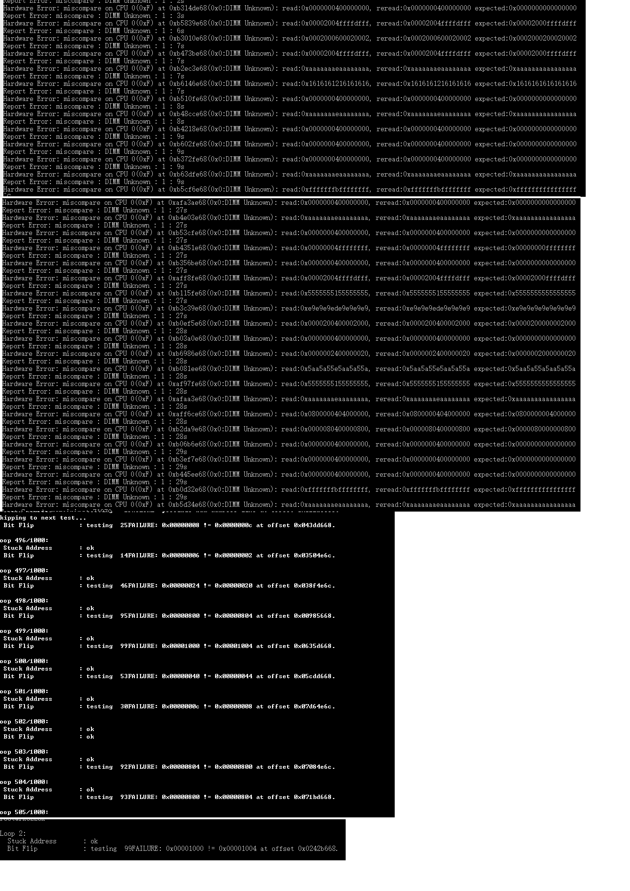

**Root Cause**

The stressapptest error was caused by CPU anomalies. After reducing CPU frequency, stressapptest passed. Therefore, stressapptest errors are not necessarily caused by DDR issues.

---

## RK3128/RK322X/RK3368/RK322XH

### Issue: Probabilistic memory type and bus width detection errors

**Keywords: Probabilistic, memory type error, bus width error, W FF != R**

**Description**

During initialization, 16-bit bus width is probabilistically detected as 32-bit, LPDDR is identified as DDR3, and W FF != R errors occur.

**Analysis Process**

1. On platforms using Inno's DDR PHY, DDR bus width and memory type are detected through read gate training. On 3228H, CS is also detected through read gate training. During anomalies, the read gate training values were abnormal, but the PHY still reported training success. For example, the actual training value was "0x2D531A1B", with DQS2 and DQS3 results being 0x53 and 0x2d, far from the normal 0x1A and 0x1B, yet the PHY result was still success.
2. False success reports occur when the corresponding DQS is floating or when no DQS signal returns. For example: a. In x16 bus width systems, DQS2 and DQS3 are floating. When first set to 32-bit training, DQS2 and DQS3 have no normal read signal returning. b. When LPDDR3 is populated, it is first initialized as DDR3 for training, and DQS will not have a normal read signal returning. c. When probing CS1, if no chip is actually present on CS1, read DQS will not return a signal. In these cases, due to internal PHY misjudgment of these signals, training may be falsely reported as successful, causing memory type, bus width, and capacity anomalies.

**Root Cause**

When no read signal returns on DQS during training, the DDR PHY probabilistically falsely reports success, causing DDR capacity, type, and bus width detection anomalies.

**Solution**

During training, change the controller's ODT from the original pull-up/pull-down to single-ended pull-up. This makes the PHY read gate training results stable and reliable.

The corresponding loader versions for each platform are:

| rk3128             | v2.06     |
| ------------------ | --------- |
| **rk322x**         | **v1.06** |
| **rk3368**         | **v2.02** |
| **rk322xh/rk3328** | **v1.10** |

---

## RK322xH/RK3328

### Issue: Flash failure during memory validation

**Keywords: Flash failure, cannot boot**

**Description**

A batch of boards with various DDR chip models were collected for validation. Three boards consistently failed flashing.

**Analysis Process**

Investigation process:

1. Checked the serial log from the failed flash. DDR initialization completed normally, but subsequent uboot code execution was anomalous.
2. Carefully examined the DDR initialization log and found a chip mismatch.
3. The chip was RK3328, but the loader selected for download was for RK3228H.

   This caused a mismatch between the loader and the chip, leading to unstable operation, either flash failure or abnormal system boot.

4. Selected the RK3328 loader and corresponding files.

   Result: Both flashing and operation were normal.

**Root Cause**

Among the batch of boards, there were both RK3228H and RK3328 chips. During download, the wrong loader and files were selected for the chip model, causing download failure.

**Solution**

Select the correct loader and files according to the chip model.

### Issue: 1Gbx4 x8 chips forming 4GB download anomaly

**Keywords: Download failure, DDR initialization error, 4GB**

**Description**

An ERR error occurs at DDR initialization during firmware flashing.

**Analysis Process**

None.

**Root Cause**

Tracing the DDR code revealed that the original code used a uint32 variable for cs_cap, not accounting for a single CS having up to 4GB capacity. With two CS totaling 4GB, the variable overflow did not occur. However, with 8x 1Gbx4 chips forming 4GB, a single CS reached 4GB, causing variable overflow.

**Solution**

Update the loader to v1.09 (20171011) to resolve the 4GB download failure issue.

### Issue: System crash after updating to v1.08 loader

**Keywords: hynix 2cs lpddr3, odt, rd_gap**

**Description**

After updating the RK3228H/RK3228 loader to V1.08 or later, system crashes occurred during boot.

Chip models: H9CKNNNCPTMRPR, H9CCNNNBJTMLAR, H9CKNNNBPTMRLR, H9CCNNN8JTMLAR

**Analysis Process**

1. Rolling back the loader resolved the issue.
2. The new loader updated the diff_cs_rd_gap and diff_cs_wr_gap for lpddr3 and ddr4 from the default value of 6 to 1.
3. Investigation found that diff_cs_rd_gap was the cause.
4. The phenomenon was similar to a previous hynix lpddr3 issue on 3399. In that case, ODT needed to be disabled at the chip end, or diff_cs_rd_gap needed to be increased for normal operation.
5. Measuring the signal showed that after enabling write ODT, the chip would probabilistically drive DQS/DQ high several cycles early, affecting the read signal of the other CS and causing data errors and crashes.

**Root Cause**

The ODT design logic in this batch of hynix lpddr3 chips was faulty. When enabled, CS0 would erroneously trigger DQS/DQ to drive high, causing CS1 read errors.

This issue was also acknowledged by hynix.

**Solution**

1. Disable write ODT.
2. Alternatively, increase the rd_gap at the controller end. However, this would affect DDR access efficiency.

### Issue: Video playback with DDR frequency scaling causes crash

**Keywords: Crash, video, frequency scaling**

**Description**

During aging testing on RK3228H/RK3228 EVB boards, video playback combined with DDR frequency scaling (via a script toggling thermal control) caused anomalies. Boards 11# and 23# from the quality department consistently exhibited issues. The log showed the anomaly did not occur during DDR frequency scaling but after the deidle_port step was complete.

**Analysis Process**

DDR frequency scaling had completed. When starting multiple CPU cores, the system crashed for unknown reasons. The bus or msch appeared to have crashed, preventing DDR access while other registers were still accessible. This phenomenon differed from previous VPU hardware reset issues. Xie Xiuxin suggested measuring the CPU voltage, which was around 1.3V. The CPU should be at high frequency at this point. The recommendation was to remove the frequency corresponding to 1.3V and retest.

Result: After removing the 1.3GHz CPU frequency, the aging test passed.

**Root Cause**

Small leakage CPUs cannot run at 1.3GHz, or the voltage needs to be further increased.

**Solution**

Comment out the 1.3GHz CPU frequency for aging testing.

### Issue: Datang DDR3 2-layer board crashes at 800MHz

**Keywords: Cannot run at high frequency, 2-layer board, panic**

**Description**

Kingston memory on a 2-layer board frequently crashes (panic) at DDR 800MHz.

**Analysis Process**

1. Reducing DDR frequency stabilized the system, suggesting signal quality or power issues.
2. Step-by-step testing found a stable edge frequency at 738MHz.
3. Changing de-skew revealed that the DDR_WE signal was very marginal, only one de-skew unit away from the edge. Changing de-skew from 0x7 to 0x3 resulted in stable 800MHz operation.

**Root Cause**

Poor signal quality; the WE signal was marginal.

**Solution**

Advancing the WE signal by 4 de-skew units resolved the stability issue.

---

## RK3288

### Issue: Changing function to no_inline in DDR frequency scaling code causes crash

**Keywords: no inline, ddr frequency scaling**

**Description**

In the 3288 optee DDR frequency scaling code, changing ddr_get_parameter to no inline caused deterministic crashes during frequency scaling.

**Analysis Process**

1. Tracing the code, the anomaly values were consistent each time.
2. It appeared the stack was corrupted.
3. Further tracing revealed that the parameters passed to ddr_sre_2_srx were incorrect.

**Root Cause**

The parameters passed to ddr_sre_2_srx were in the stack (sp). After the compiler switched sp to SRAM, it attempted to fetch the parameters from sp, resulting in incorrect parameter values.

**Solution**

Use global variables for the parameters passed to ddr_sre_2_srx instead of passing them as function arguments.

### Issue: Two 512Mbx8bit DDR3 chips per channel, flash failure

**Keywords: Flash failure, flash error, 2x 8bit, row=16**

**Description**

On the 3288, the customer had 2x 512Mbx8bit DDR3 chips per channel, totaling 2 channels. Flashing reported the following error.

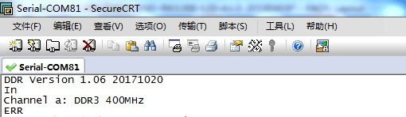

**Analysis Process**

- Based on this error, it appeared to be a hardware issue where the system could not work at all. The hardware team confirmed the DDR-related power supplies and components were fine.
- The DDR test tool generated a configuration with two channels, each using 2x 512Mbx8bit chips. Testing reported BA0 and BA1 errors, as shown below.

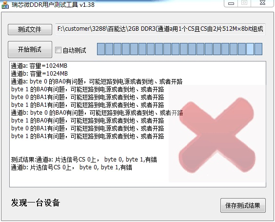

- Hardware measured BA0 and BA1 and found no anomalies.
- Adding logs revealed that during capacity detection, dram_cfg_rbc() returned an error.

**Root Cause**

The customer had 2x 512Mbx8bit chips per channel, which is equivalent to bus-width=16bit, col=10, bank=8, row=16, cs=1. This configuration was not found in ddrconfig, so an error was reported. When bus-width=16bit, the maximum row supported is 15, as shown:

`10 | C CRDR RRRR RRRR RRRR RRBB BCCC CCCC C---`

Therefore, this issue only occurs with 2x 512Mbx8bit chips per channel. It is likely related to the initial 3288 design, where the possibility of customers using 16-bit was not anticipated, so ddrconfig did not support all configurations.

**Solution**

Initially, the idea was to force row=15, effectively halving the capacity.

However, looking at the ddrconfig above, the row is above the rank:

`10 | C C[R]DR RRRR RRRR RRRR RRBB BCCC CCCC C---`

The final solution was: for this configuration, report 2 discontinuous address segments, skipping the D in ddrconfig=10 above and using the higher R bit instead.

Of course, the test() for row=16 and CS1 detection needed special handling in the code.

### Issue: RK3288 Power domain driver idle port failure

**Keywords: RK3288, idle port failure, single channel**

**Description**

After the first frequency scaling during boot, the power domain driver reports idle port failure. Disabling DDR frequency scaling resolves the idle port issue. Additionally, after flashing firmware and rebooting, the idle port works normally.

**Analysis Process**

- Since reboot after flashing works normally, we tried only downloading 471 and 472 without downloading the full loader, then sending a reboot command through the flashing tool. The idle port worked normally. Alternatively, entering loader mode without flashing and rebooting through the flashing tool also resulted in normal idle.
- After normal idle and entering the system, the reboot command worked normally regardless of how many times the machine was rebooted. However, any hardware reset immediately caused idle port failure.
- The difference between normal reboot and cold boot in the DDR initialization code is that cold boot performs capacity detection while hot boot does not.
- During initialization without capacity detection, the dram type of the empty channel was DRAM_MAX. The function setting DLL frequency accessed ddr_timing with an out-of-bounds index, which happened to set the DLL to bypass mode, resolving the issue: ddr_set_dll_bypass(ddr_timing[g_ChInfo[ch ? 1 : 0].dramType].pctl_timing.ddrFreq);
- In the kernel's frequency scaling code, performing a DLL reset on the empty channel restored normal idle port operation.

**Root Cause**

When the 3288 uses only one channel, the DLL of the empty channel is in normal state. During DDR frequency scaling, since no operation was performed on the empty channel's DLL, the DLL lost lock, causing idle port failure.

**Solution**

Setting the empty channel's DLL to bypass during initialization, or performing a DLL reset on the empty channel during frequency scaling, both resolve the issue. Since adding a DLL reset operation during frequency scaling increases scaling time, the final solution was to set the empty channel's DLL to bypass during initialization.

---

## RK3188/RK3026

### Issue: System crash with screen distortion

**Keywords: Ghosting, screen distortion**

**Description**

During system boot or operation, the system crashes without any error log, while the display shows vertical stripe ghosting.

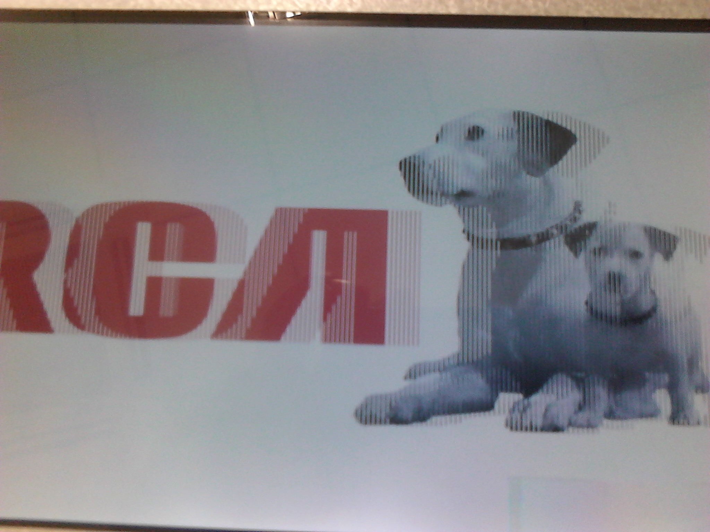

**Analysis Process**

1. Screen ghosting indicates that data read from DDR is severely corrupted. For example, reading address A returns data from address B.
2. This phenomenon indicates internal logic anomalies in the memory chip, which could be related to power or DDR timing.
3. From the layout, the reference layer was heavily interrupted, affecting signal integrity.
4. Increasing VCC_DDR power to 1.6V resolved the issue.
5. Attempting to modify other DDR timing parameters showed no significant improvement.
6. Bypassing the DDR DLL resolved the issue. However, for DRAM, DLL and ODT are linked. If DLL is bypassed, ODT cannot work properly. Therefore, bypassing DLL requires considering whether ODT can be safely disabled at that frequency.

**Root Cause**

Suspected that poor reference layer caused degradation of the internal power environment of the memory chip, causing DLL lock loss and resulting in data read/write anomalies.

**Solution**

1. Increase VCC_DDR voltage to resolve the issue.
2. Bypass the chip-side DLL to resolve the issue.
3. Improve reference layer integrity in the layout.

---

## RK3188

### Issue: System crash

**Keywords: Samsung LPDDR3 POP, RZQ, drive strength**

**Description**

Chip models K3PE0E000M, K3PE0E000A crash during boot.

**Analysis Process**

1. Power ripple was normal.
2. Reducing DDR frequency had little effect.
3. Measuring DDR signals revealed very weak read signal amplitude.
4. Increasing DDR drive strength to 34 ohms showed no significant improvement.
5. Reducing or removing RZQ significantly improved drive strength.

**Root Cause**

Due to the POP package, it is suspected that this batch of chips was custom-made by Samsung for a specific customer with intentionally weakened drive strength. The read drive strength was too weak, causing read anomalies.

**Solution**

Change the drive strength to 150 ohms or directly remove RZQ to increase drive strength.

---

## RK3399

### Issue: LPDDR4 reboot error

**Keywords: LPDDR4, reboot, DDR error**

**Description**

This issue only occurs with Samsung or Samsung-wafer chips. During reboot aging testing, errors occur in the loader's DDR initialization, with the error log showing:

`read addr 0x40008000 = 0x40000000`. The error address varies between boards, and even on the same board across multiple tests. Moreover, the LPDDR4 frequency was only 50MHz at the time of the error.

**Analysis Process**

- Assuming the error matches the "Description" above with low 16-bit data errors. JTAG revealed that a large range of addresses after the error address all had low 16-bit data equal to 0. Even rewriting and re-reading still showed low 16 bits as all 0.
- Suspected the low 16 bits of the PHY were abnormal. However, other addresses' low 16 bits could be read and written normally, ruling out PHY issues.
- After address cross-referencing, the error was found to be somewhat related to banks. Some banks consistently had errors while others were fine.
- Continuously reading the error address with JTAG while measuring the read DQS of the low 16 bits with an oscilloscope confirmed that the read DQS did not appear. This suggested a chip issue or that the command was not correctly received.
- Additionally, rewriting to these error addresses and measuring write DQS and DQ showed correct phase and amplitude.
- Measuring CA0-CA5, CS0-CS3, CKE0/1, and RESET revealed that the RESET signal had an intermediate level for a period, as shown below. Other signals had correct amplitude and phase.

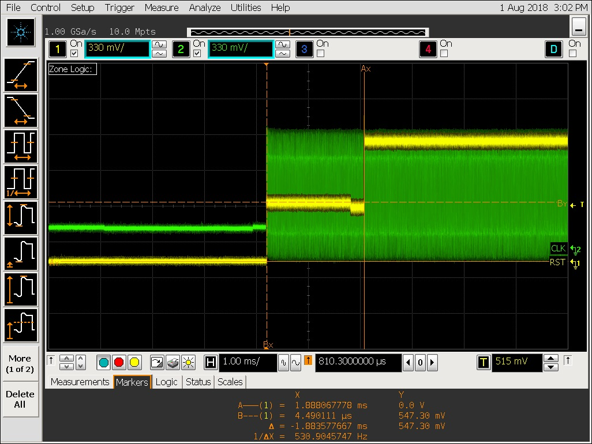

**Root Cause**

It was ultimately confirmed that the cause was the intermediate level on the RESET signal. This intermediate level occurred because the 366/272 ball chips have only one RESET_n signal. The hardware connected the RESET signals of both RK channels together and then to the chip's RESET_n, creating a 2-drive-1 situation and producing the intermediate level. The hardware connection is shown below.

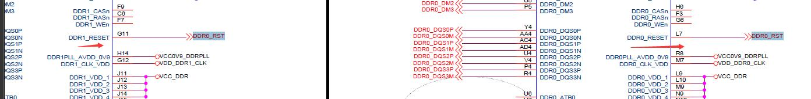

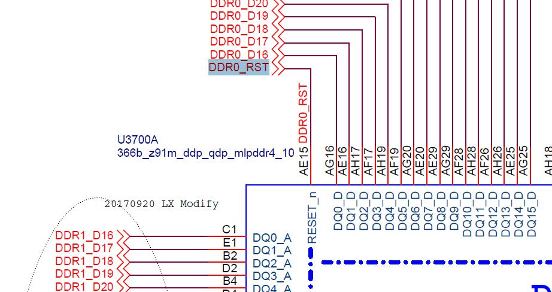

**Solution**

Initially, the approach was to set the RESET drive of Channel 1 to high impedance, effectively disconnecting Channel 1's RESET. Measurements showed that the chip-side RESET_n signal became normal.

However, 200-ball chips have two RESET_n signals, so the connection differs from 366/272 ball chips. Each RK channel's RESET is connected to its corresponding chip's RESET_n, as shown below.

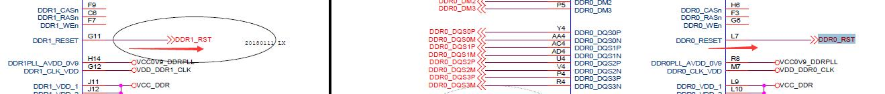

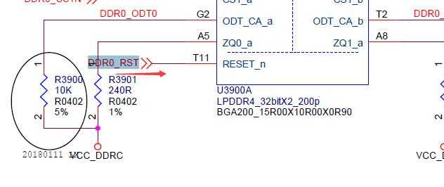

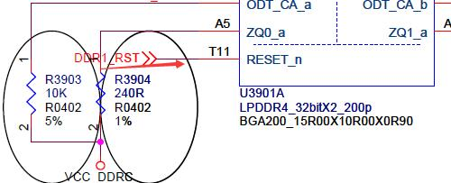

Therefore, setting Channel 1's RESET to high impedance would not work, as the 200-ball Channel 1 chip would not be properly reset.

The final solution was:

- During type detection in the loader, LPDDR4 should be detected first. Otherwise, other type detections that also toggle each channel's RESET would also cause intermediate levels.

- During frequency scaling, stop updating the RESET drive strength. Since the frequency scaling code updates drive strength one channel at a time, there is a timing difference. For 366/272 ball chips with the 2-drive-1 RESET configuration, this would still produce an intermediate level for a period.

   Fortunately, regardless of DDR type, the RESET drive strength configuration is independent of frequency and is a fixed value. Therefore, after initial configuration, it is never touched again.

- During LPDDR4 initialization in the loader, to accommodate both 366/272 ball and 200 ball RESET connection methods, we set Channel 1's RESET drive strength to 240 ohms before pctl_start, while Channel 0 uses the normal 40 ohm configuration. Ensuring Channel 0 initializes first, its RESET is pulled high first. Since Channel 1 is still driving low, but with only 240 ohm drive strength, for 366/272 ball (2-drive-1), the final voltage is 0.85*VDDQ, which is above VIH(AC), sufficient for the chip to consider it a valid RESET_n signal, as shown below.

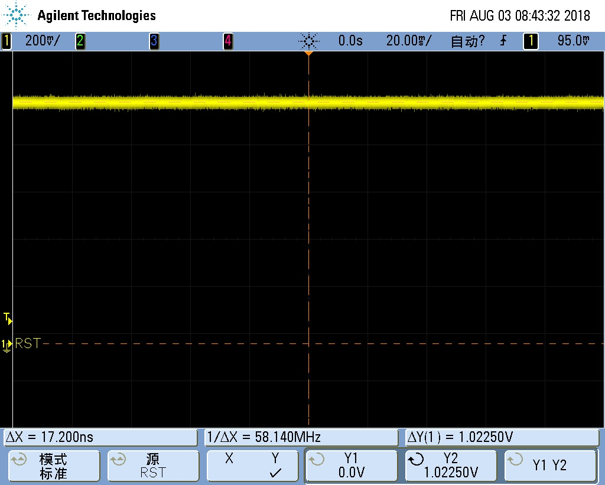

  When Channel 1 also initializes, its RESET will output high. The final 2-drive-1 level becomes VDDQ. The entire process is shown below.

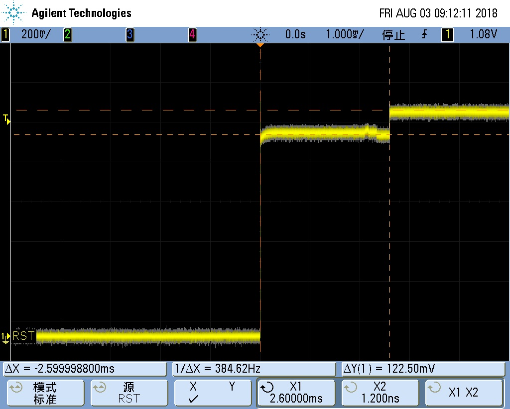

  Zooming in on the two voltage transition waveforms:

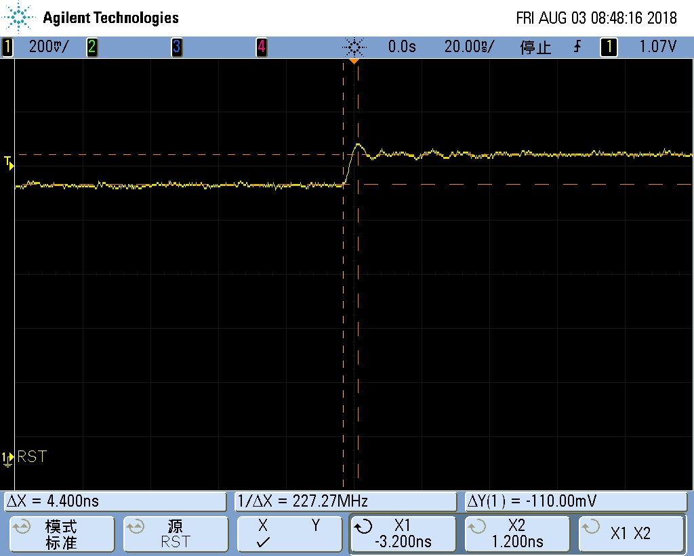

  For 200 ball, during Channel 0 initialization, since RESET has normal drive strength, the rising edge is faster, as shown below.

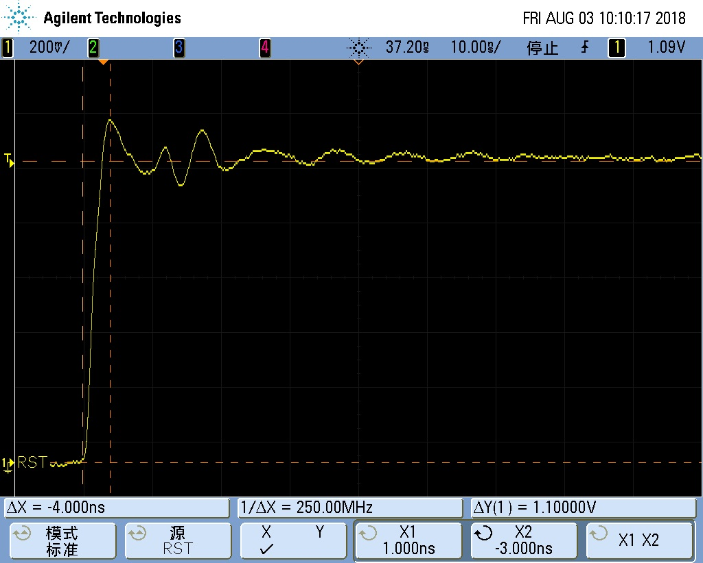

  However, during Channel 1 initialization, since the RESET drive strength is only 240 ohms, the signal rise time is extended, measured at 18ns, but it still reaches the high level, as shown below.

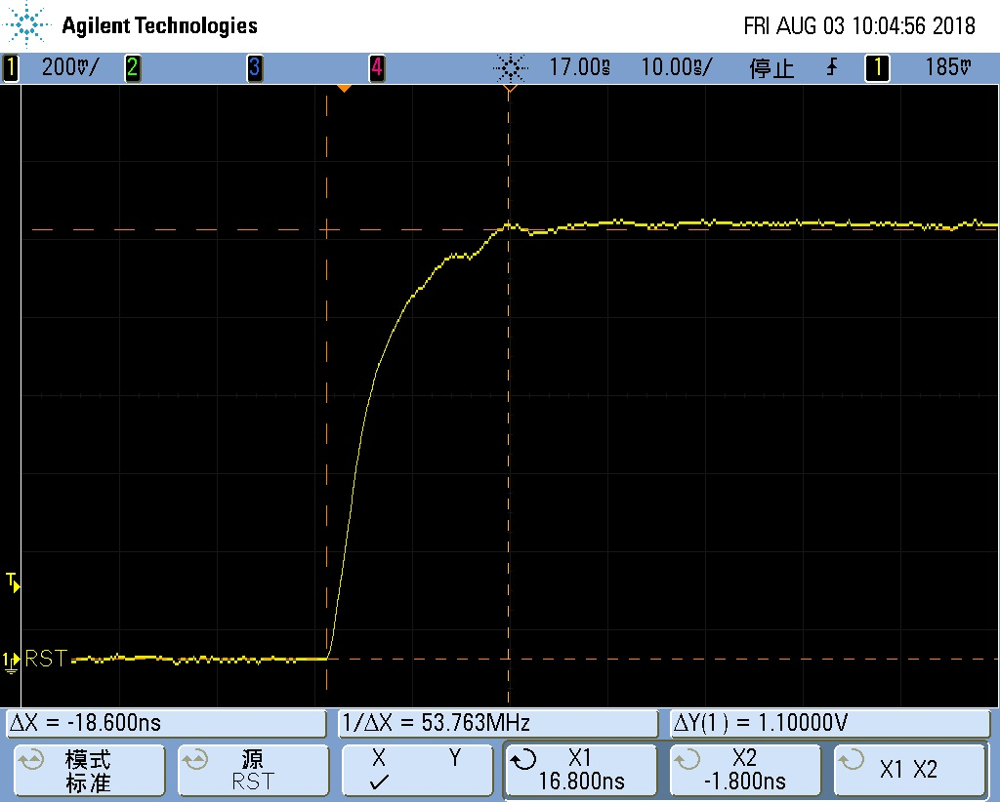

  There is no concern that the extended RESET rise time might cause subsequent commands to be issued during the rise, because after RESET_n is pulled high for LPDDR4, it must wait for tINIT3, which is at least 2ms.

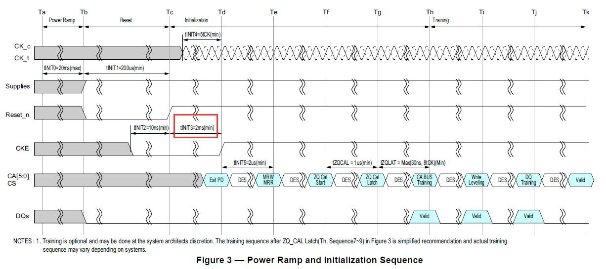

  This elegantly handles both the 366/272 ball and 200 ball issues.

- Channel 0 must be initialized first. If Channel 1 initializes first, Channel 1's RESET uses 240 ohms to drive high, while Channel 0's RESET uses 40 ohms to drive low. The final 2-drive-1 level is 0.14*VDDQ, far from VIH(AC), which is insufficient for a valid RESET_n signal, as shown below.

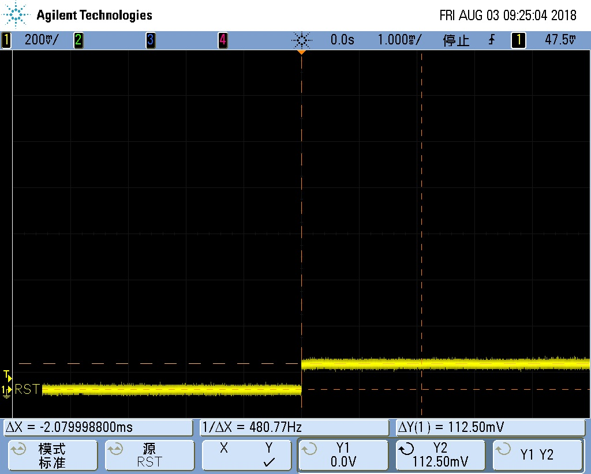

- After pctl_start initialization completes, we change Channel 1's RESET drive strength back to the normal 40 ohms. This is mainly to improve ESD immunity, as 240 ohms may not provide sufficient ESD protection. After pctl_start, both channels' RESET outputs are high, so changing the drive strength does not cause amplitude changes.

- Code modifications must not affect DDR3, as DDR3 also uses the RESET signal.

### Issue: LP4 suspend/wake crash

**Keywords: LP4, LPDDR4, suspend crash, wake crash, PS019, Z91M**

**Description**

The customer wanted to use Spectek 272ball LPDDR4, model SM512M64Z91MD4BNJ(PS019). During verification, we found that the system would crash immediately after suspend/wake. Short-duration suspend worked fine; only long-duration suspend followed by wake would cause problems.

**Analysis Process**

- Measured tCKELCK and tCKCKEH; both were normal.
- Measured VDDQ (VCC_DDRC) and found it powered off during suspend.
- Checked the timing of VCC_DDRC during suspend and before wake. Result: During suspend, VCC_DDRC powered off; before wake, VCC_DDRC had already powered back on. The timing was correct.
- Based on correct timing and the fact that only long-duration suspend caused issues, it was inferred to be a chip issue.
- A Samsung chip board tested with the same long-duration suspend showed no issues, confirming it was a chip issue.
- Further investigation: which component powered by VCC_DDRC should not be powered off? The candidates were VDDQ, ODT_CA, and RZQ. After testing each, it was confirmed that as long as RZQ remained powered, long-duration suspend was fine.
- Three machines with the same chip were all modified to keep RZQ powered. Long-duration aging testing with suspend/wake all passed.

**Root Cause**

As long as RZQ remains powered, long-duration suspend works fine.

An email to Spectek confirmed it was a design issue. The original email text:

```c
You're right Canyang. There's self refresh oscillator sharing on our Z91M DDP/QDP package but it's fixed in our 100/110/120 series LPDDR4. Please keep this info as Micron proprietary and confidential.
You can work with your customer to decide which work-around option works best.
```

Further inquiry to Spectek about which versions are Z91M and which are 100/110/120:

```c
Z91M: EOL at 2016 Q3
100 series: Z0* - Z00M,Z00N,Z0AM,Z0AP,Z01M,etc.
110 series: Z1* - Z1AM,Z11M,etc.
120 series: Z2*
```

After cross-referencing with Spectek, it was confirmed that besides PS019, the 366ball SM512M64Z91MD4BNK(PS004) is also Z19M and would have the same issue.

**Solution**

The only option for this chip is to keep RZQ powered during suspend.

However, keeping only RZQ powered would require schematic changes and board redesign.

Therefore, keeping the entire VCC_DDRC powered is the simplest solution.

A software patch to keep VCC_DDRC powered during suspend would be ideal, but this is not possible because VCC_DDRC is controlled by the PMU automatically.

A simpler method is to remove the following resistors to keep VCC_DDRC powered.

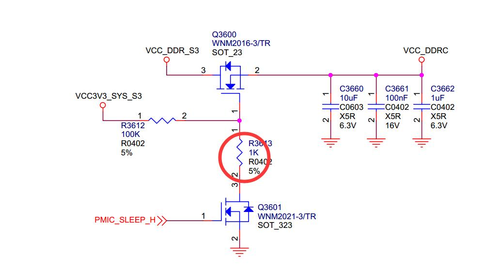

### Issue: Lingyouzhixue Kingston LP4 stress error

**Keywords: Q5116PH1MDGPAR, Kingston, LP4 error, LPDDR4 error, stress error**

**Description**

Lingyouzhixue used Kingston LP4, model Q5116PH1MDGPAR. Stress testing easily reported errors. 200 out of 1000 units failed.

The failing units all had errors at Channel 0, Byte 2.

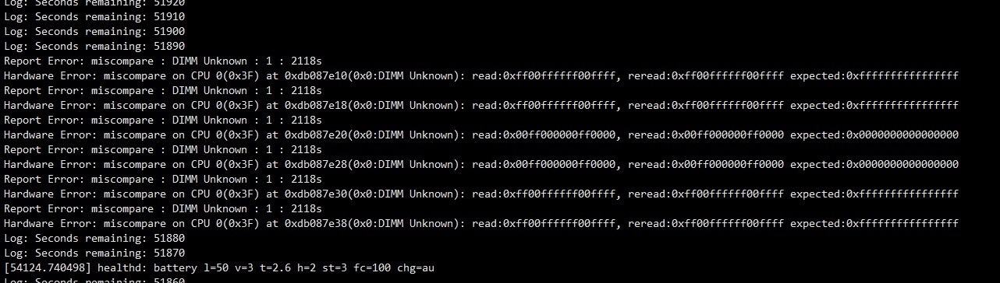

**Analysis Process**

- Updated to the latest loader and trust; errors persisted.
- Checked the eye diagram; read signals were good. Write Byte 3 had some issues, but those weren't on the failing byte 2.
- Fixed CPU frequency at 1GHz with voltage increase; stressapptest still reported errors.
- VDD_CENTER was 0.903V, which was fine.
- Changed PDDS from RZQ/3 to RZQ/1; stressapptest ran for 16 hours with only 2 errors, but they became Byte 3 errors.
- Using 1066MHz drive strength and ODT still produced errors, now on Channel 1.

  The phenomenon was inconsistent, strongly suggesting a power issue.

**Root Cause**

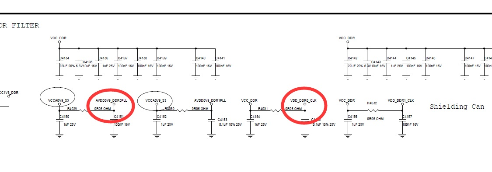

The two capacitors shown above were not placed on the back of the chip. The ripple was slightly high.

**Solution**

Solder these 2 capacitors on the back of the chip. Testing passed.

Original ripple was 35mV; after adding capacitors, ripple was 20mV. External measurements could not detect the significant impact, but the actual effect was clear.

### Issue: Shmoo results inconsistent with sw_training results

**Keywords: S5RG2G20CMS-MGCJ, Netsol, boot anomaly, RISK, no find pass-eye, Channel 1 anomaly**

**Description**

Xinzhonghong's product for "Dianliang" used Netsol's S5RG2G20CMS-MGCJ. After mass production, issues appeared. Some machines had Channel 1 misidentified, resulting in single-channel operation. Others could identify both channels but had similar RISK errors in the boot log.

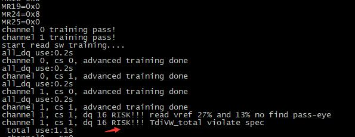

Some of these machines couldn't boot, while others could boot but would crash when running certain applications.

**Analysis Process**

- Starting from the RISK in the log, enable DEBUG_SW_TRAINING in sw_training.c to print the training results. Channel 1, CS 1, DQ 16 showed no pass-eye found, as shown below.

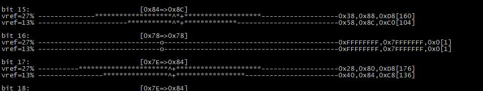

- Strangely, Channel 1, CS 0 DQ16 was normal. Only CS 1 DQ16 was abnormal.
- DDR test tools found no soldering issues.
- Set DDR_TEST to 1 in config.h. After boot, shmoo would run and scan the eye diagram. This time, the eye diagram was found!

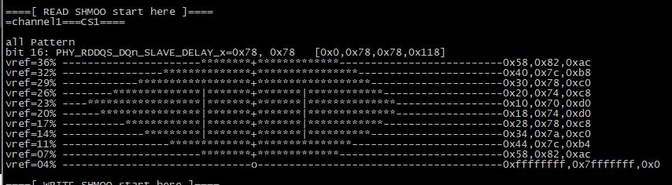

- Now the sw_training and shmoo results contradicted each other; one of them must be wrong.
- Keeping config.h DDR_TEST set to 1, modified `src\common\start.s` to disable interleaving, and changed the pbufb address in emic_test_main() calling memtest_main() to Channel 1, CS 1, as follows:

  `memtest_main((u32*)0xc0000000, (u32*)0xc0200000, 1024*1024, 1);`

  `g_ch_info DCD 0x03040000`

  Check the memtest_main results.

- memtest_main reported many errors, all from DQ16, as shown below. This indicated that sw_training was correct and shmoo was wrong.

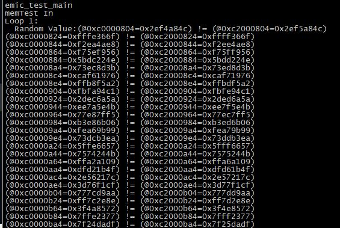

  Checking the error addresses against the memory configuration:

  `Bus Width=32 Col=10 Bank=8 Row=15/15 CS=2 Die Bus-Width=16 Size=2048MB`

  All errors were at Bank0, Bank4 with column addresses matching `10'b1[000000-111111]001`, i.e., the following column addresses:

  ```c
  0x201,0x209,0x211,0x219,0x221,0x229,0x231,0x239,
  0x241,0x249,0x251,0x259,0x261,0x269,0x271,0x279,
  0x281,0x289,0x291,0x299,0x2a1,0x2a9,0x2b1,0x2b9,
  0x2c1,0x2c9,0x2d1,0x2d9,0x2e1,0x2e9,0x2f1,0x2f9,
  0x301,0x309,0x311,0x319,0x321,0x329,0x331,0x339,
  0x341,0x349,0x351,0x359,0x361,0x369,0x371,0x379,
  0x381,0x389,0x391,0x399,0x3a1,0x3a9,0x3b1,0x3b9,
  0x3c1,0x3c9,0x3d1,0x3d9,0x3e1,0x3e9,0x3f1,0x3f9,
  ```

- After investigation, the root cause was found. The buffer size used for shmoo testing was only 1KB, while sw_training used a 64KB buffer.

  Simply increasing the shmoo buffer to 64KB revealed an abnormal eye diagram.

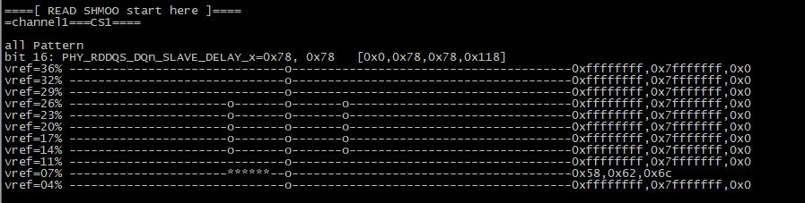

**Root Cause**

The LPDDR4 chips had defects with fixed bit errors at certain addresses.

The shmoo test buffer was small, only 1KB, while sw_training used a 64KB buffer.

Simply increasing the shmoo buffer to 64KB revealed the abnormal eye diagram.

**Solution**

This is a chip issue; the only solution is to replace the chips.

---

## RK3326/PX30

### Issue: RK3326/PX30 DDR test tool fails under loader mode

**Keywords: DDR test tool, Loader mode, A35, ICACHE**

**Description**

The DDR test tool under loader mode gets stuck at downloading boot and cannot test normally. Testing under maskrom mode (by shorting the flash) works normally.

**Analysis Process**

- When the test failed, connecting JTAG showed that boot.bin was downloaded successfully. CPU1-3 were in WFE state and were normal, while CPU0 was running and could not be stopped.
- Replacing boot.bin with the initialized ddrbin allowed normal operation.
- Using the flashing tool to switch from loader mode to maskrom mode and flash the same version of the loader was successful; flashing a different version caused a crash. (Tested with v1.10 and v1.13.)
- Directly upgrading the loader from loader mode using the flashing tool, then rebooting, succeeded regardless of version consistency.
- Adding Icache invalidate before the DDR initialization code return fixed the issue.

**Root Cause**

The A35 Icache is enabled by default. When switching from loader mode to maskrom mode, the ddrbin was loaded and executed first, then returned to bootrom to enter maskrom mode. Since the ddrbin was executed, when performing DDR testing or downloading a new version of ddrbin, the old ddrbin code remained in Icache. This caused part of the old code and part of the new code to be executed simultaneously, resulting in CPU anomalies and crashes. In the direct flash-and-reboot case, ARM invalidates Icache during reset, so there was no issue.

**Solution**

When entering maskrom mode, the ddrbin must clear the Icache before returning. Additionally, the first instruction of the ddrbin or DDR test tool must also clear the Icache, because even though the ddrbin clears the Icache before exiting, the final return instruction will still dirty the Icache.

---

The following is left as a template to maintain formatting. To add a new issue, copy from here.

### Issue

**Keywords: All bold**

**Description**

**Analysis Process**

**Root Cause**

**Solution**
