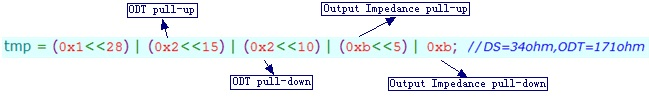
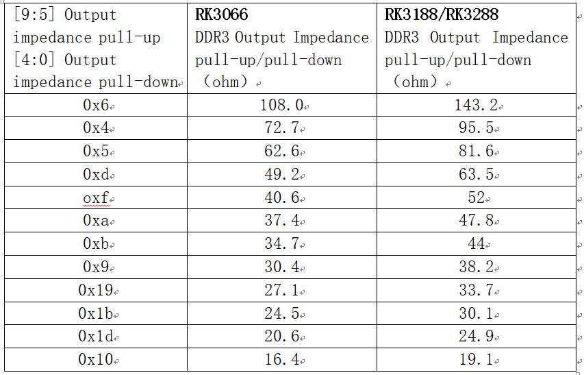
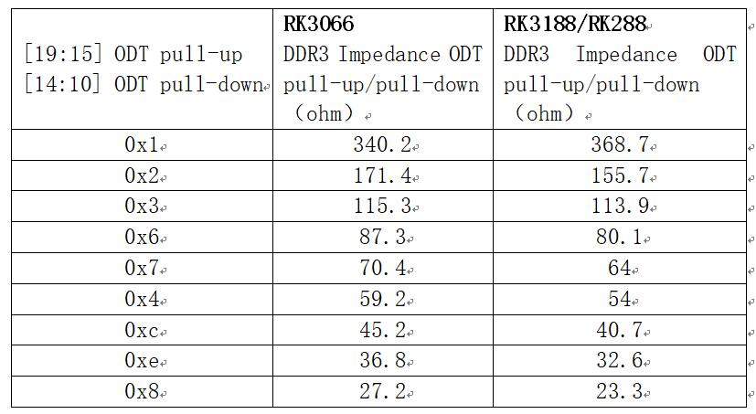

# **DDR Development Guide Internal Document**

Release Version: 1.1

Author Email: hcy@rock-chips.com

Date: 2019.1.29

Security Level: Internal

---------

**Preface**
Development guide applicable to all platforms

**Overview**

**Product Versions**

| **Chip Name** | **Kernel Version** |
| ---------    | --------------- |
| All chips    | All kernel versions |

**Intended Audience**

This document (guide) is mainly suitable for the following engineers:

Field Application Engineer

Software Development Engineer

**Revision History**

| **Date**   | **Version** | **Author** | **Revision Description** |
| ---------- | --------- | --------- | ----------------------- |
| 2017.12.21 | V1.0      | He Canyang |                         |
| 2019.1.29  | V1.1      | He Zhihuan | Added RK3308 modify deskew tool |

---------
[TOC]
------

## How to modify DDR frequency in loader

1. Update the DDR bin file to the latest
2. Use modify_ddr_bin.exe to check whether the chip supports modifying DDR frequency
3. After modification, generate a new loader as described in "How to synthesize our DDR bin into a complete usable loader"

We provide the tool modify_ddr_bin.exe for modifying the DDR frequency in the DDR bin file. Only RK322x, RK322xh, RK3328, RK3368, RK3399, RV1108 support frequency modification, and some chips can only be modified to certain frequencies. See the modify_ddr_bin.exe usage instructions for details.

```c
./modify_ddr_bin.exe       //View modify_ddr_bin.exe usage instructions
./modify_ddr_bin.exe -chip 3328      //View supported parameters for 3328 DDR bin file, similar for other chips
```

The tool modify_ddr_bin.exe is located at:

\\10.10.10.164\Common_Repository\DDR related tools\modify_ddr_bin

## How to modify the serial port number and baud rate for DDR printing in loader

1. Update the DDR bin file to the latest
2. Use modify_ddr_bin.exe to check whether the chip supports modifying the serial port number and baud rate
3. After modification, generate a new loader as described in "How to synthesize our DDR bin into a complete usable loader"

We provide the tool modify_ddr_bin.exe for modifying the serial port number and baud rate in the DDR bin file. Not all chips support this. See the modify_ddr_bin.exe usage instructions for details.

```c
./modify_ddr_bin.exe       //View modify_ddr_bin.exe usage instructions
./modify_ddr_bin.exe -chip 3328      //View supported parameters for 3328 DDR bin file, similar for other chips
```

The tool modify_ddr_bin.exe is located at:

\\10.10.10.164\Common_Repository\DDR related tools\modify_ddr_bin

## Which chips support DDR frequency scaling

DDR frequency scaling is implemented at different stages and in different kernel branches. The overall support is as follows:

| Chip             | uboot | kernel 4.4 | kernel 3.10 | kernel 3.0 |
| --------------- | ----- | ---------- | ----------- | ---------- |
| RK3026          |       |            |             | Supported  |
| RK3028A         |       |            |             | Supported  |
| RK3036          |       | Not supported | Not supported | Not supported |
| RK3066          |       |            |             | Supported  |
| RK3126B, RK3126C |       |            | Supported, trust flow |            |
| RK3126B, RK3126C |       |            | Supported, non-trust flow |            |
| RK3126          |       |            | Supported   |            |
| RK3128          |       |            | Supported   |            |
| RK3188          |       |            | Supported   |            |
| RK3288          |       | Supported, trust flow | Supported |            |
| RK322x          | Supported |            | Supported, trust flow |            |
| RK322xh         |       |            | Supported, trust flow |            |
| RK3328          |       |            | Supported, trust flow |            |
| RK3368          |       | Supported, trust flow | Supported, trust flow |            |
| RK3399          |       | Supported, trust flow |            |            |
| RV1108          |       |            | Supported   |            |

## How to check DDR capacity - Supplement

In addition to the content described in the corresponding section of the public document "DDR Development Guide", internal materials supplement the following information:

For DDR capacity information in the kernel, those using the trust flow do not print this information. Therefore, kernel 4.4 has no DDR capacity information printing, and kernel 3.10 using the trust flow also does not. Refer to the previous section "Which chips support DDR frequency scaling" to determine which chips use the trust flow under kernel 3.10.

If you do not understand basic DDR channel, row, column, bank, chip select, and data width information, please ask HR or an assistant for the training document "DRAM Simple Introduction.ppt"

## How to check DDR bandwidth utilization - Supplement

In addition to the content described in the corresponding section of the public document "DDR Development Guide", internal materials supplement the following information:

Regardless of the kernel version, to view detailed data volume information for each port, you need to push a bandwidth measurement tool (currently one tool per chip, which is messy and being consolidated into one), and you need to disable load-based frequency scaling.

1. Disable load-based frequency scaling, see "How to disable DDR load-based frequency scaling and keep only scene-based frequency scaling" or "How to fix DDR frequency"
2. Push the corresponding software. For software usage and result viewing, see the software's documentation.

## How to adjust ODT and drive strength

- DDR controller-side drive strength (DS) and ODT adjustment

   Chip: RK3026, RK3028A

   Code location: ddr_update_odt() function in arch/arm/mach-rk2928/ddr.c

   Chip: RK3126, RK3128

   Code location: ddr_update_odt() function in arch/arm/mach-rockchip/ddr_rk3126.c

   Chip: RK3126B, RK3126C non-trust flow

   Code location: ddr_update_odt() function in arch/arm/mach-rockchip/ddr_rk3126b.c

   Modification:

   All uses of PHY_RTT_XXXohm are DDR controller-side ODT

   All uses of PHY_RON_XXX are DDR controller-side drive strength (DS)

   These set the single-ended pull-up/pull-down resistance values

   Chip: RK3066

   Code location: ddr_update_odt() function in arch/arm/mach-rk30/ddr.c

   Chip: RK3188

   Code location: ddr_update_odt() function in arch/arm/mach-rockchip/ddr_rk30.c

   Chip: RK3288 kernel 3.10

   Code location: ddr_update_odt() function in arch/arm/mach-rockchip/ddr_rk32.c

   Modification:

   The following code is responsible for modifying the DDR controller-side drive strength and ODT. Change the tmp value passed to it.

   ```c
   if(cs > 1)
   {
       pPHY_Reg->ZQ1CR[0] = tmp;
       dsb();
   }
   PHY_Reg->ZQ0CR[0] = tmp;
   dsb();
   ```

   The definition of each bit in tmp is as follows:

   [19:15] bit for ODT pull-up configuration

   [14:10] bit for ODT pull-down configuration

   [9:5] bit for Output Impedance pull-up configuration

   [4:0] bit for Output Impedance pull-down configuration

   

   The drive strength (DS) and ODT values can be configured according to the two configuration tables below

   Drive strength (DS) configuration table: 

   ODT configuration table:

   

   Chip: RK3126B, RK3126C trust flow

   Code location: arch/arm/boot/dts/rk312x_ddr_default_timing.dtsi

   Chip: RK322x

   Code location: arch/arm/boot/dts/rk322x_dram_default_timing.dtsi

   Chip: RK322xh, RK3328

   Code location:

   arch/arm64/boot/dts/rk322xh-dram-default-timing.dtsi

   arch/arm64/boot/dts/rk322xh-dram-2layer-timing.dtsi

   Chip: RK3368

   Code location: arch/arm64/boot/dts/rk3368_dram_default_timing.dtsi

   Chip: RV1108

   Code location: arch/arm/boot/dts/rv1108_dram_default_timing.dtsi

   Chip: RK3288 trust flow

   Code location: arch/arm/boot/dts/rk3288-dram-default-timing.dtsi

   Chip: RK3399

   Code location: arch/arm64/boot/dts/rockchip/rk3399-dram-default-timing.dtsi

   Modification:

   phy_XXX_drv indicates controller-side drive strength

   phy_XXX_odt indicates controller-side ODT

- DDR device-side drive strength (DS) and ODT adjustment

   Chip: RK3026, RK3028A

   Code location: ddr_get_parameter() function in arch/arm/mach-rk2928/ddr.c

   Modification:

   The following code is responsible for setting the DDR device-side drive strength and ODT

   ```c
   /* DDR3 settings */
   if(nMHz <= DDR3_DDR2_ODT_DISABLE_FREQ)
   {
       ddr_reg.ddrMR[1] = DDR3_DS_40 | DDR3_Rtt_Nom_DIS;
   }
   else
   {
       ddr_reg.ddrMR[1] = DDR3_DS_40 | DDR3_Rtt_Nom_120;
   }

   ......

   /* DDR2 settings */
   if(nMHz <= DDR3_DDR2_ODT_DISABLE_FREQ)
   {
       ddr_reg.ddrMR[1] = DDR2_STR_REDUCE | DDR2_Rtt_Nom_DIS;
   }
   else
   {
       ddr_reg.ddrMR[1] = DDR2_STR_REDUCE | DDR2_Rtt_Nom_75;
   }
   ```

   DDR3\_DS\_XX, DDR2\_STR\_XXX indicate the corresponding DDR device-side drive strength

   DDR3\_Rtt\_Nom\_XXX, DDR2\_Rtt\_Nom\_XXX indicate the corresponding DDR device-side ODT

   Chip: RK3126, RK3128

   Code location: ddr_get_parameter() function in arch/arm/mach-rockchip/ddr_rk3126.c

   Chip: RK3126B, RK3126C non-trust flow

   Code location: ddr_get_parameter() function in arch/arm/mach-rockchip/ddr_rk3126b.c

   Modification:

   The following code is responsible for setting the DDR device-side drive strength and ODT

   ```c
   /* DDR3 settings */
   if (nMHz <= DDR3_DDR2_ODT_DISABLE_FREQ) {
       p_ddr_reg->ddrMR[1] = DDR3_DS_40 | DDR3_Rtt_Nom_DIS;
   } else {
       p_ddr_reg->ddrMR[1] = DDR3_DS_40 | DDR3_Rtt_Nom_120;
   }

   ......

   /* LPDDR2 settings */
   p_ddr_reg->ddrMR[3] = LPDDR2_DS_34;
   ```

   DDR3\_DS\_XX, LPDDR2\_DS\_XX indicate the corresponding DDR device-side drive strength

   DDR3\_Rtt\_Nom\_XXX indicates the corresponding DDR device-side ODT

   Chip: RK3066

   Code location: ddr_get_parameter() function in arch/arm/mach-rk30/ddr.c

   Chip: RK3188

   Code location: ddr_get_parameter() function in arch/arm/mach-rockchip/ddr_rk30.c

   Chip: RK3288 kernel 3.10

   Code location: ddr_get_parameter() function in arch/arm/mach-rockchip/ddr_rk32.c

   Modification:

   The following code is responsible for setting the DDR device-side drive strength and ODT

   ```c
   /* DDR3 settings */
   if(nMHz <= DDR3_DDR2_ODT_DISABLE_FREQ)
   {
       p_publ_timing->mr[1] = DDR3_DS_40 | DDR3_Rtt_Nom_DIS;
   }
   else
   {
       p_publ_timing->mr[1] = DDR3_DS_40 | DDR3_Rtt_Nom_120;
   }

   .......

   /* LPDDR2 settings, LPDDR2 device side has no ODT */
   p_publ_timing->mr[3] = LPDDR2_DS_34;

   ......

   /* LPDDR3 settings */
   p_publ_timing->mr[3] = LPDDR3_DS_34;
   if(nMHz <= DDR3_DDR2_ODT_DISABLE_FREQ)
   {
       p_publ_timing->mr11 = LPDDR3_ODT_DIS;
   }
   else
   {
       p_publ_timing->mr11 = LPDDR3_ODT_240;
   }
   ```

   DDR3\_DS\_XX, LPDDR2\_DS\_XX, LPDDR3\_DS\_XX indicate the corresponding DDR device-side drive strength

   DDR3\_Rtt\_Nom\_XXX, LPDDR3\_ODT\_XXX indicate the corresponding DDR device-side ODT

   Chip: RK3126B, RK3126C trust flow

   Code location: arch/arm/boot/dts/rk312x_ddr_default_timing.dtsi

   Chip: RK322x

   Code location: arch/arm/boot/dts/rk322x_dram_default_timing.dtsi

   Chip: RK322xh, RK3328

   Code location:

   arch/arm64/boot/dts/rk322xh-dram-default-timing.dtsi

   arch/arm64/boot/dts/rk322xh-dram-2layer-timing.dtsi

   Chip: RK3368

   Code location: arch/arm64/boot/dts/rk3368_dram_default_timing.dtsi

   Chip: RK1108

   Code location: arch/arm/boot/dts/rv1108_dram_default_timing.dtsi

   Chip: RK3288 trust flow

   Code location: arch/arm/boot/dts/rk3288-dram-default-timing.dtsi

   Chip: RK3399

   Code location: arch/arm64/boot/dts/rockchip/rk3399-dram-default-timing.dtsi

   Modification:

   ddr3_drv, indicates DDR3 device-side drive strength

   ddr4_drv, indicates DDR4 device-side drive strength

   lpddr2_drv, indicates LPDDR2 device-side drive strength

   lpddr3_drv, indicates LPDDR3 device-side drive strength

   lpddr4_drv, indicates LPDDR4 device-side drive strength

   ddr3_odt, indicates DDR3 device-side ODT

   ddr4_odt, indicates DDR4 device-side ODT

   lpddr2 devices do not have ODT

   lpddr3_odt, indicates LPDDR3 device-side ODT

   lpddr4_dq_odt, indicates LPDDR4 device-side DQ ODT

   lpddr4_ca_odt, indicates LPDDR4 device-side CA ODT

## How to adjust DQ, DQS, CA, CLK de-skew - Supplement

In addition to the content described in the corresponding section of the public document "DDR Development Guide", internal materials supplement the following information:

To adjust the de-skew in the loader, you need a tool. Currently, only RK322xh, RK3328, RK3308 support this.

- RK322xh, RK3328

   Tool path:

   \\\10.10.10.164\Kitkat_Repository\rk3228h\SDK_IMAGE\loader\Modify 3228H DDR parameter tool_V1.04.7z

   If the device boots normally, there is no need to adjust the de-skew in the loader. Just adjust the de-skew in the kernel.

- RK3308

   Tool path: \\\\\10.10.10.164\Common_Repository\DDR related tools\modify_ddr_bin_deskew\rk3308_modify_deskew\3308_deskew.exe

   Internal path for "deskew auto-scan tool":

   \\\10.10.10.164\Common_Repository\DDR related tools\deskew automatic scanning tool

   Follow the instructions in "3228H deskew auto-scan tool user manual.pdf"

## DDR features implemented on all platforms

==Only features not documented in the TRM are listed here; all features documented in the TRM have been implemented==

3399 implemented features:

- Single channel support
- Max capacity 4GB
- DDR3 max frequency 933MHz
- LPDDR3 max frequency 933MHz

3328, 322xh implemented features:

- DDR3 max frequency 933MHz
- LPDDR3 max frequency
- DDR4 max frequency 1066MHz

1108 implemented features:

- LPDDR2 support
- DDR3 support
- DDR3 max frequency 800MHz
- LPDDR2 max frequency 533MHz
- DDR3 only supports 64MB, 128MB, 256MB, 512MB capacities

3368 implemented features:

- LPDDR2 not supported
- DDR3 max frequency 800MHz
- LPDDR3 max frequency 666MHz

3288 implemented features:

- Max capacity 8GB, currently only 3288 among all RK chips supports 8GB
- 3GB support
- 1.5GB support
- Single channel support
- DDR3 max frequency 533MHz
- LPDDR2, LPDDR3 max frequency 533MHz

3036 implemented features:

- DDR2 support
- DDR3, DDR2 max frequency 533MHz

3066 implemented features:

- DDR2 support
- DDR3, LPDDR2 max frequency 533MHz
- DDR2 max frequency currently only verified up to 400MHz

3128 implemented features:

- DDR2 support
- DDR3, DDR2, LPDDR2 max frequency 533MHz

3126B, 3126C implemented features:

- DDR2 support

- DDR2, DDR3 max frequency 480MHz

322x supported features:

- DDR2 support
- DDR3, LPDDR3 max frequency 800MHz
- DDR2, LPDDR2 max frequency 533MHz

3188 implemented features:

- DDR3, LPDDR2 max frequency 533MHz

3066 implemented features:

- DDR3, LPDDR2 max frequency 533MHz
