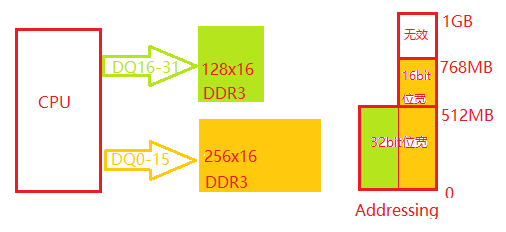
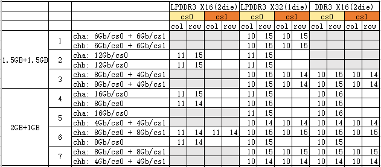

# **DDR PCB Layout Notes**

ID: RK-SM-YF-036

Release Version: V1.3.1

Date: 2021-02-25

Security Level: □Top-Secret   □Secret   □Internal   ■Public

**DISCLAIMER**

This document is provided "as is". Rockchip Electronics Co., Ltd. ("the Company") makes no express or implied representations or warranties regarding the accuracy, reliability, completeness, merchantability, fitness for a particular purpose, or non-infringement of any statements, information, or content in this document. This document is for reference only as a usage guide.

Due to product version upgrades or other reasons, this document may be updated or modified from time to time without any notice.

**Trademark Statement**

"Rockchip" is a registered trademark of the Company.

All other registered trademarks or trademarks mentioned in this document are owned by their respective owners.

**Copyright © 2021 Rockchip Electronics Co., Ltd.**

Beyond the scope of fair use, without the written permission of the Company, no individual or entity may excerpt, copy, or distribute any part or all of the content of this document in any form.

Rockchip Electronics Co., Ltd.

Address:     No. 18, Area A, Software Park, Tongpan Road, Fuzhou, Fujian Province

Website:     [www.rock-chips.com](http://www.rock-chips.com)

Customer Service Tel: +86-4007-700-590

Customer Service Fax: +86-591-83951833

Customer Service Email: [fae@rock-chips.com](mailto:fae@rock-chips.com)

---

**Preface**

**Overview**

Records DDR PCB layout notes for all platforms.

**Product Versions**

| **Chip Name** | **Kernel Version** |
| ------------- | ------------------ |
| All chips     | All kernel versions |

**Intended Audience**

This document (guide) is mainly applicable to the following engineers:

Hardware engineers

**Revision History**

| **Version** | **Author** | **Date**   | **Description**                                              |
| ----------- | ---------- | :--------- | ------------------------------------------------------------ |
| V1.0.0      | He Canyang | 2017-11-02 | Initial version                                              |
| V1.1.0      | Chen Wei   | 2017-11-09 | Changed some expressions                                     |
| V1.2.0      | Tang Yunping | 2018-01-14 | Added RK3326 description and LPDDR2/LPDDR3 requirements      |
| V1.3.0      | Chen Youmin | 2018-10-08 | Added total capacity 3GB note and RK3399 single-channel routing requirements |
| V1.3.1      | Huang Ying | 2021-02-25 | Format modification                                          |

---

**Table of Contents**

[TOC]

---

## Terminology

- **Component**: Refers to various DDR memories: DDR3 memory, DDR4 memory, LPDDR3 memory, LPDDR4 memory, LPDDR2 memory.

- **CS**: Chip select signal of the controller or DDR memory.

- **rank**: Same as CS, the chip select signal.

- **byte**: Every 8 DDR signal lines of the controller form a byte. So byte0 refers to DQ0-DQ7, byte1 to DQ8-DQ15, byte2 to DQ16-DQ23, byte3 to DQ24-DQ31. Note: DQ here refers to the controller's DQ; the component's DQ may not be connected one-to-one with the controller's DQ.

- **bank**: Refers to the number of banks in the DDR memory.

- **column**: Refers to the number of columns in the DDR memory.

- **row**: Refers to the number of rows in the DDR memory.

- **AXI SPLIT**: Asymmetric capacity combination mode, e.g., high address area is 16-bit wide, low address area is 32-bit wide. For example, a normal combination is 256x16+256x16, while an AXI SPLIT combination is 256x16+128x16=768MB, leaving only 16-bit width in the high address area, as shown in the diagram below.

  

## General Requirements

General requirements applicable to all platforms. Special requirements for each controller are listed separately below.

**1. DQ swapping must not exceed the byte group; swapping is only allowed within a byte. Some controllers have special requirements where even intra-byte swapping is not allowed (see specific controller requirements).**

**2. If DDR components with different bank/column counts on 2 CS pins are used, confirm support with software.**

**3. If a component has only one CS, it must be connected to the controller's CS0.**

**4. If only one channel is used, only channel 0 is supported.**

**5. If two CS components have different capacities, the smaller capacity should be connected to the controller's CS1.**

**6. All platforms do not support components with more than 2 CS pins.**

**7. If a component has only one ODT (like LPDDR3), it should be connected to ODT0.**

**8. Use of 6Gb and 12Gb is special (8Gb, 4Gb, 2Gb do not have this restriction).**

Currently, only configurations with both CS on one channel being 6Gb or both being 12Gb are supported. Mixing 6Gb/12Gb with 8Gb/4Gb/2Gb on two CS is not supported.
For example:

| CS0  | CS1  | Support                  |
| ---- | ---- | ------------------------ |
| 6Gb  | 6Gb  | Supported                |
| 12Gb | 12Gb | Supported                |
| 6Gb  | 12Gb | Not supported (violates rule 5, and this combination is not supported) |
| 12Gb | 6Gb  | Not supported            |
| 8Gb  | 6Gb  | Not supported (mixing 8Gb and 6Gb on 2 CS) |
| 12Gb | 8Gb  | Not supported (mixing 12Gb and 8Gb on 2 CS) |
| 6Gb  | 4Gb  | Not supported (mixing 6Gb and 4Gb on 2 CS) |
| 12Gb | 4Gb  | Not supported (mixing 12Gb and 4Gb on 2 CS) |

**9. Component RZQ pins cannot be shared.**

**10. DDR4 connection method currently has no special requirements.**

**11. When connecting external LPDDR2 or LPDDR3, DDR0 DQ0-DQ7 should be connected one-to-one to DRAM DQ0-DQ7.**

**12. Dual-channel DRAM total capacity 3GB support**
Component combinations supported for dual-channel DRAM total capacity 3GB are shown below:

  
  Note: 1) RK3288, RK3399 support dual-channel.

**13. Single-channel DRAM total capacity 3GB support**
Component combinations supported for single-channel DRAM total capacity 3GB are shown below:

  

## RK3399 Special Requirements

**1. CS2 is a replica of CS0, CS3 is a replica of CS1; their behavior is exactly the same as the replicated signal.**

**2. CLK trace must be longer than any DQS group in the same channel (ddr PHY requirement).**

**3. LPDDR3 D0-D15 must be connected one-to-one with the controller.**

**4. LPDDR3 D16 and D24 data lines must also be connected one-to-one with the controller.**

**5. Pay attention to the composition relationship between one controller channel and two LPDDR4 component channels.**

    
Using component Channel A + Channel C to form 32bit, and Channel B + Channel D to form 32bit, this method avoids ZQ sharing issues.

**6. LPDDR4 RZQ should be connected to VDDQ through a 240-ohm resistor, not GND. Note that the RK3399 controller side remains unchanged; RZQ is still connected to GND through a 240-ohm resistor.**

**7. When connecting LPDDR4, the controller-side DDR0_ODT0/1 and DDR1_ODT0/1 should be left floating, not connected to the LPDDR4 component. The component-side ODT_CA_X is pulled up to VDDQ by default through a 10K resistor; reserve a DNP pull-down resistor for now.**

**8. For LPDDR4, no data lines (DQ) may be swapped, whether within a group or between groups.**

**9. If only channel 0 is used, channel 1 also needs power supply.**

## RK3326, PX30 Special Requirements

**1. Supported bit-width combinations**

1. 32bit maximum width (large capacity 16bit + small capacity 16bit), e.g.: 256x16+128x16=768MB.
2. 16bit maximum width (large capacity 8bit + small capacity 8bit), e.g.: 512x8+256x8=768MB.

**2. Component requirements**

In AXI SPLIT mode, all components must have the same column and bank counts.

**3. Connection requirements**

1. In AXI SPLIT mode, when using 16-bit wide components, connect AP DDR controller byte0/1 to one component and byte2/3 to one component.
2. In AXI SPLIT mode, connect the larger capacity component to the low address area of the AP DDR controller, e.g., byte0 or byte0/1. For example: 16bit component a + 16bit component b form 32bit width; if component a has larger capacity, connect component a to byte0/1.
3. If using 2 CS, only CS1 supports AXI SPLIT, allowing two methods:
   1. Asymmetric capacity on CS1: e.g., if CS0 has 32bit total width, CS1 uses large 16bit + small 16bit components to form 32bit; if CS0 has 16bit total width, CS1 uses large 8bit + small 8bit components to form 16bit.
   2. CS1 only populates half-width components, requiring `row <= CS0` components. E.g., if CS0 is 32bit total width, CS1 populates 16bit components; if CS0 is 16bit total width, CS1 populates 8bit components.

**4. The following table lists all supported AXI SPLIT capacity combinations. AXI SPLIT combinations not in this table are not supported.**

| NO. | CS0                                              | CS1                                                          | Support |
| --- | ------------------------------------------------ | ------------------------------------------------------------ | ------- |
| 1   | 16bit maximum width (large 8bit + small 8bit)    | No component                                                 | Supported |
| 2   | 32bit maximum width (large 16bit + small 16bit)  | No component                                                 | Supported |
| 3   | 32bit fixed width                                | 32bit maximum width (large 16bit + small 16bit)              | Supported |
| 4   | 32bit fixed width                                | 16bit fixed width, connect Byte0/1 (`row <= cs0` component row) | Supported |
| 5   | 16bit fixed width                                | 16bit maximum width (large 8bit + small 8bit)                | Supported |
| 6   | 16bit fixed width                                | 8bit fixed width, connect Byte0 (`row <= cs0` component row) | Supported |

**5. Conventional applications are the same as other platforms.**
