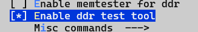
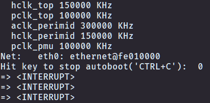
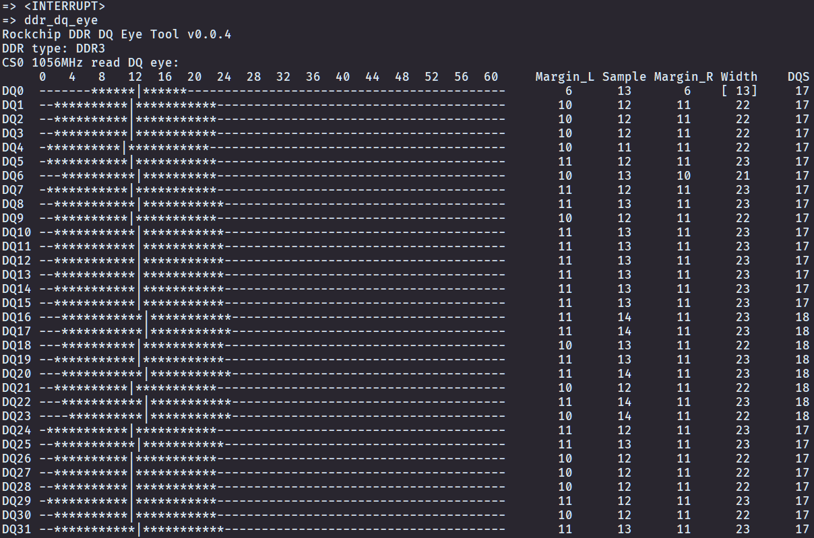
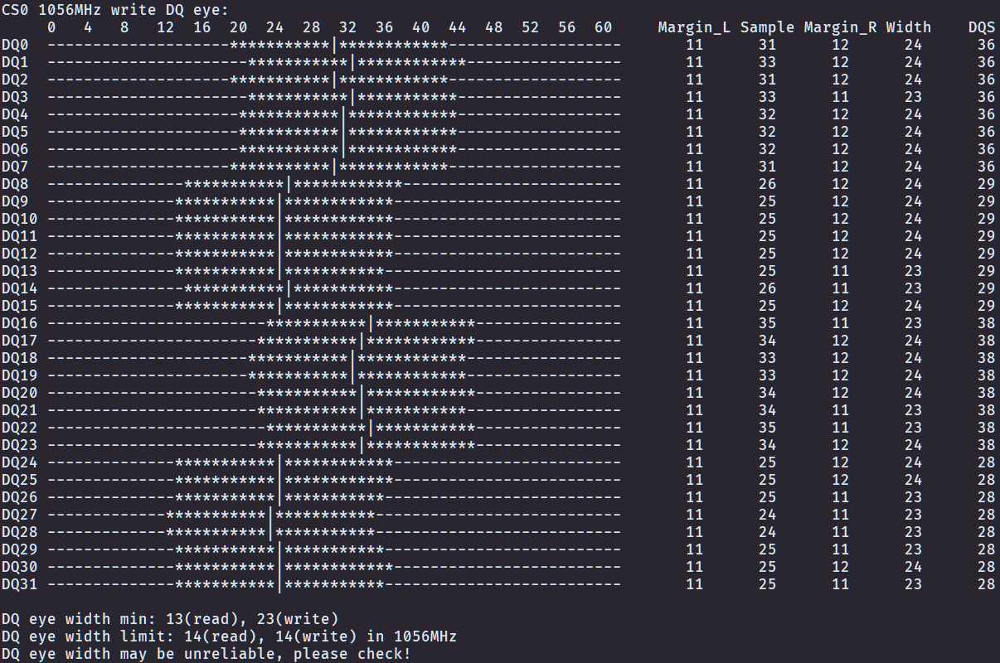

# Rockchip DDR DQ Eye Tool Guide

ID: RK-YH-YF-167

Release Version: V1.0.0

Date: 2021-03-05

Security Level: □Top-Secret   □Secret   □Internal   ■Public

**DISCLAIMER**

THIS DOCUMENT IS PROVIDED "AS IS". ROCKCHIP ELECTRONICS CO., LTD. ("ROCKCHIP") DOES NOT PROVIDE ANY WARRANTY OF ANY KIND, EXPRESSED, IMPLIED OR OTHERWISE, WITH RESPECT TO THE ACCURACY, RELIABILITY, COMPLETENESS, MERCHANTABILITY, FITNESS FOR ANY PARTICULAR PURPOSE OR NON-INFRINGEMENT OF ANY REPRESENTATION, INFORMATION AND CONTENT IN THIS DOCUMENT. THIS DOCUMENT IS FOR REFERENCE ONLY.

THIS DOCUMENT MAY BE UPDATED OR CHANGED WITHOUT ANY NOTICE AT ANY TIME DUE TO THE UPGRADES OF THE PRODUCT OR ANY OTHER REASONS.

**Trademark Statement**

"Rockchip", "Rockchip", "Rockchip" shall be Rockchip's registered trademarks and owned by Rockchip.

All other registered trademarks or trademarks mentioned in this document shall be owned by their respective owners.

**All rights reserved. © 2021. Rockchip Electronics Co., Ltd.**

Beyond the scope of fair use, no unit or individual may excerpt or copy any part or all of the content of this document without written permission from Rockchip, and may not distribute it in any form.

Rockchip Electronics Co., Ltd.

Address: No. 18, Area A, Software Park, Tongpan Road, Fuzhou, Fujian Province

Website: [www.rock-chips.com](http://www.rock-chips.com)

Customer Service Tel: +86-4007-700-590

Customer Service Fax: +86-591-83951833

Customer Service Email: [fae@rock-chips.com](mailto:fae@rock-chips.com)

---

**Preface**

**Overview**

The Rockchip DDR DQ Eye Tool provides the ability to view read/write eye diagrams for each DQ by entering commands under U-Boot.

**Product Versions**

| **Chip Name** | **Software Version** |
| ------------ | ------------ |
| RV1126  | U-Boot 2017.09 |
| RK356x | U-Boot 2017.09 |

**Intended Audience**

This document (this guide) is primarily intended for the following engineers:

Hardware Engineers

Technical Support Engineers

Software Development Engineers

**Revision History**

| **Version** | **Author**   | **Date**    | **Description** |
| ---------- | --------| :--------- | ------------ |
| V1.0.0      | Yao Xuwei | 2021-03-05 | Initial version |

---

**Table of Contents**

[TOC]

---

## Usage

### Preparation

1. Before building the U-Boot project, open menuconfig in the project root directory, go to Command line interface, configure Enable ddr test tool and save the build configuration (the Rockchip DDR DQ Eye Tool is integrated in the DDR Test Tool).

	

2. Build the U-Boot project and flash the Loader and uboot (refer to the "Build and Flash" related chapters in the UBOOT documentation).

3. Flash the Loader and uboot that support the DDR DQ Eye Tool (for RV1126 platform, you can flash the Loader packaged by the U-Boot project; for RK356x platform, please flash the Loader provided by Rockchip that supports this feature).

4. Connect the serial port of the board under test to the host PC, ensuring normal serial communication between the board and the host. When the board boots, the host should hold Ctrl + C to stop the board at U-Boot (the appearance of "`<INTERRUPT>`" indicates the board has stopped at U-Boot).

	

### Viewing DDR DQ Read/Write Eye Diagram Under U-Boot

Enter the command under U-Boot:

```shell
ddr_dq_eye <DDR frequency in MHz>
```

The parameter \<DDR frequency in MHz\> specifies the DDR clock frequency for which to view the DQ eye diagram, in MHz. When left blank, the default is the maximum frequency.

- Example: To view the DQ eye diagram at DDR clock frequency of 1056MHz, enter the command under U-Boot:

	```shell
	ddr_dq_eye 1056
	```

- Example: To view the DQ eye diagram at the maximum DDR clock frequency, enter the command under U-Boot:

	```shell
	ddr_dq_eye
	```

### Output Result Analysis





- The tool first outputs tool version, DDR type, frequency, and other information.
- The tool outputs read eye diagrams and write eye diagrams for each CS separately.
- In the eye diagram output, positions marked with "-" are outside the eye, positions marked with "*" are inside the eye, and positions marked with "|" are sampling points.
- The right side of the eye diagram shows the margins from the sampling point to the left and right boundaries of the eye (Margin_L, Margin_R), the sampling point position (Sample), eye width (Width), and other information. Eye widths marked in square brackets do not meet the minimum eye width limit (as shown for read eye diagram DQ0 in the figure).
- The tool finally outputs the minimum eye width for both read and write eye diagrams, along with the minimum eye width limit value (selecting the closest frequency).

## DDR DQ Minimum Eye Width Limits

Based on DEMO testing and relevant project experience, this document sets corresponding limits for the minimum read/write eye width of DDR DQ. If the minimum read/write eye width does not meet this limit, DDR operation may be unstable.

> Meeting the DDR DQ minimum eye width limit only indicates that the DDR DQ eye width is relatively reliable under the current design. It does not mean that the DDR-related design definitely has no other issues. Please conduct further reliability testing according to actual usage requirements.

### RV1126 DDR DQ Minimum Eye Width Limit Values

| DDR Type | DDR Clock Frequency | Min Read Eye Width Limit | Min Write Eye Width Limit |
| -------- | ------------ | ---------------- | ---------------- |
| LPDDR4   | 1056MHz      | 12               | 13               |
| LPDDR4   | 924MHz       | 15               | 15               |
| DDR4     | 1056MHz      | 13               | 9                |
| DDR4     | 924MHz       | 15               | 11               |
| LPDDR3   | 1056MHz      | 15               | 13               |
| LPDDR3   | 924MHz       | 16               | 15               |
| DDR3     | 1056MHz      | 14               | 14               |
| DDR3     | 924MHz       | 17               | 17               |

### RK356x DDR DQ Minimum Eye Width Limit Values

| DDR Type | DDR Clock Frequency | Min Read Eye Width Limit | Min Write Eye Width Limit |
| -------- | ------------ | ---------------- | ---------------- |
| LPDDR4   | 1560MHz      | 25               | 24               |
| LPDDR4   | 1184MHz      | 30               | 29               |
| DDR4     | 1560MHz      | 30               | 22               |
| DDR4     | 1184MHz      | 32               | 26               |
| LPDDR3   | 1184MHz      | 34               | 25               |
| LPDDR3   | 1056MHz      | 39               | 28               |
| DDR3     | 1184MHz      | 32               | 31               |
| DDR3     | 1056MHz      | 39               | 34               |
