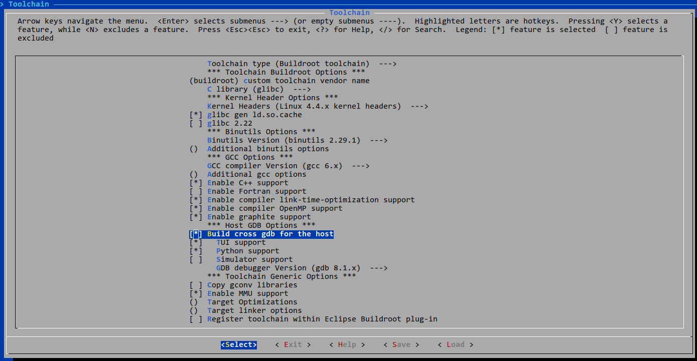
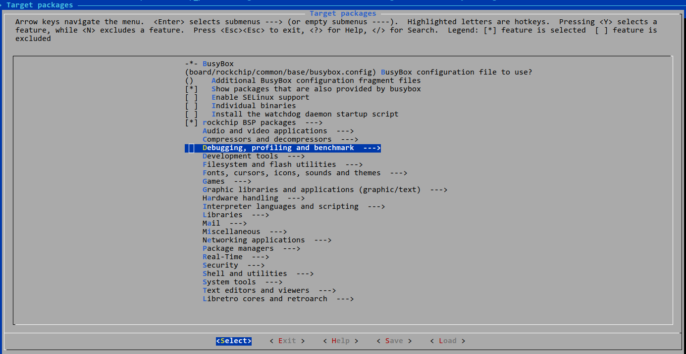
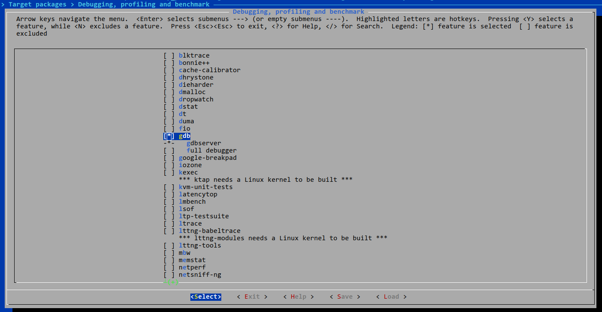
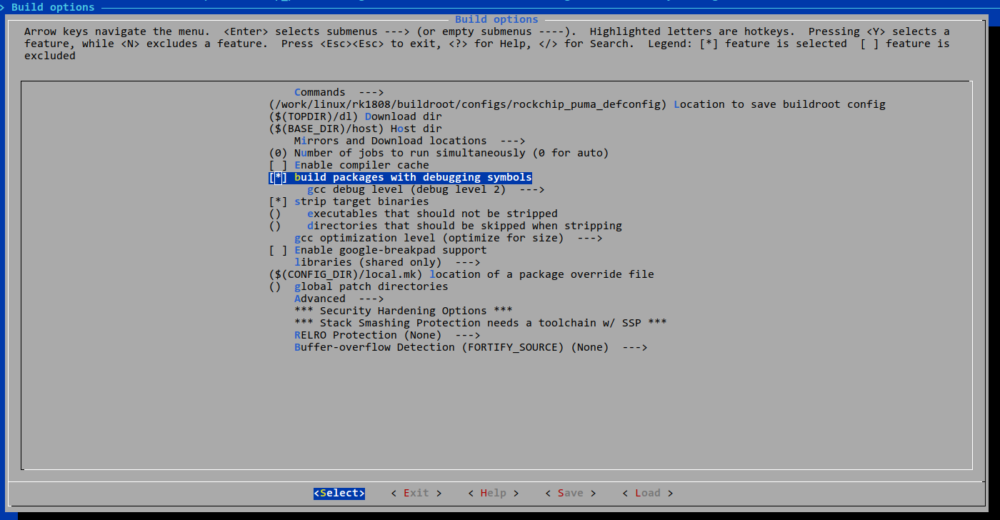

# GDB Over ADB Developer Guide

Release Version: 1.0

Author Email: cody.xie@rock-chips.com

Date: 2019.06

Security Level: Internal

------

**Preface**

**Overview**

GDB Over ADB Developer Guide.

**Intended Audience**

This document (this guide) is primarily intended for the following engineers:

Technical Support Engineers

Software Development Engineers

**Product Versions**

**Revision History**

| **Date**   | **Version** | **Author**  | **Description** |
| ---------- | ---------- | ----------- | --------------- |
| 2019-06-18 | V1.0       | Cody Xie    | Initial version |

------

[TOC]

------

## Buildroot Configuration

Configure and enable the gdb host program



Configure the gdbserver program



Selecting gdbserver is sufficient here



Configure the buildroot package to be built with debug information. If buildroot has "strip target binaries" configured, it does not affect the final packages in the target, only the staging directory. This is equivalent to Android's symbol directory vs. the final directory.



## Launching GDB over ADB

1. Configure ADB port forwarding

   ```console
   adb forward tcp:1337 tcp:1337
   ```

2. Launch the GDB Server program

   Execute in adb shell or serial console:

   ```console
   gdbserver :1337 --attach COM PID # COM is the full path and arguments of the program to execute, PID is the process ID
   # or
   gdbserver :1337 COM
   # for example
   gdbserver :1337 /bin/busybox ls
   Process /bin/busybox created; pid = 633
   Listening on port 1337
   Remote debugging from host 127.0.0.1
   Remote side has terminated connection.  GDBserver will reopen the connection.
   Listening on port 1337
   Remote debugging from host 127.0.0.1
   bin             lib32           proc            tmp
   busybox.config  linuxrc         root            udisk
   config          lost+found      run             userdata
   data            media           sbin            usr
   dev             misc            sdcard          var
   etc             mnt             sys
   init            oem             system
   lib             opt             timestamp

   Child exited with status 0
   ```

3. GDB client debugging

   ```
   $ ./buildroot/output/rockchip_puma/host/bin/arm-buildroot-linux-gnueabihf-gdb
   GNU gdb (GDB) 8.1.1
   Copyright (C) 2018 Free Software Foundation, Inc.
   License GPLv3+: GNU GPL version 3 or later <http://gnu.org/licenses/gpl.html>
   This is free software: you are free to change and redistribute it.
   There is NO WARRANTY, to the extent permitted by law.  Type "show copying"
   and "show warranty" for details.
   This GDB was configured as "--host=x86_64-pc-linux-gnu --target=arm-buildroot-linux-gnueabihf".
   Type "show configuration" for configuration details.
   For bug reporting instructions, please see:
   <http://www.gnu.org/software/gdb/bugs/>.
   Find the GDB manual and other documentation resources online at:
   <http://www.gnu.org/software/gdb/documentation/>.
   For help, type "help".
   Type "apropos word" to search for commands related to "word".
   (gdb) set sysroot /work/linux/rk1808/buildroot/output/rockchip_puma/staging/
   warning: .dynamic section for "/work/linux/rk1808/buildroot/output/rockchip_puma/staging/lib/ld-linux-armhf.so.3" is not at the expected address (wrong library or version mismatch?)
   Reading symbols from /work/linux/rk1808/buildroot/output/rockchip_puma/staging/lib/ld-linux-armhf.so.3...done.
   Reading symbols from /work/linux/rk1808/buildroot/output/rockchip_puma/staging/lib/libc.so.6...done.
   (gdb) target remote :1337
   Remote debugging using :1337
   Reading /bin/busybox from remote target...
   warning: File transfers from remote targets can be slow. Use "set sysroot" to access files locally instead.
   Reading /bin/busybox from remote target...
   Reading symbols from target:/bin/busybox...(no debugging symbols found)...done.
   Reading /lib/ld-linux-armhf.so.3 from remote target...
   Reading /lib/ld-linux-armhf.so.3 from remote target...
   Reading symbols from target:/lib/ld-linux-armhf.so.3...(no debugging symbols found)...done.
   0xf72fcbc0 in _start () from target:/lib/ld-linux-armhf.so.3
   ```
