# OpenOCD User Guide

Release Version: 1.0

Author Email: jason.zhu@rock-chips.com

Date: 2019.06

Security Level: Internal

------

**Preface**

**Overview**

OpenOCD User Guide.

**Intended Audience**

This document (guide) is mainly applicable to the following engineers:

Technical Support Engineers

Software Development Engineers

**Product Versions**

**Revision History**

| **Date**     | **Version** | **Author**  | **Description** |
| ------------ | ----------- | ----------- | --------------- |
| 2019-06-04   | V1.0        | Jason Zhu   | Initial version |

------

[TOC]

------

## References

[1] https://blog.csdn.net/zhengyangliu123/article/details/54934719

[2] ["Open On-Chip Debugger: OpenOCD User's Guide"](http://openocd.org/documentation/)

## Terminology

OpenOCD: OpenOCD is software for JTAG debugging. It supports various debuggers and CPUs and can work with GDB. It is open source.

FT2232HL: A chip manufactured by FTDI. It can implement USB to dual serial UART, FIFO, Bit-Bang IO interfaces, and can also be configured as MPSSE, I2C, JTAG, and SPI buses.

J-Link: A JTAG emulator produced by SEGGER for emulating ARM core chips.

GDB: [The GNU Project Debugger](http://www.gnu.org/software/gdb/), a powerful program debugging tool for UNIX released by the GNU open-source organization.

## Test Platform

STM32F103 development board

FT2232HL emulator

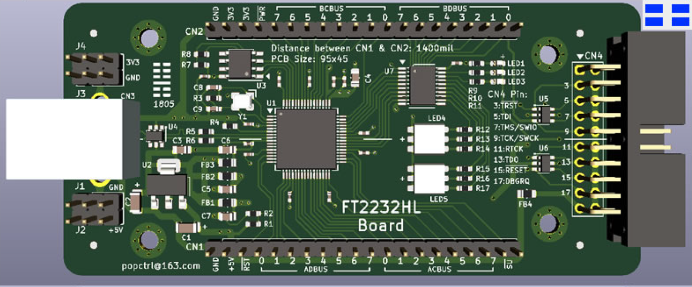

J-Link emulator

## Introduction

This document describes how to debug a development board using OpenOCD. Emulators include the FT2232HL emulator and J-Link.

## Driver Installation

### FT2232HL Windows Driver Installation

1. Connect the FT2232HL debug board to the PC. The following two serial ports will appear:

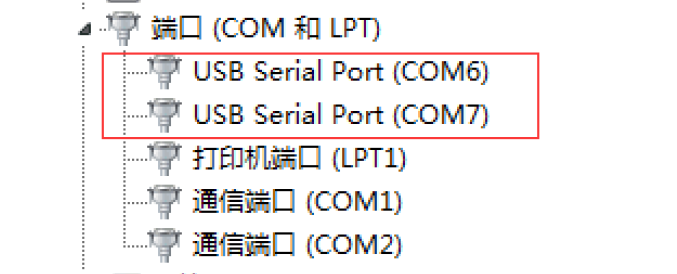

If they do not appear, download the appropriate driver from the [FTDI](https://www.ftdichip.com/) website.

2. Install and run FT_Prog.exe:

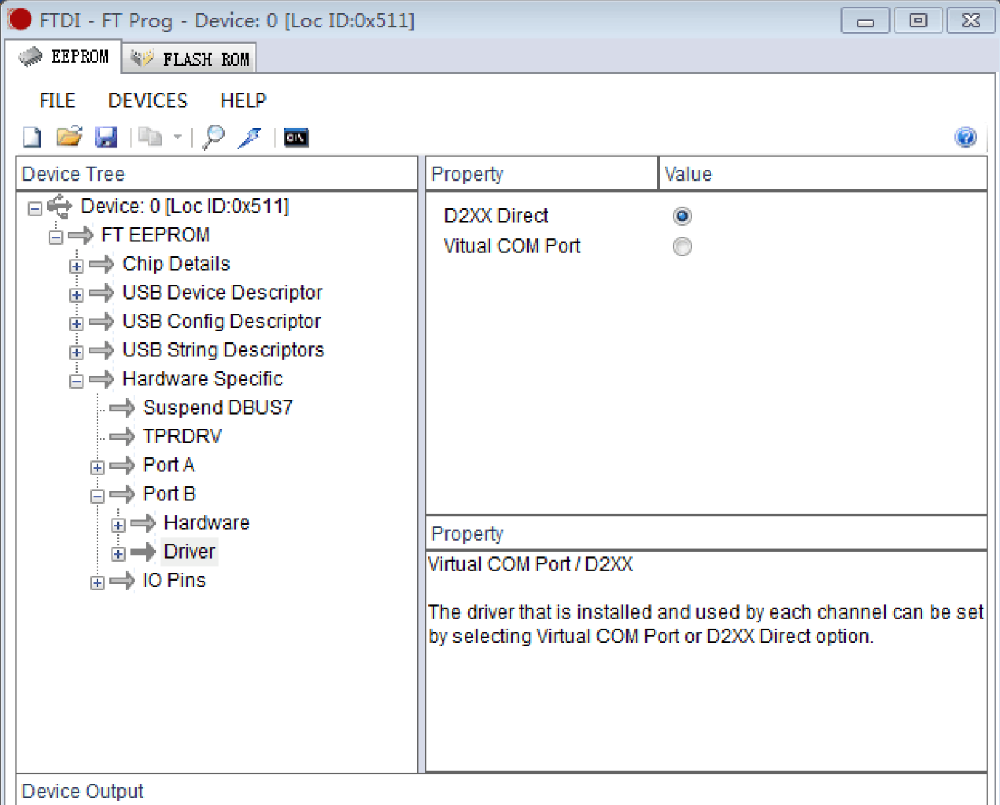

Select as shown above, then download the firmware to the FT2232HL debug board.

3. Run UsbDriverTool.exe (available for download online):

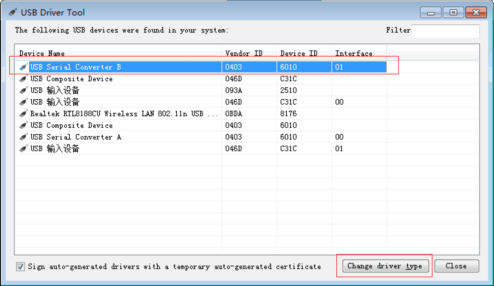

Select USB Serial Converter B, double-click to open the following dialog:

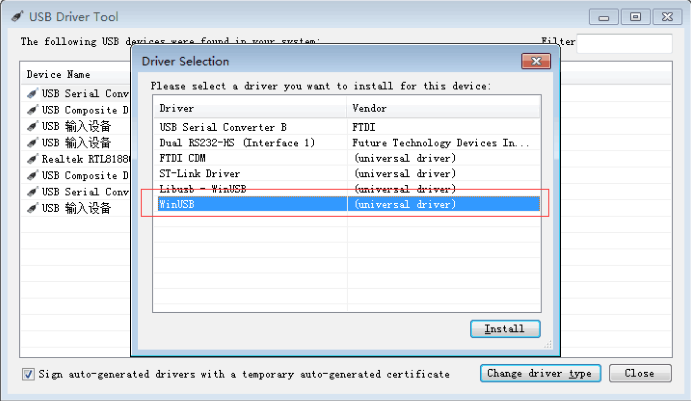

Install the WinUSB driver.

### FT2232HL Linux Driver Installation

Create a new file named 99-openocd.rules with the following content:

```
SUBSYSTEM=="tty", ATTRS{idVendor}=="0403",ATTRS{idProduct}=="6010", MODE="664", GROUP="plugdev"
SUBSYSTEM=="tty", ATTRS{idVendor}=="15ba",ATTRS{idProduct}=="002a", MODE="664", GROUP="plugdev"
SUBSYSTEM=="usb", ATTR{idVendor}=="0403",ATTR{idProduct}=="6010", MODE="664", GROUP="plugdev"
SUBSYSTEM=="usb", ATTR{idVendor}=="15ba",ATTR{idProduct}=="002a", MODE="664", GROUP="plugdev"
```

Copy this file to the /etc/udev/rules.d/ directory.

## FT2232HL Windows Debugging

In PowerShell, enter:

```
openocd -f ftdi.cfg -f stm32f1x.cfg -c "halt" -c "flash write_image erase u-boot.bin 0x08000000 bin" -c "reset"
```

Log output:

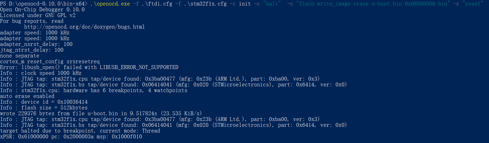

Indicates successful connection to the device.

## FT2232HL Linux Debugging

### Program Download

In the shell, enter:

```
openocd -f ftdi.cfg -f stm32f1x.cfg -c init -c "halt"  -c "flash write_image erase u-boot.bin 0x08000000 bin" -c "reset"
```

Log output:

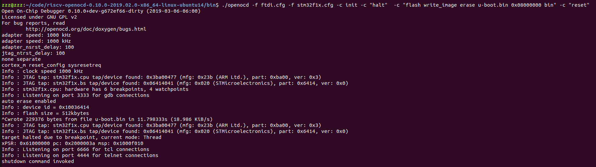

### Telnet Debugging

In a shell, enter:

```
=> openocd -f ftdi.cfg -f stm32f1x.cfg
Open On-Chip Debugger 0.10.0+dev-g672ef66-dirty (2019-03-06-06:00)
Licensed under GNU GPL v2
For bug reports, read
	http://openocd.org/doc/doxygen/bugs.html
adapter speed: 1000 kHz
adapter speed: 1000 kHz
adapter_nsrst_delay: 100
jtag_ntrst_delay: 100
none separate
cortex_m reset_config sysresetreq
Info : Listening on port 6666 for tcl connections
Info : Listening on port 4444 for telnet connections
Info : clock speed 1000 kHz
Info : JTAG tap: stm32f1x.cpu tap/device found: 0x3ba00477 (mfg: 0x23b (ARM Ltd.), part: 0xba00, ver: 0x3)
Info : JTAG tap: stm32f1x.bs tap/device found: 0x06414041 (mfg: 0x020 (STMicroelectronics), part: 0x6414, ver: 0x0)
Info : stm32f1x.cpu: hardware has 6 breakpoints, 4 watchpoints
Info : Listening on port 3333 for gdb connections
Info : accepting 'telnet' connection on tcp/4444
```

In another shell, enter:

```
=> telnet localhost 4444
Trying 127.0.0.1...
Connected to localhost.
Escape character is '^]'.
Open On-Chip Debugger
>
```

Enter help to view supported commands:

```
> help
adapter
      adapter command group (command valid any time)
  adapter usb
        usb adapter command group (command valid any time)
    adapter usb location <bus>-port[.port]...
          set the USB bus location of the USB device (configuration
          command)
adapter_khz [khz]
      With an argument, change to the specified maximum jtag speed.  For
      JTAG, 0 KHz signifies adaptive clocking. With or without argument,
      display current setting. (command valid any time)
adapter_name
      Returns the name of the currently selected adapter (driver) (command
      valid any time)
adapter_nsrst_assert_width [milliseconds]
      delay after asserting SRST in ms (command valid any time)
adapter_nsrst_delay [milliseconds]
      delay after deasserting SRST in ms (command valid any time)
add_help_text command_name helptext_string
      Add new command help text; Command can be multiple tokens. (command
      valid any time)
add_script_search_dir <directory>
      dir to search for config files and scripts (command valid any time)
add_usage_text command_name usage_string
      Add new command usage text; command can be multiple tokens. (command
      valid any time)
```

### GDB Debugging

In a shell, enter:

```
=> openocd -f ftdi.cfg -f stm32f1x.cfg
Open On-Chip Debugger 0.10.0+dev-g672ef66-dirty (2019-03-06-06:00)
Licensed under GNU GPL v2
For bug reports, read
	http://openocd.org/doc/doxygen/bugs.html
adapter speed: 1000 kHz
adapter speed: 1000 kHz
adapter_nsrst_delay: 100
jtag_ntrst_delay: 100
none separate
cortex_m reset_config sysresetreq
Info : Listening on port 6666 for tcl connections
Info : Listening on port 4444 for telnet connections
Info : clock speed 1000 kHz
Info : JTAG tap: stm32f1x.cpu tap/device found: 0x3ba00477 (mfg: 0x23b (ARM Ltd.), part: 0xba00, ver: 0x3)
Info : JTAG tap: stm32f1x.bs tap/device found: 0x06414041 (mfg: 0x020 (STMicroelectronics), part: 0x6414, ver: 0x0)
Info : stm32f1x.cpu: hardware has 6 breakpoints, 4 watchpoints
Info : Listening on port 3333 for gdb connections
Info : accepting 'gdb' connection on tcp/3333
```

In another shell, enter:

```
=> arm-none-eabi-gdb LED_project.elf
GNU gdb (Linaro GDB 2017.01) 7.12.1.20170126-git
Copyright (C) 2017 Free Software Foundation, Inc.
License GPLv3+: GNU GPL version 3 or later <http://gnu.org/licenses/gpl.html>
This is free software: you are free to change and redistribute it.
There is NO WARRANTY, to the extent permitted by law.  Type "show copying"
and "show warranty" for details.
This GDB was configured as "--host=x86_64-unknown-linux-gnu --target=arm-none-eabi".
Type "show configuration" for configuration details.
For bug reporting instructions, please see:
<http://www.gnu.org/software/gdb/bugs/>.
Find the GDB manual and other documentation resources online at:
<http://www.gnu.org/software/gdb/documentation/>.
For help, type "help".
Type "apropos word" to search for commands related to "word"...
Reading symbols from LED_project.elf...done.
(gdb)
```

Enter target remote localhost:3333:

```
(gdb) target remote localhost:3333
Remote debugging using localhost:3333
0x00554e46 in ?? ()
(gdb)
```

Download the program:

```
(gdb) monitor reset
JTAG tap: stm32f1x.cpu tap/device found: 0x3ba00477 (mfg: 0x23b (ARM Ltd.), part: 0xba00, ver: 0x3)
JTAG tap: stm32f1x.bs tap/device found: 0x06414041 (mfg: 0x020 (STMicroelectronics), part: 0x6414, ver: 0x0)
stm32f1x.cpu -- clearing lockup after double fault
target halted due to debug-request, current mode: Handler HardFault
xPSR: 0x01000003 pc: 0x00554e46 msp: 0xffffffe4
Polling target stm32f1x.cpu failed, trying to reexamine
stm32f1x.cpu: hardware has 6 breakpoints, 4 watchpoints
(gdb) monitor halt
(gdb) load
Loading section .note.gnu.build-id, size 0x24 lma 0x8000000
Loading section .isr_vector, size 0x134 lma 0x8000024
Loading section .text, size 0x14c8 lma 0x8000158
Loading section .init_array, size 0x4 lma 0x8001620
Loading section .fini_array, size 0x4 lma 0x8001624
Loading section .data, size 0x28 lma 0x8001628
Loading section .co_stack, size 0x400 lma 0x8001650
Start address 0x80015a0, load size 6736
Transfer rate: 4 KB/sec, 962 bytes/write.
(gdb)
```

GDB debugging:

```
(gdb) c
Continuing.
Program received signal SIGINT, Interrupt.
0x080015b2 in Default_Reset_Handler () at USER/CoIDE_startup.c:228
228	    *(pulDest++) = *(pulSrc++);
(gdb) s
226	  for(pulDest = &_sdata; pulDest < &_edata; )
(gdb)
```

Output from the other shell:

```
Open On-Chip Debugger 0.10.0+dev-g672ef66-dirty (2019-03-06-06:00)
Licensed under GNU GPL v2
For bug reports, read
	http://openocd.org/doc/doxygen/bugs.html
adapter speed: 1000 kHz
adapter speed: 1000 kHz
adapter_nsrst_delay: 100
jtag_ntrst_delay: 100
none separate
cortex_m reset_config sysresetreq
Info : Listening on port 6666 for tcl connections
Info : Listening on port 4444 for telnet connections
Info : clock speed 1000 kHz
Info : JTAG tap: stm32f1x.cpu tap/device found: 0x3ba00477 (mfg: 0x23b (ARM Ltd.), part: 0xba00, ver: 0x3)
Info : JTAG tap: stm32f1x.bs tap/device found: 0x06414041 (mfg: 0x020 (STMicroelectronics), part: 0x6414, ver: 0x0)
Info : stm32f1x.cpu: hardware has 6 breakpoints, 4 watchpoints
Error: stm32f1x.cpu -- clearing lockup after double fault
Polling target stm32f1x.cpu failed, trying to reexamine
Info : stm32f1x.cpu: hardware has 6 breakpoints, 4 watchpoints
Info : Listening on port 3333 for gdb connections
Info : accepting 'gdb' connection on tcp/3333
Info : device id = 0x10036414
Info : flash size = 512kbytes
Error: JTAG-DP STICKY ERROR
Error: Failed to read memory at 0x00554e48
Error: JTAG-DP STICKY ERROR
Error: Failed to read memory at 0x00554e48
Info : JTAG tap: stm32f1x.cpu tap/device found: 0x3ba00477 (mfg: 0x23b (ARM Ltd.), part: 0xba00, ver: 0x3)
Info : JTAG tap: stm32f1x.bs tap/device found: 0x06414041 (mfg: 0x020 (STMicroelectronics), part: 0x6414, ver: 0x0)
Error: stm32f1x.cpu -- clearing lockup after double fault
target halted due to debug-request, current mode: Handler HardFault
xPSR: 0x01000003 pc: 0x00554e46 msp: 0xffffffe4
Polling target stm32f1x.cpu failed, trying to reexamine
Info : stm32f1x.cpu: hardware has 6 breakpoints, 4 watchpoints
Info : JTAG tap: stm32f1x.cpu tap/device found: 0x3ba00477 (mfg: 0x23b (ARM Ltd.), part: 0xba00, ver: 0x3)
Info : JTAG tap: stm32f1x.bs tap/device found: 0x06414041 (mfg: 0x020 (STMicroelectronics), part: 0x6414, ver: 0x0)
target halted due to debug-request, current mode: Handler HardFault
xPSR: 0x01000003 pc: 0x00554e46 msp: 0xffffffe4
Info : JTAG tap: stm32f1x.cpu tap/device found: 0x3ba00477 (mfg: 0x23b (ARM Ltd.), part: 0xba00, ver: 0x3)
Info : JTAG tap: stm32f1x.bs tap/device found: 0x06414041 (mfg: 0x020 (STMicroelectronics), part: 0x6414, ver: 0x0)
target halted due to debug-request, current mode: Thread
xPSR: 0x61000000 pc: 0x2000003a msp: 0xffffffe4
```

Result:

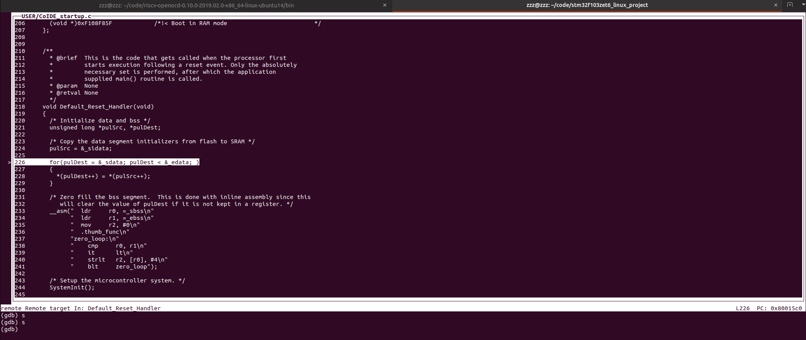

## J-Link Support

In Linux shell, enter:

```
openocd -f jlink.cfg -f stm32f1x.cfg -c init -c "halt"  -c "flash write_image erase u-boot.bin 0x08000000 bin" -c "reset"
```

Log output:

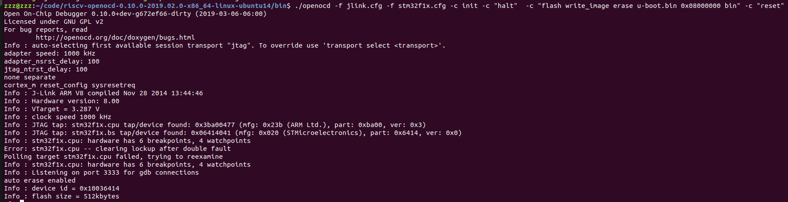

Other commands are the same as in section 7 FT2232HL Linux Debugging.

## OpenOCD Commands

In the shell, enter openocd --help to view supported commands. Log output:

```
Open On-Chip Debugger 0.10.0+dev-g672ef66-dirty (2019-03-06-06:00)
Licensed under GNU GPL v2
For bug reports, read
	http://openocd.org/doc/doxygen/bugs.html
Open On-Chip Debugger
Licensed under GNU GPL v2
--help       | -h	display this help
--version    | -v	display OpenOCD version
--file       | -f	use configuration file <name>
--search     | -s	dir to search for config files and scripts
--debug      | -d	set debug level to 3
             | -d<n>	set debug level to <level>
--log_output | -l	redirect log output to file <name>
--command    | -c	run <command>
```

1. -h

View OpenOCD command help.

2. -v

View OpenOCD version, e.g.:

```
=> openocd -v
Open On-Chip Debugger 0.10.0+dev-g672ef66-dirty (2019-03-06-06:00)
Licensed under GNU GPL v2
For bug reports, read
	http://openocd.org/doc/doxygen/bugs.html
```

3. -f

Followed by a configuration file. Can be used to detect if a board is connected, e.g.:

Connected test board log:

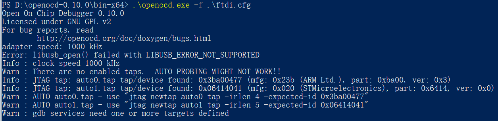

Not connected test board log:

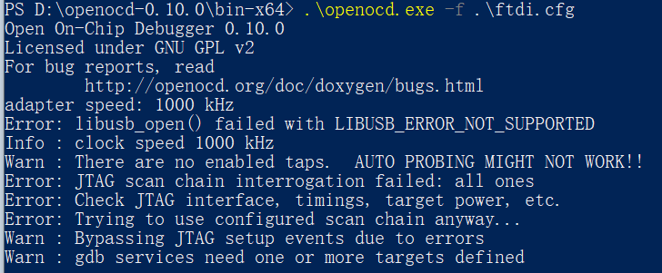

4. -d

Set debug level.

5. -l

Followed by a log output file.

6. -c

Followed by a command, e.g.:

```
openocd -f jlink.cfg -f stm32f1x.cfg -c init -c "halt"  -c "flash write_image erase u-boot.bin 0x08000000 bin" -c "reset"
```

## Eclipse Support

To-do

## Rockchip Chip Support

To-do
