# **J-Link User Guide**

Release Version: 1.0

Author Email: andy.yan@rock-chips.com

Date: 2019.05

Security Level: Public

**Intended Audience**

This document (this guide) is mainly intended for the following engineers:

Engineers who use J-Link for Cortex M series chip development and debugging

**Revision History**

| **Date**   | **Version** | **Author** | **Description** |
| ---------- | -------- | -------- | ------------ |
| 2019-05-16 | V1.0     | Andy Yan | Initial version     |

---
[TOC]
---

## **Introduction**

J-Link is a debug tool produced by the German company [SEGGER](<https://www.segger.com/products/debug-probes/j-link/>). It supports a large number of embedded target platforms such as ARM7/9/11, Cortex-M/R/A, and RISC-V. The accompanying PC software can run on Windows/Linux/Mac systems.

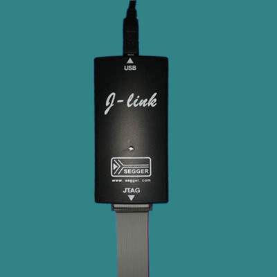

J-Link mainly provides two functions:

1. Program loading: programs can be loaded into the target platform's RAM or downloaded to flash (requires a specific flash programming algorithm).
2. System trace debug: you can view the target platform's running status, registers, and memory data.

## **J-Link Command Line Tool**

SEGGER provides a cross-platform command line tool, which can be used as long as the J-Link Software and Documentation Pack is downloaded and installed.

[Download URL](<https://www.segger.com/downloads/jlink/#J-LinkSoftwareAndDocumentationPack>)

The command line tool is called J-Link Commander on Windows and is an executable file JLinkExe on Linux.

* **Startup**

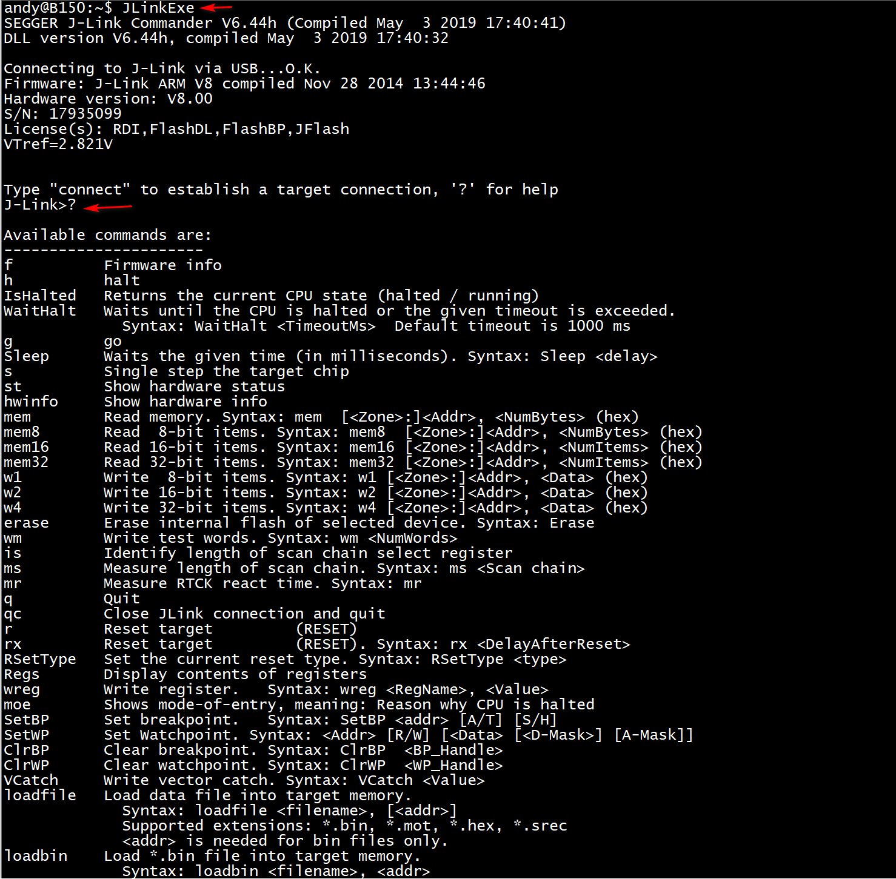

Enter "?" on the command line to list all supported commands.

* **Connect**

  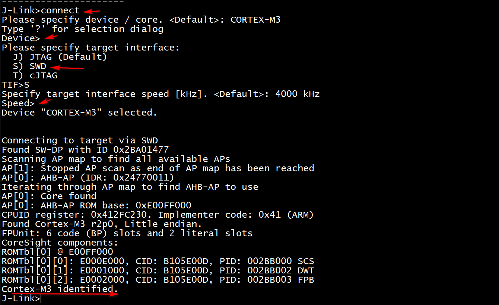

Enter the connect command to connect, then press Enter to select "SWD", and press Enter again to see the chip recognition information.

* **Load Program and Run**

  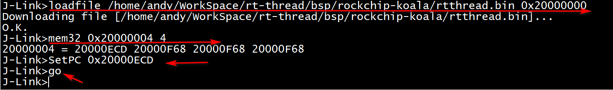

Use the loadefile or loadbin command to load the program. Note that you must specify the load address.

Since the startup code of Cortex M chips places the vector table at the very beginning, where the first word holds the stack address and the second word holds the entry address of the reset handler (Reset_Handler), you need to use the mem32 command to read out this address, then use the SetPC command to set the CPU run address to this position, and use the go command to start execution.

## Using with Ozone

When using J-Link, a host software on the PC side is required to work with it. For those using IDEs such as Keil or IAR for code development, these two software packages already provide complete functionality from code writing and compilation to downloading and debug tracing. However, these IDEs have a limitation in debugging: the debug cannot be independent from code compilation. If your code is compiled with other tools (such as GCC), or when you are facing a target board to be debugged and analyzed, and your computer does not have the source code of the platform to be debugged, and you just want to connect the J-Link and load the symbol table for debugging analysis, these IDEs cannot meet the need. Here we recommend using [Ozone](https://www.segger.com/products/development-tools/ozone-j-link-debugger/), which can well meet these requirements.

Ozone is a debug and performance analysis tool launched by SEGGER that works with J-Link. It is cross-platform (Windows/Linux/Mac), with an installation package size of only about 20M, yet it provides comprehensive functionality — compact and powerful.

* **Startup**

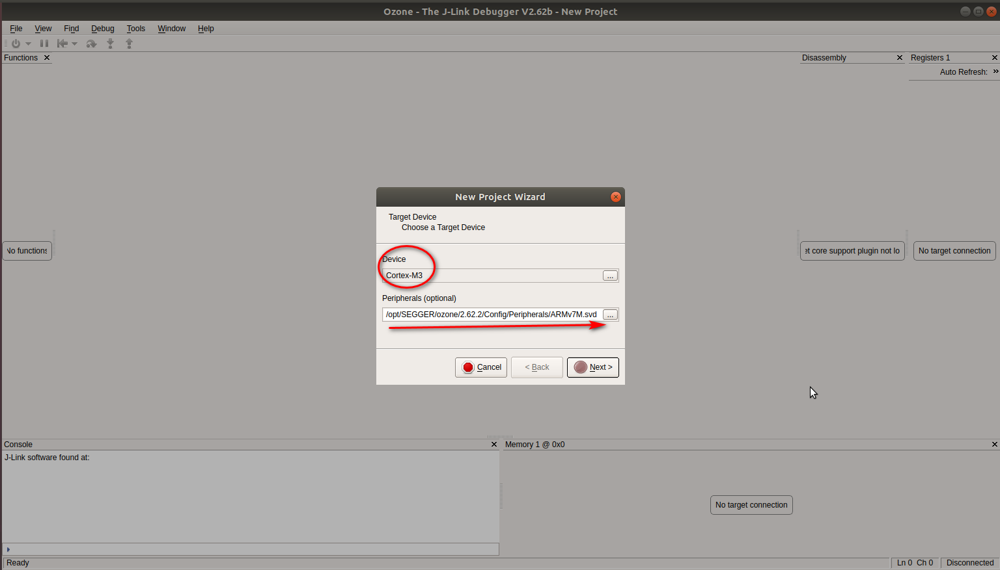

Device: Select based on the target board chip's core, e.g., Cortex-M3/Cortex-M4

Peripherals: Select the corresponding svd file based on the target board chip. In fact, this file can be customized. We can add other on-chip peripherals according to the specific chip design.

* **J-Link Settings**

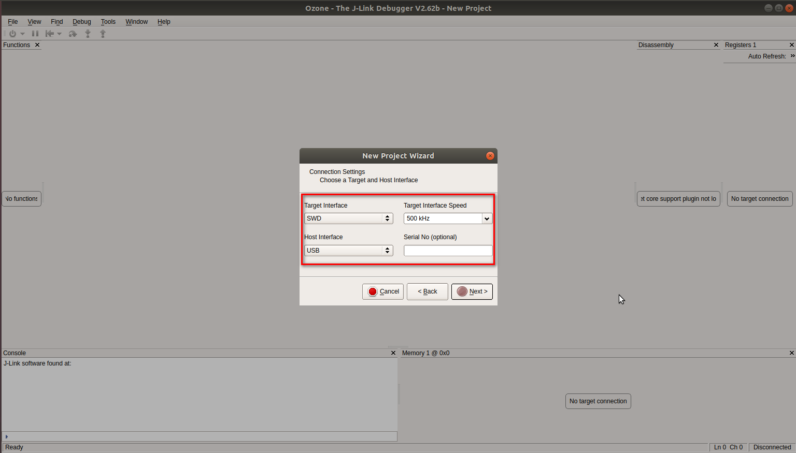

Target Interface: Our chip's JTAG port generally uses the two-wire mode, so select SWD.

Target Interface Speed: First select a relatively low speed. After a successful connection, it will automatically adjust to a higher speed.

Host Interface: Generally, J-Link is connected to the PC via USB, so select USB.

Serial No: This is used when multiple J-Links are connected to the PC. Generally, no selection is needed here.

* **Select the Program to Debug**

  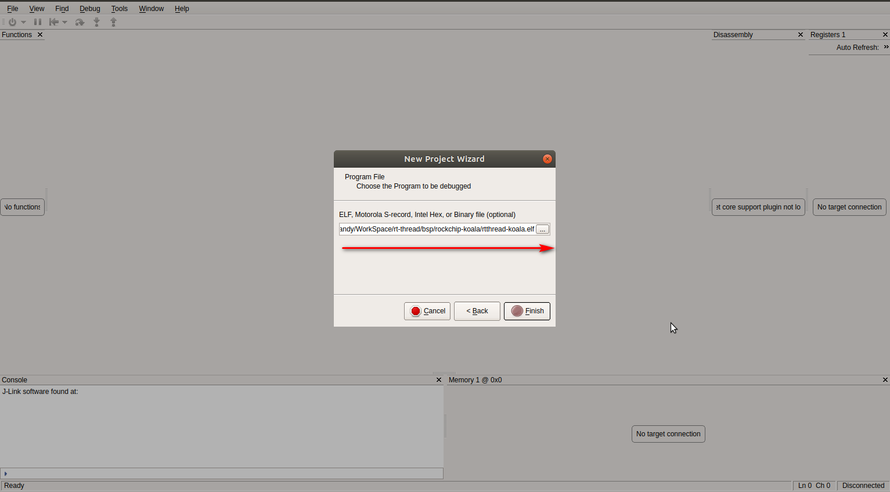

  Here we generally choose the ELF format symbol table.

* **Enter the Main Interface**

  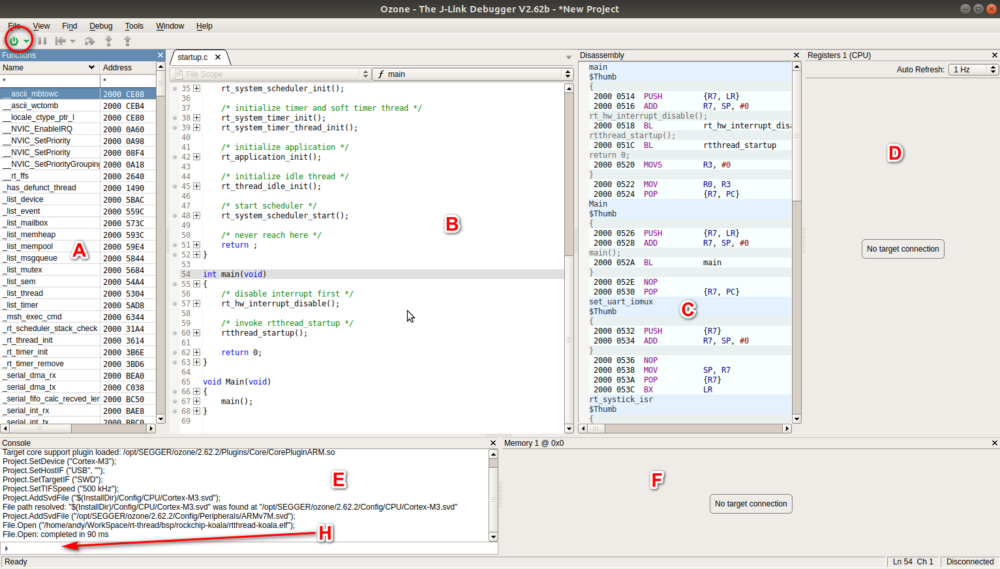

The power icon in the upper left corner is the Debug toggle button.

A: Function list

B: Source code. If the source code location can be found on the current computer based on the information in the symbol table, it will be loaded.

C: Assembly

D: After J-Link is connected, register information will be displayed.

E: Console log

F: After J-Link is connected, memory can be dumped.

H: This is a console where commands can be entered. Although the space is small, many functions can be customized.

* **Command Line**

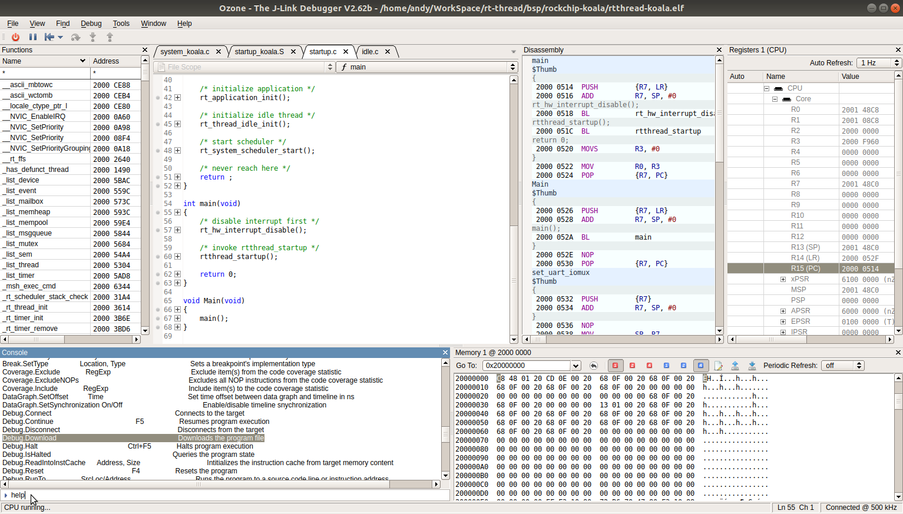

Enter help to see the various supported commands.

* **Program Download and Run**

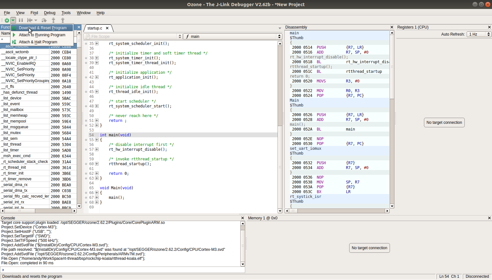

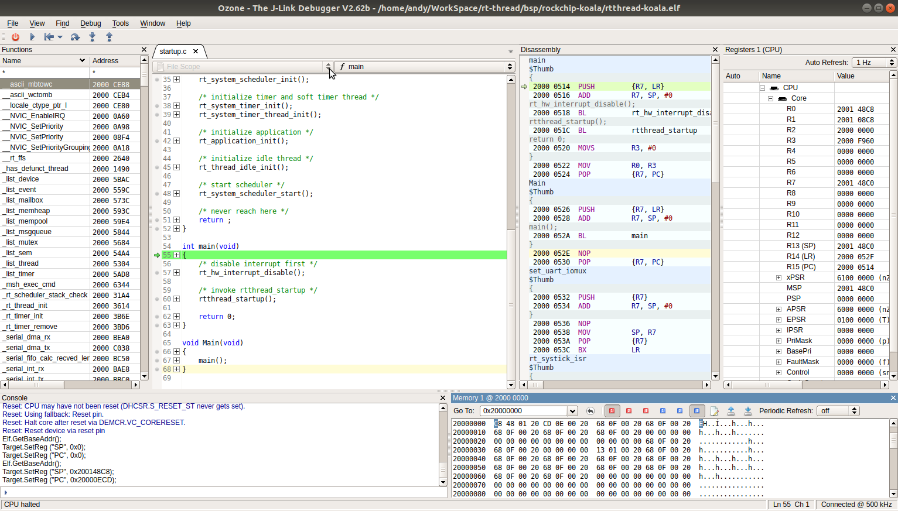

Select Download & Reset Program. Ozone will parse the program run address in the elf file, load it into the corresponding location in memory, jump there to start execution, and then stop at the entry of the main function by default. Then you can control single-step execution or set breakpoints.

* **Single-step Execution from the Program Entry**

Sometimes we need to trace and debug the code before the main function. In this case, the program needs to stop at the entry after loading. Ozone does not seem to provide a button to implement this function, but it can be achieved through commands.

Connect in the Attach & Halt Program mode:

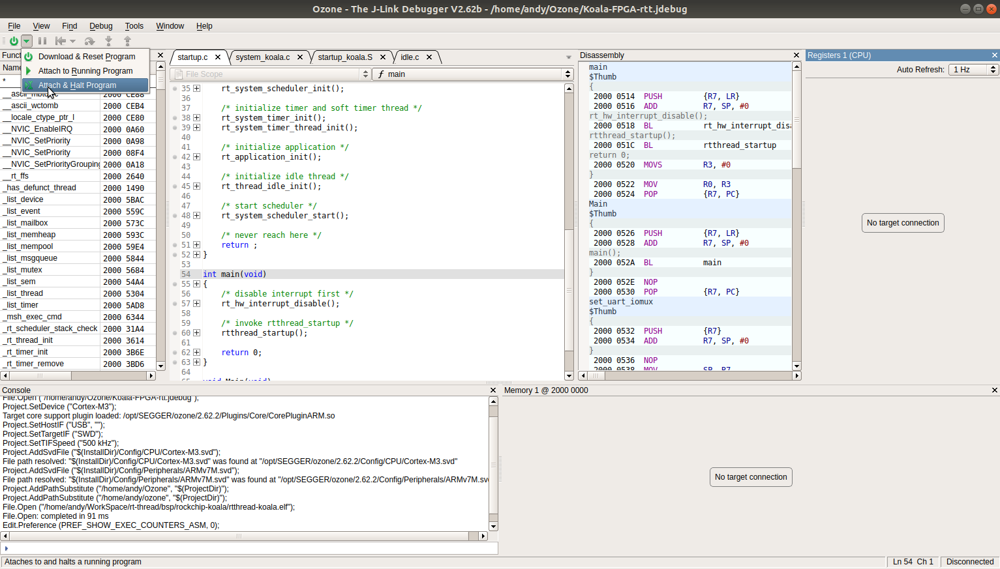

Execute the Debug.Download command in the command line window:

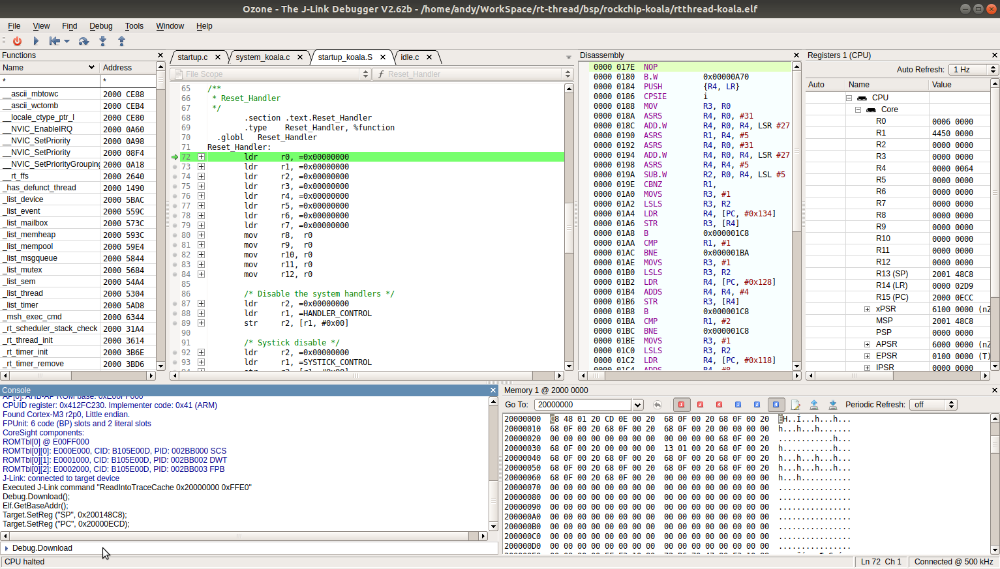

At this point, the system will stop at the code entry, and then you can single-step debug.

* Specifying the Source File Path

Many developers are accustomed to compiling code in a Linux environment and debugging in a Windows environment, or the ELF file being debugged was compiled by another developer. In this case, Ozone cannot find the source file corresponding to the code based on the path information obtained from the ELF file.

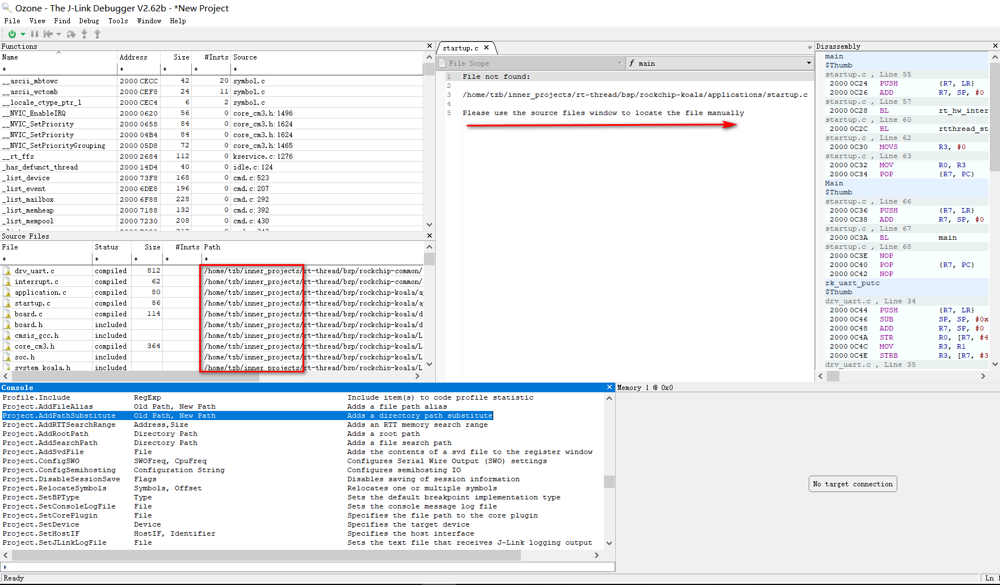

As shown in the figure, the ELF file was compiled in the Linux system directory /home/tzb/inner_projects/rt-thread, but Ozone is running on a Windows system and naturally cannot find the corresponding source file. Ozone provides the Project.AddPathSubstitute command to solve this problem. Suppose the rt-thread source directory under the Linux system is mapped to Z:\rt-thread under Windows via Samba service, then the source path can be set with the following command: `Project.AddPathSubstitute  /home/tzb/inner_projects/ Z:/` .

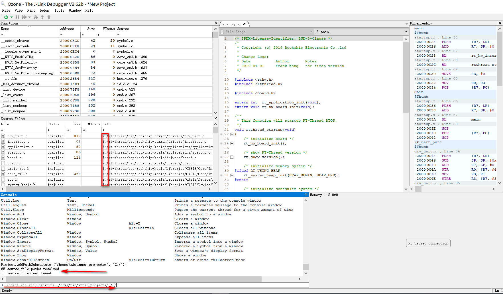

If the replacement path is fixed, you can also consider writing this path into a script to avoid having to enter the command every time.

## **Summary**

J-Link also provides many other functions, such as working with GDB. Ozone also includes rich functionality and even allows you to customize various scripts. Please refer to their user manuals during use:

* 《J-Link Manual》
* 《Ozone User Manual》
