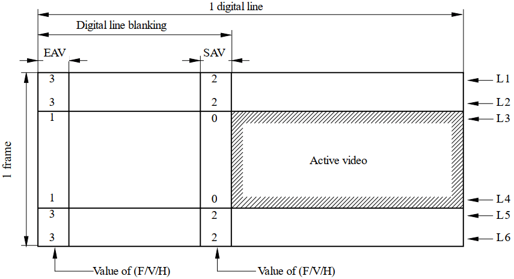
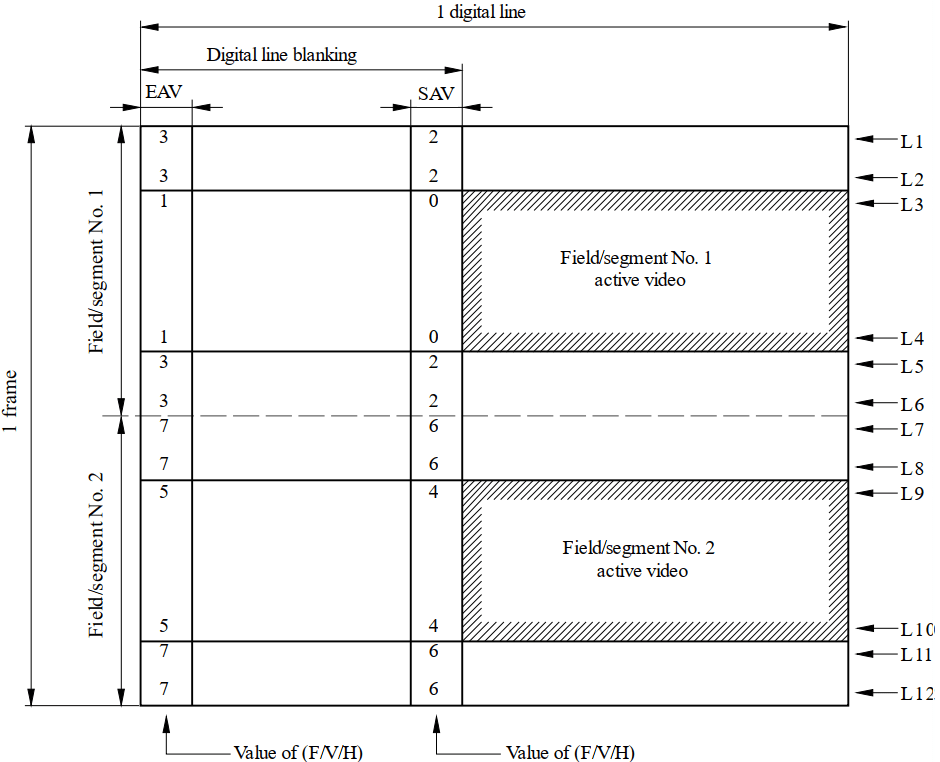
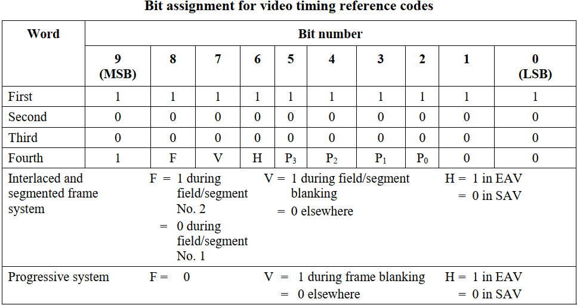
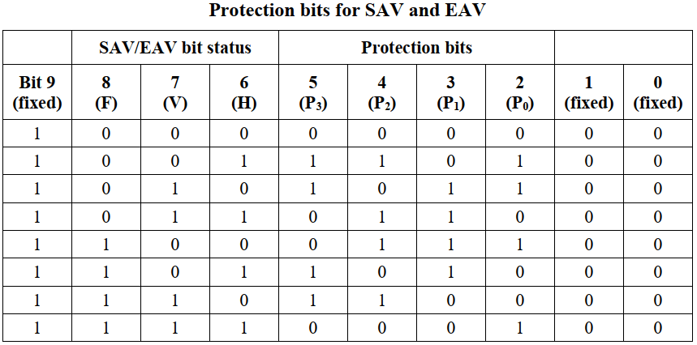
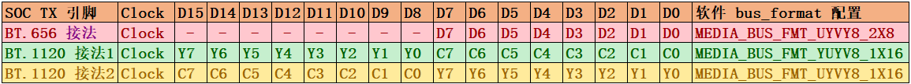

# Rockchip BT.656 TX and BT.1120 TX Developer Guide

ID: RK-YH-YF-178

Release Version: V1.0.0

Date: 2021-4-30

Security Level: □Top-Secret □Secret □Internal ■Public

**DISCLAIMER**

This document is provided "as is". Rockchip Electronics Co., Ltd. ("the Company") makes no express or implied representations or warranties regarding the accuracy, reliability, completeness, merchantability, fitness for a particular purpose, or non-infringement of any statements, information, or content in this document. This document is for reference as a usage guide only.

Due to product version upgrades or other reasons, this document may be updated or modified from time to time without any notice.

**Trademark Statement**

"Rockchip", "Rockchip", and "Rockchip" are registered trademarks of the Company and belong to the Company.

All other registered trademarks or trademarks mentioned in this document are owned by their respective owners.

**Copyright © 2021 Rockchip Electronics Co., Ltd.**

Without the Company's written permission, no individual or entity may extract or copy part or all of the content of this document, or distribute it in any form, beyond the scope of fair use.

Rockchip Electronics Co., Ltd.

Address: No. 18, Area A, Software Park, Tongpan Road, Fuzhou, Fujian Province

Website: [www.rock-chips.com](http://www.rock-chips.com)

Customer Service Phone: +86-4007-700-590

Customer Service Fax: +86-591-83951833

Customer Service Email: [fae@rock-chips.com](mailto:fae@rock-chips.com)

---

**Preface**

This document mainly introduces the BT.656 and BT.1120 interface debug guide for the ROCKCHIP platform.

**Product Versions**

| **Chip Name** | **Kernel Version** |
| ------------- | ----------------- |
| RV1109/RV1126/RK356X | Linux kernel 4.19 |

**Intended Audience**

This document (guide) is mainly applicable to the following engineers:

Technical Support Engineers

Software Development Engineers

Hardware Development Engineers

**Revision History**

| **Version** | **Author** | **Modification Date** | **Revision Description** |
| ----------- | ---------- | --------------------- | ------------------------ |
| V1.0.0      | Huang Jiacha | 2021-04-30          | Initial version           |

---

**Table of Contents**

[TOC]

---

## Basic Concepts

BT.656 and BT.1120 define the interface protocols for SDTV and HDTV respectively. They transmit EAV and SAV positioning reference codes as embedded synchronization signals during the blanking interval, with the data format being YCbCr 4:2:2. BT.656 and BT.1120 are also referred to as video signals or YUV signals in some documents and manuals. Currently, the RK platform outputs BT.656/BT.1120 image data and positioning reference codes with a bit depth of 8 bits.

The following introduces some basic concepts and protocols of BT.656 and BT.1120. For detailed information, refer to the documents "Rec. ITU-R BT.1120" and "Rec. ITU-R BT.656".

### Progressive Scan Timing



### Interlaced Scan Timing



### Timing Reference Code



The first three words of the timing reference code are fixed as: 0xFF, 0x00, 0x00. The fourth word is determined by different scan positions:

- Bit9: Fixed to 1

- Bit8(F): F=0 indicates even field, F=1 indicates odd field

- Bit7(V): V=0 indicates the line contains valid video data, V=1 indicates the line has no valid video data

- Bit6(H): H=0 indicates SAV, H=1 indicates EAV

- Bit[5, 2] (P3,P2,P1,P0): Calculated from Bit8~Bit6, where:

  Bit5 = V XOR H

  Bit4 = F XOR H

  Bit3 = F XOR V

  Bit2 = F XOR V XOR H

- Bit[1, 0]: Fixed to 0. For RK platforms, the bit depth is 8 BIT, so these 2 Bits can be considered absent.

The following table shows the corresponding protection bit values (P3,P2,P1,P0) calculated for different EAV/SAV (F,V,H):



Combining the above information, the timing reference codes corresponding to each blanking interval are:

| EAV  | CODE                | SAV  | CODE                |
| ---- | ------------------- | ---- | ------------------- |
| 1    | 0XFF 0X00 0X00 0X9D | 0    | 0XFF 0X00 0X00 0X80 |
| 3    | 0XFF 0X00 0X00 0XB2 | 2    | 0XFF 0X00 0X00 0XAB |
| 5    | 0XFF 0X00 0X00 0XDA | 4    | 0XFF 0X00 0X00 0XC7 |
| 7    | 0XFF 0X00 0X00 0XF1 | 6    | 0XFF 0X00 0X00 0XEC |

## RK Platform Support

| **SOC Platform** | **BT.656 Support** | **BT.1120 Support** | **Interlaced or Progressive** |
| ------------- | ----------------- | ----------------- | ----------------------------- |
| RV1109/RV1126 | N                 | Y                 | **Progressive** only          |
| RK3566/RK3568 | Y                 | Y                 | Supports **Progressive** and **Interlaced** |

## Hardware Connection

BT.656 and BT.1120 support the following three hardware connections. Depending on the connection method, the software should adapt the bus_format in the DTS file or the corresponding conversion chip driver accordingly.



## Software Configuration

### Enable BT.656/BT.1120

1. If the connected device at the transmitting end does not require software driver (i.e., no DRM connector registration needed), configure the panel node in the dts file:

```c
panel {
	……
	bus-format = MEDIA_BUS_FMT_YUYV8_1X16; //or MEDIA_BUS_FMT_YUYV8_1X16/MEDIA_BUS_FMT_UYVY8_1X16
	……
}
```

2. If the connected device at the transmitting end requires a software driver (i.e., needs DRM connector registration), in addition to the first point's DTS configuration, it can also be set in the corresponding connector driver's drm_connector_helper_funcs -> get_modes function. Refer to the implementation in drivers/gpu/drm/bridge/sii902x.c:

```c
static int sii902x_get_modes(struct drm_connector *connector)
{
	u32 bus_format = MEDIA_BUS_FMT_YUYV8_1X16;//depend on hardware
	……
	drm_display_info_set_bus_formats(&connector->display_info, &bus_format, 1);
	……
}
```

Through the bus_format configuration in points 1/2, the VOP driver enables BT.656/BT.1120 and configures the corresponding pin mapping.

### Timing Configuration

There are three methods for timing configuration:

1. DTS Configuration

For products supporting fixed resolutions, configure the corresponding timing in the DTS panel:

- Progressive timing

```c
timing_1080p: timing-1080p {
	clock-frequency = <148500000>;
	hactive = <1920>;
	vactive = <1080>;
	hback-porch = <100>;
	hfront-porch = <200>;
	vback-porch = <10>;
	vfront-porch = <10>;
	hsync-len = <20>;
	vsync-len = <20>;
	hsync-active = <0>;
	vsync-active = <0>;
	de-active = <0>;
	pixelclk-active = <0>;
};
```

- Interlaced timing

```c
timing_ntsc: timing-ntsc {
	clock-frequency = <13500000>;
	hactive = <720>;
	vactive = <480>;
	hback-porch = <43>;
	hfront-porch = <33>;
	vback-porch = <36>;
	vfront-porch = <3>;
	hsync-len = <62>;
	vsync-len = <6>;
	hsync-active = <0>;
	vsync-active = <0>;
	de-active = <0>;
	pixelclk-active = <0>;
	interlaced;
	doubleclk; //only NTSC(480i60) mode and PAL(576i50) mode need this property
};
```

2. Read EDID

For display devices supporting multiple resolutions and having EDID information, refer to the sii902x driver to read EDID information via DDC/I2C to obtain the supported resolutions:

```c
//dts
&i2c3 {
	clock-frequency = <400000>;
	status = "okay";
	sii9022: sii9022@39 {
		compatible = "sil,sii9022";
		reg = <0x39>;
		pinctrl-names = "default";
		……
		ports {
			#address-cells = <1>;
			#size-cells = <0>;
			port@0 {
				reg = <0>;
				sii9022_in_rgb: endpoint {
					remote-endpoint = <&rgb_out_sii9022>;
				};
			};
		};
	};
};

&rgb {
	status = "okay";
	……
	ports {
		port@1 {
			reg = <1>;
			#address-cells = <1>;
			#size-cells = <0>;

			rgb_out_sii9022: endpoint@0 {
				reg = <0>;
				remote-endpoint = <&sii9022_in_rgb>;
			};
		};
	};
};

//drivers/gpu/drm/bridge/sii902x.c
static int sii902x_probe(struct i2c_client *client, const struct i2c_device_id *id)
{
	……
	i2c_set_clientdata(client, sii902x);
	sii902x->i2cmux =
	i2c_mux_alloc(client->adapter, dev, 1, 0, I2C_MUX_GATE, sii902x_i2c_bypass_select, sii902x_i2c_bypass_deselect);
	if (!sii902x->i2cmux)
		return -ENOMEM;
	sii902x->i2cmux->priv = sii902x;
	return i2c_mux_add_adapter(sii902x->i2cmux, 0, 0, 0);
	……
}

static int sii902x_get_modes(struct drm_connector *connector)
{
	struct sii902x *sii902x = connector_to_sii902x(connector);

	edid = drm_get_edid(connector, sii902x->i2cmux->adapter[0]);
	drm_connector_update_edid_property(connector, edid);
	if (edid) {
		if (drm_detect_hdmi_monitor(edid))
			output_mode = SII902X_SYS_CTRL_OUTPUT_HDMI;
		num = drm_add_edid_modes(connector, edid);
		kfree(edid);
	}
}
```

3. Hardcode in Connector Driver

This is typically done during debugging for convenience or when there is no I2C/DDC channel to read EDID information but multiple resolutions need to be supported. Resolutions can be hardcoded directly in the connector driver. Refer to the sii902x.c driver implementation:

```c
static int sii902x_get_modes(struct drm_connector *connector)
{
	struct sii902x *sii902x = connector_to_sii902x(connector);

	……
	for (i = 0; i < ARRAY_SIZE(sii902x_default_modes); i++) {
		const struct drm_display_mode *ptr = &sii902x_default_modes[i];

		mode = drm_mode_duplicate(connector->dev, ptr);
		if (mode) {
			if (!i)
				mode->type = DRM_MODE_TYPE_PREFERRED;
			drm_mode_probed_add(connector, mode);
			ret++;
		}
	}
	……
}
```

## Frequently Asked Questions

1. Does BT.656 and BT.1120 output Full range or Limited range?

   **Answer**: Limit range, i.e., valid image data range is [16, 235]. Only timing reference codes can have 0xFF, 0x00 data.

2. How to confirm that the controller has been configured for BT.656 and BT.1120 output?

   **Answer**: Through `cat /sys/kernel/debug/dri/0/summary`, you can see the bus_format value under the corresponding VOP/VP node, corresponding to the table in point 3 of this document.

```shell
cat /sys/kernel/debug/dri/0/summary
	Video Port0: ACTIVE
	……
	bus_format[2025]: YUV8_1X24
	……
```

3. Are the BT.656 and BT.1120 signals output by the RK platform standard?

   **Answer**: Yes, designed based on the "Rec. ITU-R BT.656" and "Rec. ITU-R BT.1120" standards.

4. Single-edge or double-edge triggered?

   **Answer**: Single-edge triggered. By default, the clock rising edge is at the center of the data. If the receiving end prefers the falling edge at the data center, set pixelclk-active to 1 in the dts.

5. Which files can be referenced for dts configuration?

   **Answer**: Refer to the following two configuration files:

   BT.656: arch/arm64/boot/dts/rockchip/rk3568-evb6-ddr3-v10-rk630-bt656-to-cvbs.dts

   BT.1120: arch/arm64/boot/dts/rockchip/rk3568-evb2-lp4x-v10-bt1120-to-hdmi.dts

6. How to drive third-party conversion chips?

   **Answer**: Divided into the following two cases:

   - If the third-party conversion chip does not require separate register configuration and works normally with power only, configure the corresponding GPIO and power supply in the panel node of the dts file to ensure normal power supply to the conversion chip. No additional driver is needed. rockchip_rgb.c will complete the registration of encoder and connector to the DRM driver framework.
   - If the third-party conversion chip requires separate register configuration, in addition to correctly configuring GPIO and power supply in the dts, a corresponding driver for the conversion chip must be written. In this case, rockchip_rgb.c completes the encoder registration to the DRM driver framework, and the conversion chip driver completes the connector registration to the DRM driver framework, bridged via DRM bridge. Refer to the implementation in the kernel code: drivers/gpu/drm/bridge/sii902x.c.

7. How to use BT.1120 on RK628?

   **Answer**: Refer to the document "Rockchip_DRM_RK628_Porting_Guide_CN" for instructions on RK628 BT.1120 usage.

8. What is the relationship with Camera BT.656/BT.1120?

   **Answer**: This document describes BT.656 TX and BT.1120 TX, which are parallel output interfaces. Camera corresponds to BT.656 RX and BT.1120 RX, which are parallel input interfaces. The protocols are the same. For development documentation on BT.656 RX and BT.1120 RX, please obtain from our FAE window/ISP department.

9. What is the relationship between BT.656/BT.1120 and VOP?

   **Answer**: BT.656 and BT.1120 are parallel output interfaces with embedded synchronization signals. VOP composites data from multiple layers (multiple buffers) and outputs via BT.656/BT.1120.

10. What is the relationship between BT.656/BT.1120 and RGB?

    **Answer**: BT.656 and BT.1120 are parallel output interfaces with embedded synchronization signals. RGB is a parallel output interface with independent synchronization signals [HSYNC/VSYNC/DEN]. They are independent display interfaces with no direct relationship in the display path, though they may share IO multiplexing.
