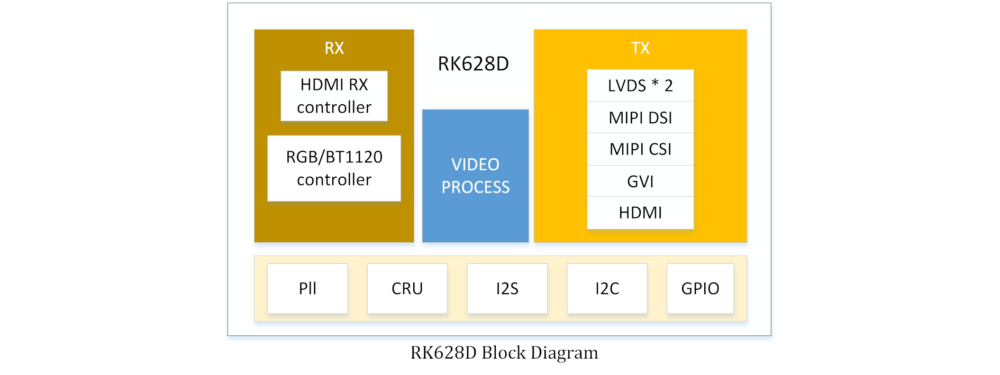
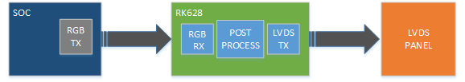
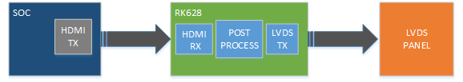
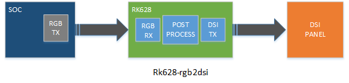
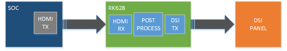
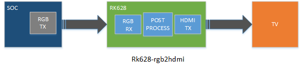
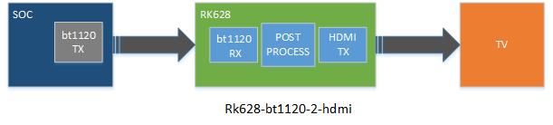
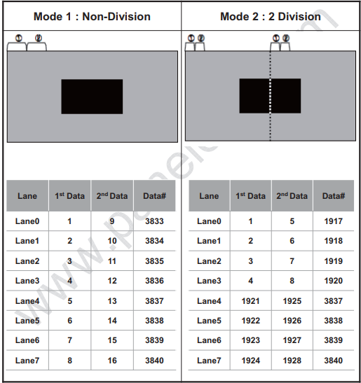

# Rockchip DRM RK628 Porting Guide

Document ID: RK-YH-YF-276

Release Version: V1.6.0

Date: 2021-03-06

Security Level: □Top-Secret   □Secret   □Internal   ■Public

**DISCLAIMER**

THIS DOCUMENT IS PROVIDED "AS IS". ROCKCHIP ELECTRONICS CO., LTD. ("ROCKCHIP") DOES NOT PROVIDE ANY WARRANTY OF ANY KIND, EXPRESSED, IMPLIED OR OTHERWISE, WITH RESPECT TO THE ACCURACY, RELIABILITY, COMPLETENESS, MERCHANTABILITY, FITNESS FOR ANY PARTICULAR PURPOSE OR NON-INFRINGEMENT OF ANY REPRESENTATION, INFORMATION AND CONTENT IN THIS DOCUMENT. THIS DOCUMENT IS FOR REFERENCE ONLY. THIS DOCUMENT MAY BE UPDATED OR CHANGED WITHOUT ANY NOTICE AT ANY TIME DUE TO THE UPGRADES OF THE PRODUCT OR ANY OTHER REASONS.

**Trademark Statement**

"Rockchip", "瑞芯微", "瑞芯" shall be Rockchip's registered trademarks and owned by Rockchip. All the other trademarks or registered trademarks mentioned in this document shall be owned by their respective owners.

**All rights reserved. ©2020. Rockchip Electronics Co., Ltd.**

Any party, exceeding the reasonable use scope, shall not, without the prior written permission of Rockchip, extract, copy, distribute, or transmit the content of this document in any form.

Rockchip Electronics Co., Ltd.

Address: No. 18, Area A, Software Park, Tongpan Road, Fuzhou, Fujian Province

Website:     [www.rock-chips.com](http://www.rock-chips.com)

Customer service Tel: +86-4007-700-590

Customer service Fax: +86-591-83951833

Customer service e-Mail: [fae@rock-chips.com](mailto:fae@rock-chips.com)

---

**Preface**

This document mainly introduces the usage and debugging methods of RK628.

**Target Audience**

This document (this guide) is mainly intended for the following engineers:

Technical support engineers

Software development engineers

**Revision History**

| **Version** | **Author**     | **Date**   | **Description**                                  |
| ----------- | -------------- | ---------- | ------------------------------------------------ |
| V1.0.0      | Bi Weiyong     | 2020-12-01 | Initial release                                  |
| V1.1.0      | Chen Shunqing  | 2020-12-02 | Added Post-Process and HDMITX                    |
| V1.2.0      | Huang Guochun  | 2020-12-02 | Added rk628_bt1120_rx                            |
| V1.3.0      | Cao Ruijie     | 2020-12-02 | Added HDMIRX                                     |
| V1.4.0      | Huang Jiacha   | 2020-12-04 | Added GVI                                        |
| V1.5.0      | Wen Dingxian   | 2020-12-09 | Added HDMI to MIPI CSI application scenario description |
| V1.6.0      | Huang Guochun  | 2021-03-06 | Added HDMI to DSI/LVDS application scenario description |

---

**Table of Contents**

[TOC]

---

## Introduction

This document mainly describes the software configuration methods and debugging techniques for the multi-function converter chip RK628. For specific function descriptions, refer to the datasheet.



Configuration options:

```
CONFIG_MFD_RK628=y
CONFIG_DRM_ROCKCHIP_RK628=y
CONFIG_VIDEO_RK628CSI=y
```

Drivers:

```
drivers/mfd/rk628.c
drivers/clk/rockchip/regmap/clk-rk628.c
drivers/pinctrl/pinctrl-rk628.c
drivers/gpu/drm/rockchip/rk628/*
drivers/media/i2c/rk628_csi.c
```

Device tree:

```
arch/arm/boot/dts/rk3288-evb-rk628.dtsi
arch/arm/boot/dts/rk3288-evb-rk628-hdmi2gvi-avb.dtb
arch/arm/boot/dts/rk3288-evb-rk628-hdmi2gvi-avb.dts
arch/arm/boot/dts/rk3288-evb-rk628-rgb2dsi-avb.dtb
arch/arm/boot/dts/rk3288-evb-rk628-rgb2dsi-avb.dts
arch/arm/boot/dts/rk3288-evb-rk628-rgb2gvi-avb.dts
arch/arm/boot/dts/rk3288-evb-rk628-rgb2hdmi-avb.dtb
arch/arm/boot/dts/rk3288-evb-rk628-rgb2hdmi-avb.dts
arch/arm/boot/dts/rk3288-evb-rk628-rgb2lvds-avb.dts
arch/arm/boot/dts/rk3288-evb-rk628-rgb2lvds-dual-avb.dts
arch/arm/boot/dts/rk3288-evb-rk628-hdmi2csi-avb.dts
```

## Core

1. `arch/arm/boot/dts/rk628.dtsi` contains the basic configuration for RK628-related modules. Generally, no changes are needed; simply include this dtsi in the board-level dts.

2. `arch/arm/boot/dts/rk3288-evb-rk628.dtsi` contains specific board-level configurations. The RK628-related control IOs need to be configured according to the hardware design, and it includes `rk628.dtsi`.

   ```
   &i2c1 {
           clock-frequency = <400000>;
           status = "okay";

           rk628: rk628@50 {
                   reg = <0x50>;
                   interrupt-parent = <&gpio7>;
                   interrupts = <15 IRQ_TYPE_LEVEL_HIGH>;
                   enable-gpios = <&gpio5 RK_PC2 GPIO_ACTIVE_HIGH>;
                   reset-gpios = <&gpio7 RK_PB6 GPIO_ACTIVE_LOW>;
                   status = "okay";
           };
   };
   ```

## Input

### RGB

Note: In the kernel baselines for rk3288-android7.1 and rk3288-android8.1, the RGB function is described using the lvds node in the dts.
These two SDK kernels do not contain configuration dts for the RK628 application. Refer to the following related dts configuration:
RKDocs/PATCHES/patch_rk628_dts_for_rk3288_android8.0.tar.gz

```
&rgb {
        status = "okay";

        ports {
                port@1 {
                        reg = <1>;

                        rgb_out_post_process: endpoint {
                                remote-endpoint = <&post_process_in_rgb>;
                        };
                };
        };
};

&video_phy {
        status = "okay";
};

&rgb_in_vopb {
        status = "disabled";
};

&rgb_in_vopl {
        status = "okay";
};
```

### BT1120

arch/arm64/boot/dts/rockchip/rk3568-evb6-ddr3-v10-rk628-bt1120-to-hdmi.dts

```
&rgb {
	status = "okay";
	pinctrl-names = "default";
	pinctrl-0 = <&bt1120_pins>;

	ports {
		port@1 {
			reg = <1>;

			rgb_out_bt1120: endpoint {
				remote-endpoint = <&bt1120_in_rgb>;
			};
		};
	};
};

&rk628_bt1120_rx {
	status = "okay";

	ports {
		#address-cells = <1>;
		#size-cells = <0>;

		port@0 {
			reg = <0>;

			bt1120_in_rgb: endpoint {
				remote-endpoint = <&rgb_out_bt1120>;
			};
		};

		port@1 {
			reg = <1>;

			bt1120_out_post_process: endpoint {
				remote-endpoint = <&post_process_in_bt1120>;
			};
		};
	};
};

&rgb_in_vp2 {
	status = "okay";
};
```

### HDMIRX

HDMIRX currently supports the following input source formats:

- 3840X2160-60Hz(YUV420-8BIT)
- 3840X2160-30Hz(RGB-8BIT)
- 1920X1080-60Hz(RGB-8BIT)
- 1280X720-60Hz(RGB-8BIT)
- 720X576-60Hz(RGB-8BIT)
- 720X480-60Hz(RGB-8BIT)

#### HDMIRX Board-Level Direct Connection Mode

DTS configuration is as follows, taking HDMI2GVI as an example:

```
&hdmi {
	status = "okay";

	ports {
		#address-cells = <1>;
		#size-cells = <0>;
		port@1 {
			reg = <1>;

			hdmi_out_hdmirx: endpoint {
				remote-endpoint = <&hdmirx_in_hdmi>;
			};
		};
	};
};

&panel {
	compatible = "simple-panel";
	......
	status = "okay";

	display-timings {
		native-mode = <&timing>;

		timing: timing {
		......
		};
	};

	port {
		panel_in_gvi: endpoint {
			remote-endpoint = <&gvi_out_panel>;
		};
	};
};

&rk628_gvi {
	pinctrl-names = "default";
	pinctrl-0 = <&gvi_hpd_pins>, <&gvi_lock_pins>;
	status = "okay";
	rockchip,lane-num = <8>;
	/* rockchip,division-mode; */

	ports {
		#address-cells = <1>;
		#size-cells = <0>;

		port@0 {
			reg = <0>;

			gvi_in_post_process: endpoint {
				remote-endpoint = <&post_process_out_gvi>;
			};
		};

		port@1 {
			reg = <1>;

			gvi_out_panel: endpoint {
				remote-endpoint = <&panel_in_gvi>;
			};
		};
	};
};

&rk628_combtxphy {
	status = "okay";
};

&rk628_post_process {
	status = "okay";

	ports {
		#address-cells = <1>;
		#size-cells = <0>;

		port@0 {
			reg = <0>;

			post_process_in_hdmirx: endpoint {
				remote-endpoint = <&hdmirx_out_post_process>;
			};
		};


		port@1 {
			reg = <1>;

			post_process_out_gvi: endpoint {
				remote-endpoint = <&gvi_in_post_process>;
			};
		};
	};
};

&rk628_combrxphy {
	status = "okay";
};

&rk628_hdmirx {
	status = "okay";

	ports {
		#address-cells = <1>;
		#size-cells = <0>;

		port@0 {
			reg = <0>;

			hdmirx_in_hdmi: endpoint {
				remote-endpoint = <&hdmi_out_hdmirx>;
			};
		};
		port@1 {
			reg = <1>;

			hdmirx_out_post_process: endpoint {
				remote-endpoint = <&post_process_in_hdmirx>;
			};
		};
	};
};

&hdmi_in_vopl {
	status = "disabled";
};

&hdmi_in_vopb {
	status = "okay";
};
```

**Notes**

Since HDMIRX supports a maximum of 4K-60Hz-YUV420, when outputting 4K-60Hz resolution, the input source must be forced to use YUV420 color format. The maximum TMDS CLK of the input source must be limited on the output side, and YUV420 format output must be allowed.

Taking HDMI2GVI as an example, the following modifications are needed:

```diff
--- a/drivers/gpu/drm/rockchip/rk628/rk628_gvi.c
+++ b/drivers/gpu/drm/rockchip/rk628/rk628_gvi.c
@@ -312,7 +312,8 @@ static int rk628_gvi_connector_get_modes(struct drm_connector *connector)
        info->edid_hdmi_dc_modes = 0;
        info->hdmi.y420_dc_modes = 0;
        info->color_formats = 0;
-       info->max_tmds_clock = 600000;
+       info->max_tmds_clock = 300000;
+       connector->ycbcr_420_allowed = true;
```

#### HDMIRX Cable Connection Mode

HDMIRX cable connection mode is used for HDMIRX to MIPI CSI interface conversion, suitable for HDMI IN application scenarios, supporting hot-plug, dynamic resolution switching, etc.

Currently supports the following resolutions, which can be added in the driver according to specific project requirements:

- 3840X2160-30Hz(RGB-8BIT/YUV422-8BIT)
- 1920X1080-60Hz(RGB-8BIT/YUV422-8BIT)
- 1280X720-60Hz(RGB-8BIT/YUV422-8BIT)
- 720X576-50Hz(RGB-8BIT/YUV422-8BIT)
- 720X480-60Hz(RGB-8BIT/YUV422-8BIT)

#### HDMIRX AUDIO

Audio signals are output via RK628 I2S (RK628 must be master). It can be directly connected to a DAC chip or directly connected to the SOC's I2S.

When connected to the SOC, the RK628 I2S does not require additional configuration. A dummy_codec can be used to create a sound device for the system:

```dtd
dummy_codec: dummy-codec {
        compatible = "rockchip,dummy-codec";
        #sound-dai-cells = <0>;
};

hdmiin-sound {
        compatible = "simple-audio-card";
        simple-audio-card,format = "i2s";
        simple-audio-card,name = "rockchip,hdmiin";
        simple-audio-card,bitclock-master = <&dailink0_master>;
        simple-audio-card,frame-master = <&dailink0_master>;
        status = "okay";
        simple-audio-card,cpu {
                        sound-dai = <&i2s0>;
        };
        dailink0_master: simple-audio-card,codec {
                        sound-dai = <&dummy_codec>;
        };
};
```

The RK3288 EVB uses RK3288 I2S with RT5651's I2S2, and the RK628 I2S connects to RT5651's I2S2. During use, by switching the internal route of RT5651, different paths for recording and playback can be achieved. The corresponding dts configuration is as follows:

```dtd
hdmiin-sound {
        compatible = "rockchip,rockchip-rt5651-rk628-sound";
        rockchip,cpu = <&i2s>;
        rockchip,codec = <&rt5651>;
        status = "okay";
};
```

Note: Since the RK628 I2S interface does not provide MCLK, when directly connecting to a DAC, it is best to choose a DAC chip that does not require MCLK.

## Output

### Post-Process

As shown in Figure 1-1, the input data needs to go through Post Process for scaling or bypass, and then be sent to each display interface. Therefore, the dts must configure the rk628_post_process to bridge RGB or HDMIRX.

Taking RGB as an example:

```
&rgb {
        status = "okay";

        ports {
                port@1 {
                        reg = <1>;

                        rgb_out_post_process: endpoint {
                                remote-endpoint = <&post_process_in_rgb>;
                        };
                };
        };
};

&rk628_post_process {
        pinctrl-names = "default";
        pinctrl-0 = <&vop_pins>;
        status = "okay";

        ports {
                #address-cells = <1>;
                #size-cells = <0>;

                port@0 {
                        reg = <0>;

                        post_process_in_rgb: endpoint {
                                remote-endpoint = <&rgb_out_post_process>;
                        };
                };
        };
};
```

#### Scaler

Taking RGB(1080p) -> GVI(4K) as an example, since RGB cannot output 4K, it must go through the Scaler for scaling.

Since GVI only adds 4K resolution, the 4K resolution will appear in the upper-layer modes list. However, the upper layer is expected to set 1080P (source resolution) and then scale it up to 4K (target resolution) in Post Process. Therefore, a source resolution needs to be added in Post Process. The configuration is as follows:

```diff
&rk628_post_process {
	pinctrl-names = "default";
	pinctrl-0 = <&vop_pins>;
	status = "okay";

	ports {
		#address-cells = <1>;
		#size-cells = <0>;

		port@0 {
			reg = <0>;

			post_process_in_rgb: endpoint {
				remote-endpoint = <&rgb_out_post_process>;
			};
		};

		port@1 {
			reg = <1>;

			post_process_out_hdmi: endpoint {
				remote-endpoint = <&hdmi_in_post_process>;
			};
		};
	};
+
+	display-timings {
+		native-mode = <&timing0>;
+
+		timing0: timing0 {
+			clock-frequency = <148500000>;
+			hactive = <1920>;
+			vactive = <1080>;
+			hback-porch = <148>;
+			hfront-porch = <88>;
+			vback-porch = <36>;
+			vfront-porch = <4>;
+			hsync-len = <44>;
+			vsync-len = <5>;
+			hsync-active = <0>;
+			vsync-active = <0>;
+			de-active = <0>;
+			pixelclk-active = <0>;
+		};
+	};
};
```

#### Polarity Configuration

```diff
&rk628_post_process {
        pinctrl-names = "default";
        pinctrl-0 = <&vop_pins>;
        status = "okay";

+		mode-sync-pol = <0>;
        ports {
                #address-cells = <1>;
                #size-cells = <0>;

                port@0 {
                        reg = <0>;

                        post_process_in_rgb: endpoint {
                                remote-endpoint = <&rgb_out_post_process>;
                        };
                };

                port@1 {
                        reg = <1>;

                        post_process_out_hdmi: endpoint {
                                remote-endpoint = <&hdmi_in_post_process>;
                        };
                };
        };
};
```

mode-sync-pol is a property added as a workaround. Generally, it does not need to be configured. Only when the polarity cannot be configured, such as when RK3568 RGB and LVDS output simultaneously and can only output DRM_MODE_FLAG_NHSYNC/DRM_MODE_FLAG_NVSYNC, should mode-sync-pol of Post Process be configured to 0 to adapt to the polarity of the preceding stage.

### LVDS

#### RGB2LVDS



##### Single LVDS

arch/arm/boot/dts/rk3288-evb-rk628-rgb2lvds-avb.dts

```
/ {
        panel {
                compatible = "simple-panel";
                backlight = <&backlight>;
                enable-gpios = <&gpio7 RK_PA2 GPIO_ACTIVE_HIGH>;
                prepare-delay-ms = <20>;
                enable-delay-ms = <20>;
                disable-delay-ms = <20>;
                unprepare-delay-ms = <20>;
                bus-format = <MEDIA_BUS_FMT_RGB888_1X7X4_SPWG>;

                display-timings {
                        native-mode = <&timing0>;

                        timing0: timing0 {
                                clock-frequency = <48000000>;
                                hactive = <1024>;
                                vactive = <600>;
                                hback-porch = <90>;
                                hfront-porch = <90>;
                                vback-porch = <10>;
                                vfront-porch = <10>;
                                hsync-len = <90>;
                                vsync-len = <10>;
                                hsync-active = <0>;
                                vsync-active = <0>;
                                de-active = <0>;
                                pixelclk-active = <0>;
                        };
                };

                port {
                        panel_in_lvds: endpoint {
                                remote-endpoint = <&lvds_out_panel>;
                        };
                };
        };
};

&rk628_lvds {
	status = "okay";

	ports {
		#address-cells = <1>;
		#size-cells = <0>;

		port@0 {
			reg = <0>;

			lvds_in_post_process: endpoint {
				remote-endpoint = <&post_process_out_lvds>;
			};
		};

		port@1 {
			reg = <1>;

			lvds_out_panel: endpoint {
				remote-endpoint = <&panel_in_lvds>;
			};
		};
	};
};

&rk628_combtxphy {
	status = "okay";
};

&rk628_post_process {
	pinctrl-names = "default";
	pinctrl-0 = <&vop_pins>;
	status = "okay";

	ports {
		#address-cells = <1>;
		#size-cells = <0>;

		port@0 {
			reg = <0>;

			post_process_in_rgb: endpoint {
				remote-endpoint = <&rgb_out_post_process>;
			};
		};

		port@1 {
			reg = <1>;

			post_process_out_lvds: endpoint {
				remote-endpoint = <&lvds_in_post_process>;
			};
		};
	};
};

&rgb {
	status = "okay";

	ports {
		port@1 {
			reg = <1>;

			rgb_out_post_process: endpoint {
				remote-endpoint = <&post_process_in_rgb>;
			};
		};
	};
};

&video_phy {
	status = "okay";
};

&rgb_in_vopb {
	status = "disabled";
};

&rgb_in_vopl {
	status = "okay";
};

route_rgb {
	status = "disabled";
};
```

##### Dual LVDS

Dual LVDS output configuration adds and modifies the following properties of &rk628_lvds based on the single LVDS configuration:

```
&rk628_lvds {
        rockchip,link-type = "dual-link-even-odd-pixels";
        status = "okay";
	...
};
```

| Property           | Value                                                        | Comment                                                      |
| ------------------ | ------------------------------------------------------------ | ------------------------------------------------------------ |
| rockchip,link-type | dual-link-odd-even-pixels<br />dual-link-even-odd-pixels<br />dual-link-left-right-pixels<br />dual-link-right-left-pixels | Dual-channel LVDS requires this property. Supports odd-even pixel mode and left-right pixel mode, as well as data channel swapping. For left-right pixel mode, the same panel needs to be connected to CH0 and CH1 respectively. When configuring timing, based on the single panel timing, multiply clock-frequency, hactive, hback-porch, hfront-porch, and hsync-len values by 2 respectively. |

#### HDMI2LVDS

In this scenario, the LVDS resolution needs to take the HDMIRX supported input source resolution factors into consideration.



##### Single LVDS

Refer to the following configuration:

```
/ {
        panel {
                compatible = "simple-panel";
                backlight = <&backlight>;
                enable-gpios = <&gpio7 RK_PA2 GPIO_ACTIVE_HIGH>;
                prepare-delay-ms = <20>;
                enable-delay-ms = <20>;
                disable-delay-ms = <20>;
                unprepare-delay-ms = <20>;
                bus-format = <MEDIA_BUS_FMT_RGB888_1X7X4_SPWG>;

                display-timings {
                        native-mode = <&timing0>;

                        timing0: timing0 {
                                clock-frequency = <74250000>;
                                hactive = <1280>;
                                vactive = <720>;
                                hback-porch = <220>;
                                hfront-porch = <110>;
                                vback-porch = <20>;
                                vfront-porch = <5>;
                                hsync-len = <40>;
                                vsync-len = <5>;
                                hsync-active = <0>;
                                vsync-active = <0>;
                                de-active = <0>;
                                pixelclk-active = <0>;
                        };
                };

                port {
                        panel_in_lvds: endpoint {
                                remote-endpoint = <&lvds_out_panel>;
                        };
                };
        };
};

&rk628_lvds {
	status = "okay";

	ports {
		#address-cells = <1>;
		#size-cells = <0>;

		port@0 {
			reg = <0>;

			lvds_in_post_process: endpoint {
				remote-endpoint = <&post_process_out_lvds>;
			};
		};

		port@1 {
			reg = <1>;

			lvds_out_panel: endpoint {
				remote-endpoint = <&panel_in_lvds>;
			};
		};
	};
};

&rk628_combtxphy {
	status = "okay";
};

&rk628_post_process {
	status = "okay";

	ports {
		#address-cells = <1>;
		#size-cells = <0>;

		port@0 {
			reg = <0>;

			post_process_in_hdmirx: endpoint {
				remote-endpoint = <&hdmirx_out_post_process>;
			};
		};

		port@1 {
			reg = <1>;

			post_process_out_lvds: endpoint {
				remote-endpoint = <&lvds_in_post_process>;
			};
		};
	};
};

&rk628_combrxphy {
	status = "okay";
};

&rk628_hdmirx {
	status = "okay";

	ports {
		#address-cells = <1>;
		#size-cells = <0>;

		port@0 {
			reg = <0>;

			hdmirx_in_hdmi: endpoint {
				remote-endpoint = <&hdmi_out_hdmirx>;
			};
		};
		port@1 {
			reg = <1>;

			hdmirx_out_post_process: endpoint {
				remote-endpoint = <&post_process_in_hdmirx>;
			};
		};
	};
};

&hdmi {
	status = "okay";

	ports {
		#address-cells = <1>;
		#size-cells = <0>;
		port@1 {
			reg = <1>;

			hdmi_out_hdmirx: endpoint {
				remote-endpoint = <&hdmirx_in_hdmi>;
			};
		};
	};
};

&hdmi_in_vopl {
	status = "disabled";
};

&hdmi_in_vopb {
	status = "okay";
};

&route_hdmi {
	status = "disabled";
};
```

##### Dual LVDS

Dual LVDS output configuration adds and modifies the following panel timing and &rk628_lvds properties based on the single LVDS configuration:

```
/ {
        panel {
                compatible = "simple-panel";
                backlight = <&backlight>;
                enable-gpios = <&gpio7 RK_PA2 GPIO_ACTIVE_HIGH>;
                prepare-delay-ms = <20>;
                enable-delay-ms = <20>;
                disable-delay-ms = <20>;
                unprepare-delay-ms = <20>;
                bus-format = <MEDIA_BUS_FMT_RGB888_1X7X4_SPWG>;

                display-timings {
                        native-mode = <&timing0>;

                        timing0: timing0 {
                                clock-frequency = <148500000>;
                                hactive = <1920>;
                                vactive = <1080>;
                                hback-porch = <148>;
                                hfront-porch = <88>;
                                vback-porch = <36>;
                                vfront-porch = <4>;
                                hsync-len = <44>;
                                vsync-len = <5>;
                                hsync-active = <0>;
                                vsync-active = <0>;
                                de-active = <0>;
                                pixelclk-active = <0>;
                        };
                };

                port {
                        panel_in_lvds: endpoint {
                                remote-endpoint = <&lvds_out_panel>;
                        };
                };
        };
};


&rk628_lvds {
        rockchip,link-type = "dual-link-even-odd-pixels";
        status = "okay";
	...
};
```

### DSI

#### RGB2DSI



##### Single DSI

arch/arm/boot/dts/rk3288-evb-rk628-rgb2dsi-avb.dts

```

&rk628_dsi0 {
	status = "okay";

	ports {
		#address-cells = <1>;
		#size-cells = <0>;

		port@0 {
			reg = <0>;

			dsi0_in_post_process: endpoint {
				remote-endpoint = <&post_process_out_dsi0>;
			};
		};
	};

	panel@0 {
		compatible = "simple-panel-dsi";
		reg = <0>;
		backlight = <&backlight>;
		enable-gpios = <&gpio7 RK_PA2 GPIO_ACTIVE_HIGH>;
		prepare-delay-ms = <120>;
		enable-delay-ms = <120>;
		disable-delay-ms = <120>;
		unprepare-delay-ms = <120>;
		init-delay-ms = <120>;

		dsi,flags = <(MIPI_DSI_MODE_VIDEO |
			      MIPI_DSI_MODE_VIDEO_BURST |
			      MIPI_DSI_MODE_LPM |
			      MIPI_DSI_MODE_EOT_PACKET)>;
		dsi,format = <MIPI_DSI_FMT_RGB888>;
		dsi,lanes = <4>;

		panel-init-sequence = [
			39 00 04 ff 98 81 03
			39 00 02 01 00
			39 00 02 02 00
			...

			05 fa 01 11
			05 14 01 29
		];

		panel-exit-sequence = [
			05 00 01 28
			05 00 01 10
		];

		display-timings {
			native-mode = <&timing0>;

			timing0: timing0 {
				clock-frequency = <64000000>;
				hactive = <720>;
				vactive = <1280>;
				hfront-porch = <40>;
				hsync-len = <10>;
				hback-porch = <40>;
				vfront-porch = <22>;
				vsync-len = <4>;
				vback-porch = <11>;
				hsync-active = <0>;
				vsync-active = <0>;
				de-active = <0>;
				pixelclk-active = <0>;
			};
		};
	};
};

&rk628_combtxphy {
	status = "okay";
};

&rk628_post_process {
	pinctrl-names = "default";
	pinctrl-0 = <&vop_pins>;

	status = "okay";

	ports {
		#address-cells = <1>;
		#size-cells = <0>;

		port@0 {
			reg = <0>;

			post_process_in_rgb: endpoint {
				remote-endpoint = <&rgb_out_post_process>;
			};
		};

		port@1 {
			reg = <1>;

			post_process_out_dsi0: endpoint {
				remote-endpoint = <&dsi0_in_post_process>;
			};
		};
	};
};

&rgb {
	status = "okay";

	ports {
		port@1 {
			reg = <1>;

			rgb_out_post_process: endpoint {
				remote-endpoint = <&post_process_in_rgb>;
			};
		};
	};
};

&video_phy {
	status = "okay";
};

&rgb_in_vopb {
	status = "disabled";
};

&rgb_in_vopl {
	status = "okay";
};

&route_rgb {
	connect = <&vopl_out_rgb>;
	status = "disabled";
};

```

##### Dual DSI

Modify the following properties based on the Single DSI configuration:

```
&rk628_dsi0 {
        status = "okay";
	...

        panel@0 {
                compatible = "simple-panel-dsi";
		...

                dsi,lanes = <8>;
		...

                display-timings {
                        native-mode = <&timing0>;

                        timing0: timing0 {
                                clock-frequency = <260000000>;
                                hactive = <1440>;
                                vactive = <2560>;
                                hfront-porch = <150>;
                                hsync-len = <30>;
                                hback-porch = <60>;
                                vfront-porch = <8>;
                                vsync-len = <4>;
                                vback-porch = <4>;
                                hsync-active = <0>;
                                vsync-active = <0>;
                                de-active = <0>;
                                pixelclk-active = <0>;
                        };
                };
        };
};

&rk628_dsi1 {
	status = "okay";
};
```

#### HDMI2DSI

In this scenario, the DSI resolution needs to take the HDMIRX supported input source resolution factors into consideration.



##### Single DSI

arch/arm/boot/dts/rk3288-evb-rk628-rgb2dsi-avb.dts

```

&rk628_dsi0 {
	status = "okay";

	ports {
		#address-cells = <1>;
		#size-cells = <0>;

		port@0 {
			reg = <0>;

			dsi0_in_post_process: endpoint {
				remote-endpoint = <&post_process_out_dsi0>;
			};
		};
	};

	panel@0 {
		compatible = "simple-panel-dsi";
		reg = <0>;
		backlight = <&backlight>;
		enable-gpios = <&gpio7 RK_PA2 GPIO_ACTIVE_HIGH>;
		prepare-delay-ms = <120>;
		enable-delay-ms = <120>;
		disable-delay-ms = <120>;
		unprepare-delay-ms = <120>;
		init-delay-ms = <120>;

		dsi,flags = <(MIPI_DSI_MODE_VIDEO |
			      MIPI_DSI_MODE_VIDEO_BURST |
			      MIPI_DSI_MODE_LPM |
			      MIPI_DSI_MODE_EOT_PACKET)>;
		dsi,format = <MIPI_DSI_FMT_RGB888>;
		dsi,lanes = <4>;

		panel-init-sequence = [
			39 00 04 ff 98 81 03
			39 00 02 01 00
			39 00 02 02 00
			...

			05 fa 01 11
			05 14 01 29
		];

		panel-exit-sequence = [
			05 00 01 28
			05 00 01 10
		];

		display-timings {
			native-mode = <&timing0>;

			timing0: timing0 {
                                clock-frequency = <74250000>;
                                hactive = <1280>;
                                vactive = <720>;
                                hback-porch = <220>;
                                hfront-porch = <110>;
                                vback-porch = <20>;
                                vfront-porch = <5>;
                                hsync-len = <40>;
                                vsync-len = <5>;
                                hsync-active = <0>;
                                vsync-active = <0>;
                                de-active = <0>;
                                pixelclk-active = <0>;
			};
		};
	};
};

&rk628_combtxphy {
	status = "okay";
};

&rk628_post_process {
	status = "okay";

	ports {
		#address-cells = <1>;
		#size-cells = <0>;

		port@0 {
			reg = <0>;

			post_process_in_hdmirx: endpoint {
				remote-endpoint = <&hdmirx_out_post_process>;
			};
		};

		port@1 {
			reg = <1>;

			post_process_out_dsi0: endpoint {
				remote-endpoint = <&dsi0_in_post_process>;
			};
		};
	};
};

&hdmi {
	status = "okay";

	ports {
		#address-cells = <1>;
		#size-cells = <0>;
		port@1 {
			reg = <1>;

			hdmi_out_hdmirx: endpoint {
				remote-endpoint = <&hdmirx_in_hdmi>;
			};
		};
	};
};

&hdmi_in_vopl {
	status = "disabled";
};

&hdmi_in_vopb {
	status = "okay";
};

&route_hdmi {
	status = "disabled";
};

&rk628_combrxphy {
	status = "okay";
};

&rk628_hdmirx {
	status = "okay";

	ports {
		#address-cells = <1>;
		#size-cells = <0>;

		port@0 {
			reg = <0>;

			hdmirx_in_hdmi: endpoint {
				remote-endpoint = <&hdmi_out_hdmirx>;
			};
		};
		port@1 {
			reg = <1>;

			hdmirx_out_post_process: endpoint {
				remote-endpoint = <&post_process_in_hdmirx>;
			};
		};
	};
};
```

### HDMITX

#### RGB2HDMI



arch/arm/boot/dts/rk3288-evb-rk628-rgb2hdmi-avb.dts

```
&rk628_hdmi {
        status = "okay";

        ports {
                #address-cells = <1>;
                #size-cells = <0>;

                port@0 {
                        reg = <0>;

                        hdmi_in_post_process: endpoint {
                                remote-endpoint = <&post_process_out_hdmi>;
                        };
                };
        };
};

&rk628_post_process {
        pinctrl-names = "default";
        pinctrl-0 = <&vop_pins>;
        status = "okay";

        ports {
                #address-cells = <1>;
                #size-cells = <0>;

                port@0 {
                        reg = <0>;

                        post_process_in_rgb: endpoint {
                                remote-endpoint = <&rgb_out_post_process>;
                        };
                };

                port@1 {
                        reg = <1>;

                        post_process_out_hdmi: endpoint {
                                remote-endpoint = <&hdmi_in_post_process>;
                        };
                };
        };
};

&rgb {
        status = "okay";

        ports {
                port@1 {
                        reg = <1>;

                        rgb_out_post_process: endpoint {
                                remote-endpoint = <&post_process_in_rgb>;
                        };
                };
        };
};


&video_phy {
        status = "okay";
};

&rgb_in_vopb {
        status = "disabled";
};

&rgb_in_vopl {
        status = "okay";
};

&route_rgb {
        connect = <&vopl_out_rgb>;
        status = "disabled";
};
```

#### BT1120->HDMI



rk3568 platform: arch/arm64/boot/dts/rockchip/rk3568-evb6-ddr3-v10-rk628-bt1120-to-hdmi.dts

```
#include <arm/rk628.dtsi>

&rk628_hdmi {
	status = "okay";

	ports {
		#address-cells = <1>;
		#size-cells = <0>;

		port@0 {
			reg = <0>;

			hdmi_in_post_process: endpoint {
				remote-endpoint = <&post_process_out_hdmi>;
			};
		};
	};
};

&rk628_post_process {
	pinctrl-names = "default";
	pinctrl-0 = <&vop_pins>;
	status = "okay";

	mode-sync-pol = <0>;
	ports {
		#address-cells = <1>;
		#size-cells = <0>;

		port@0 {
			reg = <0>;

			post_process_in_bt1120: endpoint {
				remote-endpoint = <&bt1120_out_post_process>;
			};
		};

		port@1 {
			reg = <1>;

			post_process_out_hdmi: endpoint {
				remote-endpoint = <&hdmi_in_post_process>;
			};
		};
	};
};

&rk628_bt1120_rx {
	status = "okay";

	ports {
		#address-cells = <1>;
		#size-cells = <0>;

		port@0 {
			reg = <0>;

			bt1120_in_rgb: endpoint {
				remote-endpoint = <&rgb_out_bt1120>;
			};
		};

		port@1 {
			reg = <1>;

			bt1120_out_post_process: endpoint {
				remote-endpoint = <&post_process_in_bt1120>;
			};
		};
	};
};

&rgb {
	status = "okay";
	pinctrl-names = "default";
	pinctrl-0 = <&bt1120_pins>;

	ports {
		port@1 {
			reg = <1>;

			rgb_out_bt1120: endpoint {
				remote-endpoint = <&bt1120_in_rgb>;
			};
		};
	};
};

&rgb_in_vp2 {
	status = "okay";
};
```

**Notes**

1. HDMITX maximum supported resolution is 1080P60.

2. HDMITX needs to address the clock source synchronization issue, i.e., it must share the same clock source as the main controller's RGB; otherwise, there will be a phase difference, causing compatibility issues such as black screen or display black borders. Taking RK3288+RK628 as an example, hardware-wise, the 24M clock of RK628 needs to be provided by RK3288's PIN-M23 sclk_testout. The software patch is as follows:

   ```diff
   diff --git a/drivers/clk/rockchip/clk-rk3288.c b/drivers/clk/rockchip/clk-rk3288.c
   index 2784a7ed05db..68761389b6cf 100644
   --- a/drivers/clk/rockchip/clk-rk3288.c
   +++ b/drivers/clk/rockchip/clk-rk3288.c
   @@ -204,6 +204,11 @@ PNAME(mux_hsadcout_p)      = { "hsadc_src", "ext_hsadc" };
    PNAME(mux_edp_24m_p)   = { "ext_edp_24m", "xin24m" };
    PNAME(mux_tspout_p)    = { "cpll", "gpll", "npll", "xin27m" };

   +PNAME(mux_testout_src_p) = { "aclk_peri", "clk_core", "aclk_vio0", "ddrphy",
   +                            "aclk_vcodec", "aclk_gpu", "rga_core", "aclk_cpu",
   +                            "xin24m", "xin27m", "xin32k", "clk_wifi",
   +                            "dclk_vop0", "dclk_vop1", "sclk_isp_jpe", "sclk_isp" };
   +
    PNAME(mux_usbphy480m_p)                = { "sclk_otgphy1_480m", "sclk_otgphy2_480m",
                                       "sclk_otgphy0_480m" };
    PNAME(mux_hsicphy480m_p)       = { "cpll", "gpll", "usbphy480m_src" };
   @@ -560,6 +565,12 @@ static struct rockchip_clk_branch rk3288_clk_branches[] __initdata = {
                           RK3288_CLKSEL_CON(2), 0, 6, DFLAGS,
                           RK3288_CLKGATE_CON(2), 7, GFLAGS),

   +       MUX(SCLK_TESTOUT_SRC, "sclk_testout_src", mux_testout_src_p, 0,
   +           RK3288_MISC_CON, 8, 4, MFLAGS),
   +       COMPOSITE_NOMUX(SCLK_TESTOUT, "sclk_testout", "sclk_testout_src", 0,
   +                       RK3288_CLKSEL_CON(2), 8, 5, DFLAGS,
   +                       RK3288_CLKGATE_CON(4), 15, GFLAGS),
   +
           COMPOSITE_NOMUX(SCLK_SARADC, "sclk_saradc", "xin24m", 0,
                           RK3288_CLKSEL_CON(24), 8, 8, DFLAGS,
                           RK3288_CLKGATE_CON(2), 8, GFLAGS),
   diff --git a/include/dt-bindings/clock/rk3288-cru.h b/include/dt-bindings/clock/rk3288-cru.h
   index 1f9c62f07389..61ae793438b4 100644
   --- a/include/dt-bindings/clock/rk3288-cru.h
   +++ b/include/dt-bindings/clock/rk3288-cru.h
   @@ -100,6 +100,8 @@
    #define SCLK_MAC_PLL           150
    #define SCLK_MAC               151
    #define SCLK_MACREF_OUT                152
   +#define SCLK_TESTOUT_SRC       153
   +#define SCLK_TESTOUT           154

    #define DCLK_VOP0              190
    #define DCLK_VOP1              191
   ```

   ```diff
   diff --git a/arch/arm/boot/dts/rk3288-evb-rk628-rgb2hdmi-avb.dts b/arch/arm/boot/dts/rk3288-evb-rk628-rgb2hdmi-avb.dts
   index 181ebfdef0ab..0bea70f67a4f 100644
   --- a/arch/arm/boot/dts/rk3288-evb-rk628-rgb2hdmi-avb.dts
   +++ b/arch/arm/boot/dts/rk3288-evb-rk628-rgb2hdmi-avb.dts
   @@ -39,6 +39,20 @@
           status = "okay";
    };

   +&xin_osc0_func {
   +       compatible = "fixed-factor-clock";
   +       clocks = <&cru SCLK_TESTOUT>;
   +       clock-mult = <1>;
   +       clock-div = <1>;
   +};
   +
   +&rk628 {
   +       pinctrl-names = "default";
   +       pinctrl-0 = <&test_clkout>;
   +       assigned-clocks = <&cru SCLK_TESTOUT_SRC>;
   +       assigned-clock-parents = <&xin24m>;
   +};

    &rk628_hdmi {
           status = "okay";

   @@ -114,3 +128,11 @@
           connect = <&vopl_out_rgb>;
           status = "disabled";
    };
   +
   +&pinctrl {
   +       test {
   +               test_clkout: test-clkout {
   +                       rockchip,pins = <0 17 RK_FUNC_1 &pcfg_pull_none>;
   +               };
   +       };
   +};
   ```

For the RK3399+RK628 platform, hardware-wise, the 24M clock of RK628 needs to be provided by RK3399's PIN-U28 clk_testout2. Refer to the HDMI2GVI chapter for the software patch.

#### HDMITX Audio

In HDMITX mode, HDMI audio data is received via RK628 I2S. It needs to be connected to the SOC's I2S and the sound card needs to be configured for system use. As follows, RK628 I2S is connected to SOC's I2S0:

```dtd
hdmi_sound: hdmi-sound {
        compatible = "simple-audio-card";
        simple-audio-card,format = "i2s";
        simple-audio-card,name = "hdmi-sound";
        status = "okay";
        simple-audio-card,cpu {
                sound-dai = <&i2s0>;
        };
        simple-audio-card,codec {
                sound-dai = <&rk628_hdmi>;
        };
};
```

### GVI

#### GVI Description

GVI (General Video Interface) is a general-purpose interface for high-speed video signal transmission, using 8B/10B encoding technology and CDR architecture. It supports one-section/non-division and two-section/2 division modes, with a transmission bandwidth of 3.75Gbps/lane, supporting up to 8-lane 3840x2160P60 output.

#### Configuration Description

1. Division mode configuration

- GVI defaults to one-section mode. For two-section mode panels, the following property can be added to the dts to enable it:

```c
&rk628_gvi {

    rockchip,division-mode;

}
```

- Data transmission methods for different modes



2. DTS path configuration demo

- RGB2GVI

  

  Refer to dts demo: arch/arm/boot/dts/rk3288-evb-rk628-rgb2gvi-avb.dts

- HDMI2GVI

  

  Refer to dts demo: arch/arm/boot/dts/rk3288-evb-rk628-hdmi2gvi-avb.dts

  The following is the software modification patch for HDMI2GVI on the rk3399 platform:

```diff
/ {
+       panel_gvi {
+               compatible = "simple-panel";
+               //backlight = <&backlight>;
+               power-supply = <&vcc_lcd>;
+               prepare-delay-ms = <20>;
+               //enable-gpios = <&gpio7 21 GPIO_ACTIVE_HIGH>;
+               enable-delay-ms = <200>;
+               disable-delay-ms = <20>;
+               unprepare-delay-ms = <20>;
+               bus-format = <MEDIA_BUS_FMT_RGB888_1X24>;
+               width-mm = <136>;
+               height-mm = <217>;
+               status = "okay";
+
+               display-timings {
+                       native-mode = <&timing>;
+
+                       timing: timing {
+                               clock-frequency = <594000000>;
+                               hactive = <3840>;
+                               vactive = <2160>;
+                               hback-porch = <296>;
+                               hfront-porch = <176>;
+                               vback-porch = <72>;
+                               vfront-porch = <8>;
+                               hsync-len = <88>;
+                               vsync-len = <10>;
+                               hsync-active = <1>;
+                               vsync-active = <1>;
+                               de-active = <0>;
+                               pixelclk-active = <0>;
+                       };
+               };
+
+               port {
+                       panel_in_gvi: endpoint {
+                               remote-endpoint = <&gvi_out_panel>;
+                       };
+               };
+       };
};

+&i2c7 {
+	clock-frequency = <400000>;
+	status = "okay";
+
+	rk628: rk628@50 {
+		reg = <0x50>;
+		interrupt-parent = <&gpio2>;
+		interrupts = <RK_PA0 IRQ_TYPE_LEVEL_HIGH>;
+		//enable-gpios = <&gpio0 RK_PC5 GPIO_ACTIVE_HIGH>;
+		reset-gpios = <&gpio3 RK_PC0 GPIO_ACTIVE_LOW>;
+		pinctrl-0 = <&rk628_rst>;
+		pinctrl-names = "default";
+		status = "okay";
+	};
+};
+
+#include <arm/rk628.dtsi>
+

+&hdmi {
+	status = "okay";
+
+	ports {
+		#address-cells = <1>;
+		#size-cells = <0>;
+		port@1 {
+			reg = <1>;
+
+			hdmi_out_hdmirx: endpoint {
+				remote-endpoint = <&hdmirx_in_hdmi>;
+			};
+		};
+	};
+};
+
+&rk628_gvi {
+	pinctrl-names = "default";
+	pinctrl-0 = <&gvi_hpd_pins>, <&gvi_lock_pins>;
+	status = "okay";
+	rockchip,lane-num = <8>;
+	/* rockchip,division-mode; */
+
+	ports {
+		#address-cells = <1>;
+		#size-cells = <0>;
+
+		port@0 {
+			reg = <0>;
+
+			gvi_in_post_process: endpoint {
+				remote-endpoint = <&post_process_out_gvi>;
+			};
+		};
+
+		port@1 {
+			reg = <1>;
+
+			gvi_out_panel: endpoint {
+				remote-endpoint = <&panel_in_gvi>;
+			};
+		};
+	};
+};
+
+&rk628_combtxphy {
+	status = "okay";
+};
+
+&rk628_post_process {
+	status = "okay";
+
+	ports {
+		#address-cells = <1>;
+		#size-cells = <0>;
+
+		port@0 {
+			reg = <0>;
+
+			post_process_in_hdmirx: endpoint {
+				remote-endpoint = <&hdmirx_out_post_process>;
+			};
+		};
+
+
+		port@1 {
+			reg = <1>;
+
+			post_process_out_gvi: endpoint {
+				remote-endpoint = <&gvi_in_post_process>;
+			};
+		};
+	};
+};
+
+&rk628_combrxphy {
+	status = "okay";
+};
+
+&rk628_hdmirx {
+	status = "okay";
+
+	ports {
+		#address-cells = <1>;
+		#size-cells = <0>;
+
+		port@0 {
+			reg = <0>;
+
+			hdmirx_in_hdmi: endpoint {
+				remote-endpoint = <&hdmi_out_hdmirx>;
+			};
+		};
+		port@1 {
+			reg = <1>;
+
+			hdmirx_out_post_process: endpoint {
+				remote-endpoint = <&post_process_in_hdmirx>;
+			};
+		};
+	};
+};

&pinctrl {
+	rk628_gpio {
+		rk628_rst: rk628_rst {
+			rockchip,pins = <3 16 RK_FUNC_GPIO &pcfg_pull_none>;
+		};
+	};
+
+	test {
+		clk_testout2: clk_testout2 {
+			rockchip,pins = <0 8 RK_FUNC_3 &pcfg_pull_none>;
+		};
+	};
};

/* rk3399 controller provides 24MHz same source modification as follows */
+&xin_osc0_func {
+       compatible = "fixed-factor-clock";
+       clocks = <&cru SCLK_TESTCLKOUT2>;
+       clock-mult = <1>;
+       clock-div = <1>;
+};
+

+&rk628: rk628@50 {
+	pinctrl-0 = <&rk628_rst>, <&clk_testout2>;
+	pinctrl-names = "default";
+	assigned-clocks = <&cru SCLK_TESTCLKOUT2>;
+	assigned-clock-rates = <24000000>;
+};
+
```

### MIPI CSI

MIPI CSI is used for HDMIRX to MIPI CSI interface conversion, suitable for HDMI IN application scenarios.

#### dts Configuration

The dts configuration is as follows. Please modify according to the actual project hardware connections:

1. `plugin-det-gpios` is used to detect the 5V status, i.e., whether the HDMI cable is plugged in.

2. `power-gpios` is used for power domain control of the MIPI CSI interface on the RK AP side (e.g., RK3288/RK3399).

```
&rk628_combrxphy {
	status = "okay";
};

&rk628_combtxphy {
	status = "okay";
};

&rk628_csi {
	status = "okay";
	plugin-det-gpios = <&gpio0 13 GPIO_ACTIVE_HIGH>;
	power-gpios = <&gpio0 17 GPIO_ACTIVE_HIGH>;
	rockchip,camera-module-index = <0>;
	rockchip,camera-module-facing = "back";
	rockchip,camera-module-name = "RK628-CSI";
	rockchip,camera-module-lens-name = "NC";

	port {
		hdmiin_out0: endpoint {
			remote-endpoint = <&mipi_in>;
			data-lanes = <1 2 3 4>;
		};
	};
};

&mipi_phy_rx0 {
	status = "okay";

	ports {
		#address-cells = <1>;
		#size-cells = <0>;

		port@0 {
			reg = <0>;
			#address-cells = <1>;
			#size-cells = <0>;

			mipi_in: endpoint@1 {
				reg = <1>;
				remote-endpoint = <&hdmiin_out0>;
				data-lanes = <1 2 3 4>;
			};
		};

		port@1 {
			reg = <1>;
			#address-cells = <1>;
			#size-cells = <0>;

			dphy_rx_out: endpoint@0 {
				reg = <0>;
				remote-endpoint = <&isp_mipi_in>;
			};
		};
	};
};

&rkisp1 {
	status = "okay";
	port {
		#address-cells = <1>;
		#size-cells = <0>;

		isp_mipi_in: endpoint@0 {
			reg = <0>;
			remote-endpoint = <&dphy_rx_out>;
		};
	};
};
```

#### Notes

1. The RK AP side receives MIPI CSI data similar to a camera sensor v4l2 driver. The `media-ctl` and `v4l2-ctl` tools can be used for debugging.
2. In HDMI IN application scenarios, when receiving 3840X2160-30Hz, the MIPI rate is high, and the ISP frequency needs to reach 625MHz or above. Some chip platforms (such as RK3399) require modifying the clock tree configuration so that the ISP can obtain the required frequency point. Additionally, the corresponding frequency point needs to be added in the ISP driver. Taking RK3288/RK3399 as an example, the ISP driver-related code is located at:

```
drivers/media/platform/rockchip/isp1/dev.c
```

3. When HDMI IN is 3840X2160-30Hz, depending on the actual system load, there may be insufficient bandwidth causing frame drops or MIPI reception issues. In such cases, the DDR frequency needs to be increased. If the issue persists, CMA memory can be reserved for the ISP to resolve this issue.

- Configure reserved CMA memory of 128MB in rockchip_defconfig

```
CONFIG_CMA=y
CONFIG_CMA_SIZE_MBYTES=128
```

- Disable IOMMU for ISP in dts configuration and use CMA memory

```
&isp_mmu {
        status = "disabled";
};
```

## DEBUG

### I2C Communication Failure

The following log indicates that RK628 I2C communication failed, resulting in the inability to register various RK628 modules. Check the RK628 timing, 24MHz reference clock, and related pin iomux.

```
...
[    0.960609] rk628 1-0050: failed to access register: -6
...
[    1.137516] [drm] Rockchip DRM driver version: v1.0.1
[    1.137982] rockchip-drm display-subsystem: devfreq is not set
[    1.139225] rockchip-drm display-subsystem: bound ff930000.vop (ops vop_component_ops)
[    1.140167] rockchip-drm display-subsystem: bound ff940000.vop (ops vop_component_ops)
[    1.140707] dwhdmi-rockchip ff980000.hdmi: registered DesignWare HDMI I2C bus driver
[    1.140838] dwhdmi-rockchip ff980000.hdmi: Detected HDMI TX controller v2.01a with HDCP (DWC HDMI
2.0 TX PHY)
[    1.141198] dwhdmi-rockchip ff980000.hdmi: can't find next bridge
[    1.141563] rockchip-drm display-subsystem: failed to bind ff980000.hdmi (ops
dw_hdmi_rockchip_ops): -517
[    1.141942] rockchip-drm display-subsystem: master bind failed: -517
[    1.142933] rockchip-dmc dmc: Get drm_device fail

```

### RK628 PLL Lock Failure

The following log indicates that the RK628 cpll is in an unlocked state. Follow these steps to investigate:

1. Check if the 24MHz clock voltage meets the expected design;
2. Check if there are other hardware devices with the same device address as rk628 on the i2c bus, which may interfere with i2c communication;

```
...
rk628-cru rk628-cru: rk628_clk_cpll is not lock
...
```

### Register Read/Write

Register debug nodes:

```
console:/ # ls /d/regmap/
0-001b           1-0050-dsi0          2-001a             rk628-dsi0-phy
1-0050-combtxphy 1-0050-grf           ff890000.i2s
1-0050-cru       1-0050-rk628-pinctrl ff96c000.video-phy

```

Register nodes are read-only by default. To enable register write capability, the following modification is needed:

```diff
diff --git a/drivers/base/regmap/regmap-debugfs.c b/drivers/base/regmap/regmap-debugfs.c
index 3f0a7e262d69..b819645edd84 100644
--- a/drivers/base/regmap/regmap-debugfs.c
+++ b/drivers/base/regmap/regmap-debugfs.c
@@ -259,7 +259,7 @@ static ssize_t regmap_map_read_file(struct file *file, char __user *user_buf,
                                   count, ppos);
 }

-#undef REGMAP_ALLOW_WRITE_DEBUGFS
+#define  REGMAP_ALLOW_WRITE_DEBUGFS
 #ifdef REGMAP_ALLOW_WRITE_DEBUGFS
 /*
  * This can be dangerous especially when we have clients such as
```

1. Read register

   ```
   console:/ # cat /d/regmap/1-0050-grf/registers
   000: 0600062b
   004: ffffffff
   008: 00000000
   00c: 00000000
   010: 00000001
   014: 00000000
   018: 00050000
   01c: 000a032a
   020: 00320302
   …
   ```

2. Write register

   ```
   console:/ # echo 0x000 0xffffffff > /d/regmap/1-0050-grf/registers
   ```

### Input/Output Information

#### cat /d/dri/0/summary

```
console:/ # cat /d/dri/0/summary
VOP [ff930000.vop]: DISABLED
VOP [ff940000.vop]: ACTIVE
    Connector: DPI
        overlay_mode[0] bus_format[100a] output_mode[0] color_space[0]
    Display mode: 720x1280p60
        clk[64000] real_clk[64000] type[8] flag[5]
        H: 720 760 770 810
        V: 1280 1302 1306 1317
    win0-0: ACTIVE
        format: AB24 little-endian (0x34324241) SDR[0] color_space[0]
        csc: y2r[0] r2r[0] r2y[0] csc mode[0]
        zpos: 0
        src: pos[0x0] rect[720x1280]
        dst: pos[0x0] rect[720x1280]
        buf[0]: addr: 0x00384000 pitch: 2880 offset: 0
    win1-0: DISABLED
    win2-0: DISABLED
    win2-1: DISABLED
    win2-2: DISABLED
    win2-3: DISABLED
    win3-0: DISABLED
    win3-1: DISABLED
    win3-2: DISABLED
    win3-3: DISABLED
    post: sdr2hdr[0] hdr2sdr[0]
    pre : sdr2hdr[0]
post CSC: r2y[0] y2r[0] CSC mode[1]
```

#### cat /d/clk/clk_summary

```
root@rk3288:/ # cat /d/clk/clk_summary | grep rk628
    rk628_clk_gpio_db3          0           0            24000000
    rk628_clk_gpio_db2          0           0            24000000
    rk628_clk_gpio_db1          0           0            24000000
    rk628_clk_gpio_db0          0           0            24000000
    rk628_clk_hdmirx_cec        0           0            39331
    rk628_clk_txesc             0           0            24000000
    rk628_clk_cfg_dphy1         0           0            24000000
    rk628_clk_cfg_dphy0         1           1            24000000
    rk628_clk_gpll              0           0            983039999
       rk628_clk_gpll_mux       0           0            983039999
          rk628_clk_i2s_8ch_src 0           0            98304000
             rk628_mclk_i2s_8ch 0           0            98304000
             rk628_clk_i2s_8ch_frac 0           0            3736462
          rk628_clk_hdmirx_aud  0           0            98304000
    rk628_clk_cpll              1           1            1188000000
       rk628_clk_cpll_mux       3           3            1188000000
          rk628_clk_bt1120dec   0           0            148500000
          rk628_pclk_logic      3           7            99000000
             rk628_pclk_gpio0   0           1            99000000
             rk628_pclk_gpio1   0           1            99000000
             rk628_pclk_gpio2   0           1            99000000
             rk628_pclk_gpio3   0           1            99000000
             rk628_pclk_txphy_con 1           1            99000000
             rk628_pclk_efuse   0           0            99000000
             rk628_pclk_i2c2apb 0           0            99000000
             rk628_pclk_cru     0           0            99000000
             rk628_pclk_adapter 0           0            99000000
             rk628_pclk_regfile 0           0            99000000
             rk628_pclk_dsi0    1           1            99000000
             rk628_pclk_dsi1    0           0            99000000
             rk628_pclk_csi     0           0            99000000
             rk628_pclk_hdmitx  0           0            99000000
             rk628_pclk_rxphy   0           0            99000000
             rk628_pclk_hdmirx  0           0            99000000
             rk628_pclk_gvihost 0           0            99000000
          rk628_sclk_vop        1           1            64000000
          rk628_clk_rx_read     1           1            64000000
          rk628_clk_imodet      0           0            49500000
       rk628_i2s_mclkout        0           0            12000000

```

### Primary/Secondary Display Property Configuration

Taking RGB2DSI as an example, DPI indicates the input is RGB, and DSI indicates the output is DSI. When configuring primary/secondary display properties, configure them according to the corresponding output type.

```
console:/ # ls /sys/class/drm/
card0 card0-DSI-1 controlD64 renderD128 version
```

Property configuration is as follows:

```
sys.hwc.device.primary=DSI
```

Android 9.0 and above:

```
vendor.hwc.device.primary=DSI
```

### Self-Test Mode

During debugging, the following commands can be used to test whether the output module's controller, corresponding phy, and panel link are working properly. If the color bar displays correctly, check the main controller output, RK628 input, and RK628 Process configuration. Otherwise, check the corresponding output interface and panel configuration:

#### HDMITX color bar

```
echo 0x70324 0x00 > /d/regmap/1-0050-hdmi/registers
echo 0x70324 0x40 > /d/regmap/1-0050-hdmi/registers
```

#### DSI color bar

```
echo 0x50038 0x13f02 > /d/regmap/1-0050-dsi0/registers
```

#### GVI color bar

```
echo  0x80060 0x1 > /d/regmap/1-0050-gvi/registers
```

### H/V Sync Parsing

#### rk628_bt1120_rx

The following command can determine whether the rk628_bt1120_rx parsing of H/V sync is correct:

```
cat /d/regmap/1-0051-grf/registers | grep 12c
[28:16]:Decoder 1120 last line_number of Y
[12:0]:Decoder 1120 last line_number of CbCr

cat /d/regmap/1-0051-grf/registers | grep 130
[24:13]:Decoder 1120 last pixel number of Y
[12:0]:Decoder 1120 last pixel number of CbCr
```
